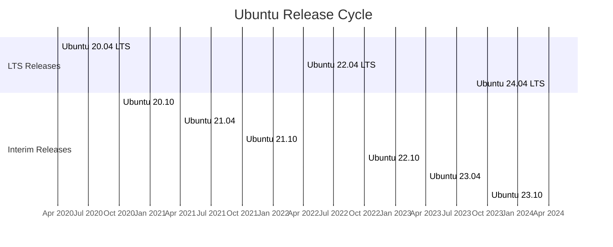

# Ubuntu Versions

## Introduction

Ubuntu is one of the most popular Linux distributions, known for its user-friendly interface and strong community support. As you begin your journey with Ubuntu, understanding its version system is crucial for making informed decisions about which release to use and when to upgrade.

In this guide, we'll explore how Ubuntu versions work, the difference between LTS and regular releases, and how to choose the right version for your needs.

## Understanding Ubuntu's Version Numbering System

Ubuntu follows a predictable version numbering scheme that makes it easy to identify when a particular version was released.

```
Ubuntu 22.04 LTS
   |    |   |
   |    |   ├── Long Term Support designation (if applicable)
   |    |
   |    ├── Month of release (04 = April)
   |
   ├── Year of release (2022)
```

For example:
- **Ubuntu 22.04** was released in April 2022
- **Ubuntu 23.10** was released in October 2023
- **Ubuntu 24.04** was released in April 2024

This pattern makes it easy to determine how recent a version is at a glance.

## Types of Ubuntu Releases

Ubuntu offers two types of releases, each serving different purposes:

### LTS (Long Term Support) Releases

LTS releases are designed for stability and long-term support, making them ideal for production environments, servers, and users who prefer not to upgrade frequently.

**Key characteristics:**
- Released every 2 years (in April of even-numbered years)
- Supported for 5 years for desktop and server
- Extended Security Maintenance (ESM) available for up to 10 years (through Ubuntu Pro)
- Focus on stability rather than cutting-edge features

**Recent LTS releases:**
- Ubuntu 20.04 LTS (Focal Fossa) - April 2020
- Ubuntu 22.04 LTS (Jammy Jellyfish) - April 2022
- Ubuntu 24.04 LTS (Noble Numbat) - April 2024

### Interim Releases

Interim releases come out every 6 months and provide access to newer software and features.

**Key characteristics:**
- Released every 6 months (April and October)
- Supported for 9 months
- Include newer software versions and features
- May have some rough edges compared to LTS releases

**Recent interim releases:**
- Ubuntu 23.04 (Lunar Lobster) - April 2023
- Ubuntu 23.10 (Mantic Minotaur) - October 2023

## Ubuntu Release Cycle Visualization



## Checking Your Ubuntu Version

If you're already using Ubuntu and want to determine which version you're running, you can use any of these terminal commands:

```bash
lsb_release -a
```

Output:
```
No LSB modules are available.
Distributor ID: Ubuntu
Description:    Ubuntu 22.04.3 LTS
Release:        22.04
Codename:       jammy
```

Alternatively, you can use:

```bash
cat /etc/os-release
```

Output:
```
NAME="Ubuntu"
VERSION="22.04.3 LTS (Jammy Jellyfish)"
ID=ubuntu
ID_LIKE=debian
PRETTY_NAME="Ubuntu 22.04.3 LTS"
VERSION_ID="22.04"
HOME_URL="https://www.ubuntu.com/"
SUPPORT_URL="https://help.ubuntu.com/"
BUG_REPORT_URL="https://bugs.launchpad.net/ubuntu/"
PRIVACY_POLICY_URL="https://www.ubuntu.com/legal/terms-and-policies/privacy-policy"
VERSION_CODENAME=jammy
UBUNTU_CODENAME=jammy
```

Or the simplest method:

```bash
hostnamectl
```

Output:
```
 Static hostname: ubuntu-machine
       Icon name: computer-vm
         Chassis: vm
      Machine ID: 1234567890abcdef1234567890abcdef
         Boot ID: 1234567890abcdef1234567890abcdef
  Virtualization: kvm
Operating System: Ubuntu 22.04.3 LTS
          Kernel: Linux 5.15.0-86-generic
    Architecture: x86-64
```

## Upgrading Between Ubuntu Versions

There are two main methods to upgrade your Ubuntu version:

### Method 1: Using the GUI (Desktop Environment)

1. Open the "Software & Updates" application
2. Go to the "Updates" tab
3. Under "Notify me of a new Ubuntu version" select:
   - "For long-term support versions" (to upgrade only to LTS versions)
   - "For any new version" (to upgrade to interim releases as well)
4. When a new version is available, you'll receive a notification

### Method 2: Using the Terminal

For upgrading to the next available version:

```bash
sudo apt update && sudo apt upgrade
sudo do-release-upgrade
```

If you want to upgrade to a development version:

```bash
sudo do-release-upgrade -d
```

## Choosing the Right Ubuntu Version

Here's a guide to help you select the most appropriate Ubuntu version:

| Use Case | Recommended Version | Reason |
|----------|---------------------|--------|
| Servers & Production | LTS (22.04, 24.04) | Stability and long-term support |
| Desktop for general use | LTS (22.04, 24.04) | Reliability with updates |
| Development machine | Latest interim release | Access to newer packages |
| Testing cutting-edge features | Latest interim or daily builds | Most recent software |
| Learning Linux fundamentals | LTS release | Stable platform for learning |

## Specialized Ubuntu Flavors

Ubuntu comes in various flavors, each with a different desktop environment:

- **Ubuntu (default)** - Uses GNOME desktop environment
- **Kubuntu** - Uses KDE Plasma desktop
- **Xubuntu** - Uses Xfce desktop (lightweight)
- **Lubuntu** - Uses LXQt desktop (very lightweight)
- **Ubuntu MATE** - Uses MATE desktop (traditional layout)
- **Ubuntu Budgie** - Uses Budgie desktop
- **Ubuntu Studio** - Focused on multimedia production

Each flavor follows the same version numbering and release schedule as standard Ubuntu.

## Advanced Version Information: Under the Hood

Ubuntu is based on Debian Linux and uses the APT package management system. Each Ubuntu release includes thousands of software packages, with versions carefully selected for compatibility.

Here's a comparison of some core component versions across recent Ubuntu releases:

| Component | Ubuntu 20.04 LTS | Ubuntu 22.04 LTS | Ubuntu 23.10 |
|-----------|------------------|------------------|--------------|
| Linux Kernel | 5.4 | 5.15 | 6.5 |
| GNOME | 3.36 | 42 | 45 |
| Python | 3.8 | 3.10 | 3.11 |
| gcc | 9.4 | 11.3 | 13.2 |
| systemd | 245 | 249 | 253 |

## Practical Example: Setting Up a Development Environment

Let's say you're setting up a development environment for Python web development. 

If you choose Ubuntu 22.04 LTS, you get:
- Python 3.10 out of the box
- Stability for 5 years
- A solid foundation that won't change drastically

First, let's check what Python version we have:

```bash
python3 --version
```

Output:
```
Python 3.10.12
```

Now we can set up a virtual environment:

```bash
sudo apt update
sudo apt install python3-venv
python3 -m venv myproject_env
source myproject_env/bin/activate
```

This gives us a stable development environment with the security of long-term support.

## Summary

Understanding Ubuntu's version system is essential for making informed choices about your operating system:

- **Version numbers** follow a year.month format (e.g., 22.04 for April 2022)
- **LTS releases** provide 5 years of support and focus on stability
- **Interim releases** provide newer software but only 9 months of support
- Choose based on your needs: stability (LTS) vs. latest features (interim)

As you continue your journey with Ubuntu, the version you select will impact your experience, available software, and upgrade frequency. For most beginners, starting with the latest LTS release provides the best balance of stability and modern features.

## Additional Resources

- [Ubuntu Release Cycle Official Documentation](https://ubuntu.com/about/release-cycle)
- [Ubuntu Wiki - LTS](https://wiki.ubuntu.com/LTS)
- [Ubuntu Download Page](https://ubuntu.com/download)

## Exercises

1. Check which version of Ubuntu you're currently running using the terminal commands provided in this guide.
2. Research the specific changes between Ubuntu 20.04 LTS and 22.04 LTS that might affect your workflow.
3. Create a list of criteria that would help you decide between using an LTS release versus an interim release for your projects.
4. Practice using a virtual machine to install a different Ubuntu flavor and compare its default applications to the standard Ubuntu release.