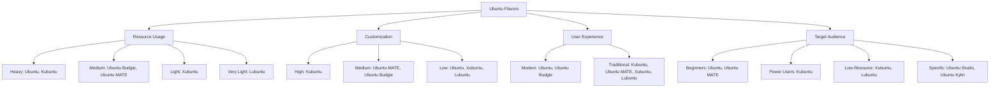

# Ubuntu Flavors

## Introduction

Ubuntu is one of the most popular Linux distributions available today, known for its ease of use and strong community support. While many people are familiar with the standard Ubuntu release (which uses the GNOME desktop environment), Ubuntu actually comes in several "flavors" - variations of the same Ubuntu base system with different desktop environments and default application sets.

These flavors provide flexibility, allowing users to choose an Ubuntu experience that matches their preferences, hardware capabilities, and workflow needs. Each flavor maintains the core Ubuntu foundation while delivering a unique look, feel, and set of features.

## What Are Ubuntu Flavors?

Ubuntu flavors are officially recognized variations of Ubuntu that use the same underlying Ubuntu base system but differ in several important ways:

1. **Desktop Environment** - The main difference between flavors is the desktop environment, which determines the look, feel, and functionality of the user interface
2. **Default Applications** - Each flavor includes a different selection of pre-installed applications
3. **System Requirements** - Resource usage varies between flavors, making some better suited for older or less powerful hardware
4. **Target Audience** - Some flavors are designed with specific user groups in mind

Despite these differences, all Ubuntu flavors:
- Share the same Ubuntu repositories
- Follow the same release schedule
- Receive security updates for the same duration
- Use the same package management system
- Are developed by the broader Ubuntu community with official recognition

Let's explore the major Ubuntu flavors available today:

## Major Ubuntu Flavors

### Ubuntu (GNOME)

The standard Ubuntu release features the GNOME desktop environment, known for its clean, modern interface and focus on simplicity.

**Key Features:**
- Modern, minimalist interface
- Activities overview for application management
- GNOME Shell extensions for customization
- Integrated search functionality
- Good touch support

**Ideal For:**
- New Linux users
- Those who prefer a clean, modern desktop
- Users with relatively modern hardware

**System Requirements:**
- 4GB RAM (minimum 2GB)
- 25GB of storage space
- Dual-core processor

**Screenshot Example:**
The standard Ubuntu desktop features a dock on the left side, a top bar with status indicators, and a clean workspace.

### Kubuntu (KDE Plasma)

Kubuntu uses the KDE Plasma desktop environment, offering a highly customizable and feature-rich experience.

**Key Features:**
- Extensive customization options
- Widget support on desktop
- Powerful file manager (Dolphin)
- Visual effects and animations
- KDE Connect for smartphone integration

**Ideal For:**
- Users who want maximum customization
- Former Windows users (familiar interface elements)
- Power users who appreciate configuration options

**System Requirements:**
- 4GB RAM (minimum)
- 25GB of storage space
- Dual-core processor

### Xubuntu (Xfce)

Xubuntu features the lightweight Xfce desktop environment, focusing on efficiency and low resource usage.

**Key Features:**
- Lightweight and responsive
- Traditional desktop layout
- Low resource consumption
- Stable and reliable
- Good performance on older hardware

**Ideal For:**
- Users with older computers
- Those who prefer a traditional desktop experience
- People looking for maximum stability

**System Requirements:**
- 1GB RAM (minimum)
- 20GB of storage space
- 1GHz processor

### Lubuntu (LXQt)

Lubuntu uses the extremely lightweight LXQt desktop environment, making it the most resource-efficient Ubuntu flavor.

**Key Features:**
- Ultra-lightweight desktop
- Minimal resource usage
- Fast performance even on very old hardware
- Simple, straightforward interface
- Qt-based applications

**Ideal For:**
- Very old or low-spec computers
- Reviving ancient hardware
- Creating minimal installations

**System Requirements:**
- 1GB RAM (minimum 512MB)
- 15GB of storage space
- Pentium 4 or newer processor

### Ubuntu MATE

Ubuntu MATE features the MATE desktop environment, a continuation of the classic GNOME 2 interface.

**Key Features:**
- Traditional desktop paradigm
- Multiple layout options (Mutiny, Cupertino, etc.)
- Good performance on mid-range hardware
- Welcome screen with helpful resources
- Comfortable for long-time Linux users

**Ideal For:**
- Users who prefer traditional desktop interfaces
- Those migrating from older versions of Ubuntu
- Mid-range hardware

**System Requirements:**
- 2GB RAM (minimum 1GB)
- 20GB of storage space
- 1.5GHz processor

### Ubuntu Budgie

Ubuntu Budgie combines Ubuntu with the elegant Budgie desktop environment, developed by the Solus project.

**Key Features:**
- Clean, modern aesthetic
- Unique Raven sidebar for notifications and controls
- App menu similar to Windows 7
- Integrated with GNOME applications
- Elegant visual effects

**Ideal For:**
- Users seeking a blend of traditional and modern interfaces
- Those who appreciate visual aesthetics
- Modern hardware with decent graphics

**System Requirements:**
- 4GB RAM (minimum 2GB)
- 25GB of storage space
- Dual-core processor

### Ubuntu Studio

Ubuntu Studio is designed specifically for multimedia production, featuring the KDE Plasma desktop and specialized audio, video, and graphics tools.

**Key Features:**
- Low-latency kernel for audio production
- Pre-installed multimedia creation tools
- Audio production suite
- Video editing tools
- Graphic design applications

**Ideal For:**
- Musicians and audio engineers
- Video editors
- Digital artists
- Content creators

**System Requirements:**
- 8GB RAM (minimum 4GB)
- 40GB of storage space
- Dual-core processor

### Ubuntu Kylin

Ubuntu Kylin is specifically designed for Chinese users, featuring localized applications and the UKUI desktop environment.

**Key Features:**
- Chinese language support
- Localized applications
- UKUI desktop environment
- Traditional Chinese aesthetics
- Integration with Chinese web services

**Ideal For:**
- Chinese-speaking users
- Organizations in China

**System Requirements:**
- 2GB RAM (minimum)
- 25GB of storage space
- 1.5GHz processor

## Comparing Ubuntu Flavors

Let's compare the main Ubuntu flavors based on several key factors:



## How to Install Different Ubuntu Flavors

You can install any Ubuntu flavor through two main methods:

### Method 1: Download and Install Directly

Each flavor has its own ISO image that you can download and install:

1. Visit the official website for your chosen flavor:
   - Ubuntu: [ubuntu.com](https://ubuntu.com)
   - Kubuntu: [kubuntu.org](https://kubuntu.org)
   - Xubuntu: [xubuntu.org](https://xubuntu.org)
   - Lubuntu: [lubuntu.me](https://lubuntu.me)
   - Ubuntu MATE: [ubuntu-mate.org](https://ubuntu-mate.org)
   - Ubuntu Budgie: [ubuntubudgie.org](https://ubuntubudgie.org)
   - Ubuntu Studio: [ubuntustudio.org](https://ubuntustudio.org)

2. Download the ISO image for the latest LTS (Long Term Support) or interim release
3. Create a bootable USB drive using tools like Balena Etcher or Rufus
4. Boot from the USB drive and follow the installation instructions

### Method 2: Install Desktop Environments on Existing Ubuntu

You can also install different desktop environments on your existing Ubuntu installation:

**To install Kubuntu desktop (KDE Plasma):**

```bash
sudo apt update
sudo apt install kubuntu-desktop
```

**To install Xubuntu desktop (Xfce):**

```bash
sudo apt update
sudo apt install xubuntu-desktop
```

**To install Lubuntu desktop (LXQt):**

```bash
sudo apt update
sudo apt install lubuntu-desktop
```

**To install Ubuntu MATE desktop:**

```bash
sudo apt update
sudo apt install ubuntu-mate-desktop
```

**To install Ubuntu Budgie desktop:**

```bash
sudo apt update
sudo apt install ubuntu-budgie-desktop
```

After installation, you can select your preferred desktop environment from the login screen by clicking on the gear icon or equivalent symbol.

## Choosing the Right Ubuntu Flavor

When selecting an Ubuntu flavor, consider the following factors:

### Hardware Capabilities

- **Older or Low-Spec Hardware (2GB RAM or less):**
  - Lubuntu
  - Xubuntu
  
- **Mid-Range Hardware (4GB RAM):**
  - Ubuntu MATE
  - Xubuntu
  - Ubuntu Budgie
  
- **Modern Hardware (8GB+ RAM):**
  - Ubuntu (GNOME)
  - Kubuntu

### User Interface Preferences

- **If you prefer a modern, streamlined interface:**
  - Ubuntu (GNOME)
  - Ubuntu Budgie
  
- **If you prefer a traditional desktop with start menu:**
  - Kubuntu
  - Ubuntu MATE
  - Xubuntu
  
- **If you want maximum customization:**
  - Kubuntu

### Use Cases

- **General-purpose computing:** Any flavor works well
- **Media production:** Ubuntu Studio
- **Gaming:** Kubuntu or Ubuntu
- **Programming:** Any flavor (consider personal preference)
- **Office/Business:** Ubuntu, Kubuntu, or Ubuntu MATE
- **Education:** Ubuntu or Ubuntu MATE
- **Reviving old computers:** Lubuntu or Xubuntu

## Practical Example: Switching Between Desktop Environments

If you've installed multiple desktop environments, you can switch between them at login. Here's how:

1. Log out of your current session
2. On the login screen, locate and click the session selector (usually a gear icon)
3. Select your desired desktop environment from the list
4. Enter your password and log in

This allows you to test different environments without reinstalling your entire system.

## Advanced: Creating Your Own Ubuntu Remix

For advanced users, it's possible to create your own custom Ubuntu "remix" by:

1. Starting with a minimal Ubuntu installation:

```bash
# Download the Ubuntu minimal ISO, then after installation:
sudo apt update
sudo apt upgrade
```

2. Installing only the packages you need:

```bash
# Install X server
sudo apt install xorg

# Install a lightweight window manager (example: Openbox)
sudo apt install openbox obconf

# Add a panel
sudo apt install tint2

# Add a file manager
sudo apt install pcmanfm

# Add a terminal
sudo apt install xfce4-terminal
```

3. Configuring the system to your preferences:

```bash
# Create default Openbox configuration
mkdir -p ~/.config/openbox
cp /etc/xdg/openbox/rc.xml ~/.config/openbox/
cp /etc/xdg/openbox/menu.xml ~/.config/openbox/
cp /etc/xdg/openbox/autostart ~/.config/openbox/
```

This approach requires significant technical knowledge but results in a highly personalized system.

## Summary

Ubuntu flavors provide a diverse range of options to suit different user preferences, hardware capabilities, and use cases. Key points to remember:

- All flavors share the same Ubuntu base and repositories
- The main differences are in desktop environment, default applications, and resource requirements
- Lighter flavors (Lubuntu, Xubuntu) work well on older hardware
- Feature-rich flavors (Ubuntu, Kubuntu) offer more capabilities but require better hardware
- You can install multiple desktop environments on the same system

By understanding the strengths and characteristics of each flavor, you can choose the Ubuntu experience that best fits your needs and preferences.

## Additional Resources

- **Official Ubuntu Wiki**: Comprehensive documentation on Ubuntu and its flavors
- **Ask Ubuntu**: Community Q&A site for Ubuntu-related questions
- **Ubuntu Forums**: Discussion forums for Ubuntu users of all skill levels
- **DistroWatch**: Compare different Linux distributions and Ubuntu flavors
- **YouTube Tutorials**: Many creators offer visual comparisons of different Ubuntu flavors

## Exercises

1. **Exploration Exercise**: Install two different Ubuntu flavors in virtual machines and create a comparison chart of their features, resource usage, and user experience.

2. **Resource Monitoring**: Install the `htop` utility (`sudo apt install htop`) and compare resource usage between different desktop environments.

3. **Customization Challenge**: Take a default Ubuntu flavor installation and customize it to look and function differently while maintaining usability.

4. **Minimal Installation**: Try installing the minimal version of Ubuntu and adding only the components you need for a functional desktop.

5. **Desktop Environment Mix**: Create a custom setup by mixing components from different desktop environments (for example, using KDE Plasma with Xfce's file manager).