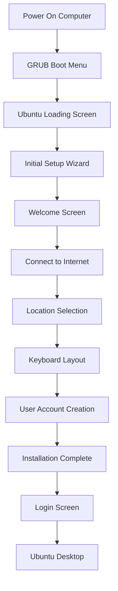

# Ubuntu First Boot

## Introduction

After successfully installing Ubuntu on your computer, the first boot experience is your gateway to the Ubuntu ecosystem. This critical phase introduces you to the Ubuntu desktop environment and guides you through essential configuration steps. This guide will walk you through what to expect during your first boot, how to navigate the initial setup wizard, and the recommended first steps to take once you reach the desktop. Whether you're new to Linux or transitioning from another operating system, this guide will help you start your Ubuntu journey with confidence.

## The First Boot Experience

When you boot into Ubuntu for the first time after installation, you'll go through a setup process that helps you configure your system according to your preferences. This experience is designed to be user-friendly and straightforward, even for complete beginners.

### The Boot Process Visualized



## Initial Setup Wizard

The initial setup wizard appears automatically after your first boot. Let's explore each step in detail:

### 1. Welcome Screen

The first screen welcomes you to Ubuntu and allows you to select your preferred language. This language will be used throughout the setup process and will be set as your system's default language.

```
Welcome to Ubuntu 22.04 LTS
Please choose your language:
[List of languages]
```

Select your language and click "Continue" to proceed to the next step.

### 2. Internet Connection

Ubuntu will attempt to detect available networks. Connecting to the internet during setup is recommended but not mandatory.

- For wired connections, Ubuntu typically connects automatically
- For wireless connections, you'll see a list of available Wi-Fi networks

```
Select your Wi-Fi network:
[List of available networks]

Enter password: ________
```

### 3. Location and Timezone

Based on your internet connection, Ubuntu might suggest your current location. You can either confirm or select a different location to set your timezone correctly.

```
Where are you?
[World map with selectable regions]
[Search box for direct location input]
```

### 4. Keyboard Layout

Choose your keyboard layout based on your physical keyboard. Ubuntu offers a text box to test your keyboard configuration.

```
Keyboard layout:
[List of layouts]

You can type here to test your keyboard: ________
```

### 5. User Account Creation

This important step establishes your primary user account:

```
Who are you?
Your name: ________
Your computer's name: ________
Pick a username: ________
Choose a password: ________
Confirm your password: ________
[ ] Log in automatically
[x] Require my password to log in
```

- **Your name**: Your full name (e.g., "John Smith")
- **Computer's name**: A name for your computer on the network (e.g., "john-ubuntu-laptop")
- **Username**: A short, lowercase name without spaces (e.g., "johnsmith" or "john")
- **Password**: A secure password that you'll remember

### 6. Installation Complete

Once you've completed all the steps, you'll see a confirmation screen indicating that the setup is complete. Click "Restart Now" to reboot your system.

## First Login

After your system restarts, you'll be presented with the login screen. Enter the password you created during the setup process to access your new Ubuntu desktop.

### The Ubuntu Desktop Environment

When you first reach the Ubuntu desktop, you'll see:

1. **Dock**: Located on the left side by default, containing application shortcuts
2. **Activities Overview**: Located at the top-left corner, allows you to see all applications and workspaces
3. **Status Bar**: Located at the top-right, showing system status, network, sound, and power options
4. **Desktop Background**: A clean desktop with the default Ubuntu wallpaper

## Essential First Steps

Once you've reached the desktop, here are some recommended first steps:

### 1. Update Your System

It's crucial to update your system to get the latest security patches and software updates:

1. Open Terminal (press `Ctrl+Alt+T` or search for "Terminal" in the Activities overview)
2. Run the following commands:

```bash
sudo apt update
sudo apt upgrade
```

You'll be prompted to enter your password (the one you created during setup). Type it and press Enter. Note that the password won't be visible as you type.

### 2. Explore the Software Center

Ubuntu Software Center allows you to easily install applications:

1. Click on the "Ubuntu Software" icon in the dock
2. Browse categories or search for specific applications
3. Click "Install" on any application you want to add

Popular applications for beginners include:
- Firefox (Web Browser)
- LibreOffice (Office Suite)
- GIMP (Image Editor)
- VLC (Media Player)

### 3. Familiarize Yourself with System Settings

The Settings app allows you to customize your Ubuntu experience:

1. Click on the system menu (top-right corner)
2. Select "Settings"
3. Explore different categories:
   - Wi-Fi and Networks
   - Displays
   - Privacy
   - Power settings
   - User accounts
   - Appearance

### 4. Learn Basic Terminal Commands

While Ubuntu has a user-friendly GUI, learning some basic terminal commands can be very helpful:

```bash
# List files and directories
ls

# Change directory
cd Documents

# Create a new directory
mkdir my_projects

# Remove a file
rm filename.txt

# Get help on a command
man ls
```

## Troubleshooting Common First Boot Issues

### Issue: Unable to Connect to Wi-Fi
- Solution: Ensure your Wi-Fi adapter is not disabled in BIOS
- Try connecting using the Network settings in the system menu
- For hidden networks, use "Connect to Hidden Network" option

### Issue: Screen Resolution Problems
- Solution: Go to Settings > Displays
- Select your preferred resolution from the available options
- If your desired resolution isn't listed, you might need to install graphics drivers

### Issue: System Updates Failing
- Solution: Try changing your download server:
  1. Open "Software & Updates" from the Activities overview
  2. Under the "Ubuntu Software" tab, select "Download from:" and choose "Main server" or a server close to your location
  3. Click "Close" and then "Reload" when prompted

## Summary

Your first boot experience with Ubuntu sets the foundation for your Linux journey. By understanding the initial setup process and taking the recommended first steps, you'll be well on your way to becoming comfortable with Ubuntu. Remember that the Ubuntu community is vast and supportive, so don't hesitate to seek help when needed.

The Ubuntu desktop environment is designed to be intuitive, but like any new system, it takes time to become fully familiar with it. Explore, experiment, and enjoy the freedom and flexibility that Ubuntu offers.

## Additional Resources

- Ubuntu Documentation: https://help.ubuntu.com/
- Ubuntu Forums: https://ubuntuforums.org/
- Ask Ubuntu (Q&A): https://askubuntu.com/

## Practice Exercises

1. **System Exploration**: Navigate through the Activities overview and identify at least five pre-installed applications. Try opening each one to understand its purpose.

2. **Terminal Practice**: Open Terminal and try running the basic commands mentioned in this guide. Create a directory structure for your future projects.

3. **Customization Challenge**: Try changing your desktop background, adjusting the dock settings, and modifying system sounds to personalize your Ubuntu experience.

4. **Software Installation**: Install three applications that you think will be useful for your specific needs through the Ubuntu Software Center.

5. **System Update**: Practice updating your system using the Terminal commands provided. Pay attention to the output messages to understand what's happening during the update process.