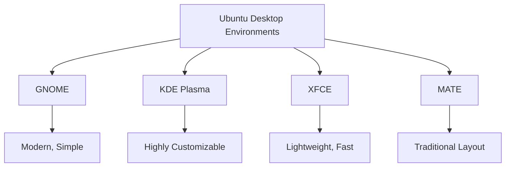

# Ubuntu Desktop Environment

## Introduction

The Ubuntu Desktop Environment is the graphical user interface (GUI) that Ubuntu Linux users interact with daily. It provides a visual way to navigate files, launch applications, and manage your system. For beginners transitioning from Windows or macOS, understanding the Ubuntu desktop is a crucial first step in your Linux journey.

Ubuntu's desktop environment is built on GNOME (GNU Network Object Model Environment), one of several desktop environments available for Linux systems. The desktop environment is separate from the underlying operating system, which allows Linux users the flexibility to choose different interfaces while using the same core system.

## Components of the Ubuntu Desktop Environment

### The GNOME Shell

The default interface in modern Ubuntu versions is GNOME Shell. Let's explore its main components:

#### Top Bar

The top bar contains:

- **Activities Button**: Located in the top-left corner, clicking it shows all running applications and workspaces
- **Clock/Calendar**: Located in the center, displays time and provides access to calendar and notifications
- **System Tray**: Located in the top-right, contains icons for system controls like network, sound, power, etc.

#### Dock

The Ubuntu Dock (a modified version of GNOME's Dash to Dock) appears on the left side of the screen and contains:

- **Favorite Applications**: Commonly used applications pinned for easy access
- **Running Applications**: Currently open applications
- **Show Applications Icon**: Located at the bottom, shows all installed applications

#### Workspaces

Ubuntu uses virtual workspaces to organize your applications:

- **Multiple Desktops**: You can spread your work across several virtual screens
- **Dynamic Creation**: Workspaces are created as needed when you move windows between them

### File Manager (Nautilus)

The default file manager in Ubuntu is called Nautilus (or "Files"):

```bash
# Launch the file manager from terminal
nautilus
```

Nautilus provides:

- **Folder Navigation**: Browse your directory structure
- **File Operations**: Copy, move, delete, and organize files
- **Search Functionality**: Find files by name or content
- **Network Access**: Connect to remote file systems

## Navigating the Ubuntu Desktop

### Keyboard Shortcuts

Efficient navigation relies on keyboard shortcuts:

| Shortcut | Action |
|----------|--------|
| `Super` (Windows key) | Open Activities overview |
| `Super + A` | Show applications menu |
| `Super + Tab` | Switch between applications |
| `Super + Arrow keys` | Snap windows to sides or corners |
| `Ctrl + Alt + Arrow keys` | Switch between workspaces |
| `Alt + F2` | Run command dialog |
| `Ctrl + Alt + T` | Open terminal |

### The Activities Overview

The Activities overview is a central hub for navigation:

1. Click the "Activities" button in the top-left corner or press the `Super` key
2. Type to search for applications, files, or settings
3. Drag windows between workspaces shown at the right side
4. Click on an application icon to launch or switch to it

## Customizing the Ubuntu Desktop

One of Linux's strengths is customization. Here's how to personalize your Ubuntu desktop:

### Appearance Settings

```bash
# Open Settings from terminal
gnome-control-center
```

Navigate to "Appearance" to change:

- Light/Dark mode
- Accent colors
- Wallpaper
- Dock behavior

### Extensions

GNOME Extensions enhance functionality:

1. Install the GNOME Extensions browser integration
   ```bash
   sudo apt install gnome-shell-extensions chrome-gnome-shell
   ```

2. Visit [extensions.gnome.org](https://extensions.gnome.org) to browse and install extensions

3. Manage extensions using the "Extensions" application
   ```bash
   gnome-extensions-app
   ```

Popular extensions include:
- Dash to Panel
- Clipboard Indicator
- User Themes

### Themes

You can install custom themes to change the look of your desktop:

```bash
# Install User Themes extension
sudo apt install gnome-shell-extensions

# Create themes directory if it doesn't exist
mkdir -p ~/.themes

# Apply themes through GNOME Tweaks
sudo apt install gnome-tweaks
```

## Working with Applications

### Installing Software

Ubuntu provides several ways to install applications:

1. **Ubuntu Software Center**: A graphical app store
   ```bash
   # Launch Software Center
   ubuntu-software
   ```

2. **APT Package Manager**: Command-line installation
   ```bash
   # Update package list
   sudo apt update

   # Install an application (example: GIMP)
   sudo apt install gimp
   ```

3. **Snap Store**: For containerized applications
   ```bash
   # Install a snap package (example: Visual Studio Code)
   sudo snap install code --classic
   ```

### Application Management

Running applications can be managed through:

- **Dock**: Right-click app icons for options (quit, pin to dock)
- **System Monitor**: View and terminate processes
  ```bash
  # Launch System Monitor
  gnome-system-monitor
  ```

## Workspace Management

Effectively organizing your workspace improves productivity:

### Multi-Monitor Setup

Configure multiple displays through Settings:

1. Open Settings → Displays
2. Arrange monitors by dragging them
3. Set primary display and resolution

### Window Tiling

Arrange windows efficiently:

- Drag a window to the top edge to maximize
- Drag to left/right edges to tile to half the screen
- Use `Super + Arrow keys` for keyboard-based tiling

## Terminal Integration

The terminal is powerful in Ubuntu and integrates well with the desktop:

```bash
# Create a desktop shortcut
echo "[Desktop Entry]
Name=My Script
Exec=/path/to/script.sh
Type=Application
Terminal=true
Icon=/path/to/icon.png" > ~/.local/share/applications/myscript.desktop
```

## Advanced Desktop Features

### Virtual Machine Integration

Ubuntu provides excellent VM integration:

```bash
# Install GNOME Boxes for VM management
sudo apt install gnome-boxes
```

### Remote Desktop Access

Access your Ubuntu desktop remotely:

```bash
# Enable screen sharing
gsettings set org.gnome.desktop.remote-desktop.rdp enable true
```

## Troubleshooting Common Issues

### Desktop Environment Recovery

If your desktop environment crashes:

```bash
# Restart GNOME Shell (without losing applications)
# Press Alt+F2, type 'r' and press Enter

# Or from terminal
killall -SIGQUIT gnome-shell
```

### Reset Desktop Settings

To reset your desktop configuration to defaults:

```bash
# Reset all GNOME settings
dconf reset -f /org/gnome/
```

## Working with Multiple Desktop Environments

You can install and switch between different desktop environments:

```bash
# Install KDE Plasma
sudo apt install kubuntu-desktop

# Install XFCE
sudo apt install xubuntu-desktop
```

Switch between them at the login screen by clicking the gear icon.

## Comparing Desktop Environments



## Summary

The Ubuntu Desktop Environment provides a user-friendly interface for interacting with your Linux system. Based on GNOME, it offers a clean, modern experience while maintaining the power and flexibility Linux is known for.

Key takeaways:
- The interface consists of a top bar, dock, and workspaces
- Keyboard shortcuts enhance productivity
- Extensive customization is possible through settings, extensions, and themes
- Applications can be installed through Software Center, APT, or Snap
- Workspace management helps organize your workflow

## Practice Exercises

1. Try customizing your dock to auto-hide and adjust its size
2. Install and configure at least one GNOME extension
3. Create custom keyboard shortcuts for your most-used applications
4. Practice using workspaces to organize different types of tasks
5. Experiment with window tiling using both mouse and keyboard methods

## Additional Resources

- [Ubuntu Desktop Guide](https://help.ubuntu.com/stable/ubuntu-help/)
- [GNOME User Documentation](https://help.gnome.org/)
- [Ask Ubuntu](https://askubuntu.com/) - Q&A community for Ubuntu users