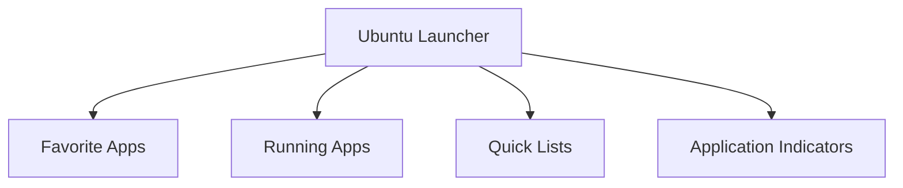

# Ubuntu Unity Interface

## Introduction

The Unity interface was Ubuntu's flagship desktop environment from Ubuntu 11.04 through Ubuntu 17.04. While Ubuntu has since switched to GNOME as its default desktop environment, Unity remains an important part of Ubuntu's history and is still available as an optional desktop environment. Understanding Unity is valuable for users who prefer its unique workflow or need to work with older Ubuntu systems.

Unity was designed with several key goals in mind:
- Efficient use of screen space
- Touch-friendly interface
- Consistent user experience across different device form factors
- Easy access to applications and files

In this guide, we'll explore the key components of the Unity interface, how to navigate it efficiently, and how to customize it to suit your workflow.

## Key Components of Unity

### The Launcher

The Launcher is the vertical bar located on the left side of your screen. It serves several important functions:

- Provides quick access to favorite applications
- Shows running applications
- Allows you to switch between applications
- Provides application-specific menus and features



You can interact with the Launcher in several ways:

- **Click** an icon to launch or switch to an application
- **Right-click** an icon to access the Quick List for that application
- **Middle-click** an icon to open a new instance of that application
- **Drag and drop** icons to rearrange them
- **Drag and drop** files onto application icons to open them with that application

To pin an application to the Launcher:
1. Launch the application
2. Right-click on its icon in the Launcher
3. Select "Lock to Launcher"

### The Dash

The Dash is Unity's application and file search tool. It provides a unified interface for finding and launching applications, accessing files, and searching online resources.

To open the Dash:
- Click the Ubuntu logo at the top of the Launcher
- Press the **Super** key (Windows key) on your keyboard

The Dash includes several "lenses" that filter search results by category:

- **Home lens**: Shows all search results
- **Applications lens**: Shows only applications
- **Files lens**: Shows only files and folders
- **Music lens**: Shows only music files
- **Videos lens**: Shows only video files
- **Photos lens**: Shows only image files

### The Panel

The Panel is the horizontal bar at the top of the screen. It contains:

- The Menu Bar (application menus)
- System indicators (network, sound, battery, etc.)
- Session menu (user account, system settings, etc.)
- Date and time
- Notification area

A unique feature of Unity is the Global Menu, which displays the menu bar of the active application in the Panel rather than in the application window itself.

### The HUD (Heads-Up Display)

The HUD is a powerful feature that allows you to search through an application's menus without navigating through them manually.

To use the HUD:
1. Press the **Alt** key when an application is in focus
2. Type what you're looking for
3. Select the desired menu option from the results

For example, if you're using GIMP and want to find the "Gaussian Blur" filter, instead of navigating through the menus, you can:
1. Press **Alt**
2. Type "gaussian"
3. Select "Gaussian Blur" from the results

This feature is particularly useful for applications with complex menu structures.

## Navigating Unity

### Keyboard Shortcuts

Unity provides numerous keyboard shortcuts to enhance productivity:

| Shortcut | Action |
|----------|--------|
| `Super` | Open the Dash |
| `Alt + F1` | Focus the Launcher |
| `Super + 1-9` | Launch or switch to the application at that position in the Launcher |
| `Super + S` | Show the workspace switcher |
| `Super + D` | Show the desktop (minimize all windows) |
| `Super + W` | Show all windows from all workspaces |
| `Super + A` | Show the Applications lens |
| `Super + F` | Show the Files lens |
| `Alt` | Open the HUD |
| `Ctrl + Alt + T` | Open a terminal |
| `Alt + Tab` | Switch between applications |
| `Alt + Shift + Tab` | Switch between applications in reverse order |
| `Alt + `\`` | Switch between windows of the current application |

### Workspaces

Unity provides virtual workspaces to help organize your open applications. By default, Ubuntu with Unity has four workspaces arranged in a 2×2 grid.

To view and switch between workspaces:
- Press `Super + S`
- Click the Workspace Switcher icon in the Launcher
- Use `Ctrl + Alt + Arrow keys` to navigate between workspaces

To move a window to a different workspace:
1. Select the window
2. Press `Ctrl + Alt + Shift + Arrow keys`

## Customizing Unity

Unity offers several customization options to tailor the interface to your preferences.

### Appearance Settings

To access appearance settings:
1. Click the session menu (top-right corner)
2. Select "System Settings"
3. Click "Appearance"

From here, you can:
- Change the desktop background
- Adjust the Launcher behavior
- Set the theme
- Configure the behavior of menus and windows

### CompizConfig Settings Manager

For more advanced customization, you can install the CompizConfig Settings Manager:

```bash
sudo apt install compizconfig-settings-manager
```

After installation, launch it from the Dash or with:

```bash
ccsm
```

This tool allows you to configure:
- Window animations and effects
- Desktop cube and other 3D effects
- Window snapping behavior
- Keyboard shortcuts
- And many more advanced settings

**Warning**: Be careful when using CompizConfig Settings Manager, as incorrect settings can cause your desktop environment to become unstable or unusable.

### Unity Tweak Tool

Unity Tweak Tool provides a user-friendly interface for customizing Unity. Install it with:

```bash
sudo apt install unity-tweak-tool
```

This tool allows you to adjust:
- Launcher settings (size, behavior, transparency)
- Panel settings
- Dash settings
- Window controls
- Theme settings
- Font settings
- And more

## Practical Examples

### Example 1: Efficient Application Switching

Scenario: You're working on a project that requires switching between a web browser, text editor, and terminal.

Efficient solution:
1. Pin each application to the Launcher
2. Memorize their positions (e.g., Firefox is position 1, Text Editor is position 2, Terminal is position 3)
3. Use `Super + 1`, `Super + 2`, and `Super + 3` to quickly switch between them

### Example 2: Using the HUD for Complex Applications

Scenario: You're using LibreOffice Writer and need to insert a table.

Traditional method:
1. Click on "Table" in the menu bar
2. Click on "Insert Table"
3. Configure the table options
4. Click "OK"

Using the HUD:
1. Press `Alt`
2. Type "insert table"
3. Select "Insert Table" from the results
4. Configure the table options
5. Click "OK"

The HUD becomes increasingly valuable as you work with applications that have deep, complex menu structures.

### Example 3: Organizing Work with Workspaces

Scenario: You're working on multiple projects simultaneously.

Setup:
1. Dedicate Workspace 1 to Project A (browser and editor windows)
2. Dedicate Workspace 2 to Project B (different browser and editor windows)
3. Use Workspace 3 for communication tools (email, chat)
4. Use Workspace 4 for reference materials and documentation

Switching between projects is now as simple as pressing `Ctrl + Alt + Arrow keys` to navigate between workspaces.

## Terminal Commands for Unity

Unity can also be controlled and configured via the terminal. Here are some useful commands:

Reset Unity to default settings:
```bash
unity --reset
```

Restart Unity (useful if experiencing issues):
```bash
unity --replace
```

Change Launcher icon size (replace 48 with your desired size):
```bash
gsettings set com.canonical.Unity.Launcher icon-size 48
```

Change Launcher auto-hide behavior:
```bash
gsettings set org.compiz.unityshell:/org/compiz/profiles/unity/plugins/unityshell/ launcher-hide-mode 1
```
(0 = never hide, 1 = auto-hide, 2 = intelligent hide)

## Summary

The Unity interface provides a unique and efficient desktop environment for Ubuntu. Its key components—the Launcher, Dash, Panel, and HUD—work together to create a cohesive user experience focused on productivity and ease of use.

While Unity is no longer the default desktop environment for Ubuntu, it remains available for users who prefer its workflow or need to work with older Ubuntu systems. The skills and concepts learned in this guide will help you navigate and customize Unity to suit your needs.

## Additional Resources

For further learning:

- Practice using keyboard shortcuts to improve your efficiency
- Experiment with different Launcher and Panel configurations
- Try using the HUD with complex applications like GIMP or LibreOffice

Exercises:

1. Pin your five most-used applications to the Launcher and practice switching between them using keyboard shortcuts.
2. Set up workspaces for different tasks or projects and practice moving windows between them.
3. Use the HUD to find at least three functions in an application that you would normally access through menus.
4. Customize your Unity interface using Unity Tweak Tool or CompizConfig Settings Manager to match your workflow preferences.