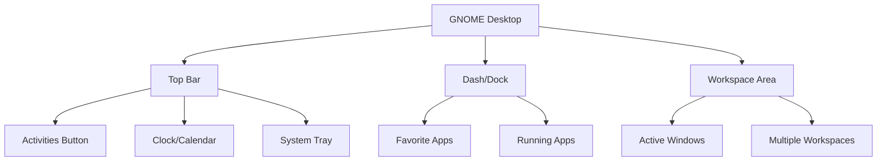

# Ubuntu GNOME Interface

## Introduction

The GNOME desktop environment is the default user interface for Ubuntu, one of the most popular Linux distributions. GNOME provides an intuitive, elegant, and powerful interface that helps users interact with their operating system efficiently. This guide will walk you through the fundamental aspects of the Ubuntu GNOME interface, helping you understand its components, features, and customization options.

GNOME (GNU Network Object Model Environment) follows a clean, minimalist design philosophy that prioritizes simplicity and usability. As a beginner, understanding the GNOME interface will give you a solid foundation for working with Ubuntu and help you become more productive with your system.

## The GNOME Desktop Layout

When you first boot into Ubuntu with the GNOME desktop environment, you'll be presented with a clean workspace consisting of several key components:

### Top Bar

At the top of the screen, you'll find the **Top Bar**, which contains:

- **Activities Button**: Located in the top-left corner, this is your gateway to accessing applications and workspaces
- **Clock/Calendar**: Positioned in the center, showing the current time and date
- **System Tray**: On the right side, displaying system indicators like network, volume, battery status, and user menu

### Dash (Dock)

The **Dash** or **Dock** is the panel typically located on the left side of the screen (in default Ubuntu) containing:

- **Favorite Applications**: Icons for frequently used programs
- **Running Applications**: Icons for currently open applications

### Workspace Area

The main area of the screen is your **Workspace**, where applications open and where you'll do most of your work.



## Essential Navigation Techniques

### Activities Overview

The Activities Overview is a central feature of GNOME that provides access to applications, windows, and workspaces.

To access the Activities Overview:
- Click the **Activities** button in the top-left corner
- Press the **Super** key (Windows key) on your keyboard
- Move your mouse cursor to the top-left hot corner (if enabled)

In the Activities Overview, you'll see:

1. **Search Bar**: Type to instantly search for applications, files, and system settings
2. **Application Grid**: Click the grid icon at the bottom of the dock to view all installed applications
3. **Workspace Selector**: On the right side, showing your virtual workspaces

### Keyboard Shortcuts

Learning keyboard shortcuts can significantly improve your productivity in the GNOME environment:

| Shortcut | Action |
|----------|--------|
| `Super` | Open Activities Overview |
| `Super + A` | Show Applications Grid |
| `Super + Tab` | Switch between applications |
| `Alt + Tab` | Switch between windows |
| `Super + Arrow Keys` | Snap windows to sides or corners |
| `Super + Page Up/Down` | Switch between workspaces |
| `Super + L` | Lock screen |
| `Ctrl + Alt + T` | Open Terminal |
| `Super + D` | Show desktop |

## Working with Applications

### Launching Applications

There are several ways to launch applications in GNOME:

1. **Using the Dock**: Click on an application icon in the dock
2. **From Activities Overview**:
   - Press `Super` key
   - Start typing the application name
   - Click the application icon or press Enter when it's highlighted

3. **From Applications Grid**:
   - Press `Super + A` or click the grid icon in the dock
   - Browse through your installed applications
   - Click on the application you want to launch

### Managing Windows

GNOME provides several tools for managing your application windows efficiently:

#### Window Controls

Ubuntu GNOME windows have three control buttons in the top-right corner:
- **Minimize**: Hides the window temporarily
- **Maximize/Restore**: Toggles between full-screen and windowed mode
- **Close**: Closes the application

#### Window Snapping

You can organize your workspace by "snapping" windows to different parts of the screen:
- Drag a window to the top edge to maximize it
- Drag to the left/right edge to snap to the left/right half of the screen
- Drag to corners to snap to quarter sections of the screen

Alternatively, use the keyboard shortcuts:
- `Super + Left Arrow`: Snap to left half
- `Super + Right Arrow`: Snap to right half
- `Super + Up Arrow`: Maximize window
- `Super + Down Arrow`: Restore/minimize window

#### Workspaces

GNOME uses dynamic workspaces to help you organize your applications:

- Workspaces are created automatically as you need them
- To move between workspaces:
  - Use `Super + Page Up/Down`
  - Use the workspace selector in Activities Overview
- To move a window to another workspace:
  - Drag it to the desired workspace in the Activities Overview
  - Use `Shift + Super + Page Up/Down`

## Customizing Your GNOME Desktop

One of GNOME's strengths is its customizability. Here are some ways to personalize your Ubuntu GNOME experience:

### Appearance Settings

To access appearance settings:
1. Open **Settings** (click on the system tray and select Settings, or search for it in Activities)
2. Select **Appearance**

Here you can change:
- Light/Dark theme
- Background image
- Accent colors

### Extensions

GNOME Extensions are small pieces of code that modify and extend GNOME's functionality. To manage extensions:

1. Install the GNOME Extensions app:
```bash
sudo apt install gnome-shell-extensions gnome-shell-extension-manager
```

2. Launch Extensions app from the Applications grid
3. Browse and enable/disable extensions as needed

Some popular extensions include:
- **Dash to Dock**: Customizes the dock behavior and appearance
- **GSConnect**: Integrates your phone with the desktop
- **Sound Input & Output Device Chooser**: Advanced audio controls
- **Weather**: Displays weather information in the top bar

### Tweaks Tool

For more advanced customization, install the GNOME Tweaks tool:

```bash
sudo apt install gnome-tweaks
```

Tweaks allows you to customize:
- Font settings
- Window titlebars
- Keyboard and mouse behavior
- Startup applications
- Desktop icons

## Practical Examples: Daily Workflow

Let's walk through some practical examples of using the GNOME interface for everyday tasks:

### Example 1: Setting Up a Development Environment

1. **Launch Terminal**: Press `Ctrl + Alt + T`
2. **Install Development Tools**:
```bash
sudo apt update
sudo apt install build-essential git nodejs npm
```
3. **Create a Project Folder**:
```bash
mkdir ~/projects/my-web-app
cd ~/projects/my-web-app
```
4. **Launch Code Editor**: Press `Super` key, type "code" or your preferred editor
5. **Open Multiple Windows**: Drag VS Code to one half of the screen and Terminal to the other using window snapping

### Example 2: Organizing Research and Documents

1. **Create Separate Workspaces**:
   - Workspace 1: Web Browser for research
   - Workspace 2: Document editor and reference materials
   - Workspace 3: Communication tools (email, messaging)

2. **Quick Switch Between Tasks**: Use `Super + Page Up/Down` to move between workspaces

3. **Find Documents Quickly**:
   - Press `Super` key
   - Type document name in search bar
   - Press Enter to open the document

### Example 3: Customizing for Productivity

Let's create a productivity-focused desktop:

1. **Install Focus-Enhancing Extensions**:
```bash
sudo apt install gnome-shell-extension-manager
```

2. Open Extension Manager and install:
   - Pomodoro Timer (for time management)
   - Do Not Disturb (to block notifications during focus periods)

3. **Configure Night Light** for reduced eye strain:
   - Open Settings → Display
   - Enable Night Light
   - Configure schedule and color temperature

4. **Create Custom Keyboard Shortcuts** for frequent tasks:
   - Open Settings → Keyboard → Keyboard Shortcuts
   - Add custom shortcuts for your most-used applications

## Troubleshooting Common Issues

### Interface Feels Slow or Laggy

If your GNOME interface is not performing well:

1. Check system resources:
```bash
gnome-system-monitor
```

2. Consider disabling extensions:
```bash
gnome-extensions disable --all
```

3. Update your graphics drivers:
```bash
sudo ubuntu-drivers autoinstall
```

### Missing Icons or Theme Elements

If you notice missing icons or theme inconsistencies:

1. Reset GNOME appearance settings:
```bash
gsettings reset-recursively org.gnome.desktop.interface
```

2. Reinstall the default theme:
```bash
sudo apt install --reinstall yaru-theme-gtk yaru-theme-icon
```

## Summary

The Ubuntu GNOME interface provides a clean, efficient environment for both new and experienced Linux users. By understanding the key components—Top Bar, Dash, and workspace management—you can navigate your system with confidence. The customization options available through Settings, Extensions, and Tweaks allow you to create a desktop experience tailored to your preferences and workflow needs.

As you become more familiar with GNOME, you'll discover additional features and shortcuts that will enhance your productivity. The consistent design philosophy makes Ubuntu accessible for beginners while providing the depth and flexibility that power users demand.

## Additional Resources

Here are some resources to continue learning about the Ubuntu GNOME interface:

- GNOME User Help: Access by pressing `F1` in most GNOME applications
- Ubuntu Documentation: [https://help.ubuntu.com/](https://help.ubuntu.com/)
- GNOME Extensions Website: [https://extensions.gnome.org/](https://extensions.gnome.org/)

## Practice Exercises

1. **Basic Navigation**: Create three different applications windows and practice arranging them using window snapping. Then try moving them between workspaces.

2. **Keyboard Efficiency**: Try to navigate your system for one hour using only keyboard shortcuts (no mouse). Note which tasks were difficult and research shortcuts for those actions.

3. **Custom Desktop**: Install three GNOME extensions that match your workflow needs and configure them to improve your productivity.

4. **Terminal Challenge**: Create a custom keyboard shortcut that opens the terminal, changes to a specific directory, and runs a command of your choice.