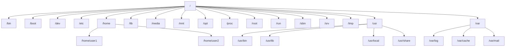

# Ubuntu File Structure

## Introduction

The Ubuntu file system follows the Filesystem Hierarchy Standard (FHS), which defines the directory structure and directory contents in Unix-like operating systems. Understanding this structure is crucial for navigating your system, finding files, and performing administrative tasks effectively.

Unlike Windows with its drive letters (C:, D:), Ubuntu organizes everything under a single hierarchical directory structure that starts with the root directory, represented by a forward slash `/`.

## The Root Directory

The root directory `/` is the top-level directory in the Ubuntu file system. All other directories and files are contained within the root directory, either directly or within subdirectories.

Let's explore the main directories that you'll find under the root:

## Key Directories in Ubuntu

### `/bin` - Essential User Binaries

The `/bin` directory contains essential command binaries (executable programs) that are required for basic system functionality, especially during system boot or in single-user mode.

```bash
# List contents of the /bin directory
ls -la /bin

# Example output
total 14448
drwxr-xr-x  2 root root    4096 Feb 15 12:34 .
drwxr-xr-x 23 root root    4096 Feb 15 12:34 ..
lrwxrwxrwx  1 root root       4 Feb 15 12:34 arch -> /usr/bin/arch
-rwxr-xr-x  1 root root   35064 Nov 12  2024 bash
-rwxr-xr-x  1 root root 1396520 Jan  5  2024 cp
-rwxr-xr-x  1 root root  138208 Jan  5  2024 date
-rwxr-xr-x  1 root root  114648 Jan  5  2024 echo
# ... more binaries
```

### `/boot` - Boot Files

This directory contains files required for booting the system, including the Linux kernel, initial RAM disk image, and boot loader configuration.

```bash
# List contents of the /boot directory
ls -la /boot

# Example output
total 115836
drwxr-xr-x  5 root root     4096 Feb 10 14:22 .
drwxr-xr-x 23 root root     4096 Feb 15 12:34 ..
-rw-r--r--  1 root root   238489 Jan 23 05:41 config-5.15.0-91-generic
drwxr-xr-x  4 root root     4096 Feb 15 12:34 grub
-rw-r--r--  1 root root 70678528 Feb 10 14:22 initrd.img-5.15.0-91-generic
-rw-r--r--  1 root root 13918376 Jan 23 05:41 vmlinuz-5.15.0-91-generic
# ... more boot files
```

### `/dev` - Device Files

The `/dev` directory contains device files that represent hardware devices like hard drives, USB devices, and terminals.

```bash
# List some device files
ls -la /dev/sd*

# Example output (on a system with one hard drive)
brw-rw---- 1 root disk 8, 0 Feb 15 12:34 /dev/sda
brw-rw---- 1 root disk 8, 1 Feb 15 12:34 /dev/sda1
brw-rw---- 1 root disk 8, 2 Feb 15 12:34 /dev/sda2
# ... more partitions if present
```

### `/etc` - Configuration Files

The `/etc` directory contains system-wide configuration files and shell scripts used during system startup.

```bash
# View a configuration file
cat /etc/hostname

# Example output
ubuntu-server
```

### `/home` - User Home Directories

The `/home` directory contains personal directories for each user on the system (except the root user). Each user typically has a directory named after their username.

```bash
# List home directories
ls -la /home

# Example output
total 12
drwxr-xr-x  3 root  root  4096 Feb 15 12:34 .
drwxr-xr-x 23 root  root  4096 Feb 15 12:34 ..
drwxr-xr-x 20 alice alice 4096 Feb 15 13:45 alice
drwxr-xr-x 16 bob   bob   4096 Feb 14 09:22 bob
```

### `/lib` - Essential Shared Libraries

The `/lib` directory contains essential shared library files and kernel modules that are needed to boot the system and run commands in the root filesystem.

```bash
# List some shared libraries
ls -la /lib/x86_64-linux-gnu/libc.so*

# Example output
lrwxrwxrwx 1 root root     12 Nov 10  2024 /lib/x86_64-linux-gnu/libc.so.6 -> libc-2.31.so
-rw-r--r-- 1 root root 2029592 Nov 10  2024 /lib/x86_64-linux-gnu/libc-2.31.so
```

### `/media` - Removable Media

The `/media` directory serves as a mount point for removable media devices like USB drives, external hard drives, and optical discs.

```bash
# After plugging in a USB drive, you might see:
ls -la /media/username/

# Example output
total 12
drwxr-x---+ 3 username username 4096 Feb 15 14:22 .
drwxr-xr-x  3 root     root     4096 Feb 15 12:34 ..
drwxrwx---+ 5 username username 4096 Feb 15 14:22 USB_DRIVE
```

### `/mnt` - Temporary Mount Points

The `/mnt` directory is intended for temporarily mounted filesystems.

```bash
# Mount a network share
sudo mount -t nfs 192.168.1.100:/shared /mnt/network-share

# List mounted filesystem
ls -la /mnt/network-share

# Example output
total 16
drwxr-xr-x 2 nobody nogroup 4096 Feb 15 10:22 .
drwxr-xr-x 3 root   root    4096 Feb 15 12:34 ..
-rw-r--r-- 1 nobody nogroup 8192 Feb 14 15:30 shared-file.txt
```

### `/opt` - Optional Software

The `/opt` directory is used for installing add-on application software packages.

```bash
# List optional software
ls -la /opt

# Example output (after installing Google Chrome)
total 12
drwxr-xr-x  3 root root 4096 Feb 10 14:22 .
drwxr-xr-x 23 root root 4096 Feb 15 12:34 ..
drwxr-xr-x  4 root root 4096 Feb 10 14:22 google
```

### `/proc` - Process Information

The `/proc` directory contains virtual files that provide information about running processes and system resources.

```bash
# View CPU information
cat /proc/cpuinfo | head -15

# Example output
processor       : 0
vendor_id       : GenuineIntel
cpu family      : 6
model           : 142
model name      : Intel(R) Core(TM) i5-8250U CPU @ 1.60GHz
stepping        : 10
microcode       : 0xde
cpu MHz         : 1800.000
cache size      : 6144 KB
physical id     : 0
siblings        : 8
core id         : 0
cpu cores       : 4
apicid          : 0
initial apicid  : 0
```

### `/root` - Root User Home

The `/root` directory is the home directory for the root user (system administrator).

```bash
# Try to list root directory (requires privileges)
sudo ls -la /root

# Example output
total 28
drwx------  4 root root 4096 Feb 15 12:34 .
drwxr-xr-x 23 root root 4096 Feb 15 12:34 ..
-rw-------  1 root root 1387 Feb 15 12:40 .bash_history
-rw-r--r--  1 root root 3106 Dec  5  2023 .bashrc
-rw-r--r--  1 root root  161 Dec  5  2023 .profile
drwxr-xr-x  2 root root 4096 Feb 10 14:22 scripts
```

### `/run` - Runtime Data

The `/run` directory contains runtime data for processes started since the last boot.

```bash
# List contents
ls -la /run

# Example output
total 56
drwxr-xr-x 22 root     root     4096 Feb 15 12:34 .
drwxr-xr-x 23 root     root     4096 Feb 15 12:34 ..
drwxr-xr-x  2 root     root     4096 Feb 15 12:34 lock
drwxr-xr-x  5 root     root     4096 Feb 15 12:34 systemd
drwxr-xr-x  8 root     root     4096 Feb 15 12:34 udev
srw-rw-rw-  1 root     root        0 Feb 15 12:34 uuidd.socket
# ... more runtime files
```

### `/sbin` - System Binaries

The `/sbin` directory contains essential system binaries that are typically used by the system administrator.

```bash
# List some system binaries
ls -la /sbin/init

# Example output
lrwxrwxrwx 1 root root 20 Feb 10 14:22 /sbin/init -> /lib/systemd/systemd
```

### `/srv` - Service Data

The `/srv` directory contains data for services provided by the system, such as web servers or FTP servers.

```bash
# If you have a web server installed, you might see:
ls -la /srv/www/

# Example output
total 12
drwxr-xr-x 3 root root 4096 Feb 15 12:34 .
drwxr-xr-x 3 root root 4096 Feb 15 12:34 ..
drwxr-xr-x 2 www-data www-data 4096 Feb 15 12:34 html
```

### `/tmp` - Temporary Files

The `/tmp` directory is used to store temporary files created by the system and applications.

```bash
# Create a temporary file
echo "Temporary data" > /tmp/my-temp-file.txt

# View the file
cat /tmp/my-temp-file.txt

# Example output
Temporary data
```

### `/usr` - User Programs

The `/usr` directory contains user binaries, libraries, documentation, and source code.

```bash
# List main usr directories
ls -la /usr | grep ^d

# Example output
drwxr-xr-x  2 root root  4096 Feb 15 12:34 bin
drwxr-xr-x  2 root root  4096 Feb 15 12:34 games
drwxr-xr-x  2 root root  4096 Feb 15 12:34 include
drwxr-xr-x 94 root root  4096 Feb 15 12:34 lib
drwxr-xr-x 10 root root  4096 Feb 15 12:34 local
drwxr-xr-x  2 root root  4096 Feb 15 12:34 sbin
drwxr-xr-x 73 root root  4096 Feb 15 12:34 share
drwxr-xr-x  5 root root  4096 Feb 15 12:34 src
```

### `/var` - Variable Files

The `/var` directory contains variable data files, including logs, databases, and mail queues.

```bash
# View system logs
ls -la /var/log

# Example output
total 2376
drwxr-xr-x 14 root      root      4096 Feb 15 14:30 .
drwxr-xr-x 14 root      root      4096 Feb 15 12:34 ..
-rw-r-----  1 syslog    adm      15790 Feb 15 14:31 auth.log
-rw-r--r--  1 root      root    325086 Feb 10 14:22 dpkg.log
-rw-r-----  1 syslog    adm     245760 Feb 15 14:31 syslog
# ... more log files
```

## Visual Representation of the File Structure

Let's visualize the Ubuntu file system hierarchy:



## Practical Examples

### Example 1: Finding Configuration Files

When you need to configure a service, knowing where to look is important. Let's say you want to modify SSH server settings:

```bash
# SSH server configuration is in /etc
sudo nano /etc/ssh/sshd_config

# After making changes, restart the service
sudo systemctl restart ssh
```

### Example 2: Understanding User Data Location

Most applications store user-specific settings in hidden directories (starting with a dot) in the user's home directory.

```bash
# List hidden directories in your home
ls -la ~ | grep "^\."

# Example output
drwxr-xr-x 27 alice alice  4096 Feb 15 14:30 .
drwxr-xr-x  3 root  root   4096 Feb 15 12:34 ..
-rw-------  1 alice alice 15790 Feb 15 14:31 .bash_history
-rw-r--r--  1 alice alice   220 Feb 15 12:34 .bash_logout
-rw-r--r--  1 alice alice  3771 Feb 15 12:34 .bashrc
drwx------ 14 alice alice  4096 Feb 15 13:22 .config
drwx------ 10 alice alice  4096 Feb 15 13:29 .mozilla
```

### Example 3: Working with Temporary Files

Creating and managing temporary files is a common operation in scripting and application development:

```bash
#!/bin/bash
# Example script that uses temporary files

# Create a temporary file
TEMP_FILE=$(mktemp /tmp/example-script.XXXXXX)

# Use the temporary file
echo "This is temporary data" > $TEMP_FILE
echo "More data" >> $TEMP_FILE

# Process the file
cat $TEMP_FILE | wc -l

# Clean up when done
rm $TEMP_FILE
```

### Example 4: Installing Software

Understanding where software is installed helps you manage your system:

```bash
# System-wide packages install in various locations:
# Executables: /usr/bin
# Libraries: /usr/lib
# Documentation: /usr/share/doc

# Manually installed software often goes in:
# /opt (packaged software)
# /usr/local (compiled from source)

# Example of installing software from source
cd ~/Downloads
wget https://example.com/software-1.0.tar.gz
tar -xzvf software-1.0.tar.gz
cd software-1.0
./configure --prefix=/usr/local
make
sudo make install
```

## File Permissions

Understanding file permissions is crucial when working with the Ubuntu file system:

```bash
# List files with permissions
ls -l /bin/bash

# Example output
-rwxr-xr-x 1 root root 1113504 Apr 18  2022 /bin/bash
```

Breaking down the permissions:
- First character: Type (- for file, d for directory)
- Next three characters: Owner permissions (rwx)
- Next three characters: Group permissions (r-x)
- Final three characters: Others permissions (r-x)

Where:
- r = read permission
- w = write permission
- x = execute permission

## Summary

The Ubuntu file system follows a hierarchical structure starting from the root directory `/`. Each directory has a specific purpose:

- Essential binaries: `/bin`, `/sbin`
- Configuration: `/etc`
- User data: `/home`
- System and runtime data: `/var`, `/run`, `/proc`
- Applications and libraries: `/usr`, `/opt`
- Temporary and mounted media: `/tmp`, `/media`, `/mnt`

Understanding this structure helps you navigate your system efficiently, locate important files, and perform system administration tasks more effectively.

## Additional Resources

### Practice Exercises

1. **Navigation Challenge**
   - Use the terminal to navigate through different system directories
   - Find out how many files are in the `/etc` directory
   - Locate all configuration files related to a specific application

2. **System Exploration**
   - Find out where a particular command (e.g., `ls`) is located
   - Examine the system logs for any errors
   - Identify which processes are currently using the most memory

3. **File Operations**
   - Create a temporary file in the appropriate directory
   - Back up a configuration file before modifying it
   - Set appropriate permissions for a script you've written

### Command References

- `ls` - List files and directories
- `cd` - Change directory
- `pwd` - Print working directory
- `find` - Search for files
- `locate` - Find files by name (requires `sudo updatedb` first)
- `chmod` - Change file permissions
- `chown` - Change file owner
- `df` - Display free disk space
- `du` - Display disk usage

The Ubuntu file system may seem complex at first, but with practice, you'll quickly become familiar with its structure and be able to navigate it efficiently.