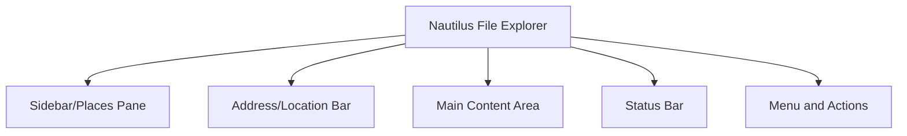

# Ubuntu File Explorer

## Introduction

The Ubuntu File Explorer, officially named "Nautilus" (also called "Files"), is the default graphical file manager for the Ubuntu operating system. It provides a user-friendly interface for navigating, organizing, and manipulating files and directories on your system. For beginners transitioning from Windows or macOS, understanding how to effectively use the Ubuntu File Explorer is essential for productive work in the Linux environment.

This guide will walk you through the basics of using Nautilus, its key features, and how to perform common file management tasks efficiently.

## Getting Started with Nautilus

### Launching the File Explorer

There are several ways to open the Ubuntu File Explorer:

1. Click on the Files icon in the dock (looks like a file cabinet)
2. Press the `Super` key (Windows key) and type "Files" or "Nautilus"
3. Use the keyboard shortcut `Ctrl+Alt+F` or `Super+E`
4. From the terminal, run the command:

```bash
nautilus
```

### Understanding the Interface

When you first open Nautilus, you'll see an interface with these main components:



- **Sidebar/Places Pane**: Shows bookmarked locations, devices, and network locations
- **Address/Location Bar**: Shows your current location in the file system
- **Main Content Area**: Displays files and folders in the current location
- **Status Bar**: Shows information about selected items or available space
- **Menu and Actions**: Contains buttons for common actions and the hamburger menu

## Navigation Basics

### Navigating Through Folders

- **Double-click** on a folder to open it
- Use the **Back** and **Forward** buttons to move through your browsing history
- The **Up** button takes you to the parent directory
- Use the **breadcrumb trail** in the address bar to jump to specific locations in your path

### Location Entry

To directly enter a file path:

1. Click on the address bar or press `Ctrl+L`
2. Type the desired path, for example: `/home/username/Documents`
3. Press `Enter` to navigate to that location

### Using the Places Sidebar

The sidebar provides quick access to common locations:

- **Recent**: Files you've recently accessed
- **Home**: Your personal directory (`/home/username`)
- **Documents**, **Downloads**, **Music**, etc.: Standard user folders
- **Computer**: Shows the root file system and mounted devices
- **Network**: Network shares and connected servers

## File Management Basics

### Selecting Files and Folders

- Click on a file/folder to select it
- `Ctrl+click` to select multiple non-adjacent items
- `Shift+click` to select a range of items
- `Ctrl+A` to select all items in the current view

### Copy, Cut, and Paste

- **Copy**: Select item(s) and press `Ctrl+C` (or right-click → Copy)
- **Cut**: Select item(s) and press `Ctrl+X` (or right-click → Cut)
- **Paste**: Navigate to the destination and press `Ctrl+V` (or right-click → Paste)

### Creating New Items

- **New Folder**: Press `Ctrl+Shift+N` or right-click → New Folder
- **New Document**: Right-click → New Document → Empty Document

### Renaming Files and Folders

1. Select the item you want to rename
2. Press `F2` (or right-click → Rename)
3. Type the new name and press `Enter`

### Deleting Files and Folders

1. Select the item(s) you want to delete
2. Press `Delete` to move to Trash (or right-click → Move to Trash)
3. Press `Shift+Delete` for permanent deletion (bypassing Trash)

To empty the Trash:
1. Click on "Trash" in the sidebar
2. Click the "Empty Trash" button

## Advanced Features

### View Options

Nautilus offers multiple ways to view your files:

- **Icon View**: Press `Ctrl+1` or click the grid icon
- **List View**: Press `Ctrl+2` or click the list icon
- **Compact View**: Available from the View menu

To change sorting options, right-click in the empty space and select "Sort By" or use the dropdown in the toolbar.

### Search Functionality

To search for files:

1. Press `Ctrl+F` or click the search icon
2. Type your search term
3. Use filters (click on the filter icon) to narrow results by type, date, etc.

Example search query for Python files modified in the last week:
```
*.py modified:week
```

### File and Folder Properties

To view detailed information about a file or folder:

1. Select the item
2. Press `Alt+Enter` or right-click → Properties
3. The Properties dialog shows size, permissions, modification dates, etc.

### Bookmarking Locations

To bookmark a frequently used location:

1. Navigate to the folder you want to bookmark
2. Press `Ctrl+D` or click Bookmarks → Bookmark this Location
3. The bookmark will appear in the sidebar under "Bookmarks"

### Tabs and Windows

- Open a new tab: `Ctrl+T`
- Open a new window: `Ctrl+N`
- Close a tab: `Ctrl+W`
- Switch between tabs: `Ctrl+Tab` or `Ctrl+Page Up/Down`

## Terminal Integration

### Opening Terminal in Current Location

To open a terminal in your current folder:

1. Right-click in the empty space
2. Select "Open in Terminal"

Or use the keyboard shortcut `F4`

### Running Commands on Selected Files

You can drag and drop files from Nautilus to a terminal window to automatically insert their file paths into commands.

Example scenario:
1. Open Nautilus and navigate to a folder containing Python scripts
2. Open Terminal
3. Type `python3 ` (with a space after)
4. Drag a Python file from Nautilus to the Terminal
5. The full path will be inserted; press Enter to run the script

## Customizing Nautilus

### Preferences Settings

Access preferences through the hamburger menu → Preferences. Here you can customize:

- Default view options (icon size, sorting, etc.)
- Behavior for single/double clicks
- Preview settings for files
- List view columns

### Adding Extensions

Nautilus can be extended with additional features. Some useful extensions include:

- `nautilus-admin`: Adds admin actions like "Open as Administrator"
- `nautilus-image-converter`: Image resizing and conversion tools
- `nautilus-terminal`: Embeds a terminal within the file browser

To install extensions, use apt:

```bash
sudo apt install nautilus-admin nautilus-image-converter
```

After installation, you may need to restart Nautilus:

```bash
nautilus -q
```

## Practical Examples

### Example 1: Organizing a Programming Project

Let's say you're creating a new web development project:

1. Open Nautilus and navigate to your Projects folder
2. Create a new folder: `Ctrl+Shift+N`, name it "WebProject"
3. Inside WebProject, create subfolders:
   - css
   - js
   - images
   - docs
4. Create initial files by right-clicking → New Document → Empty Document
   - index.html
   - style.css (move to css folder)
   - script.js (move to js folder)
5. Bookmark the WebProject folder: `Ctrl+D`

### Example 2: Bulk File Operations

Scenario: You need to organize photos from a recent trip.

1. Navigate to your Downloads folder where the photos are
2. Use search (`Ctrl+F`) to find all image files: `*.jpg OR *.png`
3. Create a new folder called "Trip_Photos"
4. Select all relevant photos: `Ctrl+click` each one, or use `Shift+click` for ranges
5. Copy the selected files: `Ctrl+C`
6. Navigate to the "Trip_Photos" folder
7. Paste the files: `Ctrl+V`
8. Use "Rename" option to batch rename them (select multiple files → right-click → Rename)

### Example 3: Working with Archives

To create and extract archive files:

Creating a zip archive:
1. Select files you want to archive
2. Right-click and select "Compress..."
3. Choose format (zip, tar.gz, etc.) and location
4. Click "Create"

Extracting an archive:
1. Right-click on the archive file
2. Select "Extract Here" or "Extract To..." for more options

## File Permissions in Nautilus

Ubuntu, like all Linux systems, uses a permission system to control access to files. In Nautilus, you can view and modify these permissions:

1. Select a file or folder
2. Right-click and select "Properties"
3. Go to the "Permissions" tab

Here you can set:
- Who can access the file (Owner, Group, Others)
- What they can do (Read, Write, Execute)

Example: Making a script executable:
1. Right-click your script file (e.g., `myscript.sh`)
2. Select Properties → Permissions
3. Check the "Allow executing file as program" box
4. Close the dialog

## Summary

The Ubuntu File Explorer (Nautilus) is a powerful yet user-friendly tool for managing files in the Ubuntu operating system. In this guide, we've covered:

- Basic navigation and interface elements
- File management operations (copy, move, rename, delete)
- Advanced features like search, properties, and bookmarks
- Terminal integration
- Customization options
- Practical examples for real-world scenarios

These skills will help you efficiently manage your files and folders while working in Ubuntu. As you become more comfortable with Nautilus, you'll find that many operations can be performed quickly using keyboard shortcuts and context menus.

## Additional Resources

For further learning:

- Use `man nautilus` in the terminal for the complete manual
- Practice the keyboard shortcuts to improve efficiency
- Explore the Extensions system to customize Nautilus to your needs

## Practice Exercises

1. Create a folder structure for organizing study materials with subfolders for different subjects
2. Practice searching for all files modified in the last 24 hours
3. Try customizing your file browser with different view options and sorting methods
4. Create a zip archive of a project folder, then extract it to a different location
5. Add custom bookmarks for folders you access frequently