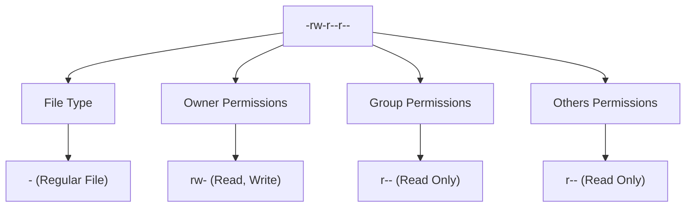

# Ubuntu File Permissions

## Introduction

File permissions are a fundamental aspect of any Unix-based system like Ubuntu. They determine who can read, write, or execute files, forming a critical part of system security. Understanding file permissions is essential for managing your Ubuntu system effectively, preventing unauthorized access, and troubleshooting permission-related issues.

In this guide, we'll explore how Ubuntu handles file permissions, how to view and modify them, and common use cases for permission management.

## Understanding Permission Basics

In Ubuntu, every file and directory has three types of permissions assigned to three different categories of users:

### Permission Types

- **Read (r)**: Allows viewing a file's contents or listing a directory's contents
- **Write (w)**: Allows modifying a file or creating/deleting files within a directory
- **Execute (x)**: Allows running a file as a program or accessing a directory

### User Categories

- **Owner**: The user who created or owns the file
- **Group**: Users who belong to the file's assigned group
- **Others**: All other users on the system

## Viewing File Permissions

You can view file permissions using the `ls` command with the `-l` (long format) option:

```bash
ls -l filename
```

For example:

```bash
ls -l myfile.txt
```

Output:
```
-rw-r--r-- 1 username groupname 1234 Mar 12 14:30 myfile.txt
```

Let's break down this output:



- First character: File type (`-` for regular files, `d` for directories)
- Characters 2-4: Owner permissions (`rw-` means read and write, but not execute)
- Characters 5-7: Group permissions (`r--` means read-only)
- Characters 8-10: Others permissions (`r--` means read-only)

## Permission Notations

There are two common ways to represent permissions:

### Symbolic Notation

Uses letters to represent permissions:
- `r`: Read
- `w`: Write
- `x`: Execute
- `-`: No permission

### Numeric Notation

Uses numbers to represent permissions:
- `4`: Read
- `2`: Write
- `1`: Execute
- `0`: No permission

The sum of these values represents the permissions for each category:
- `7` (4+2+1): Read, write, and execute
- `6` (4+2): Read and write
- `5` (4+1): Read and execute
- `4`: Read only
- `3` (2+1): Write and execute
- `2`: Write only
- `1`: Execute only
- `0`: No permissions

## Modifying File Permissions

### Using `chmod` (Change Mode)

The `chmod` command allows you to change file permissions.

#### Symbolic Method

```bash
chmod [who][operation][permissions] filename
```

Where:
- `who`: `u` (owner), `g` (group), `o` (others), `a` (all)
- `operation`: `+` (add), `-` (remove), `=` (set exactly)
- `permissions`: `r`, `w`, `x`

Examples:

```bash
# Give the owner execute permission
chmod u+x script.sh

# Remove write permission for others
chmod o-w myfile.txt

# Give read and write permissions to owner and group
chmod ug+rw document.txt

# Set exact permissions for all categories
chmod a=r readme.txt
```

#### Numeric Method

```bash
chmod [numeric_value] filename
```

Examples:

```bash
# Set permissions to rwxr-xr-- (owner: rwx, group: r-x, others: r--)
chmod 754 script.sh

# Set permissions to rw-rw-r-- (owner: rw-, group: rw-, others: r--)
chmod 664 document.txt

# Set permissions to rwx------ (only owner has all permissions)
chmod 700 private_folder
```

### Practical Examples

#### Making a Script Executable

When you create a bash script, you need to make it executable before running it:

```bash
# Create a script
echo '#!/bin/bash' > hello.sh
echo 'echo "Hello, World!"' >> hello.sh

# Check current permissions
ls -l hello.sh
# Output: -rw-r--r-- 1 username groupname 33 Mar 12 15:45 hello.sh

# Make it executable
chmod +x hello.sh
# or
chmod 755 hello.sh

# Check updated permissions
ls -l hello.sh
# Output: -rwxr-xr-x 1 username groupname 33 Mar 12 15:45 hello.sh

# Now you can run it
./hello.sh
# Output: Hello, World!
```

#### Securing Configuration Files

For sensitive configuration files, you might want to restrict permissions:

```bash
# Create a configuration file with a password
echo "password=mysecretpassword" > config.cfg

# Restrict permissions to owner only
chmod 600 config.cfg

# Check permissions
ls -l config.cfg
# Output: -rw------- 1 username groupname 25 Mar 12 15:50 config.cfg
```

## Special Permissions

Beyond the basic permissions, Ubuntu supports special permissions:

### SetUID (Set User ID)

When set on an executable file, it runs with the permissions of the file's owner rather than the user executing it.

```bash
# Set the SetUID bit
chmod u+s executable
# or
chmod 4755 executable
```

### SetGID (Set Group ID)

When set on an executable file, it runs with the permissions of the file's group. When set on a directory, new files created in it inherit the directory's group.

```bash
# Set the SetGID bit
chmod g+s executable
# or
chmod 2755 executable
```

### Sticky Bit

When set on a directory, files within can only be deleted by their owners, the directory owner, or root.

```bash
# Set the sticky bit
chmod +t directory
# or
chmod 1777 directory
```

## Changing Ownership with `chown`

You can change a file's owner or group using the `chown` command:

```bash
# Change owner
sudo chown new_owner filename

# Change group
sudo chown :new_group filename

# Change both owner and group
sudo chown new_owner:new_group filename
```

Example:

```bash
# Change the owner to 'john'
sudo chown john myfile.txt

# Change the group to 'developers'
sudo chown :developers myfile.txt

# Change both owner to 'john' and group to 'developers'
sudo chown john:developers myfile.txt
```

## Recursive Permission Changes

To change permissions or ownership for directories and all their contents, use the `-R` (recursive) option:

```bash
# Change permissions recursively
chmod -R 755 directory/

# Change ownership recursively
sudo chown -R username:groupname directory/
```

## Common Permission Patterns

Here are some commonly used permission patterns:

| Permission | Numeric | Use Case |
|------------|---------|----------|
| `-rwx------` | `700` | Scripts or programs only you should use |
| `-rwxr-xr-x` | `755` | Scripts or programs everyone should be able to use |
| `-rw-------` | `600` | Private files only you should see |
| `-rw-r--r--` | `644` | Files everyone should be able to read but only you can modify |
| `drwx------` | `700` | Private directories |
| `drwxr-xr-x` | `755` | Directories everyone should be able to access |

## Troubleshooting Permission Issues

### Common Problems and Solutions

1. **"Permission denied" when running a script**
   ```bash
   # Solution: Make the script executable
   chmod +x script.sh
   ```

2. **Can't modify a file**
   ```bash
   # Solution: Add write permission
   chmod u+w file.txt
   ```

3. **Can't access a directory**
   ```bash
   # Solution: Add execute permission
   chmod u+x directory/
   ```

4. **Can't modify files as a different user**
   ```bash
   # Solution: Change ownership (requires sudo)
   sudo chown username file.txt
   ```

### Checking Process Permissions

You can check what permissions a process has using the `ps` command:

```bash
ps -eo user,pid,args
```

## Advanced Concepts: Access Control Lists (ACLs)

For more fine-grained control beyond the traditional permissions, Ubuntu supports Access Control Lists (ACLs).

To use ACLs, you need to install the `acl` package:

```bash
sudo apt install acl
```

### Setting ACLs

```bash
# Give a specific user read access to a file
setfacl -m u:username:r file.txt

# Give a specific group write access
setfacl -m g:groupname:w file.txt
```

### Viewing ACLs

```bash
getfacl file.txt
```

## Summary

Understanding Ubuntu file permissions is essential for system security and proper file management. Here's what we've covered:

- Permission types: read, write, and execute
- User categories: owner, group, and others
- Viewing permissions with `ls -l`
- Modifying permissions with `chmod` using both symbolic and numeric methods
- Changing ownership with `chown`
- Special permissions: SetUID, SetGID, and sticky bit
- Common permission patterns and troubleshooting
- Advanced permissions with Access Control Lists

## Practice Exercises

1. Create a new directory called `practice_permissions` and experiment with different permission settings.
2. Create a bash script that prints system information and make it executable.
3. Create a file with sensitive information and restrict its permissions so only you can read and write to it.
4. Create a shared directory where members of your group can add files, but only the creator of a file can delete their own files.

## Additional Resources

- The `man` pages for the commands mentioned in this guide:
  ```bash
  man chmod
  man chown
  man ls
  man getfacl
  man setfacl
  ```
- Online documentation:
  - Ubuntu Documentation on File Permissions
  - Linux Command Library
  - GNU Coreutils Documentation

By mastering file permissions in Ubuntu, you'll be better equipped to maintain a secure and properly functioning system while avoiding many common permission-related issues that beginners often encounter.