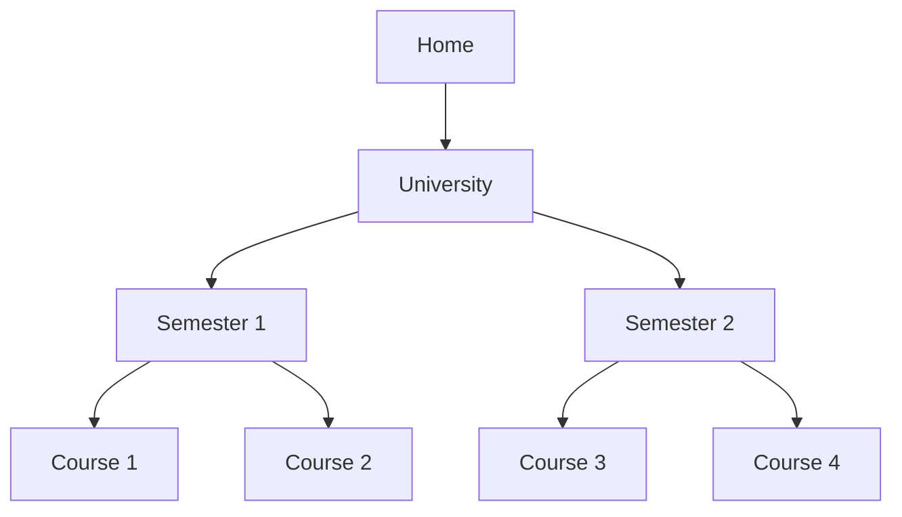

# Ubuntu Bookmarks

## Introduction

File navigation is a fundamental aspect of using any operating system. As you work with Ubuntu, you'll find yourself frequently accessing certain directories or locations. Constantly typing paths or clicking through multiple folders can become tedious and time-consuming. This is where Ubuntu's bookmarking system comes to the rescue.

Ubuntu bookmarks provide a convenient way to save and quickly access your frequently visited locations within the file system. Whether you're a student organizing study materials, a developer managing multiple project directories, or simply someone who wants to optimize their workflow, understanding how to use bookmarks effectively can significantly enhance your Ubuntu experience.

In this guide, we'll explore the Ubuntu bookmarking system in depth, covering everything from basic bookmark creation to advanced bookmark management techniques. By the end, you'll be able to navigate your file system with greater efficiency and organization.

## Understanding Ubuntu's File Manager

Before diving into bookmarks, let's briefly understand Ubuntu's default file manager, Nautilus (also called "Files"). Nautilus is the graphical file manager that comes pre-installed with Ubuntu's GNOME desktop environment.

The Nautilus interface consists of several key components:

1. **Sidebar** - Contains quick access locations, including your bookmarks
2. **Address Bar** - Shows your current location and allows direct path entry
3. **Content Area** - Displays files and folders in your current location
4. **Menu Button** - Provides additional options and settings

The sidebar is where your bookmarks appear, making them easily accessible regardless of your current location in the file system.

## Basic Bookmark Usage

### Viewing Existing Bookmarks

When you open Nautilus, you'll notice several default bookmarks in the left sidebar:

- **Home** - Your personal directory (`/home/username`)
- **Desktop** - Your desktop directory
- **Documents** - Your documents folder
- **Downloads** - Your downloads folder
- **Music** - Your music library
- **Pictures** - Your pictures folder
- **Videos** - Your videos folder
- **Trash** - Location for deleted files

These default bookmarks point to commonly used locations in your home directory, making them quickly accessible with a single click.

### Creating Your First Bookmark

Creating a bookmark in Ubuntu is straightforward:

1. Navigate to the folder you want to bookmark
2. Press `Ctrl+D` on your keyboard
- Alternatively, click on "Bookmarks" in the menu bar and select "Bookmark this Location"

For example, if you're working on a programming project located at `/home/username/Projects/MyAwesomeApp`, navigate to this folder and press `Ctrl+D`. A new bookmark named "MyAwesomeApp" will immediately appear in your sidebar.

### Using Bookmarks to Navigate

To use a bookmark:

1. Simply click on the bookmark name in the sidebar
2. Nautilus will immediately navigate to that location

This allows you to quickly jump between different parts of your file system without having to remember and type complex paths.

## Advanced Bookmark Management

### Renaming Bookmarks

By default, a bookmark is named after the folder it points to. However, you might want to use a more descriptive name:

1. Right-click on the bookmark in the sidebar
2. Select "Rename..."
3. Enter the new name and press Enter

For instance, you might rename a bookmark from "MyAwesomeApp" to "Current Project" for clarity.

### Removing Bookmarks

If you no longer need a bookmark:

1. Right-click on the bookmark in the sidebar
2. Select "Remove"

This action only removes the bookmark, not the actual folder or its contents.

### Reordering Bookmarks

To organize your bookmarks in a logical order:

1. Click and drag a bookmark up or down in the sidebar
2. Release to place it in the new position

This allows you to group related bookmarks together or prioritize frequently used ones at the top.

### Bookmarking Network Locations

Bookmarks aren't limited to local folders. You can bookmark network locations too:

1. Connect to a network location using the "Connect to Server" option
```bash
# Example: Connect to an SFTP server in terminal
sftp username@server.example.com
   ```

2. Once connected, press `Ctrl+D` to bookmark the location

This is particularly useful for regularly accessed network drives, remote servers, or cloud storage.

## Bookmark Management with GTK Bookmarks

Behind the scenes, Ubuntu bookmarks are stored in a plain text file located at `~/.config/gtk-3.0/bookmarks`. Advanced users can directly edit this file to manage their bookmarks:

```bash
# Open bookmarks file in a text editor
gedit ~/.config/gtk-3.0/bookmarks
```

The file format is simple, with each bookmark on a new line:

```
file:///home/username/Projects/MyAwesomeApp MyAwesomeApp
file:///home/username/Documents/Important Important Documents
sftp://username@server.example.com/home/username Remote Server
```

Each line contains:
1. The location URI (starting with `file:///` for local locations)
2. An optional space followed by the display name

Changes to this file take effect immediately, although you might need to refresh Nautilus by pressing `F5`.

## Real-World Bookmark Applications

Let's explore some practical applications of Ubuntu bookmarks to enhance your workflow:

### Scenario 1: Student Organization

A student might set up bookmarks for organizing coursework:



By creating bookmarks for each course folder, the student can quickly switch between different courses without navigating through the folder hierarchy each time.

### Scenario 2: Developer Workflow

A developer working on multiple projects might create bookmarks like:

- Current Project
- Reference Documentation
- Client Assets
- Testing Environment
- Backup Location

This setup allows for swift navigation between different aspects of the development workflow.

### Scenario 3: System Administration

System administrators can bookmark critical system directories:

1. Navigate to system directories (you may need `sudo` access)
```bash
sudo nautilus /etc
   ```

2. Create bookmarks for important locations like:
- `/etc` (System configuration)
- `/var/log` (System logs)
- `/usr/local` (Local software)

Remember that bookmarks requiring elevated privileges will prompt for your password when accessed.

## Command Line Bookmark Integration

Ubuntu's bookmark system isn't limited to the graphical interface. You can leverage your bookmarks in the terminal using the `cd` command with the CDPATH environment variable:

```bash
# Add this to your ~/.bashrc file
export CDPATH=.:~:~/Documents:~/Projects

# Source the updated bashrc
source ~/.bashrc
```

Now you can quickly navigate to directories in your CDPATH:

```bash
# Instead of typing the full path
cd ~/Projects/MyAwesomeApp

# You can simply type
cd MyAwesomeApp
```

While this isn't directly using Nautilus bookmarks, it's a complementary approach for terminal users.

## Creating Bookmark Shortcuts

For even faster access, you can create custom keyboard shortcuts to jump to specific bookmarked locations:

1. Open Settings → Keyboard → Shortcuts → Custom Shortcuts
2. Click the "+" button to add a new shortcut
3. Enter a name like "Open Projects Folder"
4. Enter the command: `nautilus /home/username/Projects`
5. Assign a keyboard shortcut like `Ctrl+Alt+P`

Now, pressing `Ctrl+Alt+P` will open your Projects folder directly, regardless of what you're currently doing.

## Troubleshooting Common Bookmark Issues

### Missing Bookmarks

If your bookmarks disappear:

1. Check if the bookmarks file exists:
```bash
ls -l ~/.config/gtk-3.0/bookmarks
   ```

2. If it's missing, you may need to create it:
```bash
mkdir -p ~/.config/gtk-3.0
touch ~/.config/gtk-3.0/bookmarks
   ```

3. Restart Nautilus:
```bash
nautilus -q && nautilus
   ```

### Broken Bookmarks

If a bookmark points to a location that no longer exists, it will be shown with an error icon. To fix:

1. Right-click the broken bookmark
2. Select "Remove"
3. Navigate to the new location and create a new bookmark

### Permission Issues

If you can't access a bookmarked location, it might be a permissions issue:

```bash
# Check permissions for the directory
ls -ld /path/to/bookmarked/directory

# Fix permissions if needed
sudo chmod 755 /path/to/bookmarked/directory
```

## Summary

Ubuntu bookmarks are a powerful feature that can significantly enhance your file management experience by providing quick access to frequently used locations. We've covered:

- Basic bookmark creation, usage, and management
- Advanced techniques for renaming, reordering, and removing bookmarks
- Direct editing of the bookmarks file
- Real-world bookmark applications for various use cases
- Command line integration and keyboard shortcuts
- Troubleshooting common bookmark issues

By incorporating bookmarks into your daily workflow, you can navigate the Ubuntu file system more efficiently, saving time and reducing frustration. Whether you're a student, developer, system administrator, or casual user, bookmarks can help you organize your digital workspace effectively.

## Additional Resources

- The GNOME Files (Nautilus) documentation: Visit the GNOME website for official documentation
- Ubuntu Documentation: Ubuntu's official documentation provides additional insights into file management
- Linux File System Hierarchy Standard: Understanding the Linux file system structure can help you organize bookmarks more effectively

## Exercises

1. **Basic Exercise**: Create bookmarks for your three most frequently accessed folders.

2. **Intermediate Exercise**: Set up a bookmark structure for a project with multiple components (e.g., source code, documentation, assets, and testing).

3. **Advanced Exercise**: Edit your bookmarks file directly to add remote locations with custom names.

4. **Challenge Exercise**: Create a script that backs up your bookmarks and restores them on a new Ubuntu installation.

5. **Exploration Exercise**: Investigate how bookmarks work in other file managers like Thunar or PCManFM. Compare their bookmark management features with Nautilus.