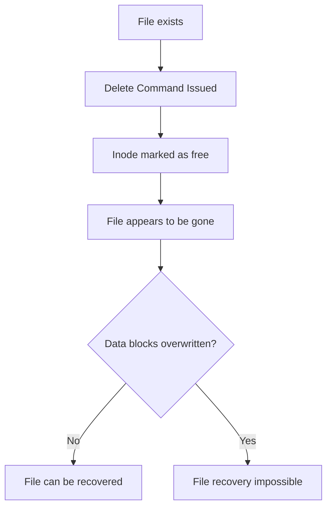

# Ubuntu File Recovery

## Introduction

Data loss happens to everyone at some point. Whether it's accidentally deleting important files, formatting the wrong partition, or experiencing system crashes, the loss of valuable data can be distressing. The good news is that in Ubuntu Linux, there are several tools and techniques available to help you recover lost files.

This guide explores file recovery concepts in Ubuntu, offering step-by-step instructions for using various recovery tools. We'll cover how file deletion works in Linux systems, why recovery is possible, and practical approaches to rescue your data.

## Understanding File Deletion in Linux

Before diving into recovery methods, it's important to understand how file deletion works in Linux file systems:

1. **Deletion Process**: When you delete a file in Ubuntu (using `rm` command or emptying the trash), the system doesn't immediately erase the file data from the storage device. Instead, it marks the space occupied by the file as available for new data.

2. **Inodes and Data Blocks**: Linux file systems use inodes that point to data blocks. When a file is deleted, the inode reference is removed, but the actual data blocks may remain untouched until they're overwritten by new data.

3. **Recovery Window**: There's a window of opportunity to recover files before the system reuses those data blocks for new files.



## Important Precautions

Before attempting file recovery, follow these critical precautions:

1. **Stop Using the Affected Drive**: As soon as you realize files are missing, minimize writing to the drive where the files were stored.

2. **Mount Drives as Read-Only**: If possible, mount the affected partition as read-only to prevent further data modifications.

3. **Use a Live USB**: For system partitions, boot from a Ubuntu Live USB to avoid writing to the drive during normal system operation.

4. **Recover to a Different Drive**: Always save recovered files to a different drive than the one containing the deleted files.

## Recovery Tools in Ubuntu

Let's explore several effective file recovery tools available for Ubuntu:

### 1. The Trash Folder

The simplest recovery method is checking Ubuntu's Trash folder:

1. Open the file manager (Nautilus)
2. Click on the Trash icon in the sidebar
3. Right-click on the file you want to restore and select "Restore"

For command-line users:

```bash
# List files in trash
ls -la ~/.local/share/Trash/files/

# Restore a file from trash to current directory
mv ~/.local/share/Trash/files/filename ./
```

### 2. TestDisk and PhotoRec

TestDisk is a powerful, free data recovery utility that can recover lost partitions and make non-booting disks bootable again. PhotoRec (part of the TestDisk package) focuses on file recovery.

#### Installation:

```bash
sudo apt update
sudo apt install testdisk
```

#### Using TestDisk:

```bash
# Launch TestDisk with sudo permissions
sudo testdisk
```

TestDisk provides an interactive interface to:
- Recover deleted partitions
- Rebuild boot sectors
- Recover deleted files from file systems

#### Using PhotoRec:

```bash
# Launch PhotoRec with sudo permissions
sudo photorec
```

PhotoRec is especially useful for recovering:
- Photos from memory cards
- Documents from formatted partitions
- Files from drives with corrupted file systems

Example workflow for PhotoRec:

1. Select the disk containing deleted files
2. Choose the partition
3. Specify the file system type (often automatic)
4. Choose where to save recovered files (use a different drive)
5. Select file types to recover
6. Wait for the scanning and recovery process to complete

### 3. Extundelete

Extundelete is designed specifically for ext3/ext4 file systems and can recover deleted files if the space hasn't been overwritten.

#### Installation:

```bash
sudo apt update
sudo apt install extundelete
```

#### Basic Usage:

```bash
# List deleted files in a partition
sudo extundelete /dev/sdXY --inode 2

# Recover all deleted files
sudo extundelete /dev/sdXY --restore-all

# Recover a specific file
sudo extundelete /dev/sdXY --restore-file path/to/file

# Recover a directory and its contents
sudo extundelete /dev/sdXY --restore-directory path/to/directory
```

Replace `/dev/sdXY` with your actual device and partition (e.g., `/dev/sda1`).

The recovered files will be saved in a directory named `RECOVERED_FILES` in your current working directory.

### 4. Foremost

Foremost is a forensic data recovery tool that recovers files based on their headers, footers, and data structures.

#### Installation:

```bash
sudo apt update
sudo apt install foremost
```

#### Basic Usage:

```bash
# Recover all supported file types
sudo foremost -i /dev/sdXY -o /path/to/recovery/directory

# Recover specific file types (e.g., jpg, pdf, doc)
sudo foremost -t jpg,pdf,doc -i /dev/sdXY -o /path/to/recovery/directory
```

Foremost is particularly useful when:
- The file system is damaged
- You need to recover specific types of files
- You're performing file carving (extracting files from raw data)

### 5. GNU ddrescue

For cases where the drive has physical issues, ddrescue can create a disk image while minimizing further damage:

#### Installation:

```bash
sudo apt update
sudo apt install gddrescue
```

#### Basic Usage:

```bash
# Create a disk image of a failing drive
sudo ddrescue /dev/sdX /path/to/image.img /path/to/logfile.log

# Run a second pass to try harder on difficult sectors
sudo ddrescue -d -r3 /dev/sdX /path/to/image.img /path/to/logfile.log
```

After creating the image, you can use other recovery tools on the image file instead of the original drive.

## Practical Recovery Scenarios

Let's walk through some common data loss scenarios and how to handle them:

### Scenario 1: Accidentally Deleted Files

```bash
# Step 1: Stop using the system immediately to prevent overwriting
# Step 2: If it's a non-system partition, mount it as read-only
sudo mount -o remount,ro /dev/sdXY /mount/point

# Step 3: Use Extundelete to recover files
sudo extundelete /dev/sdXY --restore-all

# Step 4: Check recovered files in RECOVERED_FILES directory
ls -la RECOVERED_FILES/
```

### Scenario 2: Formatted Partition

```bash
# Step 1: Create a disk image to work on (optional but recommended)
sudo dd if=/dev/sdXY of=/path/to/backup.img bs=4M status=progress

# Step 2: Use TestDisk on the image or directly on the partition
sudo testdisk /path/to/backup.img
# Or
sudo testdisk /dev/sdXY

# Follow TestDisk's guided recovery process for the partition
```

### Scenario 3: Recovering Specific File Types

```bash
# Use Foremost to recover images, documents, etc.
sudo foremost -t jpg,png,pdf,doc,xls -i /dev/sdXY -o ~/recovered-files

# Check results
ls -la ~/recovered-files
```

### Scenario 4: Corrupted File System

```bash
# Check and repair the file system (don't use if you suspect physical drive issues)
sudo fsck -y /dev/sdXY

# If fsck doesn't help, use TestDisk to repair the partition table
sudo testdisk /dev/sdXY

# If data is still inaccessible, try file carving with PhotoRec
sudo photorec /dev/sdXY
```

## Best Practices for Prevention

The best recovery strategy is prevention. Here are some best practices:

1. **Regular Backups**: Use tools like `rsync`, Déjà Dup, or Timeshift to maintain regular backups.

```bash
# Basic rsync backup command
rsync -av --delete /source/directory /backup/location
```

2. **Use Version Control**: For code and text-based projects, use Git or another version control system.

3. **RAID Configurations**: Consider RAID setups for important data storage.

4. **Testing Backups**: Regularly verify that your backups are working by testing restoration.

5. **Cloud Backups**: Use services like NextCloud, Dropbox, or Google Drive as additional backup locations.

## Common File Recovery Mistakes

Avoid these common mistakes during recovery:

1. **Installing recovery software on the affected drive**
2. **Writing recovered files back to the same drive**
3. **Running system updates or installing software during recovery**
4. **Attempting recovery on a physically failing drive**
5. **Giving up after the first recovery attempt fails**

## Summary

File recovery in Ubuntu is possible thanks to how Linux file systems handle deletion. By understanding the underlying principles and using the right tools, you can often rescue accidentally deleted files. Remember these key points:

- Act quickly to prevent overwriting deleted data
- Use the appropriate recovery tool for your situation
- Follow proper procedures and precautions
- Recover files to a different drive
- Maintain regular backups to avoid future data loss situations

## Additional Resources

- [TestDisk Documentation](https://www.cgsecurity.org/wiki/TestDisk)
- [The Linux Documentation Project](https://tldp.org/)
- [Ubuntu Community Help Wiki](https://help.ubuntu.com/community/)

## Practice Exercises

1. Create a test file, delete it, and try to recover it using Extundelete.
2. Set up an automated backup system using rsync and cron jobs.
3. Create a bootable Ubuntu Live USB specifically for file recovery purposes.
4. Practice file recovery on a virtual machine to gain experience without risking real data.
5. Document your own file recovery procedure based on your specific needs and environment.

Remember that successful data recovery often depends on quick action and following the right procedures. With practice and preparation, you'll be well-equipped to handle data loss situations when they occur.