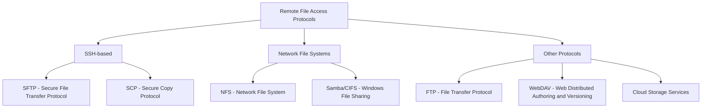

# Ubuntu Remote Files

## Introduction

Working with remote files is an essential skill for any Ubuntu user, especially for those in programming and system administration. Remote file access allows you to view, edit, and transfer files between your local machine and remote servers or computers without physically transferring storage media. 

In Ubuntu, you have multiple ways to access and manage remote files, from command-line tools to graphical interfaces. This guide will walk you through the various methods, protocols, and practical applications of working with remote files in Ubuntu.

## Understanding Remote File Access

Remote file access involves connecting to files stored on another computer or server over a network connection. Before diving into specific tools, let's understand some common protocols used for remote file access:



## SSH-Based Remote File Access

### Using SFTP (Secure File Transfer Protocol)

SFTP is a secure protocol for transferring files that works over SSH. It's one of the most common ways to access remote files in Ubuntu.

#### Command Line SFTP

To connect to a remote server using SFTP:

```bash
sftp username@remote_server
```

For example:

```bash
sftp john@192.168.1.100
```

Once connected, you'll see an sftp prompt where you can run commands:

```
Connected to 192.168.1.100.
sftp>
```

Common SFTP commands:

| Command | Description | Example |
|---------|-------------|---------|
| `ls` | List remote directory contents | `ls /var/www` |
| `cd` | Change remote directory | `cd /home/user/documents` |
| `get` | Download file from remote to local | `get report.pdf` |
| `put` | Upload file from local to remote | `put script.py` |
| `mkdir` | Create remote directory | `mkdir new_folder` |
| `rm` | Remove remote file | `rm old_file.txt` |
| `pwd` | Print working directory | `pwd` |
| `exit` | Close connection | `exit` |

Example SFTP session:

```
sftp> ls
Documents  Downloads  Pictures  Videos
sftp> cd Documents
sftp> ls
project1  project2  notes.txt
sftp> get notes.txt
Fetching /home/username/Documents/notes.txt to notes.txt
/home/username/Documents/notes.txt                  100%  156     0.2KB/s   00:00
sftp> exit
```

### Using SCP (Secure Copy Protocol)

SCP is a simple way to copy files between hosts on a network using SSH for authentication and encryption.

Basic syntax:

```bash
scp [options] source destination
```

Examples:

Copy a local file to a remote server:

```bash
scp local_file.txt username@remote_server:/path/to/destination/
```

Copy a remote file to local machine:

```bash
scp username@remote_server:/path/to/remote_file.txt /local/directory/
```

Copy an entire directory recursively:

```bash
scp -r local_directory/ username@remote_server:/path/to/destination/
```

### Using the File Browser (Nautilus)

Ubuntu's default file manager (Nautilus) supports connecting to remote servers graphically:

1. Open Nautilus (Files)
2. Click on "Other Locations" in the sidebar
3. At the bottom, find the "Connect to Server" field
4. Enter the server address in the proper format:
   - For SFTP: `sftp://username@server_address`
   - For FTP: `ftp://username@server_address`
   - For Windows shares: `smb://server_address/share`

For example, to connect to a server via SFTP:
```
sftp://john@192.168.1.100
```

After entering the address and pressing Enter, you'll be prompted for a password (if needed). Once authenticated, the remote files will appear in Nautilus just like local files, allowing you to browse, open, edit, and transfer files using drag and drop.

## Mounting Remote Filesystems

For more persistent access to remote files, you can mount remote filesystems directly into your local filesystem.

### SSHFS (SSH Filesystem)

SSHFS allows you to mount a remote filesystem using SSH. First, install SSHFS:

```bash
sudo apt install sshfs
```

Create a mount point:

```bash
mkdir ~/remote-server
```

Mount the remote filesystem:

```bash
sshfs username@remote_server:/remote/path ~/remote-server
```

For example:

```bash
sshfs john@192.168.1.100:/home/john/projects ~/remote-server
```

To unmount:

```bash
fusermount -u ~/remote-server
```

### NFS (Network File System)

NFS is commonly used in Linux/Unix environments for sharing files between systems.

To access an NFS share in Ubuntu:

1. Install NFS client:
   ```bash
   sudo apt install nfs-common
   ```

2. Create a mount point:
   ```bash
   sudo mkdir /mnt/nfs_share
   ```

3. Mount the NFS share:
   ```bash
   sudo mount -t nfs server_ip:/shared_directory /mnt/nfs_share
   ```

For example:
   ```bash
   sudo mount -t nfs 192.168.1.200:/exports/data /mnt/nfs_share
   ```

For automatic mounting at boot, add an entry to `/etc/fstab`:
   ```
   server_ip:/shared_directory /mnt/nfs_share nfs defaults 0 0
   ```

### Samba/CIFS (Windows File Sharing)

To access Windows or Samba shares:

1. Install CIFS utilities:
   ```bash
   sudo apt install cifs-utils
   ```

2. Create a mount point:
   ```bash
   sudo mkdir /mnt/windows_share
   ```

3. Mount the Samba share:
   ```bash
   sudo mount -t cifs //server_ip/share_name /mnt/windows_share -o username=your_username
   ```

For example:
   ```bash
   sudo mount -t cifs //192.168.1.50/Documents /mnt/windows_share -o username=john
   ```

If credentials are required, create a credentials file:
   ```bash
   echo "username=your_username" > ~/.smbcredentials
   echo "password=your_password" >> ~/.smbcredentials
   chmod 600 ~/.smbcredentials
   ```

Then mount using:
   ```bash
   sudo mount -t cifs //server_ip/share_name /mnt/windows_share -o credentials=~/.smbcredentials
   ```

## Remote File Editing

### Using SSH and Text Editors

You can directly edit remote files using text editors over SSH:

#### Using Nano

```bash
ssh username@remote_server nano /path/to/file.txt
```

#### Using Vim

```bash
ssh username@remote_server vim /path/to/file.txt
```

### Using VS Code Remote Development

Visual Studio Code has excellent remote development capabilities:

1. Install the "Remote - SSH" extension in VS Code
2. Press F1 and select "Remote-SSH: Connect to Host..."
3. Enter `username@hostname` and your password
4. Once connected, you can browse, edit, and save remote files directly

### Using X11 Forwarding

You can run graphical applications on the remote server and have them display on your local machine:

```bash
ssh -X username@remote_server
```

Then run any graphical application (like gedit):

```bash
gedit /path/to/file.txt
```

## Practical Examples

### Example 1: Backing Up Important Files to a Remote Server

Create a backup script using rsync:

```bash
#!/bin/bash
# Simple backup script

# Source directory to backup
SRC_DIR="/home/username/important_data"

# Remote server details
REMOTE_USER="backup_user"
REMOTE_HOST="backup.example.com"
REMOTE_DIR="/backup/username"

# Backup with timestamp
TIMESTAMP=$(date +"%Y-%m-%d_%H-%M-%S")
BACKUP_NAME="backup_$TIMESTAMP"

# Run rsync backup
rsync -avz --progress "$SRC_DIR" "$REMOTE_USER@$REMOTE_HOST:$REMOTE_DIR/$BACKUP_NAME"

echo "Backup completed: $BACKUP_NAME"
```

### Example 2: Deploying a Web Project to a Remote Server

```bash
#!/bin/bash
# Simple deployment script

# Local project directory
PROJECT_DIR="/home/username/projects/my_website"

# Remote server details
REMOTE_USER="www_user"
REMOTE_HOST="webserver.example.com"
REMOTE_DIR="/var/www/html/my_website"

# Build the project (if needed)
cd "$PROJECT_DIR"
npm run build

# Deploy to server
rsync -avz --delete --exclude='.git' --exclude='node_modules' \
  "$PROJECT_DIR/build/" "$REMOTE_USER@$REMOTE_HOST:$REMOTE_DIR"

echo "Deployment completed!"
```

### Example 3: Setting Up a Shared Folder for Team Collaboration

Using Samba to set up a shared folder:

1. Install Samba:
   ```bash
   sudo apt install samba
   ```

2. Create a shared directory:
   ```bash
   mkdir -p ~/shared_folder
   ```

3. Edit the Samba configuration:
   ```bash
   sudo nano /etc/samba/smb.conf
   ```

4. Add the following at the end of the file:
   ```
   [TeamShare]
   path = /home/username/shared_folder
   browseable = yes
   read only = no
   valid users = @team_group
   create mask = 0755
   ```

5. Create a Samba user:
   ```bash
   sudo smbpasswd -a username
   ```

6. Restart Samba:
   ```bash
   sudo systemctl restart smbd
   ```

## Troubleshooting Remote File Access

### Common Issues and Solutions

1. **Connection Refused**
   - Check if the remote server is running
   - Verify firewall settings
   - Confirm the service is running on the expected port

2. **Permission Denied**
   - Verify username and password
   - Check file permissions on the remote server
   - Ensure your user has access to the requested files

3. **Slow Transfer Speeds**
   - Consider using compression (`-C` option in SSH)
   - Check network bandwidth and limitations
   - Use `rsync` with the `-z` option for compressed transfers

4. **Mounting Issues**
   - Ensure required packages are installed
   - Check if the remote service is running
   - Verify network connectivity

### Debugging Commands

Check SSH connection:
```bash
ssh -v username@remote_server
```

Test network connectivity:
```bash
ping remote_server
```

Check open ports:
```bash
nmap -p 22,21,445,2049 remote_server
```

## Summary

Working with remote files in Ubuntu offers significant flexibility for managing data across multiple systems. You've learned about:

- SSH-based file transfer tools like SFTP and SCP
- Graphical methods using Nautilus
- Mounting remote filesystems with SSHFS, NFS, and Samba
- Editing remote files directly
- Practical examples for backups, deployments, and team collaboration

By mastering these techniques, you'll be able to efficiently work with files across your network, regardless of where they're stored physically.

## Exercises

1. Set up SSHFS to mount a remote directory and create a simple text file in it. Verify the file appears on the remote server.

2. Create a script that backs up your home directory to a remote server using rsync, excluding large directories like Downloads and .cache.

3. Use Nautilus to connect to a remote server via SFTP and practice moving files between your local and remote machines.

4. Set up a small shared folder using Samba and access it from another computer on your network.

5. Write a small script that synchronizes a project directory between your local machine and a remote server whenever files change.

## Additional Resources

- [Ubuntu Documentation - SSH/TransferFiles](https://help.ubuntu.com/community/SSH/TransferFiles)
- [Ubuntu Wiki - MountWindowsSharesPermanently](https://wiki.ubuntu.com/MountWindowsSharesPermanently)
- [The rsync Manual](https://rsync.samba.org/documentation.html)
- [OpenSSH Documentation](https://www.openssh.com/manual.html)
- [Visual Studio Code Remote Development](https://code.visualstudio.com/docs/remote/remote-overview)