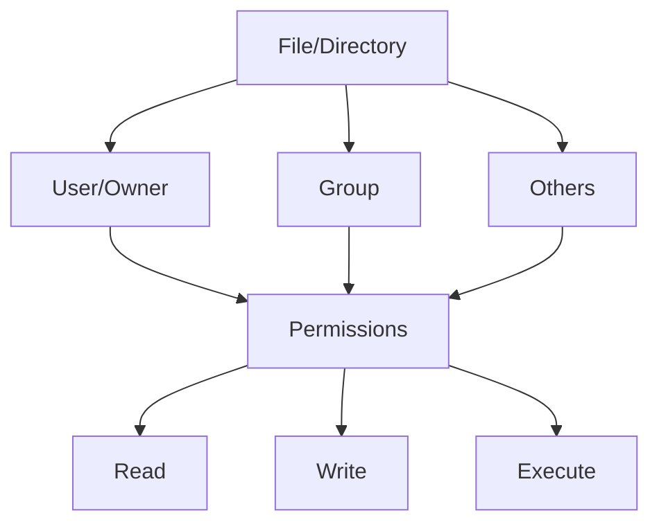

# Ubuntu File Ownership

## Introduction

File ownership is a fundamental concept in Ubuntu and other Linux-based operating systems. It determines who can access, modify, or execute files on your system. Understanding file ownership is crucial for maintaining security, managing permissions, and organizing your filesystem effectively.

In Ubuntu, every file and directory has three types of ownership attributes:

1. **User (Owner)**: The user who created the file or currently owns it
2. **Group**: A collection of users that share certain permissions
3. **Others**: Everyone else on the system who isn't the owner or in the group

Let's explore how file ownership works in Ubuntu and how to manage it effectively.

## Viewing File Ownership

To view the ownership information of files and directories, you can use the `ls` command with the `-l` (long listing) option:

```bash
ls -l
```

Here's an example output:

```
-rw-r--r-- 1 ubuntu developers 2048 Mar 13 10:25 document.txt
drwxr-xr-x 2 ubuntu ubuntu     4096 Mar 12 14:30 images/
-rwxr-xr-x 1 root   root       8421 Mar 10 09:15 system_script.sh
```

Let's break down the first entry:

- `-rw-r--r--`: File permissions (we'll cover this in detail)
- `1`: Number of hard links
- `ubuntu`: The owner of the file (user)
- `developers`: The group that has access to the file
- `2048`: File size in bytes
- `Mar 13 10:25`: Last modification date and time
- `document.txt`: Filename

To see ownership details for all files, including hidden ones, use:

```bash
ls -la
```

## Understanding the Ownership Model

Ubuntu's file ownership model consists of three entities:



Each entity (User, Group, Others) can have different permissions to the file.

## Changing File Ownership

### Changing the User Owner

To change the user owner of a file, use the `chown` (change owner) command:

```bash
sudo chown new_username filename
```

For example, to change the owner of `document.txt` to `john`:

```bash
sudo chown john document.txt
```

### Changing the Group Owner

To change the group ownership, use `chown` with the group name after a colon:

```bash
sudo chown :new_groupname filename
```

Or you can use the `chgrp` command:

```bash
sudo chgrp new_groupname filename
```

For example, to change the group of `document.txt` to `staff`:

```bash
sudo chown :staff document.txt
# OR
sudo chgrp staff document.txt
```

### Changing Both User and Group Simultaneously

You can change both the user and group owner at once:

```bash
sudo chown new_username:new_groupname filename
```

For example:

```bash
sudo chown john:staff document.txt
```

### Changing Ownership Recursively

To change ownership of a directory and all its contents recursively, use the `-R` option:

```bash
sudo chown -R new_username:new_groupname directory/
```

This is particularly useful when dealing with large directories of files that need consistent ownership:

```bash
sudo chown -R ubuntu:developers projects/
```

## File Permissions and Ownership

File ownership works closely with file permissions. Each file has permission settings that define what actions the owner, group members, and others can perform on the file. The basic permissions are:

- **r (read)**: Permission to view the file or list directory contents
- **w (write)**: Permission to modify the file or create/delete files in a directory
- **x (execute)**: Permission to run the file as a program or script, or to access a directory

Let's look at a file permission string in detail:

```
-rwxr-xr--
```

This string can be broken down as follows:

1. First character: File type (- for regular file, d for directory)
2. Characters 2-4: Owner permissions (rwx = read, write, execute)
3. Characters 5-7: Group permissions (r-x = read, execute, no write)
4. Characters 8-10: Others permissions (r-- = read only)

## Practical Examples

### Example 1: Setting Up a Shared Project Directory

Let's say you want to create a directory for a team project where all team members need read and write access:

```bash
# Create a new directory
mkdir /home/shared/team_project

# Create a group for team members
sudo groupadd team_dev

# Add users to the team group
sudo usermod -aG team_dev john
sudo usermod -aG team_dev sarah
sudo usermod -aG team_dev mike

# Change ownership of the directory
sudo chown -R :team_dev /home/shared/team_project

# Set group permissions to read, write, execute
sudo chmod -R 775 /home/shared/team_project

# Set the setgid bit so new files inherit the group
sudo chmod g+s /home/shared/team_project
```

The above example ensures that any team member can work on files in the shared directory, while users outside the team have limited access.

### Example 2: Securing Configuration Files

For sensitive configuration files that only admins should modify:

```bash
# Create admin configuration file
sudo touch /etc/app/config.conf

# Make sure it's owned by root with admin group access
sudo chown root:admin /etc/app/config.conf

# Set permissions to allow read/write for owner and group, read-only for others
sudo chmod 664 /etc/app/config.conf
```

### Example 3: Fixing Permission Issues

If you've cloned a repository or extracted files that have incorrect permissions:

```bash
# Make all scripts executable
find ./scripts -name "*.sh" -exec chmod u+x {} \;

# Make all files owned by your user
sudo chown -R $(whoami) ./project_directory

# Fix web server directories (if using Apache)
sudo chown -R www-data:www-data /var/www/html
```

## Special Ownership: SUID, SGID, and Sticky Bit

Beyond basic ownership, Ubuntu offers special permission bits:

### SUID (Set User ID)

When set on an executable file, it runs with the permissions of the owner, not the user who ran it.

```bash
# Set SUID
sudo chmod u+s filename

# Example: The passwd command uses SUID to modify password files
ls -l /usr/bin/passwd
# Output: -rwsr-xr-x 1 root root 68208 Mar 26  2022 /usr/bin/passwd
```

### SGID (Set Group ID)

When set on a directory, new files created within the directory inherit the group ID of the directory instead of the creator's group.

```bash
# Set SGID
sudo chmod g+s directory

# Example: Create a shared directory where all files will belong to the same group
sudo mkdir /shared
sudo chown :developers /shared
sudo chmod g+s /shared
```

### Sticky Bit

When set on a directory, files in that directory can only be deleted or renamed by the file owner, the directory owner, or the root user.

```bash
# Set sticky bit
sudo chmod +t directory

# Example: The /tmp directory has the sticky bit set
ls -ld /tmp
# Output: drwxrwxrwt 18 root root 4096 Mar 13 10:45 /tmp
```

## Common Ownership-Related Commands

Here's a quick reference of the commands we've covered:

| Command | Description | Example |
|---------|-------------|---------|
| `ls -l` | List files with ownership details | `ls -l /home` |
| `chown` | Change file owner | `sudo chown john file.txt` |
| `chgrp` | Change file group | `sudo chgrp team file.txt` |
| `chmod` | Change file permissions | `chmod 755 script.sh` |
| `id` | Show current user and group IDs | `id` |
| `groups` | Show groups a user belongs to | `groups john` |
| `sudo` | Execute command as another user | `sudo command` |

## Best Practices for File Ownership

1. **Least Privilege Principle**: Give users and programs only the permissions they need to function
2. **Use Groups Effectively**: Create logical groups for different projects or functions
3. **Regular Audits**: Periodically check file permissions in sensitive locations
4. **Be Careful with Recursive Changes**: Use `-R` with caution as it affects all files in a directory
5. **Document Special Permissions**: Keep track of files with special permissions like SUID

## Summary

Understanding Ubuntu file ownership is essential for maintaining a secure and well-organized system. By properly managing who can access and modify your files, you create a more secure environment and facilitate better collaboration.

In this guide, we've covered:
- The three levels of file ownership: user, group, and others
- Viewing file ownership information
- Changing file owners and groups
- The relationship between permissions and ownership
- Special permission bits: SUID, SGID, and sticky bit
- Practical examples for different scenarios

## Practice Exercises

To reinforce your understanding of file ownership:

1. Create a new directory and experiment with changing its ownership and permissions
2. Create a shared directory for multiple users with appropriate group permissions
3. Find all files owned by a specific user on your system
4. Identify files with special permission bits set
5. Create a script that requires execute permissions and test running it

## Additional Resources

- The Ubuntu documentation on file permissions and ownership
- Man pages for related commands: `man chmod`, `man chown`, `man chgrp`
- Learn more about access control lists (ACLs) for more fine-grained permissions

Understanding file ownership is a powerful skill that will help you manage your Ubuntu system effectively and securely!