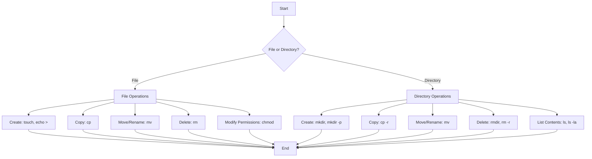

# Ubuntu File Operations

## Introduction

File operations are fundamental skills for anyone working with Ubuntu or any Linux-based operating system. Whether you're a programmer, system administrator, or casual user, understanding how to manipulate files efficiently through the command line will significantly enhance your productivity and control over your system.

In this tutorial, we'll explore essential file operations in Ubuntu, including how to create, copy, move, rename, and delete files and directories. We'll also cover file permissions and some advanced techniques that will help you manage your files more effectively.

## Basic File Operations

### Listing Files and Directories

The `ls` command is used to list files and directories in the current working directory.

```bash
ls
```

Example output:
```
Documents  Downloads  Music  Pictures  Videos
```

To see more details, including file permissions, ownership, size, and modification date, use the `-l` (long format) option:

```bash
ls -l
```

Example output:
```
total 32
drwxr-xr-x 2 user user 4096 Mar 13 10:30 Documents
drwxr-xr-x 2 user user 4096 Mar 13 10:30 Downloads
drwxr-xr-x 2 user user 4096 Mar 13 10:30 Music
drwxr-xr-x 2 user user 4096 Mar 13 10:30 Pictures
drwxr-xr-x 2 user user 4096 Mar 13 10:30 Videos
```

To show hidden files (those starting with a dot), add the `-a` option:

```bash
ls -la
```

### Navigating Directories

Use the `cd` command to change directories:

```bash
cd Documents
```

To go back to the parent directory:

```bash
cd ..
```

To go to your home directory:

```bash
cd ~
```

Or simply:

```bash
cd
```

To go to the root directory:

```bash
cd /
```

## Creating Files and Directories

### Creating Directories

The `mkdir` command is used to create directories:

```bash
mkdir Projects
```

To create nested directories (creating parent directories if they don't exist), use the `-p` option:

```bash
mkdir -p Projects/WebDev/HTML
```

### Creating Files

There are several ways to create files in Ubuntu:

1. Using `touch` to create an empty file:
   ```bash
   touch file.txt
   ```

2. Using text editors like `nano`, `vim`, or `gedit`:
   ```bash
   nano file.txt
   ```
   
3. Using output redirection:
   ```bash
   echo "Hello, Ubuntu!" > greeting.txt
   ```

4. Appending content to existing files:
   ```bash
   echo "Line 2" >> greeting.txt
   ```

## Copying Files and Directories

The `cp` command is used to copy files and directories.

### Copying Files

To copy a file to another location:

```bash
cp source.txt destination.txt
```

To copy a file to another directory:

```bash
cp source.txt Documents/
```

### Copying Directories

To copy directories and their contents, use the `-r` (recursive) option:

```bash
cp -r Projects/ ProjectsBackup/
```

## Moving and Renaming Files

The `mv` command is used for both moving and renaming files and directories.

### Moving Files

To move a file to another directory:

```bash
mv file.txt Documents/
```

### Renaming Files

To rename a file:

```bash
mv oldname.txt newname.txt
```

### Moving Multiple Files

To move multiple files to a directory:

```bash
mv file1.txt file2.txt file3.txt Documents/
```

## Deleting Files and Directories

### Removing Files

The `rm` command is used to delete files:

```bash
rm file.txt
```

### Removing Directories

To remove an empty directory:

```bash
rmdir EmptyDirectory
```

To remove a directory and all its contents:

```bash
rm -r Directory
```

**⚠️ Warning:** Be extremely careful with the `rm -r` command, especially when combined with `sudo` or used with wildcards. There is no "trash bin" or "undo" feature in the command line. Once files are deleted, they cannot be easily recovered.

For safer deletion, consider using the `-i` (interactive) option:

```bash
rm -ri Directory
```

This will prompt for confirmation before deleting each file or directory.

## File Permissions

In Ubuntu, each file and directory has permissions that define who can read, write, or execute them.

### Viewing Permissions

Use `ls -l` to view permissions:

```bash
ls -l file.txt
```

Example output:
```
-rw-r--r-- 1 user user 13 Mar 13 10:45 file.txt
```

The permission string `-rw-r--r--` can be broken down as:
- First character: File type (`-` for regular file, `d` for directory)
- Next 3 characters: Owner permissions (`rw-` = read, write, no execute)
- Next 3 characters: Group permissions (`r--` = read, no write, no execute)
- Last 3 characters: Others permissions (`r--` = read, no write, no execute)

### Changing Permissions

Use the `chmod` command to change permissions:

```bash
chmod permissions file.txt
```

Permissions can be specified in two ways:

1. Symbolic method:
   ```bash
   chmod u+x file.txt  # Add execute permission for the owner
   chmod g+w file.txt  # Add write permission for the group
   chmod o-r file.txt  # Remove read permission for others
   ```

2. Numeric method:
   ```bash
   chmod 755 file.txt  # rwxr-xr-x (owner: rwx, group: r-x, others: r-x)
   chmod 644 file.txt  # rw-r--r-- (owner: rw-, group: r--, others: r--)
   ```

Common numeric permissions:
- `755`: For executable files and directories
- `644`: For regular files
- `600`: For sensitive files (only owner can read/write)

## Advanced File Operations

### Finding Files

Use the `find` command to locate files:

```bash
find /home/user -name "*.txt"
```

This command searches for all `.txt` files in the `/home/user` directory and its subdirectories.

### Searching File Contents

Use `grep` to search for text within files:

```bash
grep "search term" file.txt
```

To search recursively through a directory:

```bash
grep -r "search term" /path/to/directory
```

### File Links

Ubuntu supports two types of links:

1. Symbolic links (soft links):
   ```bash
   ln -s original_file link_name
   ```

2. Hard links:
   ```bash
   ln original_file link_name
   ```

Symbolic links are more flexible and can link across different filesystems, but they break if the original file is moved or deleted.

### Archiving and Compressing Files

1. Create a tar archive:
   ```bash
   tar -cvf archive.tar directory/
   ```

2. Create a compressed tar archive (tarball):
   ```bash
   tar -czvf archive.tar.gz directory/
   ```

3. Extract files from a tar archive:
   ```bash
   tar -xvf archive.tar
   ```

4. Extract files from a compressed tar archive:
   ```bash
   tar -xzvf archive.tar.gz
   ```

## Real-World Examples

### Example 1: Setting Up a Web Project

```bash
# Create project structure
mkdir -p mywebsite/{css,js,images}

# Create basic files
touch mywebsite/index.html
touch mywebsite/css/style.css
touch mywebsite/js/script.js

# Add content to index.html
echo "<!DOCTYPE html>
<html>
<head>
  <title>My Website</title>
  <link rel='stylesheet' href='css/style.css'>
</head>
<body>
  <h1>Welcome to My Website</h1>
  <script src='js/script.js'></script>
</body>
</html>" > mywebsite/index.html

# Make a backup of the project
cp -r mywebsite/ ~/Documents/mywebsite_backup/
```

### Example 2: File Management Script

Here's a simple bash script to organize files by extension:

```bash
#!/bin/bash
# organize.sh - Organizes files in the current directory by extension

# Create directories for different file types
mkdir -p documents images videos music others

# Move files based on extension
for file in *; do
  if [ -f "$file" ]; then
    case "$file" in
      *.pdf|*.docx|*.txt)
        mv "$file" documents/ ;;
      *.jpg|*.png|*.gif)
        mv "$file" images/ ;;
      *.mp4|*.avi|*.mkv)
        mv "$file" videos/ ;;
      *.mp3|*.wav|*.flac)
        mv "$file" music/ ;;
      organize.sh)
        # Don't move this script
        ;;
      *)
        mv "$file" others/ ;;
    esac
  fi
done

echo "Files organized successfully!"
```

To make this script executable:

```bash
chmod +x organize.sh
```

To run it:

```bash
./organize.sh
```

## File Operations Workflow Diagram



## Summary

In this tutorial, we've covered essential file operations in Ubuntu, including:

- Listing files and directories with `ls`
- Navigating the file system with `cd`
- Creating directories with `mkdir`
- Creating files with `touch`, text editors, and output redirection
- Copying files and directories with `cp`
- Moving and renaming files with `mv`
- Deleting files and directories with `rm` and `rmdir`
- Modifying file permissions with `chmod`
- Advanced operations like finding files, searching contents, creating links, and archiving

Understanding these file operations is crucial for efficiently working with Ubuntu and Linux systems. With practice, you'll become faster and more confident in managing your files through the command line.

## Practice Exercises

1. Create a directory structure for a personal project with at least three subdirectories.
2. Create several empty files and practice copying, moving, and renaming them.
3. Write a simple text file using output redirection and then append more content to it.
4. Practice changing file permissions using both symbolic and numeric methods.
5. Create a backup script that copies important files to a backup directory.
6. Use the `find` command to locate all `.txt` files in your home directory.
7. Create a symbolic link to a file and observe what happens when you modify the original file.

## Additional Resources

- The Ubuntu community documentation: [https://help.ubuntu.com/community/UsingTheTerminal](https://help.ubuntu.com/community/UsingTheTerminal)
- The Linux command line book by William Shotts: "The Linux Command Line"
- `man` pages: Access detailed documentation for any command using `man command` (e.g., `man ls`)
- `--help` option: Most commands provide basic help with the `--help` option (e.g., `ls --help`)