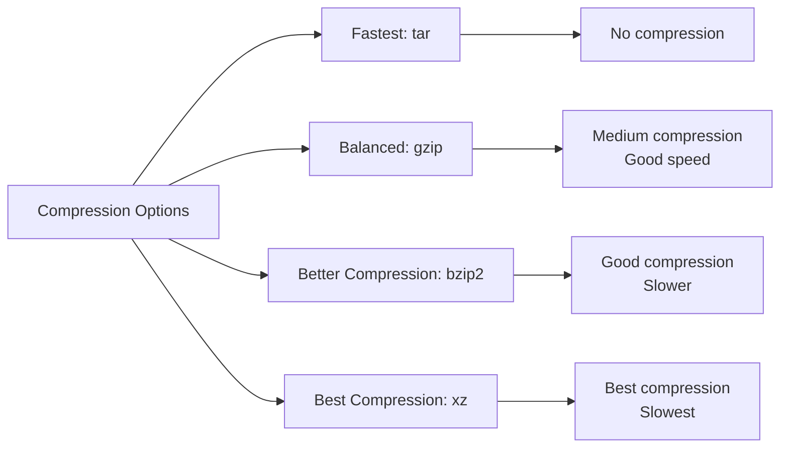

# Ubuntu Archive Management

## Introduction

Archive management is an essential skill for anyone working with Ubuntu or any Linux distribution. Archives allow you to compress multiple files into a single file for easier storage, transfer, and backup. Ubuntu provides several powerful command-line tools and graphical applications for creating, extracting, and managing archive files.

In this guide, we'll explore how to work with common archive formats in Ubuntu, including `.tar`, `.gz`, `.zip`, and more. Whether you're backing up your projects, sharing files, or simply organizing your system, understanding archive management will significantly enhance your Ubuntu experience.

## Common Archive Formats in Ubuntu

Before diving into the commands, let's understand the common archive formats you'll encounter in Ubuntu:

| Format | Extension | Description |
|--------|-----------|-------------|
| Tar | `.tar` | Combines multiple files into a single file without compression |
| Gzip | `.gz` | Compresses a single file |
| Tar + Gzip | `.tar.gz` or `.tgz` | Combines and compresses multiple files |
| Bzip2 | `.bz2` | Offers better compression than gzip but is slower |
| Tar + Bzip2 | `.tar.bz2` or `.tbz` | Combines and compresses with bzip2 |
| Zip | `.zip` | Common format compatible with Windows and macOS |
| 7-Zip | `.7z` | High compression format |
| XZ | `.xz` | High compression format with good speed |
| Tar + XZ | `.tar.xz` | Combines and compresses with XZ |

## Using the Terminal for Archive Management

### Creating Archives

#### Creating a TAR Archive

The `tar` command (tape archive) is the foundation of archive management in Ubuntu.

```bash
# Create a tar archive
tar -cf archive.tar file1 file2 directory1

# Output
# No output means the command executed successfully
```

In this command:
- `-c` means create a new archive
- `-f` specifies the filename

#### Creating a Compressed TAR Archive

To add compression:

```bash
# Create a gzipped tar archive
tar -czf archive.tar.gz file1 file2 directory1

# Create a bzip2 compressed tar archive
tar -cjf archive.tar.bz2 file1 file2 directory1

# Create an XZ compressed tar archive
tar -cJf archive.tar.xz file1 file2 directory1
```

Where:
- `-z` adds gzip compression
- `-j` adds bzip2 compression
- `-J` adds xz compression

#### Creating ZIP Archives

The `zip` command creates ZIP archives:

```bash
# Create a zip archive
zip -r archive.zip file1 file2 directory1

# Output
# adding: file1 (stored 0%)
# adding: file2 (deflated 35%)
# adding: directory1/ (stored 0%)
# adding: directory1/subfile1 (deflated 42%)
```

The `-r` flag enables recursive inclusion of directories.

### Extracting Archives

#### Extracting TAR Archives

```bash
# Extract a tar archive
tar -xf archive.tar

# Extract to a specific directory
tar -xf archive.tar -C /path/to/directory

# Output
# No output means the command executed successfully
```

Where:
- `-x` means extract
- `-C` specifies the extraction directory

#### Extracting Compressed TAR Archives

Modern versions of `tar` automatically detect compression, so you can often omit the decompression flag:

```bash
# Extract a gzipped tar archive
tar -xf archive.tar.gz

# Extract a bzip2 compressed tar archive
tar -xf archive.tar.bz2

# Extract an XZ compressed tar archive
tar -xf archive.tar.xz
```

But you can also be explicit:

```bash
# Explicitly specify compression for extraction
tar -xzf archive.tar.gz
tar -xjf archive.tar.bz2
tar -xJf archive.tar.xz
```

#### Extracting ZIP Archives

```bash
# Extract a zip archive
unzip archive.zip

# Extract to a specific directory
unzip archive.zip -d /path/to/directory

# Output
# Archive:  archive.zip
# extracting: file1
# inflating: file2
# creating: directory1/
# inflating: directory1/subfile1
```

### Listing Archive Contents

#### Listing TAR Archive Contents

```bash
# List contents of a tar archive
tar -tf archive.tar

# List with detailed information
tar -tvf archive.tar

# Output
# file1
# file2
# directory1/
# directory1/subfile1
```

Where:
- `-t` means list contents
- `-v` shows verbose output with file details

#### Listing ZIP Archive Contents

```bash
# List contents of a zip archive
unzip -l archive.zip

# Output
# Archive:  archive.zip
#   Length     Date   Time    Name
# ---------  ---------- -----   ----
#       123  2023-01-01 10:00   file1
#       456  2023-01-01 10:01   file2
#         0  2023-01-01 10:02   directory1/
#       789  2023-01-01 10:03   directory1/subfile1
# ---------                     -------
#      1368                     4 files
```

### Advanced TAR Operations

#### Extracting Specific Files

```bash
# Extract only specific files
tar -xf archive.tar file1 directory1/subfile1

# Output
# No output means the command executed successfully
```

#### Updating a TAR Archive

```bash
# Update files in an existing archive
tar -uf archive.tar newfile

# Output
# No output means the command executed successfully
```

Where `-u` means update.

#### Adding Files to an Existing Archive

```bash
# Append files to an existing archive
tar -rf archive.tar additionalfile

# Output
# No output means the command executed successfully
```

Where `-r` means append.

## Using File Manager (Nautilus) for Archive Management

Ubuntu's default file manager provides a user-friendly GUI for working with archives:

1. **Creating an archive**:
   - Select the files/folders you want to archive
   - Right-click and select "Compress..."
   - Choose the format and name for your archive
   - Click "Create"

2. **Extracting an archive**:
   - Right-click on the archive
   - Select "Extract Here" or "Extract To..." for more options

3. **Viewing archive contents**:
   - Double-click the archive file to view its contents without extracting
   - You can extract specific files by selecting them and clicking "Extract"

## Using Archive Manager (File Roller)

Ubuntu comes with Archive Manager (file-roller), a dedicated GUI application for working with archives:

1. **Opening Archive Manager**:
   - Search for "Archive Manager" in the Applications menu, or
   - Right-click on an archive and select "Open with Archive Manager"

2. **Creating a new archive**:
   - Click the "New" button
   - Select files to add and choose the archive format
   - Click "Create"

3. **Adding files to an archive**:
   - Open the archive in Archive Manager
   - Click the "+" button to add files

4. **Extracting files**:
   - Click the "Extract" button
   - Choose the destination folder
   - Click "Extract"

## Practical Examples

### Example 1: Backing Up a Project Directory

```bash
# Create a dated backup of a project
tar -czf my_project_backup_$(date +%Y-%m-%d).tar.gz my_project/

# Output
# No output means the command executed successfully
```

This creates a timestamped archive, e.g., `my_project_backup_2023-01-15.tar.gz`.

### Example 2: Selectively Archiving Files

```bash
# Archive only specific file types
find . -name "*.jpg" -o -name "*.png" | tar -czf images.tar.gz -T -

# Output
# No output means the command executed successfully
```

This command finds all JPG and PNG files in the current directory and its subdirectories, then archives them.

### Example 3: Incremental Backup

Create a snapshot of current files, then use it for incremental backups:

```bash
# Initial backup with snapshot
tar -czf full_backup.tar.gz --listed-incremental=snapshot.file directory/

# Later incremental backup
tar -czf incremental_backup.tar.gz --listed-incremental=snapshot.file directory/

# Output
# No output means the command executed successfully
```

### Example 4: Splitting Large Archives

For very large archives that need to be split into smaller files:

```bash
# Create a split archive (each part 1GB)
tar -czf - large_directory/ | split -b 1G - backup.tar.gz.part

# Reassemble the archive
cat backup.tar.gz.part* > restored.tar.gz

# Output
# No output means the command executed successfully
```

## Compression Comparison

Different compression methods offer trade-offs between compression ratio, speed, and compatibility:



Here's a practical comparison:

```bash
# Create archives with different compression methods
tar -cf test.tar directory/
tar -czf test.tar.gz directory/
tar -cjf test.tar.bz2 directory/
tar -cJf test.tar.xz directory/

# Check sizes
ls -lh test.tar*

# Output
# -rw-r--r-- 1 user user 10M Jan 15 14:30 test.tar
# -rw-r--r-- 1 user user 3.5M Jan 15 14:31 test.tar.gz
# -rw-r--r-- 1 user user 2.8M Jan 15 14:32 test.tar.bz2
# -rw-r--r-- 1 user user 2.3M Jan 15 14:33 test.tar.xz
```

## Tips and Best Practices

1. **Choose the right format**:
   - Use `.tar.gz` for a good balance of compression and speed
   - Use `.tar.xz` for maximum compression when size matters more than speed
   - Use `.zip` when sharing with users of other operating systems

2. **Test your archives**:
   - Always verify archive contents after creation with `tar -tf` or `unzip -l`

3. **Password protection**:
   - For sensitive data, consider using password protection:
   ```bash
   # Create password-protected zip archive
   zip -er protected.zip sensitive_data/
   
   # Output
   # Enter password: 
   # Verify password: 
   # adding: sensitive_data/ (stored 0%)
   # ...
   ```

4. **Preserve permissions**:
   - The `tar` command preserves file permissions by default
   - For `zip`, use the `-X` flag to preserve extended attributes

5. **Exclude files**:
   - Exclude unwanted files or directories using the `--exclude` option:
   ```bash
   tar -czf backup.tar.gz --exclude="*.log" --exclude="node_modules" project/
   ```

## Troubleshooting Common Issues

### Archive Corruption

If you encounter a corrupted archive:

```bash
# Try to repair a zip archive
zip -FF damaged.zip --out=repaired.zip

# Check a tar archive for errors
tar -tf archive.tar.gz
```

### Insufficient Space

When extracting large archives, check available disk space first:

```bash
# Check disk space
df -h

# Check archive size
du -h archive.tar.gz

# Output (df -h)
# Filesystem      Size  Used Avail Use% Mounted on
# /dev/sda1       500G  350G  150G  70% /
```

### Permission Denied Errors

If you encounter permission errors:

```bash
# Use sudo for system-level directories
sudo tar -xf archive.tar -C /opt/

# Fix permissions after extraction if needed
sudo chown -R username:username /path/to/extracted/files
```

## Summary

Archive management in Ubuntu is a powerful skill that helps you efficiently organize, back up, and transfer files. The `tar` command offers incredible flexibility with various compression options, while graphical tools provide user-friendly alternatives for less complex tasks.

By mastering these tools and techniques, you can:
- Create efficient backups of your important data
- Reduce file sizes for easier sharing and storage
- Organize collections of files into single, manageable archives
- Preserve file permissions and attributes during transfers

## Additional Resources

For further learning, consult these man pages in your terminal:

```bash
man tar
man gzip
man zip
man unzip
```

## Practice Exercises

1. Create a compressed archive of your home directory's documents folder, excluding hidden files.
2. Extract only specific files from an existing archive without extracting everything.
3. Create an incremental backup system for a project folder using `tar`.
4. Compare the compression ratios and times between gzip, bzip2, and xz on a large directory.
5. Create a password-protected archive containing sensitive information.