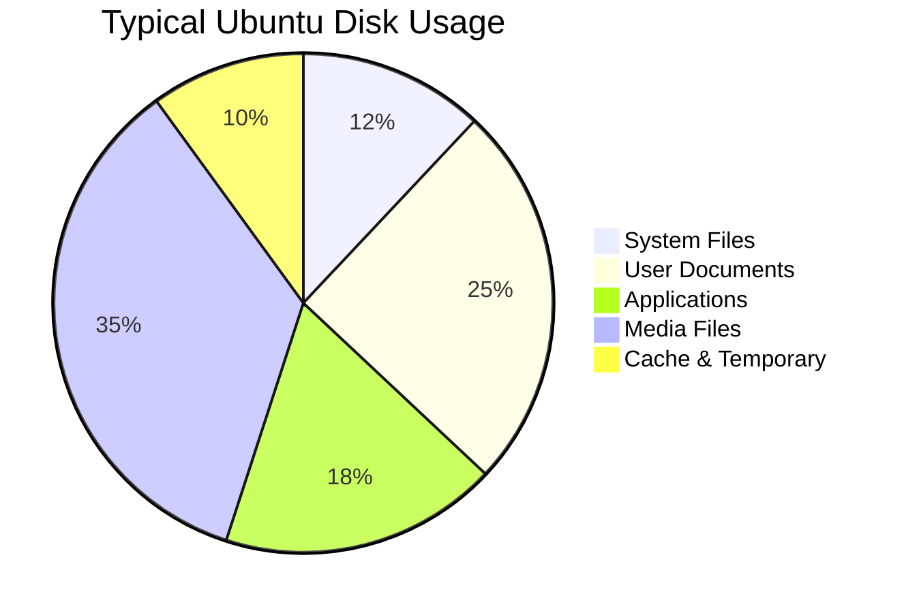

# Ubuntu Disk Usage

Managing disk space is a fundamental skill for any Ubuntu user. Whether you're working with a small SSD or a large server with multiple drives, understanding how to monitor, analyze, and manage your disk usage will help you maintain system performance and prevent storage-related issues.

## Introduction to Disk Usage in Ubuntu

In Ubuntu, disk usage refers to how much storage space is being consumed by files, directories, and system components. Monitoring this usage is essential for:

- Preventing your system from running out of space
- Identifying large or unnecessary files that can be removed
- Planning storage upgrades when necessary
- Troubleshooting performance issues related to disk space

This guide will introduce you to several command-line tools for analyzing disk usage in Ubuntu and provide practical examples for managing your storage effectively.

## Basic Disk Usage Commands

### Checking Overall Disk Usage with `df`

The `df` (disk free) command displays information about total and available disk space on your file systems.

```bash
df -h
```

Example output:
```
Filesystem      Size  Used Avail Use% Mounted on
/dev/sda1        20G   12G  6.8G  64% /
tmpfs           2.0G     0  2.0G   0% /dev/shm
/dev/sda2       450G  298G  130G  70% /home
```

The `-h` flag makes the output human-readable, showing sizes in GB or MB instead of bytes.

### Finding Directory and File Sizes with `du`

The `du` (disk usage) command measures the disk space used by files and directories.

```bash
# Check the size of the current directory
du -sh

# Check sizes of all items in the current directory
du -sh *

# Check sizes recursively up to a specific depth
du -h --max-depth=2 /home/username
```

Example output:
```
$ du -sh *
4.0K    bin
8.0K    Desktop
1.2G    Documents
2.4G    Downloads
24K     Music
5.2G    Pictures
16K     Public
```

### Understanding `du` Options

| Option | Description |
|--------|-------------|
| `-s` | Summarize (only show total for each directory) |
| `-h` | Human-readable (show sizes in KB, MB, GB) |
| `-a` | Show sizes for all files, not just directories |
| `--max-depth=N` | Go only N levels deep in recursion |
| `-c` | Produce a grand total |

## Advanced Disk Usage Analysis

### Using `ncdu` for Interactive Exploration

While `du` is powerful, `ncdu` (NCurses Disk Usage) provides an interactive interface that makes it easier to browse through directories and identify space-consuming items.

First, install `ncdu`:

```bash
sudo apt install ncdu
```

Then run it on a directory:

```bash
ncdu /home/username
```

With `ncdu`, you can:
- Navigate directories using arrow keys
- Delete files directly from the interface
- Sort items by size, name, or file count
- Quickly identify the largest space consumers

### Finding the Largest Files with `find` and `sort`

To locate the largest files in your system:

```bash
find /path/to/search -type f -exec du -h {} \; | sort -rh | head -n 20
```

This command:
1. Finds all files in the specified path
2. Measures the size of each file
3. Sorts them in descending order by size
4. Shows the top 20 largest files

Example output:
```
1.2G    /home/username/Videos/vacation2023.mp4
856M    /home/username/Downloads/ubuntu-22.04-desktop-amd64.iso
645M    /home/username/Documents/project-backup.zip
422M    /home/username/Pictures/family-photos.tar
```

## Analyzing Disk Usage by File Type

### Finding Files by Extension

To analyze space used by specific file types:

```bash
# Find all .mp4 files and calculate their total size
find /home/username -name "*.mp4" -type f -exec du -ch {} \; | grep total$

# Find all .log files larger than 100MB
find /var/log -name "*.log" -type f -size +100M -exec ls -lh {} \;
```

### Identifying Space Used by Package Cache

Ubuntu's package management system caches downloaded package files which can consume significant space:

```bash
# Check the size of the APT cache
du -sh /var/cache/apt/archives

# Clear the APT cache
sudo apt clean
```

## Visualizing Disk Usage

We can visualize disk usage using various tools. Here's a simple mermaid diagram showing a typical disk usage breakdown:



## Managing Disk Space

### Clearing System Logs

System logs can grow large over time:

```bash
# Check the size of journal logs
sudo du -sh /var/log/journal/

# Limit journal size to 500MB
sudo journalctl --vacuum-size=500M
```

### Removing Old Kernels

Old kernel versions can take up significant space:

```bash
# List installed kernels
dpkg --list | grep linux-image

# Remove old kernels (Ubuntu 18.04 and newer)
sudo apt autoremove --purge
```

### Cleaning Temporary Files

```bash
# Remove temporary files
sudo rm -rf /tmp/*

# Clean thumbnail cache
rm -rf ~/.cache/thumbnails/*
```

## Real-World Scenario: Troubleshooting a "Disk Full" Error

Imagine you receive a "disk full" error while working on your Ubuntu system. Here's a systematic approach to resolve it:

1. Check overall disk usage:
   ```bash
   df -h
   ```

2. Identify which partition is full (e.g., if `/` is at 100%)

3. Find the largest directories in the root partition:
   ```bash
   sudo du -h --max-depth=1 / | sort -rh
   ```

4. Dive deeper into large directories:
   ```bash
   sudo du -h --max-depth=1 /var | sort -rh
   ```

5. Take appropriate action based on what you find:
   - Clear package cache: `sudo apt clean`
   - Remove old log files: `sudo find /var/log -type f -name "*.gz" -delete`
   - Uninstall unnecessary applications: `sudo apt remove application-name`
   - Move large files to external storage

## Best Practices for Disk Usage Management

1. **Regular Monitoring**: Check disk usage weekly with `df -h` to prevent surprises

2. **Scheduled Cleanup**: Create a simple cron job to clear temporary files:
   ```bash
   # Add to crontab -e:
   0 2 * * 0 sudo apt clean && sudo journalctl --vacuum-time=30d
   ```

3. **Partition Planning**: Consider separate partitions for `/`, `/home`, and `/var` on larger systems

4. **Use Quotas**: For multi-user systems, set disk quotas to prevent any single user from consuming all available space:
   ```bash
   sudo apt install quota
   # Then configure in /etc/fstab
   ```

5. **Compression**: Use compression for logs and archives:
   ```bash
   # Configure logrotate to compress old logs
   sudo nano /etc/logrotate.conf
   ```

## Summary

Understanding disk usage in Ubuntu is essential for maintaining a healthy system. The tools and techniques covered in this guide provide a comprehensive approach to monitoring, analyzing, and managing your disk space effectively.

From basic commands like `df` and `du` to advanced tools like `ncdu`, you now have the knowledge to:
- Monitor overall disk usage
- Find space-consuming files and directories
- Clean up unnecessary files to free space
- Implement best practices for disk space management

## Additional Resources

- The `man` pages for the tools mentioned (`man df`, `man du`, etc.)
- Ubuntu's official documentation on system maintenance
- For automated disk usage monitoring, explore tools like:
  - Disk Usage Analyzer (GUI tool, install with `sudo apt install baobab`)
  - Cockpit (web-based system monitor, install with `sudo apt install cockpit`)

## Exercises

1. Use `du` to find the three largest directories in your home folder.
2. Install `ncdu` and explore your `/var` directory to identify potential space-saving opportunities.
3. Create a simple shell script that reports disk usage and emails you if any partition exceeds 90% capacity.
4. Use the `find` command to locate all files larger than 100MB that haven't been accessed in the last 90 days.
5. Analyze your disk usage before and after running `sudo apt clean` and `sudo apt autoremove` to see how much space you saved.