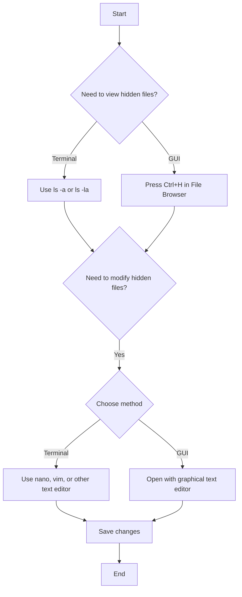

# Ubuntu Hidden Files

## Introduction

In Ubuntu and other Linux-based operating systems, hidden files serve important purposes in system configuration and application settings. Unlike regular files, hidden files are not immediately visible in file browsers or directory listings by default. This design helps keep your workspace uncluttered while ensuring critical system files remain protected from accidental modification.

Hidden files and directories are distinguished by a simple naming convention: they begin with a dot (`.`). For example, `.bashrc` or `.config/`. These files are often referred to as "dotfiles" for this reason.

## Why Hidden Files Matter

Hidden files typically store:

- User preferences and settings
- Application configurations
- System configuration files
- Cache data
- Backup information

As you become more familiar with Ubuntu, working with hidden files will become an essential skill in your Linux journey.

## Viewing Hidden Files

### Using the Terminal

The most common way to view hidden files is through the terminal using the `ls` command with the `-a` flag (for "all"):

```bash
ls -a
```

**Example output:**
```
.              .bash_logout    Downloads        Pictures       Videos
..             .bashrc         .local           Public         .viminfo
.bash_history  Desktop         Music            Templates      .Xauthority
```

For a more detailed listing that includes file permissions, size, and modification dates, use:

```bash
ls -la
```

**Example output:**
```
total 96
drwxr-xr-x 17 user user 4096 Mar 13 09:45 .
drwxr-xr-x  3 root root 4096 Feb 10 15:32 ..
-rw-------  1 user user 9807 Mar 13 08:30 .bash_history
-rw-r--r--  1 user user  220 Feb 10 15:32 .bash_logout
-rw-r--r--  1 user user 3771 Feb 10 15:32 .bashrc
drwxr-xr-x  2 user user 4096 Feb 10 16:01 Desktop
drwxr-xr-x  2 user user 4096 Feb 10 16:01 Downloads
drwx------  3 user user 4096 Feb 12 10:15 .local
drwxr-xr-x  2 user user 4096 Feb 10 16:01 Music
drwxr-xr-x  2 user user 4096 Feb 10 16:01 Pictures
drwxr-xr-x  2 user user 4096 Feb 10 16:01 Public
drwxr-xr-x  2 user user 4096 Feb 10 16:01 Templates
drwxr-xr-x  2 user user 4096 Feb 10 16:01 Videos
-rw-------  1 user user  184 Feb 15 13:42 .viminfo
-rw-------  1 user user  237 Feb 10 15:58 .Xauthority
```

You can also view hidden files in a specific directory by adding the path:

```bash
ls -la ~/Documents
```

### Using the File Browser (Nautilus)

To view hidden files in Ubuntu's graphical file browser:

1. Open the File Browser (Nautilus)
2. Press `Ctrl+H` to toggle hidden files
3. Alternatively, click on the menu (three lines) and select "Show Hidden Files"

Hidden files will appear slightly transparent to distinguish them from regular files.

## Important Hidden Files and Directories

Here are some common hidden files and directories you'll encounter in Ubuntu:

| Hidden File/Directory | Purpose |
|----------------------|---------|
| `.bashrc` | Configuration file for the Bash shell |
| `.profile` | Environment variables and startup programs |
| `.config/` | Application configuration files |
| `.cache/` | Temporary cache data |
| `.local/` | User-specific application data |
| `.ssh/` | SSH keys and configuration |
| `.gnupg/` | GnuPG encryption keys |
| `.mozilla/` | Firefox browser data |
| `.git/` | Git repository information |

## Creating Hidden Files

Creating a hidden file or directory is as simple as prefixing the name with a dot:

### Creating a Hidden File

```bash
touch .myconfig
```

### Creating a Hidden Directory

```bash
mkdir .myconfigs
```

### Converting an Existing File to Hidden

```bash
mv config.txt .config.txt
```

## Editing Hidden Files

Hidden files can be edited just like regular files. Here are common approaches:

### Using Terminal Editors

```bash
# Using Nano (beginner-friendly)
nano ~/.bashrc

# Using Vim (more advanced)
vim ~/.bashrc

# Using Gedit (graphical editor)
gedit ~/.bashrc
```

### Using the File Browser

1. Show hidden files with `Ctrl+H`
2. Navigate to the file
3. Double-click to open with the default text editor

## Practical Examples

### Example 1: Customizing Your Bash Prompt

The `.bashrc` file controls your terminal's appearance and behavior. Let's modify it to customize your prompt:

```bash
# Open .bashrc in a text editor
nano ~/.bashrc

# Add this line at the end to create a colorful prompt
PS1='\[\033[01;32m\]\u@\h\[\033[00m\]:\[\033[01;34m\]\w\[\033[00m\]\$ '

# Save and exit (Ctrl+O, Enter, Ctrl+X in Nano)

# Apply changes
source ~/.bashrc
```

### Example 2: Creating a Hidden Configuration File for a Script

Let's create a hidden configuration file for a custom script:

```bash
# Create a hidden config file
echo "default_directory=/home/user/Documents" > ~/.myscript_config

# Now let's create a script that uses this config
nano ~/bin/myscript

# Add the following to myscript:
```

```bash
#!/bin/bash
# Load config
if [ -f ~/.myscript_config ]; then
    source ~/.myscript_config
else
    default_directory="$HOME"
fi

echo "Working with directory: $default_directory"
ls -la "$default_directory"
```

```bash
# Make the script executable
chmod +x ~/bin/myscript
```

### Example 3: Understanding the `.git` Directory

When you initialize a Git repository, it creates a hidden `.git` directory:

```bash
# Create a new directory
mkdir my_project
cd my_project

# Initialize Git repository
git init

# View the hidden .git directory
ls -la
```

**Output:**
```
total 12
drwxrwxr-x  3 user user 4096 Mar 13 10:20 .
drwxr-xr-x 17 user user 4096 Mar 13 10:20 ..
drwxrwxr-x  7 user user 4096 Mar 13 10:20 .git
```

To explore what's inside:

```bash
ls -la .git/
```

**Output:**
```
total 44
drwxrwxr-x 7 user user 4096 Mar 13 10:20 .
drwxrwxr-x 3 user user 4096 Mar 13 10:20 ..
-rw-rw-r-- 1 user user   23 Mar 13 10:20 HEAD
drwxrwxr-x 2 user user 4096 Mar 13 10:20 branches
-rw-rw-r-- 1 user user  137 Mar 13 10:20 config
-rw-rw-r-- 1 user user   73 Mar 13 10:20 description
drwxrwxr-x 2 user user 4096 Mar 13 10:20 hooks
drwxrwxr-x 2 user user 4096 Mar 13 10:20 info
drwxrwxr-x 4 user user 4096 Mar 13 10:20 objects
drwxrwxr-x 4 user user 4096 Mar 13 10:20 refs
```

This directory contains all the version control information for your project.

## Common Operations with Hidden Files

Here's a flowchart showing common operations with hidden files:



## Best Practices

1. **Back up before editing** - Always make a backup copy of system-related hidden files before modifying them:
   ```bash
   cp ~/.bashrc ~/.bashrc.backup
   ```

2. **Use version control** - Consider storing your important dotfiles in a Git repository for easier management and tracking changes.

3. **Be cautious with system files** - Hidden files that require root access (in `/etc` or other system directories) should be edited with caution.

4. **Use comments** - When modifying configuration files, add comments to explain your changes:
   ```bash
   # Added by user on 2025-03-13 to improve prompt colors
   PS1='\[\033[01;32m\]\u@\h\[\033[00m\]:\[\033[01;34m\]\w\[\033[00m\]\$ '
   ```

## Summary

Hidden files in Ubuntu are an essential part of the system's organization. They store configurations, settings, and other important data while keeping your directories uncluttered. By learning how to view, create, and manage these files, you've gained a valuable skill for working effectively in Ubuntu and other Linux distributions.

The key points to remember are:

- Hidden files and directories start with a dot (`.`)
- Use `ls -a` or `ls -la` in the terminal to view hidden files
- Press `Ctrl+H` in the file browser to toggle hidden files
- Edit hidden files carefully, especially system configurations
- Many application settings are stored in hidden files in your home directory

## Exercises

1. Create a hidden directory called `.backups` in your home directory and copy some important configuration files there.

2. Modify your `.bashrc` file to add a custom alias for a command you use frequently.

3. Explore the `.config` directory in your home folder to see which applications store their settings there.

4. Write a simple shell script that backs up all hidden files in your home directory to a `.dotfiles_backup` folder.

5. Find three applications you use regularly and identify where they store their hidden configuration files.

## Additional Resources

- The [Linux Documentation Project](https://tldp.org/) offers in-depth guides on Linux file systems
- [Arch Linux Wiki](https://wiki.archlinux.org/) has excellent documentation on managing configuration files
- Learn about "dotfiles management" techniques to synchronize your settings across multiple systems