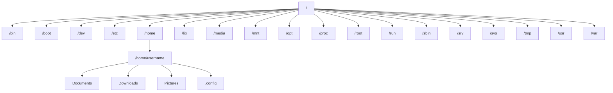

# Ubuntu File Types

## Introduction

In Ubuntu, as in any Linux-based operating system, the concept "everything is a file" is a fundamental principle. Understanding different file types is essential for effective file management and system navigation. Unlike Windows, which heavily relies on file extensions to determine file types, Ubuntu uses more intrinsic properties to classify files.

This guide will walk you through the various file types in Ubuntu, how to identify them, and how to work with them effectively. Whether you're new to Ubuntu or looking to deepen your understanding, this comprehensive overview will help you navigate the Ubuntu file system with confidence.

## Common File Types in Ubuntu

In Ubuntu, files are categorized into several types, each serving specific purposes. Let's explore these types in detail:

### 1. Regular Files

Regular files are the most common file type you'll encounter. They store data, text, program instructions, or any other information.

#### How to identify regular files

From the terminal, you can use the `ls -l` command to list files with their details:

```bash
ls -l
```

Regular files start with a `-` in the file permissions:

```bash
-rw-rw-r-- 1 user user 2048 Mar 13 14:30 document.txt
```

#### Working with regular files

You can create a regular file using various methods:

```bash
# Create an empty file
touch newfile.txt

# Create a file with content
echo "Hello World" > newfile.txt

# Open and edit a file with a text editor
nano newfile.txt
```

### 2. Directories

Directories (folders) are special files that contain other files and directories, creating a hierarchical file structure.

#### How to identify directories

Directories are marked with a `d` at the beginning of the permissions string:

```bash
drwxr-xr-x 2 user user 4096 Mar 13 14:35 Documents
```

They're also typically highlighted with different colors in terminal output.

#### Working with directories

```bash
# Create a new directory
mkdir new_directory

# Change to a directory
cd new_directory

# List directory contents
ls -la

# Remove an empty directory
rmdir empty_directory

# Remove a directory and its contents (use with caution!)
rm -r directory_name
```

### 3. Symbolic Links

Symbolic links (symlinks) are files that point to other files or directories, similar to shortcuts in Windows.

#### How to identify symbolic links

Symbolic links start with an `l` in the file permissions and show an arrow pointing to their target:

```bash
lrwxrwxrwx 1 user user 15 Mar 13 14:40 link_name -> target_file.txt
```

#### Creating and managing symbolic links

```bash
# Create a symbolic link
ln -s target_file.txt link_name

# Find where a symlink points to
readlink link_name

# Remove a symbolic link (doesn't affect the target)
rm link_name
```

### 4. Device Files

Device files in Ubuntu provide an interface to hardware devices. They're located in the `/dev` directory.

#### Block device files

These represent devices that handle data in blocks, like hard drives and USB drives:

```bash
brw-rw---- 1 root disk 8, 0 Mar 13 14:45 /dev/sda
```

Block device files start with a `b` in the permissions.

#### Character device files

These represent devices that handle data character by character, like keyboards or serial ports:

```bash
crw-rw-rw- 1 root tty 5, 0 Mar 13 14:50 /dev/tty
```

Character device files start with a `c` in the permissions.

### 5. Named Pipes (FIFOs)

Named pipes allow different processes to communicate with each other.

#### How to identify named pipes

Named pipes start with a `p` in the file permissions:

```bash
prw-r--r-- 1 user user 0 Mar 13 14:55 my_pipe
```

#### Creating and using named pipes

```bash
# Create a named pipe
mkfifo my_pipe

# Write to a pipe in one terminal
echo "Hello pipe" > my_pipe

# Read from the pipe in another terminal
cat < my_pipe
```

### 6. Sockets

Socket files facilitate inter-process communication and are marked with an `s` in file permissions:

```bash
srwxrwxrwx 1 user user 0 Mar 13 15:00 /tmp/socket
```

## File Extensions in Ubuntu

While Ubuntu doesn't rely on file extensions to determine file types, extensions are still used for organizational purposes and to help applications identify files they can open.

Here are some common file extensions in Ubuntu:

| Extension | File Type      | Description                                                           |
|-----------|----------------|-----------------------------------------------------------------------|
| .txt      | Text file      | Plain text documents                                                  |
| .sh       | Shell script   | Executable shell scripts                                              |
| .deb      | Debian package | Installation packages for Ubuntu and other Debian-based distributions |
| .tar.gz   | Archive        | Compressed archive files                                              |
| .py       | Python script  | Python programming language scripts                                   |
| .conf     | Configuration  | System or application configuration files                             |

### Determining File Types

Ubuntu provides several ways to identify a file's type:

#### Using the `file` command

```bash
file document.txt
```

Output:
```
document.txt: ASCII text
```

```bash
file /usr/bin/ls
```

Output:
```
/usr/bin/ls: ELF 64-bit LSB shared object, x86-64, version 1 (SYSV), dynamically linked, interpreter /lib64/ld-linux-x86-64.so.2, BuildID[sha1]=2f15ad836be3339dec32d29f7fce1dc7a4f1d61a, for GNU/Linux 3.2.0, stripped
```

## Special Files in Ubuntu

### Hidden Files

Files starting with a dot (`.`) are hidden files, typically used for configuration:

```bash
# List all files including hidden files
ls -la

# Example output
-rw-r--r-- 1 user user  220 Mar 13 15:10 .bashrc
```

### Executable Files

Files with execute permissions can be run as programs:

```bash
# Create a simple bash script
echo '#!/bin/bash
echo "Hello, World!"' > hello.sh

# Make it executable
chmod +x hello.sh

# Run the script
./hello.sh
```

## File Permissions and Ownership

Understanding file permissions is crucial when working with different file types in Ubuntu.

### Permission Structure

```
-rwxrw-r-- 1 user group 2048 Mar 13 15:15 sample.txt
│└┬┘└┬┘└┬┘             │    │    │
│ │  │  │              │    │    └─ File modification date and name
│ │  │  │              │    └──── Group owner
│ │  │  │              └───────── User owner
│ │  │  └──────────────────────── Others' permissions (r--)
│ │  └─────────────────────────── Group permissions (rw-)
│ └────────────────────────────── User permissions (rwx)
└──────────────────────────────── File type (-)
```

### Changing Permissions

```bash
# Give execute permission to the owner
chmod u+x file.sh

# Remove write permission from others
chmod o-w file.txt

# Set specific permissions (read, write, execute for owner; read for group and others)
chmod 744 important_file
```

### Changing Ownership

```bash
# Change the owner of a file
sudo chown new_user file.txt

# Change both owner and group
sudo chown new_user:new_group file.txt
```

## Working with File Types in Practice

### Example 1: Creating a Simple Backup Script

Let's create a simple backup script that demonstrates file creation, permissions, and directory management:

```bash
#!/bin/bash

# Define backup directory
BACKUP_DIR=~/backups
TIMESTAMP=$(date +%Y%m%d_%H%M%S)

# Create backup directory if it doesn't exist
if [ ! -d "$BACKUP_DIR" ]; then
    mkdir -p "$BACKUP_DIR"
    echo "Created backup directory: $BACKUP_DIR"
fi

# Create a backup of the Documents folder
tar -czf "$BACKUP_DIR/documents_$TIMESTAMP.tar.gz" ~/Documents

echo "Backup created at $BACKUP_DIR/documents_$TIMESTAMP.tar.gz"
```

Save this as `backup.sh`, make it executable with `chmod +x backup.sh`, and run it with `./backup.sh`.

### Example 2: Working with Symbolic Links for Project Management

Imagine you're working on multiple versions of a project but want to always have a link to the current version:

```bash
# Create project directories
mkdir -p ~/projects/project_v1
mkdir -p ~/projects/project_v2

# Create a symbolic link to the current version
ln -s ~/projects/project_v1 ~/projects/current

# Later, update the link to point to version 2
rm ~/projects/current
ln -s ~/projects/project_v2 ~/projects/current
```

This way, scripts or applications that use `~/projects/current` will always access the most recent version.

## File Type Detection and MIME Types

Ubuntu uses MIME (Multipurpose Internet Mail Extensions) types to associate files with applications.

### Checking a File's MIME Type

```bash
file --mime-type document.pdf
```

Output:
```
document.pdf: application/pdf
```

### Changing Default Applications

To change which application opens a particular file type:

1. Right-click on a file
2. Select "Properties"
3. Go to the "Open With" tab
4. Choose your preferred application

From the terminal, you can use the `xdg-mime` command:

```bash
# Set Firefox to open HTML files
xdg-mime default firefox.desktop text/html
```

## File System Hierarchy

Understanding where different types of files are stored in Ubuntu's file system hierarchy is important:



- `/bin`: Essential command binaries
- `/dev`: Device files
- `/etc`: System configuration files
- `/home`: User home directories
- `/tmp`: Temporary files (cleared on reboot)
- `/usr`: User binaries and read-only data
- `/var`: Variable data like logs and caches

## Summary

Understanding Ubuntu file types is essential for effective file management and system administration. In this guide, we've covered:

- The different types of files in Ubuntu (regular files, directories, symlinks, device files, named pipes, and sockets)
- How to identify and work with each file type
- File permissions and ownership
- Practical examples of working with different file types
- File MIME types and associations
- The Ubuntu file system hierarchy

By mastering these concepts, you'll be better equipped to navigate and manage your Ubuntu system efficiently. Remember that "everything is a file" in Linux, and this principle simplifies many aspects of system interaction once you understand the different file types.

## Practice Exercises

1. Create a shell script that identifies and counts the different types of files in your home directory.
2. Set up a named pipe and use it to transfer data between two terminal windows.
3. Create a symbolic link structure for a project with configuration files.
4. Write a bash script that backs up all your hidden configuration files.
5. Explore the `/dev` directory and use the `file` command to learn about different device files.

## Additional Resources

- `man` pages for various commands: `man ls`, `man chmod`, `man ln`
- The Ubuntu documentation website
- The Filesystem Hierarchy Standard documentation
- Linux file system books and online tutorials