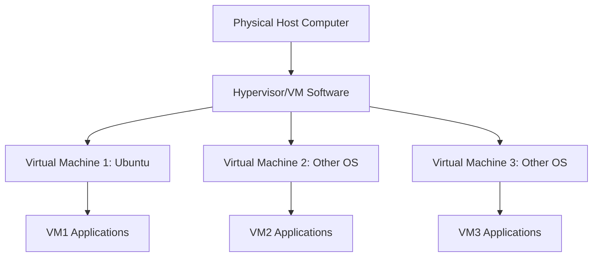

# Ubuntu Virtual Machines

## Introduction

Virtual machines (VMs) provide a way to run multiple operating systems on a single physical computer. They create isolated environments where you can install and run different operating systems without affecting your main system. Ubuntu, being one of the most popular Linux distributions, is an excellent choice for virtualization due to its reliability, performance, and extensive community support.

In this guide, we'll explore how to set up, configure, and use Ubuntu virtual machines for development, testing, and learning purposes. Whether you're a developer wanting to test your applications in different environments, a system administrator managing multiple servers, or simply a curious beginner wanting to explore Ubuntu without installing it directly on your computer, this guide has you covered.

## What Are Virtual Machines?

A virtual machine is a software-based emulation of a physical computer. It runs an operating system and applications just like a physical computer, but exists as a file or set of files on your host machine.



### Key Components of Virtualization:

1. **Host System**: The physical computer running the virtualization software
2. **Hypervisor**: Software that creates and manages virtual machines
3. **Guest System**: The operating system running inside the virtual machine
4. **Virtual Hardware**: Emulated hardware components like CPU, RAM, and storage

## Hypervisor Options for Ubuntu VMs

There are several hypervisors you can use to create and run Ubuntu virtual machines:

1. **VirtualBox** - Free, open-source, and works on Windows, macOS, and Linux
2. **VMware Workstation/Player** - Powerful commercial option with a free version available
3. **QEMU/KVM** - Open-source solution built into the Linux kernel
4. **Hyper-V** - Microsoft's solution for Windows
5. **Multipass** - Canonical's lightweight VM manager specifically for Ubuntu

## Getting Started with Ubuntu VMs

Let's walk through setting up an Ubuntu VM using VirtualBox, as it's cross-platform and beginner-friendly.

### Installing VirtualBox

1. Download VirtualBox from the [official website](https://www.virtualbox.org/)
2. Install it following the instructions for your operating system
3. Launch VirtualBox

### Downloading Ubuntu ISO

Before creating a VM, you'll need the Ubuntu installation image:

1. Visit the [Ubuntu download page](https://ubuntu.com/download/desktop)
2. Download the latest LTS (Long Term Support) version
3. Save the ISO file to a location you can easily access

### Creating Your First Ubuntu VM

Follow these steps to create your first Ubuntu virtual machine:

1. Open VirtualBox and click "New"
2. Enter a name for your VM (e.g., "Ubuntu-VM")
3. Select "Linux" as the Type and "Ubuntu (64-bit)" as the Version
4. Allocate memory (RAM) to your VM (minimum 2GB recommended)
5. Create a virtual hard disk (VDI format is fine)
6. Choose dynamically allocated storage
7. Set the virtual hard disk size (minimum 20GB recommended)
8. Click "Create"

### Configuring Your VM (Before Installation)

Before installing Ubuntu, configure these settings:

1. Select your new VM and click "Settings"
2. Under "System" > "Processor", allocate at least 2 CPUs
3. Under "Display", increase video memory to 128MB
4. Under "Storage", click on the empty optical drive, then select the Ubuntu ISO file
5. Under "Network", ensure "NAT" is selected for the adapter

### Installing Ubuntu on Your VM

Now let's install Ubuntu:

1. Start your VM by selecting it and clicking "Start"
2. The Ubuntu installer will boot from the ISO
3. Select "Install Ubuntu"
4. Follow the installation wizard:
   - Choose your language
   - Select "Normal installation"
   - Choose "Erase disk and install Ubuntu" (don't worry, this only affects the virtual disk)
   - Select your time zone
   - Create a user account and password
   - Wait for the installation to complete
5. When prompted, restart the VM

Congratulations! You now have Ubuntu running in a virtual machine.

## Basic VM Operations

### Starting and Stopping Your VM

- **Start**: Select your VM in VirtualBox and click "Start"
- **Shut Down**: Within Ubuntu, click the power icon and select "Power Off"
- **Force Stop**: In VirtualBox, click "Machine" > "Close" > "Power Off"

### Taking Snapshots

Snapshots allow you to save the state of your VM at a specific point in time:

1. With your VM selected (but not running), click "Snapshots"
2. Click the camera icon to take a new snapshot
3. Give it a name and description
4. To restore a snapshot, select it and click "Restore"

```bash
# You can also manage snapshots from the command line
VBoxManage snapshot "Ubuntu-VM" take "Clean Installation" --description "Fresh Ubuntu install"
VBoxManage snapshot "Ubuntu-VM" restore "Clean Installation"
```

### VM Keyboard Shortcuts

| Action | Shortcut |
|--------|----------|
| Release keyboard/mouse from VM | Right Ctrl |
| Switch to fullscreen | Right Ctrl + F |
| Take snapshot | Right Ctrl + T |
| Pause VM | Right Ctrl + P |

## Sharing Files Between Host and VM

### Using Shared Folders

VirtualBox allows you to share folders between your host and guest systems:

1. Install VirtualBox Guest Additions:
   - In the VM window, click "Devices" > "Insert Guest Additions CD image"
   - Open a terminal in Ubuntu and run:

```bash
sudo apt update
sudo apt install -y build-essential dkms linux-headers-$(uname -r)
cd /media/$USER/VBox_GAs_*
sudo ./VBoxLinuxAdditions.run
sudo reboot
```

2. After rebooting, set up a shared folder:
   - In VirtualBox, select your VM and click "Settings"
   - Go to "Shared Folders"
   - Click the "+" icon
   - Select a folder on your host machine
   - Give it a name and check "Auto-mount" and "Make Permanent"
   - Click "OK"

3. Access the shared folder in Ubuntu:
   - Open File Explorer
   - Navigate to `/media/sf_YourFolderName`
   - If you can't access it, add your user to the `vboxsf` group:

```bash
sudo usermod -aG vboxsf $USER
sudo reboot
```

### Using SSH for File Transfer

You can also use SSH to transfer files:

1. Install OpenSSH server in your Ubuntu VM:

```bash
sudo apt update
sudo apt install -y openssh-server
```

2. Configure port forwarding in VirtualBox:
   - Select your VM and click "Settings"
   - Go to "Network" > "Advanced" > "Port Forwarding"
   - Add a new rule: Protocol TCP, Host Port 2222, Guest Port 22
   - Click "OK"

3. Transfer files using SCP from your host machine:

```bash
# From host to VM
scp -P 2222 file.txt username@localhost:~/destination/

# From VM to host
scp -P 2222 username@localhost:~/file.txt local_destination/
```

## Networking in Ubuntu VMs

VirtualBox offers several networking modes for your VM:

1. **NAT (Network Address Translation)**:
   - Default mode
   - VM can access the internet but isn't directly accessible from the network
   - Uses port forwarding for specific services

2. **Bridged Adapter**:
   - VM appears as a separate device on your network
   - Gets its own IP address
   - Useful for hosting servers that need to be accessible on your network

3. **Host-only Adapter**:
   - Creates a private network between your host and VMs
   - VMs can communicate with each other and the host
   - No direct internet access by default

### Configuring Network in Ubuntu

To check your network configuration in Ubuntu:

```bash
# View network interfaces
ip addr show

# Check internet connectivity
ping -c 4 google.com

# View routing table
ip route
```

To configure static IP in Ubuntu (for bridged or host-only networks):

1. Edit the Netplan configuration:

```bash
sudo nano /etc/netplan/01-netcfg.yaml
```

2. Add a static IP configuration:

```yaml
network:
  version: 2
  renderer: networkd
  ethernets:
    enp0s3:
      addresses:
        - 192.168.1.100/24
      gateway4: 192.168.1.1
      nameservers:
        addresses: [8.8.8.8, 8.8.4.4]
```

3. Apply the changes:

```bash
sudo netplan apply
```

## Using Ubuntu VMs for Development

### Setting Up a Development Environment

Let's set up a basic web development environment in our Ubuntu VM:

1. Install essential development tools:

```bash
sudo apt update
sudo apt install -y build-essential git curl wget
```

2. Install Node.js and npm:

```bash
curl -fsSL https://deb.nodesource.com/setup_16.x | sudo -E bash -
sudo apt install -y nodejs
node --version
npm --version
```

3. Install Python development tools:

```bash
sudo apt install -y python3 python3-pip python3-venv
python3 --version
pip3 --version
```

4. Install Docker (for containerization):

```bash
sudo apt install -y apt-transport-https ca-certificates curl software-properties-common
curl -fsSL https://download.docker.com/linux/ubuntu/gpg | sudo apt-key add -
sudo add-apt-repository "deb [arch=amd64] https://download.docker.com/linux/ubuntu $(lsb_release -cs) stable"
sudo apt update
sudo apt install -y docker-ce
sudo usermod -aG docker $USER
sudo systemctl enable docker
sudo systemctl start docker
```

### Creating Isolated Development Environments

One of the key benefits of VMs is the ability to create isolated environments for different projects:

1. Clone your VM for different projects:
   - Shut down your VM
   - Right-click on it in VirtualBox and select "Clone"
   - Give it a new name (e.g., "Ubuntu-Python-Dev")
   - Choose "Full clone"
   - Click "Clone"

2. Take snapshots before major changes:
   - Before installing new software
   - After setting up a working environment
   - Before system upgrades

## Advanced VM Management

### VM Resource Allocation

You can adjust the resources allocated to your VM:

1. Shut down your VM
2. Select it and click "Settings"
3. Under "System", adjust:
   - Base Memory (RAM)
   - Processor count
4. Under "Display", adjust:
   - Video Memory
   - 3D Acceleration (if needed)
5. Under "Storage", you can add additional virtual disks

### VM Automation with VBoxManage

VirtualBox includes a command-line tool called VBoxManage for automation:

```bash
# List all VMs
VBoxManage list vms

# Start a VM in headless mode (no GUI)
VBoxManage startvm "Ubuntu-VM" --type headless

# Power off a VM
VBoxManage controlvm "Ubuntu-VM" poweroff

# Create a new VM from script
VBoxManage createvm --name "Ubuntu-Dev" --ostype Ubuntu_64 --register
VBoxManage modifyvm "Ubuntu-Dev" --memory 4096 --cpus 2
```

### Importing and Exporting VMs

You can share VMs with others:

1. **Exporting**:
   - Select your VM in VirtualBox
   - Click "File" > "Export Appliance"
   - Select your VM and click "Next"
   - Choose the format (OVF 2.0 recommended)
   - Set a file location
   - Click "Export"

2. **Importing**:
   - Click "File" > "Import Appliance"
   - Browse for the OVF/OVA file
   - Review settings
   - Click "Import"

## Practical Use Cases for Ubuntu VMs

### Testing Software in Isolated Environments

VMs are perfect for testing:

1. **Test software installations**: Install and test software without affecting your main system
2. **Test system updates**: See how updates affect your setup before applying them to production
3. **Test configuration changes**: Experiment with system configurations safely

### Learning and Experimentation

Use VMs to learn without risk:

1. **Learn command line**: Practice Linux commands in a safe environment
2. **Learn system administration**: Set up services, manage users, and configure systems
3. **Break things on purpose**: Learn how to recover from system failures

### Example: Setting Up a Web Server

Let's create a simple web server in our Ubuntu VM:

1. Install Apache:

```bash
sudo apt update
sudo apt install -y apache2
sudo systemctl status apache2
```

2. Create a simple website:

```bash
echo "<html><body><h1>Hello from my Ubuntu VM!</h1></body></html>" | sudo tee /var/www/html/index.html
```

3. Configure port forwarding in VirtualBox:
   - VM Settings > Network > Port Forwarding
   - Add rule: Protocol TCP, Host Port 8080, Guest Port 80

4. Access your website from your host machine by visiting `http://localhost:8080` in a browser

## Troubleshooting Common Issues

### VM Won't Start

If your VM fails to start:

1. Check error messages in the VirtualBox log
2. Ensure virtualization is enabled in your BIOS/UEFI
3. Verify you have enough resources (disk space, RAM)

```bash
# Check if virtualization is enabled
grep -E --color 'vmx|svm' /proc/cpuinfo
```

### Slow VM Performance

If your VM is running slowly:

1. Increase RAM and CPU allocation
2. Install VirtualBox Guest Additions
3. Enable hardware virtualization in VM settings
4. Disable unused VM features

### Network Connectivity Issues

If your VM can't connect to the internet:

1. Check network adapter settings
2. Try different network modes
3. Verify host firewall settings

## Summary

Ubuntu virtual machines provide a flexible, isolated environment for development, testing, and learning. They allow you to:

- Run Ubuntu alongside your existing operating system
- Create isolated environments for different projects
- Experiment with system configurations safely
- Test software before deploying to production
- Learn Linux without installing it directly on your hardware

By mastering Ubuntu VMs, you gain a powerful tool in your development arsenal that can help you become a more versatile and knowledgeable programmer.

## Additional Resources

Here are some resources to continue your learning journey:

- [Official Ubuntu Documentation](https://help.ubuntu.com/)
- [VirtualBox User Manual](https://www.virtualbox.org/manual/)
- [Linux Command Line Basics](https://ubuntu.com/tutorials/command-line-for-beginners)

## Exercises

To reinforce your learning, try these exercises:

1. Create a new Ubuntu VM and install a different desktop environment (like KDE or XFCE)
2. Set up a LAMP stack (Linux, Apache, MySQL, PHP) in your VM
3. Create a VM snapshot, make major changes to your system, then restore from the snapshot
4. Configure networking to allow two different VMs to communicate with each other
5. Automate VM creation and configuration using VBoxManage commands

By completing these exercises, you'll gain practical experience with Ubuntu virtual machines and be well on your way to leveraging them for your development projects.