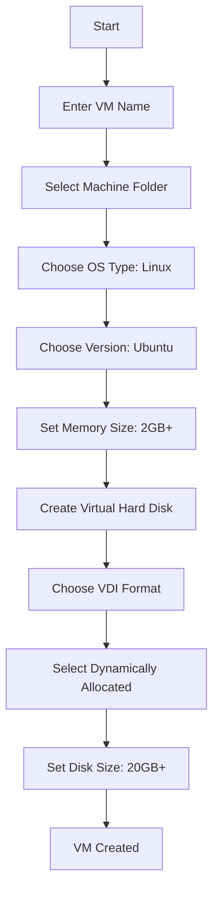

# Ubuntu VirtualBox

## Introduction

VirtualBox is a powerful, open-source virtualization software that allows you to run multiple operating systems simultaneously on a single physical machine. This guide focuses specifically on using VirtualBox with Ubuntu, enabling you to create isolated Ubuntu environments for development, testing, and learning without affecting your host system.

Virtualization provides several benefits for developers and system administrators:

- Run multiple operating system environments on a single machine
- Test software in isolated environments
- Create disposable development environments
- Learn new technologies without dedicated hardware
- Simulate complex network configurations

By the end of this guide, you'll understand how to install VirtualBox, create Ubuntu virtual machines, manage them effectively, and leverage this setup for your development needs.

## Prerequisites

Before getting started, ensure you have:

- A computer with sufficient resources (at least 4GB RAM, 2 CPU cores recommended)
- Administrative/root access to your system
- At least 20GB of free disk space
- Hardware virtualization support enabled in BIOS/UEFI (Intel VT-x or AMD-V)

## Installing VirtualBox

### On Ubuntu Host

To install VirtualBox on an Ubuntu host system:

```bash
# Update package lists
sudo apt update

# Install VirtualBox
sudo apt install virtualbox

# Install Extension Pack for additional features
sudo apt install virtualbox-ext-pack
```

### On Other Operating Systems

For Windows, macOS, or other Linux distributions, download VirtualBox from the [official website](https://www.virtualbox.org/wiki/Downloads).

## Creating an Ubuntu Virtual Machine

### Step 1: Download Ubuntu ISO

First, download the Ubuntu ISO file from the Ubuntu website. You can choose between:

- Ubuntu Desktop (for graphical interface)
- Ubuntu Server (minimal, command-line only)

### Step 2: Create a New Virtual Machine

1. Launch VirtualBox and click "New"
2. Configure the basic settings:



### Step 3: Configure VM Settings

Before starting your VM, configure additional settings:

1. Select your new VM and click "Settings"
2. Under "System":
   - Processor: Allocate at least 2 CPU cores
   - Enable PAE/NX if available
3. Under "Display":
   - Enable 3D Acceleration
   - Allocate 64MB+ video memory
4. Under "Storage":
   - Select the empty optical drive
   - Choose the Ubuntu ISO file you downloaded

### Step 4: Install Ubuntu

1. Start the VM by clicking "Start"
2. Follow the Ubuntu installation wizard:
   - Choose your language
   - Select "Install Ubuntu"
   - Configure keyboard layout
   - Choose installation type (usually "Erase disk and install Ubuntu")
   - Set your location
   - Create a user account
   - Wait for installation to complete
   - Restart when prompted

## Essential VirtualBox Features

### Guest Additions

Guest Additions provide enhanced integration between your host system and virtual machine, including:

- Better video performance
- Seamless mouse integration
- Shared folders
- Time synchronization

To install Guest Additions:

```bash
# Update your Ubuntu system first
sudo apt update && sudo apt upgrade -y

# Install required packages
sudo apt install build-essential dkms linux-headers-$(uname -r) -y

# Mount Guest Additions CD
# From VirtualBox menu: Devices > Insert Guest Additions CD image...

# Run the installer
cd /media/$USER/VBox_GAs_*
sudo ./VBoxLinuxAdditions.run

# Restart the VM
sudo reboot
```

### Shared Folders

To set up shared folders between your host and VM:

1. In VirtualBox Manager, select your VM and click "Settings"
2. Go to "Shared Folders" and click the "+" icon
3. Select the folder on your host to share
4. Name the share and check "Auto-mount" and "Make Permanent"
5. After starting the VM, access the shared folder at `/media/sf_[share_name]`

```bash
# To access shared folders, add your user to the vboxsf group
sudo usermod -aG vboxsf $USER

# Restart the VM or log out and back in
```

### Snapshots

Snapshots allow you to save the state of your VM at a specific point in time, which is incredibly useful for:

- Creating backup points before software installation
- Testing configurations without risk
- Quickly reverting to a working state

To create a snapshot:

1. Select your VM in VirtualBox Manager
2. Click on "Snapshots"
3. Click the "Take" button
4. Give your snapshot a name and description

To restore a snapshot:

1. Select the snapshot you want to restore
2. Click "Restore"

## Performance Optimization

### Memory Allocation

Assign an appropriate amount of RAM to your VM:

```bash
# Check available memory on your host
free -h

# Check memory usage within VM
htop
```

Recommended settings:
- Minimum: 2GB
- Comfortable: 4GB
- Development: 8GB

Never allocate more than 50% of your host's RAM to VMs.

### CPU Allocation

VirtualBox allows assigning multiple CPU cores to a VM:

```bash
# Check CPU info
lscpu

# Monitor CPU usage
top
```

Guidelines:
- Allocate no more than 50% of physical cores
- For development VMs, at least 2 cores is recommended

### Storage Options

VirtualBox offers several storage configurations:

1. **Dynamically allocated** - Grows as needed (slower but saves space)
2. **Fixed size** - Pre-allocates all space (faster performance)

For development environments, consider:

```bash
# Check disk usage in VM
df -h

# Monitor I/O performance
sudo iotop
```

## Networking

VirtualBox offers multiple network adapters and configurations:

### NAT (Network Address Translation)

- Default setting
- VM can access the internet but not directly accessible from network
- Example use:

```bash
# Verify internet connection
ping -c 4 google.com

# Install web server
sudo apt install apache2

# Access from within VM
curl localhost
```

### Bridged Adapter

- VM appears as a separate device on your network
- Has its own IP address
- Configure with:

```bash
# After setting adapter to bridged, check IP
ip addr show

# Now VM is accessible from other network devices
# On another machine: http://vm-ip-address
```

### Host-Only Adapter

- Creates private network between host and VMs
- VMs can communicate with each other
- No external access by default

```bash
# Create host-only network in VirtualBox preferences
# Then configure VM to use it

# Check IP in VM
ip addr show

# Test connection to host
ping host-ip-address
```

## Common Use Cases

### Development Environment

VirtualBox is ideal for creating isolated development environments:

```bash
# Install development tools
sudo apt install git nodejs npm python3 python3-pip

# Clone a repository
git clone https://github.com/example/project.git

# Set up development environment
cd project
npm install
```

Benefits:
- Consistent environment across team members
- Easy to replicate production environment
- Safe testing of new configurations

### Server Testing

Test server configurations before deployment:

```bash
# Install web server
sudo apt install apache2

# Configure virtual hosts
sudo nano /etc/apache2/sites-available/example.conf

# Add site configuration
<VirtualHost *:80>
    ServerName example.local
    DocumentRoot /var/www/html/example
    ErrorLog ${APACHE_LOG_DIR}/example-error.log
    CustomLog ${APACHE_LOG_DIR}/example-access.log combined
</VirtualHost>

# Enable site and reload
sudo a2ensite example.conf
sudo systemctl reload apache2
```

### Learning Environment

VirtualBox provides a safe space for learning:

```bash
# Experiment with system commands
sudo fdisk -l
sudo apt install htop
sudo systemctl status sshd

# Try potentially destructive commands safely
sudo rm -rf /tmp/test_directory
```

## Troubleshooting

### Boot Issues

If your VM fails to boot:

1. Check if virtualization is enabled in BIOS/UEFI
2. Ensure the ISO file is not corrupted
3. Verify VM settings (especially system settings)

```bash
# On host system, check for virtualization support
egrep -c '(vmx|svm)' /proc/cpuinfo
# If result is 0, virtualization is disabled
```

### Performance Problems

For slow VM performance:

```bash
# Inside VM, check for resource bottlenecks
top
free -h
df -h

# Adjust VM settings:
# - Increase RAM
# - Add CPU cores
# - Use fixed-size VDI
# - Enable 3D acceleration
```

### Guest Additions Issues

If Guest Additions won't install:

```bash
# Update kernel headers
sudo apt update
sudo apt install linux-headers-$(uname -r)

# Reinstall Guest Additions
sudo /media/$USER/VBox_GAs_*/VBoxLinuxAdditions.run
```

## Advanced Features

### VirtualBox Command Line (VBoxManage)

VirtualBox includes a powerful command-line tool:

```bash
# List VMs
VBoxManage list vms

# Start a VM headless (without UI)
VBoxManage startvm "Ubuntu VM" --type headless

# Control VM state
VBoxManage controlvm "Ubuntu VM" pause
VBoxManage controlvm "Ubuntu VM" resume
VBoxManage controlvm "Ubuntu VM" poweroff

# Create snapshot
VBoxManage snapshot "Ubuntu VM" take "clean-install" --description "Fresh Ubuntu installation"
```

### VM Cloning

Create identical copies of your VMs:

1. Right-click VM in VirtualBox Manager
2. Select "Clone"
3. Choose between:
   - Full clone (completely independent)
   - Linked clone (shares virtual disk with original)

### Importing/Exporting VMs

Share VMs between machines:

```bash
# Export VM to OVA file
VBoxManage export "Ubuntu VM" -o ubuntu-dev-environment.ova

# Import VM from OVA file
VBoxManage import ubuntu-dev-environment.ova
```

## Summary

VirtualBox provides a powerful way to run Ubuntu virtual machines for development, testing, and learning. With the ability to create multiple isolated environments, take snapshots, and customize hardware configurations, it's an essential tool for developers and system administrators.

Key takeaways:
- VirtualBox allows running Ubuntu in an isolated environment
- Guest Additions improve integration with the host system
- Snapshots provide protection and versioning
- Various networking options support different use cases
- Command-line tools enable automation and advanced management

## Additional Resources

- [VirtualBox Official Documentation](https://www.virtualbox.org/wiki/Documentation)
- [Ubuntu Documentation](https://help.ubuntu.com/)
- [VirtualBox Forum](https://forums.virtualbox.org/)

## Exercises

1. Create a new Ubuntu virtual machine and install the LAMP stack (Linux, Apache, MySQL, PHP).
2. Configure different network adapters and compare how they affect VM connectivity.
3. Create a development environment for a specific programming language or framework.
4. Set up shared folders between your host and VM.
5. Create a snapshot, make significant changes to your VM, then restore to the snapshot.
6. Export your VM and import it on another computer (if available).