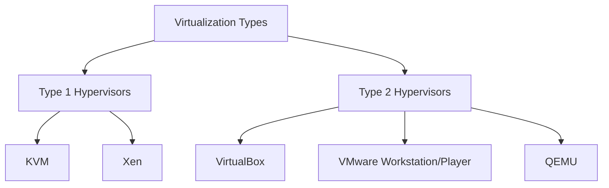
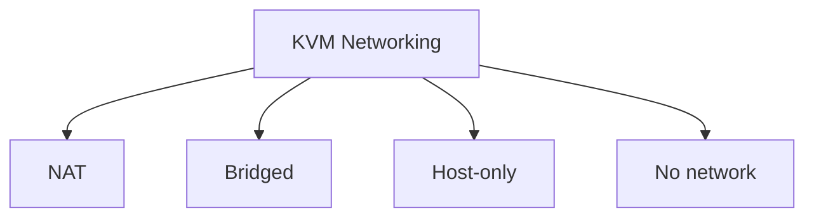

# Ubuntu VM Management

## Introduction

Virtual machines (VMs) provide a powerful way to run multiple operating systems simultaneously on a single physical computer. Ubuntu VM management involves creating, configuring, monitoring, and maintaining Ubuntu virtual machines. This guide focuses on managing Ubuntu VMs, whether Ubuntu is serving as the host system, the guest system, or both.

Virtualization offers several benefits:

- **Resource isolation**: Run multiple environments without interference
- **Testing environment**: Safe experimentation without affecting physical systems
- **Development flexibility**: Create identical environments across different machines
- **Server consolidation**: Optimize hardware usage by running multiple servers on one physical machine
- **Snapshot and backup**: Easily create point-in-time backups of entire systems

## Understanding Virtualization Types

Before diving into Ubuntu VM management, it's important to understand different virtualization approaches:



- **Type 1 Hypervisors** (bare-metal): Run directly on hardware
  - Examples: KVM, Xen
- **Type 2 Hypervisors** (hosted): Run on top of an operating system
  - Examples: VirtualBox, VMware Workstation/Player, QEMU

This guide will focus on the most common tools for Ubuntu environments: KVM, VirtualBox, and Multipass.

## Setting Up KVM on Ubuntu

KVM (Kernel-based Virtual Machine) is integrated into Linux, making it powerful and efficient for running VMs on Ubuntu.

### Prerequisites

First, check if your hardware supports virtualization:

```bash
egrep -c '(vmx|svm)' /proc/cpuinfo
```

If the result is greater than 0, your CPU supports virtualization. Next, install the required packages:

```bash
sudo apt update
sudo apt install qemu-kvm libvirt-daemon-system libvirt-clients bridge-utils virt-manager
```

### Configuring User Permissions

Add your user to the necessary groups:

```bash
sudo adduser $USER libvirt
sudo adduser $USER kvm
```

Log out and log back in for the changes to take effect.

### Creating an Ubuntu VM with virt-manager

Virt-manager provides a graphical interface for VM management:

1. Start virt-manager:
   ```bash
   sudo virt-manager
   ```

2. Click "Create a new virtual machine"
3. Select "Local install media" and click Forward
4. Browse and select your Ubuntu ISO file or enter its location
5. Allocate RAM and CPU resources
6. Configure storage for the VM
7. Configure network settings
8. Complete the setup and start the VM

## Managing VMs with KVM Command Line

While virt-manager is convenient, command-line tools offer more control and scriptability.

### Creating a VM with virsh

```bash
sudo virt-install \
  --name ubuntu20.04 \
  --ram 2048 \
  --disk path=/var/lib/libvirt/images/ubuntu20.04.qcow2,size=20 \
  --vcpus 2 \
  --os-type linux \
  --os-variant ubuntu20.04 \
  --network bridge=virbr0 \
  --graphics none \
  --console pty,target_type=serial \
  --location 'http://archive.ubuntu.com/ubuntu/dists/focal/main/installer-amd64/' \
  --extra-args 'console=ttyS0,115200n8 serial'
```

### Basic VM Management Commands

List all VMs:

```bash
sudo virsh list --all
```

Start a VM:

```bash
sudo virsh start ubuntu20.04
```

Connect to the VM console:

```bash
sudo virsh console ubuntu20.04
```

Shutdown a VM gracefully:

```bash
sudo virsh shutdown ubuntu20.04
```

Force shutdown (like unplugging the power):

```bash
sudo virsh destroy ubuntu20.04
```

Delete a VM (caution: this removes the VM definition but not its storage):

```bash
sudo virsh undefine ubuntu20.04
```

To delete a VM and its storage:

```bash
sudo virsh undefine ubuntu20.04 --remove-all-storage
```

### VM Snapshots with KVM

Snapshots allow you to save the state of a VM at a point in time:

Create a snapshot:

```bash
sudo virsh snapshot-create-as ubuntu20.04 snapshot1 "Clean install with updates" --disk-only --atomic
```

List snapshots:

```bash
sudo virsh snapshot-list ubuntu20.04
```

Restore to a snapshot:

```bash
sudo virsh snapshot-revert ubuntu20.04 snapshot1
```

Delete a snapshot:

```bash
sudo virsh snapshot-delete ubuntu20.04 snapshot1
```

## Using VirtualBox for Ubuntu VMs

VirtualBox is a popular Type 2 hypervisor that's easy to use, making it ideal for beginners.

### Installation

```bash
sudo apt update
sudo apt install virtualbox
```

For enhanced functionality, install the extension pack:

```bash
sudo apt install virtualbox-ext-pack
```

### Creating an Ubuntu VM in VirtualBox

1. Launch VirtualBox and click "New"
2. Name your VM, select "Linux" as the type and "Ubuntu (64-bit)" as the version
3. Allocate memory (at least 2GB recommended)
4. Create a virtual hard disk
5. Specify the Ubuntu ISO location
6. Complete the setup and start the VM

### VirtualBox Command Line Management

VirtualBox also offers command-line tools for automation:

List VMs:

```bash
VBoxManage list vms
```

Create a VM:

```bash
VBoxManage createvm --name "UbuntuServer" --ostype Ubuntu_64 --register
VBoxManage modifyvm "UbuntuServer" --memory 2048 --cpus 2
VBoxManage createhd --filename ~/VirtualBox\ VMs/UbuntuServer/UbuntuServer.vdi --size 20000
```

Start a VM:

```bash
VBoxManage startvm "UbuntuServer"
```

Start a VM in headless mode (no GUI):

```bash
VBoxManage startvm "UbuntuServer" --type headless
```

Power off a VM:

```bash
VBoxManage controlvm "UbuntuServer" poweroff
```

### VirtualBox Snapshots

Create a snapshot:

```bash
VBoxManage snapshot "UbuntuServer" take "fresh-install" --description "Fresh Ubuntu installation"
```

List snapshots:

```bash
VBoxManage snapshot "UbuntuServer" list
```

Restore a snapshot:

```bash
VBoxManage snapshot "UbuntuServer" restore "fresh-install"
```

## Multipass for Quick Ubuntu VMs

Multipass, developed by Canonical, makes it extremely easy to spin up Ubuntu VMs for development and testing.

### Installation

```bash
sudo snap install multipass
```

### Basic Multipass Commands

Create a new Ubuntu VM:

```bash
multipass launch --name ubuntu-vm
```

List running instances:

```bash
multipass list
```

Execute commands in a VM:

```bash
multipass exec ubuntu-vm -- lsb_release -a
```

Open a shell in a VM:

```bash
multipass shell ubuntu-vm
```

Stop and start VMs:

```bash
multipass stop ubuntu-vm
multipass start ubuntu-vm
```

Delete a VM:

```bash
multipass delete ubuntu-vm
multipass purge  # Actually removes deleted VMs
```

## VM Resource Management

Efficiently managing VM resources is crucial for optimal performance.

### Monitoring VM Performance

Using KVM/QEMU:

```bash
sudo apt install virt-top
sudo virt-top
```

Or get detailed info:

```bash
sudo virsh dominfo ubuntu20.04
```

### Adjusting VM Resources

With KVM, modify VM settings (must be stopped first):

```bash
sudo virsh shutdown ubuntu20.04
sudo virsh setmaxmem ubuntu20.04 4G --config
sudo virsh setmem ubuntu20.04 4G --config
sudo virsh setvcpus ubuntu20.04 4 --config
sudo virsh start ubuntu20.04
```

With VirtualBox:

```bash
VBoxManage modifyvm "UbuntuServer" --memory 4096 --cpus 4
```

## Networking Options for Ubuntu VMs

VMs can connect to networks in different ways:

### KVM Networking Modes



Configure bridged networking with KVM:

```bash
sudo apt install bridge-utils
sudo nano /etc/netplan/01-netcfg.yaml
```

Add configuration like:

```yaml
network:
  version: 2
  renderer: networkd
  ethernets:
    enp0s25:
      dhcp4: no
  bridges:
    br0:
      interfaces: [enp0s25]
      dhcp4: yes
```

Apply configuration:

```bash
sudo netplan apply
```

Update VM to use bridge:

```bash
sudo virsh edit ubuntu20.04
```

Change the network interface to:

```xml
<interface type='bridge'>
  <source bridge='br0'/>
  <model type='virtio'/>
</interface>
```

### VirtualBox Networking

In VirtualBox, the networking modes are:
- NAT (default)
- Bridged
- Host-only
- Internal network

To configure bridged networking from the command line:

```bash
VBoxManage modifyvm "UbuntuServer" --nic1 bridged --bridgeadapter1 enp0s25
```

## Automating VM Management

### Creating VM Templates

With KVM:

1. Create a base VM with desired configurations
2. Install all necessary packages
3. Clean up the system
4. Shut down the VM
5. Create a template:

```bash
sudo virt-clone --original ubuntu20.04 --name ubuntu-template --file /var/lib/libvirt/images/ubuntu-template.qcow2
```

### Using Cloud-Init with KVM

For automated installations:

1. Install required packages:

```bash
sudo apt install cloud-image-utils
```

2. Download Ubuntu cloud image:

```bash
wget https://cloud-images.ubuntu.com/focal/current/focal-server-cloudimg-amd64.img
```

3. Create a cloud-init configuration file `cloud-config.yml`:

```yaml
#cloud-config
hostname: ubuntuvm
users:
  - name: ubuntu
    sudo: ALL=(ALL) NOPASSWD:ALL
    shell: /bin/bash
    ssh_authorized_keys:
      - ssh-rsa AAAA... your_key
password: ubuntu
chpasswd: { expire: False }
ssh_pwauth: True
```

4. Create a disk with the configuration:

```bash
cloud-localds cloud-config.iso cloud-config.yml
```

5. Create and start the VM:

```bash
sudo virt-install \
  --name ubuntu-cloud \
  --ram 2048 \
  --vcpus 2 \
  --disk focal-server-cloudimg-amd64.img,size=10 \
  --disk cloud-config.iso,device=cdrom \
  --os-type linux \
  --os-variant ubuntu20.04 \
  --network bridge=virbr0 \
  --graphics none \
  --import
```

### Scripting VM Creation

Create a bash script for automated VM deployment:

```bash
#!/bin/bash
# create_ubuntu_vm.sh

VM_NAME=$1
RAM=$2
CPUS=$3
DISK_SIZE=$4

if [ -z "$VM_NAME" ] || [ -z "$RAM" ] || [ -z "$CPUS" ] || [ -z "$DISK_SIZE" ]; then
  echo "Usage: $0 <vm_name> <ram_in_mb> <cpus> <disk_size_in_gb>"
  exit 1
fi

# Download Ubuntu cloud image if not present
IMAGE="focal-server-cloudimg-amd64.img"
if [ ! -f "$IMAGE" ]; then
  wget https://cloud-images.ubuntu.com/focal/current/$IMAGE
fi

# Create a copy of the image
cp $IMAGE $VM_NAME.img
qemu-img resize $VM_NAME.img ${DISK_SIZE}G

# Create cloud-init config
cat > cloud-config.yml <<EOF
#cloud-config
hostname: $VM_NAME
users:
  - name: ubuntu
    sudo: ALL=(ALL) NOPASSWD:ALL
    shell: /bin/bash
password: ubuntu
chpasswd: { expire: False }
ssh_pwauth: True
EOF

# Create cloud-init disk
cloud-localds $VM_NAME-cloud-config.iso cloud-config.yml

# Create and start VM
sudo virt-install \
  --name $VM_NAME \
  --ram $RAM \
  --vcpus $CPUS \
  --disk $VM_NAME.img \
  --disk $VM_NAME-cloud-config.iso,device=cdrom \
  --os-type linux \
  --os-variant ubuntu20.04 \
  --network bridge=virbr0 \
  --graphics none \
  --import

echo "VM $VM_NAME created and started"
```

Make the script executable:

```bash
chmod +x create_ubuntu_vm.sh
```

Usage:

```bash
./create_ubuntu_vm.sh webserver 2048 2 10
```

## Best Practices for Ubuntu VM Management

1. **Regular backups**: Use snapshots but don't rely on them exclusively
   ```bash
   sudo virsh dumpxml ubuntu20.04 > ubuntu20.04.xml
   sudo cp /var/lib/libvirt/images/ubuntu20.04.qcow2 /backup/
   ```

2. **Security considerations**:
   - Keep both host and guest systems updated
   - Use minimal installations for guests
   - Isolate sensitive VMs on separate networks
   - Disable unnecessary services

3. **Performance optimization**:
   - Use virtio drivers where possible
   - Allocate resources based on actual needs
   - Enable CPU passthrough for intensive workloads:
     ```bash
     sudo virsh edit ubuntu20.04
     ```
     Add CPU configuration:
     ```xml
     <cpu mode='host-passthrough'/>
     ```

4. **Documentation**: Keep records of VM configurations and purposes
   ```bash
   sudo virsh dumpxml ubuntu20.04 > ~/vm-configs/ubuntu20.04-config.xml
   ```

## Troubleshooting Common Issues

### VM Won't Start

Check the error:

```bash
sudo virsh start ubuntu20.04 --verbose
```

Check system logs:

```bash
sudo journalctl -u libvirtd
```

### Performance Issues

Check VM resource usage:

```bash
sudo virt-top
```

Check I/O wait issues:

```bash
top
# Look for high %wa values
```

Improve disk performance with cache settings:

```bash
sudo virsh edit ubuntu20.04
```

Modify disk cache:

```xml
<disk type='file' device='disk'>
  <driver name='qemu' type='qcow2' cache='none'/>
  ...
</disk>
```

### Network Connectivity Issues

Check the network interface status:

```bash
sudo virsh domiflist ubuntu20.04
```

Ensure the bridge is up:

```bash
ip a show virbr0
```

Verify firewall rules aren't blocking traffic:

```bash
sudo iptables -L -v | grep virbr0
```

## Summary

Ubuntu VM management offers powerful capabilities for creating flexible, isolated environments for development, testing, and production. We've covered:

- Setting up virtualization environments with KVM, VirtualBox, and Multipass
- Managing VMs through both graphical and command-line interfaces
- Creating and restoring snapshots
- Automating VM deployment with scripts and cloud-init
- Configuring networking for different use cases
- Optimizing performance and troubleshooting common issues

## Additional Resources

1. **Official Documentation**:
   - [Ubuntu KVM Documentation](https://ubuntu.com/server/docs/virtualization-kvm)
   - [VirtualBox Manual](https://www.virtualbox.org/manual/)
   - [Multipass Documentation](https://multipass.run/docs)

2. **Practice Exercises**:
   - Create a three-tier application using separate VMs for web, application, and database servers
   - Set up a development environment with automated deployment using cloud-init
   - Create a VM template and deploy multiple instances with different configurations

3. **Advanced Topics to Explore**:
   - Container technologies (Docker, LXD) and how they compare to VMs
   - Orchestration tools for managing multiple VMs
   - Live migration between physical hosts
   - Nested virtualization

With these tools and techniques, you can effectively manage Ubuntu virtual machines for almost any use case, from simple development environments to complex multi-server deployments.