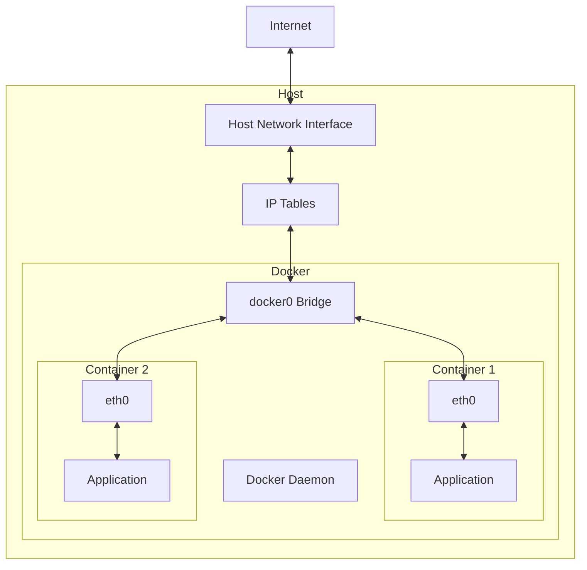

# Ubuntu Container Networking

## Introduction

Container networking is a fundamental concept when working with virtualization technologies on Ubuntu. It enables containers to communicate with each other, with the host system, and with external networks including the internet. Understanding container networking is essential for deploying robust, scalable, and secure containerized applications.

In this guide, we'll explore how networking works in Ubuntu containers, focusing on Docker and LXD, the two most popular container technologies on Ubuntu. We'll cover everything from basic network configurations to advanced networking concepts, with practical examples to help you implement these solutions in real-world scenarios.

## Container Networking Fundamentals

Before diving into specific implementations, let's understand some core concepts of container networking.

### What is Container Networking?

Container networking refers to the mechanisms that allow containers to communicate with:
- Other containers on the same host
- The host system itself
- External networks and the internet
- Containers on different hosts

### Network Namespaces

At the heart of container networking are Linux network namespaces, which provide isolation for network resources:

```bash
# Create a new network namespace
sudo ip netns add my_container

# List network namespaces
ip netns list
```

Output:
```
my_container
```

Network namespaces isolate the network stack (interfaces, routing tables, firewall rules) for each container, allowing them to have their own network configuration without interfering with others.

## Docker Networking in Ubuntu

Docker provides several networking options out of the box. Let's explore them:

### Default Bridge Network

When you install Docker on Ubuntu, it creates a default bridge network (`docker0`):

```bash
# Check the docker0 bridge interface
ip addr show docker0
```

Output:
```
3: docker0: <BROADCAST,MULTICAST,UP,LOWER_UP> mtu 1500 qdisc noqueue state UP group default 
    link/ether 02:42:7d:83:13:8e brd ff:ff:ff:ff:ff:ff
    inet 172.17.0.1/16 brd 172.17.255.255 scope global docker0
       valid_lft forever preferred_lft forever
    inet6 fe80::42:7dff:fe83:138e/64 scope link 
       valid_lft forever preferred_lft forever
```

### Network Types in Docker

Docker supports several network types:

1. **Bridge**: The default network mode. Containers can talk to each other on the same bridge network.
2. **Host**: Containers share the host's network namespace.
3. **None**: Containers have no network connectivity.
4. **Overlay**: Connects multiple Docker daemons across hosts.
5. **Macvlan**: Assigns a MAC address to containers, making them appear as physical devices on the network.

Let's see how to use these networks:

```bash
# List Docker networks
docker network ls
```

Output:
```
NETWORK ID     NAME      DRIVER    SCOPE
7a8e3b9d1234   bridge    bridge    local
9c48e227b345   host      host      local
2ba8c1d45687   none      null      local
```

### Creating Custom Bridge Networks

Custom networks provide better isolation and allow container-to-container communication using container names:

```bash
# Create a custom bridge network
docker network create --driver bridge my_network

# Create two containers on this network
docker run -d --name container1 --network my_network ubuntu sleep infinity
docker run -d --name container2 --network my_network ubuntu sleep infinity

# From container1, ping container2 by name
docker exec container1 ping -c 3 container2
```

Output:
```
PING container2 (172.18.0.3): 56 data bytes
64 bytes from 172.18.0.3: seq=0 ttl=64 time=0.069 ms
64 bytes from 172.18.0.3: seq=1 ttl=64 time=0.074 ms
64 bytes from 172.18.0.3: seq=2 ttl=64 time=0.063 ms

--- container2 ping statistics ---
3 packets transmitted, 3 packets received, 0% packet loss
round-trip min/avg/max = 0.063/0.068/0.074 ms
```

### Port Mapping

To make container services accessible from outside, we use port mapping:

```bash
# Run an Nginx container and map port 80 to host port 8080
docker run -d --name web_server -p 8080:80 nginx

# Test access from the host
curl http://localhost:8080
```

Output:
```html
<!DOCTYPE html>
<html>
<head>
<title>Welcome to nginx!</title>
...
<p><em>Thank you for using nginx.</em></p>
</html>
```

## LXD Networking in Ubuntu

LXD is Ubuntu's system container manager and offers powerful networking capabilities.

### Default Bridge in LXD

Similar to Docker, LXD creates a default bridge (`lxdbr0`):

```bash
# Check the lxdbr0 bridge interface
ip addr show lxdbr0
```

Output:
```
4: lxdbr0: <BROADCAST,MULTICAST,UP,LOWER_UP> mtu 1500 qdisc noqueue state UP group default qlen 1000
    link/ether 00:16:3e:d9:a3:c4 brd ff:ff:ff:ff:ff:ff
    inet 10.146.118.1/24 scope global lxdbr0
       valid_lft forever preferred_lft forever
    inet6 fd42:9c28:1b30:e88e::1/64 scope global 
       valid_lft forever preferred_lft forever
```

### Creating LXD Networks

You can create custom networks in LXD:

```bash
# Create a new bridge network
lxc network create my_lxd_network

# Show network details
lxc network show my_lxd_network
```

Output:
```yaml
name: my_lxd_network
type: bridge
config:
  ipv4.address: 10.150.155.1/24
  ipv4.nat: "true"
  ipv6.address: fd42:9c8d:432a:559e::1/64
  ipv6.nat: "true"
description: ""
```

### Connecting Containers to Networks

You can connect LXD containers to different networks:

```bash
# Create a container connected to the custom network
lxc launch ubuntu:20.04 container3 --network my_lxd_network

# Check container's network configuration
lxc config device get container3 eth0 ipv4.address
```

Output:
```
10.150.155.98
```

### Static IP Configuration

You can assign static IPs to LXD containers:

```bash
# Set a static IP for a container
lxc config device set container3 eth0 ipv4.address 10.150.155.10

# Restart the container to apply
lxc restart container3
```

## Advanced Container Networking

### Multi-host Networking with Docker Swarm

Docker Swarm allows containers to communicate across multiple hosts:

```bash
# Initialize a swarm (on the first host)
docker swarm init --advertise-addr 192.168.1.10

# Create an overlay network
docker network create --driver overlay --attachable swarm_network

# Deploy a service on the overlay network
docker service create --name web --network swarm_network --replicas 3 -p 80:80 nginx
```

### Container-to-Container Communication Patterns

Let's explore a real-world example of containerized microservices:

```bash
# Create a network for our application
docker network create app_network

# Deploy a database container
docker run -d --name database --network app_network \
  -e POSTGRES_PASSWORD=mypassword postgres

# Deploy a backend API container
docker run -d --name api --network app_network \
  -e DB_HOST=database -e DB_PASSWORD=mypassword \
  -p 3000:3000 my-api-image

# Deploy a frontend container
docker run -d --name frontend --network app_network \
  -e API_URL=http://api:3000 -p 80:80 my-frontend-image
```

This pattern allows for separation of concerns while maintaining easy communication between services.

### Network Security with Container Networking

Container networks should be secured properly:

```bash
# Create a more secure network with custom subnet
docker network create --driver bridge \
  --subnet 172.20.0.0/16 \
  --gateway 172.20.0.1 \
  --opt com.docker.network.bridge.name=secure_net \
  secure_network

# Apply network policies (using ufw on the host)
sudo ufw allow in on secure_net from 172.20.0.0/16 to 172.20.0.1 port 53
```

## Container Networking Architecture

The following diagram illustrates the container networking architecture in Ubuntu:



## Troubleshooting Container Networking

### Common Issues and Solutions

#### DNS Resolution Issues

If containers can't resolve domain names:

```bash
# Check DNS configuration
docker run --rm alpine cat /etc/resolv.conf
```

Solution: Configure DNS in Docker daemon settings:

```json
// /etc/docker/daemon.json
{
  "dns": ["8.8.8.8", "8.8.4.4"]
}
```

#### Container Connectivity Issues

To troubleshoot container connectivity:

```bash
# Install networking tools in a container
docker exec -it container1 apt-get update && apt-get install -y iputils-ping iproute2

# Check network interface and routes
docker exec -it container1 ip addr show
docker exec -it container1 ip route

# Test connectivity
docker exec -it container1 ping -c 3 8.8.8.8
```

## Real-World Example: Deploying a Web Application with Database

Let's deploy a complete web application using container networking:

```bash
# Create an isolated network
docker network create webapp_net

# Deploy MySQL database
docker run -d --name mysql \
  --network webapp_net \
  -e MYSQL_ROOT_PASSWORD=secret \
  -e MYSQL_DATABASE=webapp \
  -e MYSQL_USER=webuser \
  -e MYSQL_PASSWORD=userpass \
  mysql:5.7

# Deploy backend API
docker run -d --name api \
  --network webapp_net \
  -e DB_HOST=mysql \
  -e DB_USER=webuser \
  -e DB_PASSWORD=userpass \
  -e DB_NAME=webapp \
  -p 3000:3000 \
  my-node-api:latest

# Deploy frontend
docker run -d --name frontend \
  --network webapp_net \
  -e API_URL=http://api:3000 \
  -p 80:80 \
  my-react-app:latest
```

In this example:
1. All containers are on the same isolated network
2. They can communicate using container names
3. Only necessary ports are exposed to the host
4. Database credentials are secured as environment variables

## Summary

Container networking in Ubuntu provides the foundation for building complex, scalable applications with isolated components. We've covered:

- Basic networking concepts with network namespaces
- Docker networking types and configuration options
- LXD networking capabilities
- Advanced multi-host networking
- Security considerations
- Troubleshooting techniques
- Real-world deployment patterns

By understanding these concepts, you can design efficient, secure, and scalable containerized applications on Ubuntu.

## Additional Resources

To deepen your knowledge of container networking on Ubuntu, consider:

- Exploring Docker's official networking documentation
- Learning about Linux network namespaces and iptables
- Practicing with more complex multi-container applications
- Studying container orchestration tools like Kubernetes

## Exercises

1. Create a bridge network and deploy three containers: a web server, an API, and a database. Configure them to communicate with each other.

2. Set up a container with a static IP address and configure port forwarding to make it accessible from outside.

3. Deploy containers across two Ubuntu hosts and configure them to communicate with each other.

4. Implement a container-level firewall using iptables to restrict communication between containers.

5. Create a networking diagnostic container that can be attached to any network to inspect and troubleshoot issues.