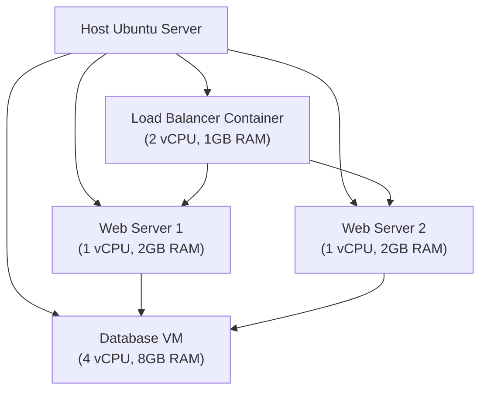

# Ubuntu Resource Allocation

## Introduction

Resource allocation is a critical aspect of Ubuntu virtualization that ensures virtual machines (VMs) and containers receive appropriate amounts of CPU power, memory, storage, and network bandwidth. Proper resource allocation helps maximize system performance, prevent resource contention, and ensure that all virtualized environments run efficiently.

In this guide, we'll explore the fundamentals of resource allocation in Ubuntu virtualization environments, covering the key concepts, tools, and best practices for beginners. By the end, you'll understand how to effectively distribute system resources to meet the requirements of your virtualized applications.

## Understanding System Resources

Before diving into allocation techniques, let's understand the four primary resources you'll need to manage:

1. **CPU** - Processing power that executes instructions
2. **Memory (RAM)** - Temporary storage for running applications
3. **Storage** - Persistent data storage on disks
4. **Network** - Bandwidth for data transfer between systems

Each virtual machine or container will consume a portion of these resources from the host system. Your goal is to allocate these resources efficiently to prevent waste while ensuring each virtualized environment has what it needs to function properly.

## Resource Allocation in KVM/QEMU

Ubuntu primarily uses KVM (Kernel-based Virtual Machine) with QEMU for full virtualization. Let's look at how to allocate resources in this environment.

### CPU Allocation

When creating a virtual machine, you specify how many virtual CPUs (vCPUs) to assign. This can be done through the command line or using Virtual Machine Manager.

```bash
# Create a new VM with 2 vCPUs using virt-install
sudo virt-install \
  --name ubuntu-vm \
  --ram 2048 \
  --vcpus 2 \
  --os-type linux \
  --os-variant ubuntu20.04 \
  --disk path=/var/lib/libvirt/images/ubuntu-vm.qcow2,size=20 \
  --cdrom /path/to/ubuntu-20.04-desktop-amd64.iso
```

You can also adjust CPU allocation for existing VMs:

```bash
# Modify CPU allocation for an existing VM
sudo virsh setvcpus ubuntu-vm 4 --config --maximum
sudo virsh setvcpus ubuntu-vm 4 --config
sudo virsh start ubuntu-vm
```

#### Advanced CPU Options

KVM provides options for fine-tuning CPU allocation:

- **CPU pinning**: Binding vCPUs to specific physical cores
- **CPU shares**: Assigning relative priorities
- **CPU quotas**: Limiting maximum CPU usage

Example of CPU pinning in a VM configuration:

```xml
<vcpu placement='static'>4</vcpu>
<cputune>
  <vcpupin vcpu='0' cpuset='0'/>
  <vcpupin vcpu='1' cpuset='1'/>
  <vcpupin vcpu='2' cpuset='2'/>
  <vcpupin vcpu='3' cpuset='3'/>
</cputune>
```

You can edit this configuration using:

```bash
sudo virsh edit ubuntu-vm
```

### Memory Allocation

Memory is allocated when creating a VM and can be adjusted later. The basic allocation is straightforward:

```bash
# Create a VM with 4GB RAM
sudo virt-install \
  --name ubuntu-vm2 \
  --ram 4096 \
  --vcpus 2 \
  --os-type linux \
  --os-variant ubuntu20.04 \
  --disk path=/var/lib/libvirt/images/ubuntu-vm2.qcow2,size=20 \
  --cdrom /path/to/ubuntu-20.04-desktop-amd64.iso
```

To modify memory for an existing VM:

```bash
# Change memory allocation to 8GB
sudo virsh setmaxmem ubuntu-vm 8G --config
sudo virsh setmem ubuntu-vm 8G --config
sudo virsh start ubuntu-vm
```

#### Memory Overcommitment

KVM allows memory overcommitment, where you allocate more total memory to VMs than physically available. This works through:

- **Ballooning**: Dynamically adjusting VM memory
- **KSM (Kernel Samepage Merging)**: Finding and merging identical memory pages

To enable KSM:

```bash
# Enable KSM
sudo systemctl enable ksmtuned
sudo systemctl start ksmtuned
```

### Storage Allocation

Storage can be allocated as:

1. **File-based storage**: Individual files representing virtual disks
2. **Block-based storage**: Direct access to physical or logical volumes
3. **Network storage**: Access to remote storage systems

Creating a file-based disk:

```bash
# Create a 30GB qcow2 disk image
sudo qemu-img create -f qcow2 /var/lib/libvirt/images/ubuntu-vm-data.qcow2 30G

# Attach the disk to a VM
sudo virsh attach-disk ubuntu-vm \
  --source /var/lib/libvirt/images/ubuntu-vm-data.qcow2 \
  --target vdb \
  --persistent
```

#### Storage Pools

Libvirt uses storage pools to manage collections of storage volumes:

```bash
# Create a storage pool
sudo virsh pool-define-as data_pool dir --target /mnt/storage_pool

# Build the pool directory
sudo virsh pool-build data_pool

# Start the pool
sudo virsh pool-start data_pool

# Enable autostart
sudo virsh pool-autostart data_pool

# Create a volume in the pool
sudo virsh vol-create-as data_pool vm_data 10G
```

### Network Allocation

Network resources include:

- **Network interfaces**: Connections to networks
- **Bandwidth**: Data transfer capacity

Creating a bridged network for VMs:

```bash
# Create a network bridge in /etc/netplan/01-netcfg.yaml
network:
  version: 2
  renderer: networkd
  ethernets:
    enp0s3:
      dhcp4: no
  bridges:
    br0:
      interfaces: [enp0s3]
      dhcp4: yes
```

Apply the configuration:

```bash
sudo netplan apply
```

Connecting a VM to the bridge:

```bash
# Edit VM configuration
sudo virsh edit ubuntu-vm
```

Modify the network interface section:

```xml
<interface type='bridge'>
  <source bridge='br0'/>
  <model type='virtio'/>
</interface>
```

## Resource Allocation in LXD Containers

LXD containers are more lightweight than VMs and have their own resource allocation mechanisms.

### Setting Resource Limits for Containers

Create a container with resource limits:

```bash
# Create an Ubuntu container with resource limits
lxc launch ubuntu:20.04 my-container -c limits.cpu=2 -c limits.memory=2GB

# Or for an existing container
lxc config set my-container limits.cpu=2
lxc config set my-container limits.memory=2GB
```

### CPU Allocation in LXD

Fine-tuning CPU allocation:

```bash
# Set CPU limits
lxc config set my-container limits.cpu=2
lxc config set my-container limits.cpu.allowance=50%
lxc config set my-container limits.cpu.priority=5
```

### Memory Allocation in LXD

Setting memory limits and priorities:

```bash
# Set memory limits
lxc config set my-container limits.memory=2GB
lxc config set my-container limits.memory.enforce=hard
```

### Disk Space Allocation in LXD

Managing storage for containers:

```bash
# Set disk space quota
lxc config device override my-container root size=10GB
```

### Network Allocation in LXD

Controlling network resources:

```bash
# Limit network bandwidth
lxc config device override my-container eth0 limits.ingress=100Mbit limits.egress=50Mbit
```

## Real-world Example: Web Server Farm

Let's build a practical example of a web server farm using resource allocation techniques:



Implementation:

1. Create the database VM with significant resources:

```bash
sudo virt-install \
  --name db-server \
  --ram 8192 \
  --vcpus 4 \
  --os-type linux \
  --os-variant ubuntu20.04 \
  --disk path=/var/lib/libvirt/images/db-server.qcow2,size=50 \
  --cdrom /path/to/ubuntu-20.04-server-amd64.iso
```

2. Create lightweight web server containers:

```bash
lxc launch ubuntu:20.04 web-server-1 -c limits.cpu=1 -c limits.memory=2GB
lxc launch ubuntu:20.04 web-server-2 -c limits.cpu=1 -c limits.memory=2GB
```

3. Create the load balancer container:

```bash
lxc launch ubuntu:20.04 load-balancer -c limits.cpu=2 -c limits.memory=1GB
```

4. Configure networking to allow communication between the systems:

```bash
# Create a private network for the infrastructure
lxc network create webfarm
lxc network attach webfarm load-balancer eth0
lxc network attach webfarm web-server-1 eth0
lxc network attach webfarm web-server-2 eth0

# Connect the VM to the same network
sudo virsh edit db-server
# Add the network configuration
```

This setup efficiently distributes resources based on the needs of each component:
- Database server: High CPU and memory for handling queries
- Web servers: Moderate resources as they're stateless
- Load balancer: Low memory but multiple CPUs for connection handling

## Monitoring Resource Usage

To ensure your resource allocation is appropriate, regularly monitor usage:

```bash
# Monitor VM resource usage
sudo virt-top

# Monitor container resource usage
lxc info my-container --show-resources
```

For comprehensive monitoring, install additional tools:

```bash
# Install Cockpit for web-based monitoring
sudo apt update
sudo apt install cockpit cockpit-machines

# Access Cockpit
# Open https://your-server-ip:9090 in a browser
```

## Best Practices for Resource Allocation

1. **Don't overcommit critical systems**: For production workloads, avoid excessive overcommitment
2. **Monitor and adjust**: Regularly check resource usage and adjust allocations
3. **Consider workload patterns**: Allocate based on peak and average usage patterns
4. **Use resource pools**: Group similar VMs to share resources effectively
5. **Implement resource quotas**: Set up quotas for users or projects
6. **Reserve host resources**: Keep some resources free for the host OS
7. **Use appropriate storage types**: Match storage performance to workload needs
8. **Implement QoS policies**: Set quality of service levels for different workloads

## Troubleshooting Resource Issues

Common issues and solutions:

### CPU Contention

**Symptoms**: High CPU wait times, sluggish VM performance
**Solution**: Reduce vCPU allocation or implement CPU pinning

```bash
# Check for CPU contention
sudo virt-top

# Implement CPU pinning
sudo virsh edit problematic-vm
# Add CPU pinning configuration
```

### Memory Swapping

**Symptoms**: Poor performance, high disk I/O
**Solution**: Increase RAM allocation or reduce memory overcommitment

```bash
# Check if VMs are swapping
sudo virsh dommemstat problematic-vm

# Increase memory allocation
sudo virsh setmem problematic-vm 4G --config --live
```

### Disk I/O Bottlenecks

**Symptoms**: Slow disk operations, high wait times
**Solution**: Move to faster storage or implement I/O limits

```bash
# Check disk I/O
sudo iotop

# Set I/O limits for a container
lxc config set io-heavy-container limits.disk.priority=5
```

## Summary

Effective resource allocation in Ubuntu virtualization environments requires understanding the available resources, the needs of your workloads, and the tools to configure and monitor these allocations. By properly allocating CPU, memory, storage, and network resources, you can create efficient, high-performing virtualized systems.

Remember these key points:
- Match resource allocation to workload requirements
- Monitor usage and adjust allocations as needed
- Use the appropriate virtualization technology for your use case
- Implement best practices to prevent resource contention
- Understand the trade-offs between overcommitment and performance

With these principles in mind, you can create well-balanced virtualization environments that make the most of your hardware resources.

## Exercises

1. Create a VM with 2 vCPUs pinned to specific physical cores and 4GB of RAM
2. Set up an LXD container with CPU and memory limits and monitor its resource usage
3. Create a small virtualized infrastructure with different resource allocations based on workload types
4. Compare the performance of file-based storage versus direct LVM storage for a VM
5. Implement and test memory overcommitment with KSM enabled

## Additional Resources

- [KVM Documentation](https://www.linux-kvm.org/page/Documents)
- [LXD Documentation](https://linuxcontainers.org/lxd/docs/master/)
- [Ubuntu Server Guide - Virtualization](https://ubuntu.com/server/docs)
- [Libvirt Wiki](https://wiki.libvirt.org/page/Main_Page)
- [QEMU Documentation](https://www.qemu.org/documentation/)