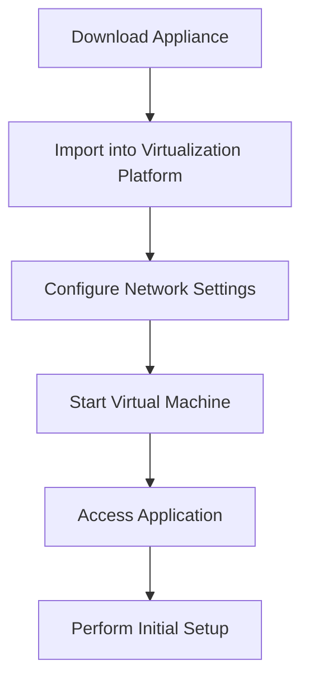

# Ubuntu Virtual Appliances

## Introduction

Ubuntu Virtual Appliances are pre-configured, ready-to-run virtual machine images built on the Ubuntu operating system. They package the operating system together with specific applications and configurations to create turnkey solutions that can be deployed instantly. These appliances drastically reduce the time and technical knowledge required to set up complex software environments, making them ideal for beginners and professionals alike.

Think of a virtual appliance as a complete computer system — with the operating system, applications, and all configurations already set up — that you can simply download and run in your virtualization environment. This eliminates the need for manual installation and configuration of individual software components.

## What Makes Ubuntu a Great Platform for Virtual Appliances

Ubuntu serves as an excellent foundation for virtual appliances due to several key features:

- **Stability**: As a long-term support (LTS) distribution, Ubuntu provides a stable base for applications.
- **Security**: Regular security updates help keep appliances protected.
- **Lightweight options**: Ubuntu Server and minimal installations reduce resource overhead.
- **Wide compatibility**: Ubuntu works well across various virtualization platforms.
- **Large ecosystem**: The extensive package repository makes it easy to include a variety of software.

## Types of Ubuntu Virtual Appliances

### Server Appliances

These focus on running specific server functions with minimal resource requirements.

- Web servers (Apache, Nginx)
- Database servers (MySQL, PostgreSQL, MongoDB)
- File servers (Samba, NFS)
- Mail servers (Postfix, Dovecot)

### Application Appliances

These deliver specific applications ready for immediate use.

- Content Management Systems (WordPress, Drupal, Joomla)
- Customer Relationship Management (SuiteCRM)
- Enterprise Resource Planning (ERPNext)
- Development environments (LAMP stack, MEAN stack)

### Infrastructure Appliances

These provide core network infrastructure services.

- DNS servers
- DHCP servers
- Firewall/routing appliances
- Monitoring systems (Nagios, Zabbix)

## Where to Find Ubuntu Virtual Appliances

### Ubuntu Cloud Images

Official Ubuntu Cloud Images are minimal Ubuntu server installations, perfect as a base for creating your own appliances.

```bash
# Download the latest Ubuntu Server cloud image
wget https://cloud-images.ubuntu.com/releases/22.04/release/ubuntu-22.04-server-cloudimg-amd64.img

# Output
--2025-03-13 10:15:20--  https://cloud-images.ubuntu.com/releases/22.04/release/ubuntu-22.04-server-cloudimg-amd64.img
Resolving cloud-images.ubuntu.com... 185.125.190.80, 2001:67c:1562::25
Connecting to cloud-images.ubuntu.com|185.125.190.80|:443... connected.
HTTP request sent, awaiting response... 200 OK
Length: 2210398208 (2.1G) [application/octet-stream]
Saving to: 'ubuntu-22.04-server-cloudimg-amd64.img'

ubuntu-22.04-server-cloudimg-amd64.img  100%[============================================================================>]   2.06G  10.2MB/s    in 3m 29s  

2025-03-13 10:18:51 (10.1 MB/s) - 'ubuntu-22.04-server-cloudimg-amd64.img' saved [2210398208/2210398208]
```

### Turnkey Linux

Turnkey Linux offers over 100 ready-to-use Ubuntu-based appliances for various applications.

Visit: TurnKey Linux Library (turnkeylinux.org)

### Bitnami

Bitnami provides numerous application stacks built on Ubuntu.

Visit: Bitnami Application Catalog (bitnami.com)

## How to Use Ubuntu Virtual Appliances

The process for using an Ubuntu Virtual Appliance typically follows these steps:



Let's go through a practical example of importing and using a virtual appliance.

### Example: Importing an Ubuntu Virtual Appliance in VirtualBox

1. **Download a Virtual Appliance**

   First, download an OVA (Open Virtualization Appliance) file. For this example, let's assume we've downloaded `ubuntu-wordpress-appliance.ova`.

2. **Import the Appliance**

   ```bash
   # Command line import (VBoxManage is VirtualBox's command-line interface)
   VBoxManage import ubuntu-wordpress-appliance.ova

   # Output
   Interpreting /home/user/Downloads/ubuntu-wordpress-appliance.ova...
   OK.
   Disks:  vmdisk1 9122181120 -1 http://www.vmware.com/interfaces/specifications/vmdk.html#streamOptimized ubuntu-wordpress-disk001.vmdk -1 -1
   Virtual system 0:
    0: Suggested OS type: "Ubuntu_64"
       (change with "--vsys 0 --ostype <type>")
    1: Suggested VM name "Ubuntu WordPress"
       (change with "--vsys 0 --vmname <name>")
   ...
   Successfully imported the appliance.
   ```

   Alternatively, you can use the VirtualBox GUI:
   - Open VirtualBox
   - Click File > Import Appliance
   - Select the OVA file and follow the wizard

3. **Configure Network Settings**

   You'll typically need to choose between:
   - NAT: Simple but limited external access
   - Bridged: Appears as a separate machine on your network
   - Host-only: Accessible only from the host machine

4. **Start the Virtual Machine**

   ```bash
   # Start the VM headless (without GUI)
   VBoxManage startvm "Ubuntu WordPress" --type headless

   # Output
   Waiting for VM "Ubuntu WordPress" to power on...
   VM "Ubuntu WordPress" has been successfully started.
   ```

5. **Access the Appliance**

   Most appliances will display access information during boot. Typically, you'll access the application through:
   - Web interface (http://[VM-IP-ADDRESS])
   - SSH (ssh username@[VM-IP-ADDRESS])

   ```bash
   # Find the IP address of the VM
   ssh ubuntu@192.168.1.100
   
   # Output
   The authenticity of host '192.168.1.100 (192.168.1.100)' can't be established.
   ED25519 key fingerprint is SHA256:AbCdEfGhIjKlMnOpQrStUvWxYz0123456789.
   This key is not known by any other names
   Are you sure you want to continue connecting (yes/no/[fingerprint])? yes
   Warning: Permanently added '192.168.1.100' (ED25519) to the list of known hosts.
   ubuntu@192.168.1.100's password: 
   
   Welcome to Ubuntu 22.04.3 LTS (GNU/Linux 5.15.0-92-generic x86_64)
   
    * Documentation:  https://help.ubuntu.com
    * Management:     https://landscape.canonical.com
    * Support:        https://ubuntu.com/advantage
   
   WordPress appliance information:
   Web interface available at: http://192.168.1.100/
   Admin login: admin
   Admin password: See /home/ubuntu/wordpress_password.txt
   ```

## Creating Your Own Ubuntu Virtual Appliance

Creating your own virtual appliance allows you to package specific software configurations for easy deployment. Here's a basic workflow:

### Step 1: Set Up the Base System

Start with a minimal Ubuntu installation:

```bash
# Download Ubuntu Server ISO
wget https://releases.ubuntu.com/22.04/ubuntu-22.04.3-live-server-amd64.iso

# Create a new VM in VirtualBox
VBoxManage createvm --name "MyCustomAppliance" --ostype Ubuntu_64 --register
VBoxManage modifyvm "MyCustomAppliance" --memory 2048 --cpus 2
VBoxManage createhd --filename MyCustomAppliance.vdi --size 20000
VBoxManage storagectl "MyCustomAppliance" --name "SATA Controller" --add sata
VBoxManage storageattach "MyCustomAppliance" --storagectl "SATA Controller" --port 0 --device 0 --type hdd --medium MyCustomAppliance.vdi
VBoxManage storageattach "MyCustomAppliance" --storagectl "SATA Controller" --port 1 --device 0 --type dvddrive --medium ubuntu-22.04.3-live-server-amd64.iso
```

### Step 2: Install and Configure Software

Install and configure the software packages your appliance will provide:

```bash
# Example: Installing a LAMP stack
sudo apt update
sudo apt install -y apache2 mysql-server php libapache2-mod-php php-mysql

# Configure services to start automatically
sudo systemctl enable apache2
sudo systemctl enable mysql

# Secure MySQL installation
sudo mysql_secure_installation
```

### Step 3: Clean Up Before Export

Remove unnecessary files and prepare the system for distribution:

```bash
# Clear package cache
sudo apt clean

# Remove log files
sudo find /var/log -type f -exec truncate -s 0 {} \;

# Remove bash history
cat /dev/null > ~/.bash_history
history -c

# Shutdown the VM
sudo shutdown -h now
```

### Step 4: Export as OVA

```bash
# Export the VM as an OVA file
VBoxManage export "MyCustomAppliance" -o MyCustomAppliance.ova

# Output
Exporting VM "MyCustomAppliance"...
Successfully exported 1 machine(s).
```

## Best Practices for Using Ubuntu Virtual Appliances

### Security Considerations

1. **Update Immediately After Deployment**
   ```bash
   sudo apt update && sudo apt upgrade -y
   ```

2. **Change Default Passwords**
   ```bash
   # Example: Changing the user password
   passwd
   
   # Example: Changing MySQL root password
   sudo mysql -e "ALTER USER 'root'@'localhost' IDENTIFIED WITH mysql_native_password BY 'new_secure_password';"
   ```

3. **Enable Automatic Security Updates**
   ```bash
   sudo apt install -y unattended-upgrades
   sudo dpkg-reconfigure -plow unattended-upgrades
   ```

### Performance Tuning

1. **Allocate Appropriate Resources**
   - Match RAM and CPU to the appliance requirements
   - Too few resources: poor performance
   - Too many: wasted host resources

2. **Use Proper Storage Configuration**
   - Consider using SSD storage for better performance
   - Enable disk caching if your hypervisor supports it

3. **Enable VM Tools**
   ```bash
   # For VirtualBox Guest Additions
   sudo apt install -y virtualbox-guest-additions-iso
   
   # For VMware Tools
   sudo apt install -y open-vm-tools
   ```

## Real-World Examples and Use Cases

### Case Study 1: Development Environment

A software team uses an Ubuntu LAMP stack appliance to ensure all developers have identical environments:

```bash
# Clone the development appliance
VBoxManage clonevm "Dev-LAMP-Template" --name "Dev-LAMP-John" --register

# Developer starts the environment
VBoxManage startvm "Dev-LAMP-John"

# Automatically mounts project directory from host
# (These commands would be in the VM's startup script)
mkdir -p /var/www/html/project
mount -t vboxsf project_share /var/www/html/project
```

### Case Study 2: Quick Deployment of Network Services

An IT administrator needs to quickly deploy a temporary DNS server:

```bash
# Import the DNS server appliance
VBoxManage import ubuntu-bind9-dns-appliance.ova

# Configure with specific settings
VBoxManage modifyvm "Ubuntu-BIND9-DNS" --nic1 bridged --bridgeadapter1 eth0

# Start the server
VBoxManage startvm "Ubuntu-BIND9-DNS" --type headless

# The DNS server is immediately available on the network
# without manual installation and configuration
```

### Case Study 3: Educational Environments

A programming instructor uses Ubuntu appliances to provide pre-configured environments to students:

```bash
# Students download a single file
# (command executed on student machines)
wget https://example.edu/appliances/python-django-course.ova

# Import and run
VBoxManage import python-django-course.ova
VBoxManage startvm "Python Django Course"

# Students can immediately start learning Django
# without dealing with installation issues
```

## Troubleshooting Common Issues

### Network Connectivity Problems

If your appliance can't connect to the network:

```bash
# Check network interfaces
ip a

# Restart networking
sudo systemctl restart systemd-networkd

# Verify connectivity
ping -c 4 google.com
```

### Performance Issues

If your appliance is running slowly:

```bash
# Check resource usage
top

# Look for high CPU or memory usage
# Output will show processes consuming resources

# Check disk space
df -h

# Output
Filesystem      Size  Used Avail Use% Mounted on
/dev/sda1        20G  4.2G   15G  23% /
```

### Boot Failures

If your appliance won't boot:

1. Check the VM settings to ensure compatibility with your hypervisor
2. Try booting in recovery mode if available
3. Check the appliance documentation for minimum requirements

## Summary

Ubuntu Virtual Appliances provide an efficient way to deploy pre-configured software environments. They offer numerous advantages:

- **Time-saving**: Eliminate manual installation and configuration steps
- **Consistency**: Ensure identical environments across deployments
- **Accessibility**: Make complex software stacks available to users of all skill levels
- **Isolation**: Keep applications contained within their own virtual environments

Whether you're using ready-made appliances or creating your own, these pre-packaged virtual machines simplify the deployment of Ubuntu-based software stacks and services.

## Additional Resources

- Ubuntu Cloud Images: https://cloud-images.ubuntu.com/
- Turnkey Linux: https://www.turnkeylinux.org/
- VirtualBox Documentation: https://www.virtualbox.org/wiki/Documentation

## Exercises

1. Download and deploy an Ubuntu LAMP stack virtual appliance.
2. Create a custom Ubuntu virtual appliance with your favorite development tools.
3. Configure network settings to make your virtual appliance accessible from other machines on your network.
4. Practice exporting and importing your appliance between different computers.
5. Install and configure a specific web application (like WordPress) on a base Ubuntu appliance.