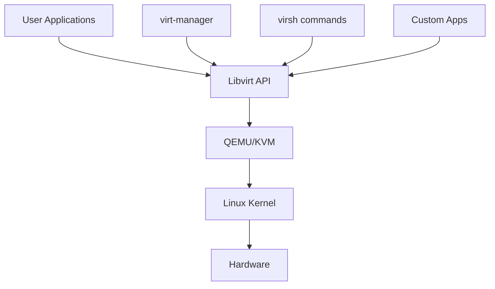

# Ubuntu KVM

## Introduction

KVM (Kernel-based Virtual Machine) is a full virtualization solution for Linux that turns your Ubuntu system into a hypervisor, allowing you to run multiple, isolated virtual machines (VMs) on a single physical server. KVM is built directly into the Linux kernel, which makes it efficient, stable, and high-performing compared to other virtualization technologies.

In this guide, we'll explore how to set up and use KVM on Ubuntu, providing you with the skills to create and manage virtual machines for development, testing, or production environments.

## Prerequisites

Before we begin, make sure your system meets these requirements:

- Ubuntu 20.04 LTS or newer
- A 64-bit processor with virtualization extensions (Intel VT-x or AMD-V)
- At least 4GB of RAM (8GB or more recommended)
- Sufficient disk space for virtual machines

## Checking Hardware Compatibility

First, let's verify that your CPU supports hardware virtualization:

```bash
egrep -c '(vmx|svm)' /proc/cpuinfo
```

If the output is greater than 0, your CPU supports virtualization.

You can also check if KVM virtualization is usable on your system:

```bash
kvm-ok
```

Output if KVM is supported:

```
INFO: /dev/kvm exists
KVM acceleration can be used
```

## Installing KVM and Required Packages

Let's install KVM and the necessary tools:

```bash
sudo apt update
sudo apt install -y qemu-kvm libvirt-daemon-system libvirt-clients bridge-utils virtinst virt-manager
```

Here's what each package provides:

- `qemu-kvm`: The main KVM package
- `libvirt-daemon-system`: System daemon for managing virtual machines
- `libvirt-clients`: Command-line utilities for managing VMs
- `bridge-utils`: Tools for configuring network bridges
- `virtinst`: Tools for installing virtual machines
- `virt-manager`: A GUI for managing virtual machines

## Verifying the Installation

After installation, let's verify that the libvirt daemon is running:

```bash
sudo systemctl status libvirtd
```

You should see output indicating that the service is active (running).

## Setting Up User Permissions

To manage VMs without root privileges, add your user to the libvirt and kvm groups:

```bash
sudo usermod -aG libvirt $USER
sudo usermod -aG kvm $USER
```

Log out and log back in for the changes to take effect.

## Creating Your First Virtual Machine

### Using the Command Line

Let's create a virtual machine using the command line:

```bash
sudo virt-install \
  --name ubuntu20.04 \
  --ram 2048 \
  --disk path=/var/lib/libvirt/images/ubuntu20.04.qcow2,size=20 \
  --vcpus 2 \
  --os-type linux \
  --os-variant ubuntu20.04 \
  --network bridge=virbr0 \
  --graphics none \
  --console pty,target_type=serial \
  --location 'http://archive.ubuntu.com/ubuntu/dists/focal/main/installer-amd64/' \
  --extra-args 'console=ttyS0,115200n8 serial'
```

This command:
- Creates a VM named "ubuntu20.04"
- Allocates 2GB of RAM and 2 virtual CPUs
- Creates a 20GB virtual disk
- Uses the Ubuntu 20.04 installer
- Sets up networking with the default virtual bridge
- Configures a serial console instead of a graphical one

### Using Virt-Manager (GUI)

For beginners, virt-manager provides a more user-friendly approach:

1. Start virt-manager:
   ```bash
   virt-manager
   ```

2. Click on the "Create a new virtual machine" button (the computer icon with a plus sign).

3. Select "Local install media" and click "Forward".

4. Browse to your ISO file or enter its location, then click "Forward".

5. Set the RAM and CPU allocation, then click "Forward".

6. Set the disk size, then click "Forward".

7. Give your VM a name, check "Customize configuration before install" if you want to adjust settings, and click "Finish".

8. If you chose to customize, make your changes and click "Begin Installation".

## Managing Virtual Machines

KVM provides several tools for managing virtual machines:

### Listing Virtual Machines

```bash
virsh list --all
```

Output example:
```
 Id   Name          State
-----------------------------
 1    ubuntu20.04   running
 -    debian11      shut off
```

### Starting a Virtual Machine

```bash
virsh start ubuntu20.04
```

### Stopping a Virtual Machine

Graceful shutdown:
```bash
virsh shutdown ubuntu20.04
```

Forced shutdown:
```bash
virsh destroy ubuntu20.04
```

### Connecting to a Virtual Machine Console

```bash
virsh console ubuntu20.04
```

To exit the console, press `Ctrl+]`.

### Deleting a Virtual Machine

```bash
virsh undefine ubuntu20.04 --remove-all-storage
```

## Understanding KVM Architecture

KVM has a modular architecture that combines the Linux kernel with QEMU for hardware emulation:



- **Linux Kernel**: Provides the KVM module which enables processor virtualization features
- **QEMU**: Emulates hardware devices (disk, network, etc.)
- **Libvirt**: API and daemon that provides a stable management layer
- **Management Tools**: virt-manager, virsh, and other tools that interact with libvirt

## Working with Storage Pools and Volumes

KVM uses storage pools to organize virtual machine disks:

### Listing Storage Pools

```bash
virsh pool-list
```

### Creating a New Storage Pool

```bash
sudo mkdir -p /kvm/images
sudo virsh pool-define-as --name kvm-pool --type dir --target /kvm/images
sudo virsh pool-build kvm-pool
sudo virsh pool-start kvm-pool
sudo virsh pool-autostart kvm-pool
```

### Creating a New Volume (Virtual Disk)

```bash
virsh vol-create-as kvm-pool newvm.qcow2 20G --format qcow2
```

## Networking in KVM

KVM provides several networking modes:

1. **NAT** (default): VMs can access external networks but aren't directly accessible from outside
2. **Bridged**: VMs appear as separate machines on the physical network
3. **Isolated**: VMs can communicate with each other but not with the host or external networks
4. **Routed**: Similar to bridged networking but with more control

### Setting Up Bridge Networking

Create a file named `/etc/netplan/01-netcfg.yaml`:

```yaml
network:
  version: 2
  renderer: networkd
  ethernets:
    enp0s3:
      dhcp4: no
  bridges:
    br0:
      interfaces: [enp0s3]
      dhcp4: yes
```

Apply the configuration:

```bash
sudo netplan apply
```

Now you can create VMs that connect directly to your physical network:

```bash
virt-install \
  --name bridged-vm \
  --ram 2048 \
  --disk path=/var/lib/libvirt/images/bridged-vm.qcow2,size=20 \
  --vcpus 2 \
  --os-type linux \
  --os-variant ubuntu20.04 \
  --network bridge=br0 \
  --graphics spice \
  --location 'http://archive.ubuntu.com/ubuntu/dists/focal/main/installer-amd64/'
```

## Performance Tuning

To optimize KVM performance:

### CPU Pinning

Assign specific physical CPU cores to virtual machines:

```bash
virsh vcpupin ubuntu20.04 0 2
virsh vcpupin ubuntu20.04 1 3
```

This example pins vCPU 0 to physical core 2 and vCPU 1 to physical core 3.

### Memory Tuning

Enable huge pages for better memory performance:

```bash
echo "vm.nr_hugepages = 1024" | sudo tee -a /etc/sysctl.conf
sudo sysctl -p
```

Then edit your VM configuration:

```bash
virsh edit ubuntu20.04
```

Add this inside the `<memoryBacking>` section:

```xml
<memoryBacking>
  <hugepages/>
</memoryBacking>
```

## Real-World Use Cases

### Development and Testing Environments

KVM is perfect for creating isolated development environments:

```bash
# Create a development VM template
virt-install \
  --name dev-template \
  --ram 4096 \
  --disk path=/var/lib/libvirt/images/dev-template.qcow2,size=30 \
  --vcpus 4 \
  --os-type linux \
  --os-variant ubuntu20.04 \
  --network bridge=virbr0 \
  --graphics spice \
  --location 'http://archive.ubuntu.com/ubuntu/dists/focal/main/installer-amd64/'

# After installing and configuring the template
virsh shutdown dev-template

# Clone it for different projects
virt-clone --original dev-template --name project1-dev --auto-clone
virt-clone --original dev-template --name project2-dev --auto-clone
```

### Server Consolidation

Run multiple server workloads on a single physical machine:

```bash
# Web server VM
virt-install \
  --name webserver \
  --ram 2048 \
  --disk path=/var/lib/libvirt/images/webserver.qcow2,size=20 \
  --vcpus 2 \
  --os-type linux \
  --os-variant ubuntu20.04 \
  --network bridge=virbr0 \
  --graphics spice \
  --location 'http://archive.ubuntu.com/ubuntu/dists/focal/main/installer-amd64/'

# Database server VM
virt-install \
  --name dbserver \
  --ram 4096 \
  --disk path=/var/lib/libvirt/images/dbserver.qcow2,size=50 \
  --vcpus 4 \
  --os-type linux \
  --os-variant ubuntu20.04 \
  --network bridge=virbr0 \
  --graphics spice \
  --location 'http://archive.ubuntu.com/ubuntu/dists/focal/main/installer-amd64/'
```

### Learning and Education

KVM is great for creating sandboxes to learn new technologies:

```bash
# Create lightweight VM for learning containers
virt-install \
  --name container-lab \
  --ram 2048 \
  --disk path=/var/lib/libvirt/images/container-lab.qcow2,size=20 \
  --vcpus 2 \
  --os-type linux \
  --os-variant ubuntu20.04 \
  --network bridge=virbr0 \
  --graphics spice \
  --location 'http://archive.ubuntu.com/ubuntu/dists/focal/main/installer-amd64/'
```

## Troubleshooting KVM

### Common Issues and Solutions

#### VM Won't Start

If a VM fails to start, check the error message:

```bash
virsh start ubuntu20.04 --verbose
```

Check libvirtd status:

```bash
sudo systemctl status libvirtd
```

#### Networking Problems

If VMs can't connect to the network:

```bash
sudo systemctl restart libvirtd
sudo virsh net-start default
```

Check if the default network is active:

```bash
virsh net-list --all
```

If it's not active, start it:

```bash
virsh net-start default
virsh net-autostart default
```

#### Performance Issues

Check VM resource usage:

```bash
virt-top
```

## Advanced Topics

### Backing Up Virtual Machines

Create a backup of a VM:

```bash
# Shut down the VM first
virsh shutdown ubuntu20.04
# Wait for it to shut down completely

# Create the backup
sudo mkdir -p /backup/vms
sudo virsh dumpxml ubuntu20.04 > /backup/vms/ubuntu20.04.xml
sudo cp /var/lib/libvirt/images/ubuntu20.04.qcow2 /backup/vms/
```

Restore from backup:

```bash
sudo cp /backup/vms/ubuntu20.04.qcow2 /var/lib/libvirt/images/
sudo virsh define /backup/vms/ubuntu20.04.xml
```

### Migrating Virtual Machines

To migrate a VM to another KVM host:

```bash
# On the source host
virsh dumpxml ubuntu20.04 > ubuntu20.04.xml
scp ubuntu20.04.xml user@destination:/tmp/
scp /var/lib/libvirt/images/ubuntu20.04.qcow2 user@destination:/var/lib/libvirt/images/

# On the destination host
virsh define /tmp/ubuntu20.04.xml
```

### Snapshotting

Create a snapshot of a running VM:

```bash
virsh snapshot-create-as --domain ubuntu20.04 --name "snapshot1" --description "Before software update"
```

List snapshots:

```bash
virsh snapshot-list ubuntu20.04
```

Revert to a snapshot:

```bash
virsh snapshot-revert --domain ubuntu20.04 --snapshotname "snapshot1"
```

## Summary

In this guide, we've covered:

- Setting up KVM on Ubuntu
- Creating and managing virtual machines
- Working with storage and networking
- Performance tuning and optimization
- Real-world applications
- Troubleshooting and advanced topics

KVM provides a powerful, flexible virtualization platform that's perfect for development, testing, and production environments. By using KVM on Ubuntu, you can efficiently manage multiple virtual machines on a single physical server, saving resources while maintaining isolation between workloads.

## Additional Resources

- [KVM Documentation](https://www.linux-kvm.org/page/Documents)
- [Ubuntu Server Guide: Virtualization](https://ubuntu.com/server/docs/virtualization-virt-tools)
- [Libvirt Wiki](https://wiki.libvirt.org/page/Main_Page)

## Exercises

1. Create a VM with 1GB RAM and 1 vCPU running Ubuntu Server.
2. Set up a network bridge and connect a VM directly to your physical network.
3. Create a VM template and clone it to create three identical VMs.
4. Set up CPU pinning for a VM to improve performance.
5. Create a snapshot, make some changes to the VM, then revert to the snapshot.