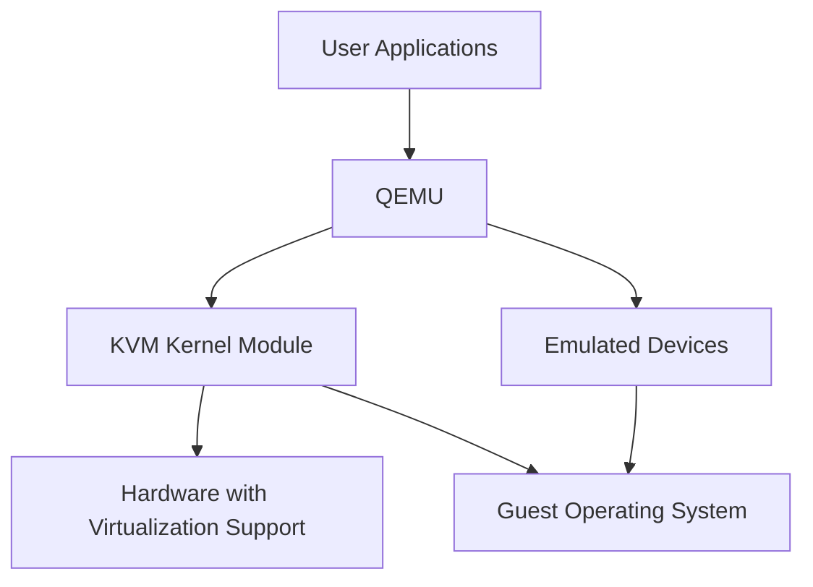

# Ubuntu QEMU

## Introduction

QEMU (Quick EMUlator) is a powerful open-source machine emulator and virtualizer that allows you to run operating systems and programs made for one machine on a different machine. When used with KVM (Kernel-based Virtual Machine), QEMU can achieve near-native performance by executing guest code directly on the host CPU.

In this guide, we'll explore how to use QEMU on Ubuntu to create and manage virtual machines. Whether you're looking to test different operating systems, develop cross-platform applications, or isolate environments for security purposes, QEMU provides a flexible solution for virtualization needs.

## Why Use QEMU on Ubuntu?

- **Free and open-source**: Unlike some proprietary virtualization solutions, QEMU is completely free and open-source.
- **Versatility**: QEMU can emulate different CPU architectures (x86, ARM, RISC-V, etc.).
- **Performance**: When combined with KVM, QEMU offers near-native performance.
- **Integration**: Works well with the Linux ecosystem and Ubuntu specifically.
- **Lightweight**: Requires fewer resources compared to full virtualization platforms.

## Prerequisites

Before getting started, ensure you have:

- Ubuntu 20.04 or newer
- Administrator (sudo) privileges
- Processor with virtualization support (Intel VT-x or AMD-V)
- Sufficient RAM and disk space for virtual machines

## Installation

Let's begin by installing QEMU and related packages:

```bash
sudo apt update
sudo apt install qemu-kvm libvirt-daemon-system libvirt-clients bridge-utils virtinst virt-manager
```

This command installs:
- `qemu-kvm`: The main QEMU package with KVM support
- `libvirt-daemon-system`: The libvirt daemon run as a system service
- `libvirt-clients`: Client utilities for libvirt
- `bridge-utils`: Tools for configuring network bridges
- `virtinst`: Utilities for creating virtual machines
- `virt-manager`: A GUI for managing virtual machines

### Verify Installation

To confirm your installation and check if your system supports KVM acceleration:

```bash
kvm-ok
```

You should see output similar to:

```
INFO: /dev/kvm exists
KVM acceleration can be used
```

## Basic QEMU Usage

### Creating a Virtual Machine

Let's create a basic virtual machine using QEMU from the command line:

#### 1. Create a virtual disk

First, create a virtual disk where the guest OS will be installed:

```bash
qemu-img create -f qcow2 ubuntu-vm.qcow2 20G
```

This creates a 20GB disk in QCOW2 format (QEMU Copy-On-Write version 2), which efficiently uses space by allocating storage only as needed.

#### 2. Boot from an ISO to install an OS

To install an operating system, you'll need to boot from an installation ISO:

```bash
qemu-system-x86_64 \
  -enable-kvm \
  -m 2048 \
  -smp 2 \
  -drive file=ubuntu-vm.qcow2,format=qcow2 \
  -cdrom ubuntu-22.04-desktop-amd64.iso \
  -display gtk
```

This command:
- Enables KVM acceleration (`-enable-kvm`)
- Allocates 2GB of RAM (`-m 2048`)
- Assigns 2 CPU cores (`-smp 2`)
- Uses our previously created disk (`-drive file=ubuntu-vm.qcow2,format=qcow2`)
- Boots from the Ubuntu ISO (`-cdrom ubuntu-22.04-desktop-amd64.iso`)
- Opens a GTK window to display the VM (`-display gtk`)

After running this command, a window will open showing the Ubuntu installation process. Follow the on-screen instructions to install the operating system.

#### 3. Running the VM after installation

Once installation is complete, you can run the VM without the ISO:

```bash
qemu-system-x86_64 \
  -enable-kvm \
  -m 2048 \
  -smp 2 \
  -drive file=ubuntu-vm.qcow2,format=qcow2 \
  -display gtk
```

## Advanced QEMU Options

QEMU provides many options to customize your virtual machines. Here are some useful ones:

### Networking

By default, QEMU uses user-mode networking. To enable more advanced networking:

```bash
qemu-system-x86_64 \
  -enable-kvm \
  -m 2048 \
  -drive file=ubuntu-vm.qcow2,format=qcow2 \
  -netdev user,id=network0 \
  -device e1000,netdev=network0 \
  -display gtk
```

This creates a virtual network interface using the e1000 driver.

### Shared Folders

To share folders between the host and guest:

```bash
qemu-system-x86_64 \
  -enable-kvm \
  -m 2048 \
  -drive file=ubuntu-vm.qcow2,format=qcow2 \
  -fsdev local,id=shared_folder,path=/path/to/shared/folder,security_model=mapped \
  -device virtio-9p-pci,fsdev=shared_folder,mount_tag=shared \
  -display gtk
```

Inside the guest, you can mount the shared folder with:

```bash
mkdir -p ~/shared_folder
mount -t 9p -o trans=virtio shared ~/shared_folder
```

### USB Passthrough

To pass a USB device to the VM:

```bash
qemu-system-x86_64 \
  -enable-kvm \
  -m 2048 \
  -drive file=ubuntu-vm.qcow2,format=qcow2 \
  -usb -device usb-host,vendorid=0x1234,productid=0x5678 \
  -display gtk
```

Replace `0x1234` and `0x5678` with your device's vendor and product IDs, which you can find using `lsusb`.

## Using QEMU with Libvirt

Libvirt provides a more user-friendly way to manage QEMU VMs through tools like `virt-manager` and `virsh`.

### Virtual Machine Manager (virt-manager)

Virtual Machine Manager offers a GUI for creating and managing virtual machines:

1. Launch virt-manager:
```bash
sudo virt-manager
```

2. Click "Create a new virtual machine" and follow the wizard to create a VM.

### Managing VMs with virsh

The `virsh` command-line tool lets you manage VMs from the terminal:

```bash
# List all VMs
virsh list --all

# Start a VM
virsh start ubuntu-vm

# Shut down a VM
virsh shutdown ubuntu-vm

# Force stop a VM
virsh destroy ubuntu-vm

# Delete a VM (removes the VM but not its disk image)
virsh undefine ubuntu-vm
```

## QEMU and KVM Architecture

The relationship between QEMU, KVM, and your hardware can be visualized as follows:



QEMU provides device emulation and works with the KVM kernel module to enable hardware acceleration, resulting in efficient virtualization.

## Example: Creating a Headless VM Server

Let's create a practical example of a headless Ubuntu server VM that automatically starts at boot and can be accessed via SSH:

1. Create the disk:
```bash
qemu-img create -f qcow2 ubuntu-server.qcow2 15G
```

2. Create a VM definition using virsh:
```bash
virt-install \
  --name ubuntu-server \
  --ram 2048 \
  --disk path=./ubuntu-server.qcow2,size=15 \
  --vcpus 2 \
  --os-type linux \
  --os-variant ubuntu20.04 \
  --network bridge=virbr0 \
  --graphics none \
  --console pty,target_type=serial \
  --location 'http://archive.ubuntu.com/ubuntu/dists/focal/main/installer-amd64/' \
  --extra-args 'console=ttyS0,115200n8 serial'
```

3. After installation, you can start, stop, and configure the VM to start at boot:
```bash
# Start the VM
virsh start ubuntu-server

# Configure autostart
virsh autostart ubuntu-server

# Get the VM's IP address
virsh domifaddr ubuntu-server

# Connect via SSH
ssh username@vm_ip_address
```

## Performance Tuning

To get the best performance from your QEMU/KVM virtual machines:

### CPU Pinning

Assign specific host CPU cores to your VM:

```bash
qemu-system-x86_64 \
  -enable-kvm \
  -m 2048 \
  -smp 2,cores=2,threads=1,sockets=1 \
  -cpu host \
  -drive file=ubuntu-vm.qcow2,format=qcow2 \
  -display gtk
```

The `-cpu host` option passes your host CPU model to the guest for better performance.

### Memory Optimization

Enable huge pages for better memory performance:

```bash
echo 1024 > /proc/sys/vm/nr_hugepages

qemu-system-x86_64 \
  -enable-kvm \
  -m 2048 \
  -mem-path /dev/hugepages \
  -drive file=ubuntu-vm.qcow2,format=qcow2 \
  -display gtk
```

### Disk I/O Performance

Use virtio drivers for better disk performance:

```bash
qemu-system-x86_64 \
  -enable-kvm \
  -m 2048 \
  -drive file=ubuntu-vm.qcow2,format=qcow2,if=virtio \
  -display gtk
```

## Troubleshooting Common Issues

### Virtualization Not Enabled in BIOS/UEFI

If `kvm-ok` reports that KVM acceleration cannot be used, you may need to enable virtualization in your BIOS/UEFI settings.

Solution: Restart your computer, enter the BIOS/UEFI settings, and enable options like "Intel VT-x," "AMD-V," "Virtualization Technology," or "SVM Mode."

### Permission Denied Errors

If you see permission errors when trying to use QEMU:

Solution: Ensure your user is in the proper groups:

```bash
sudo usermod -aG kvm,libvirt $USER
```

Then log out and log back in for the changes to take effect.

### VM Performance Issues

If your VM is running slowly:

Solutions:
- Ensure KVM acceleration is enabled with `-enable-kvm`
- Add more RAM with `-m` option
- Use virtio drivers for disks and network
- Check host system load and available resources

## Summary

QEMU with KVM on Ubuntu provides a powerful and flexible virtualization solution for running multiple operating systems on one machine. In this guide, we've covered:

- Installing and configuring QEMU/KVM on Ubuntu
- Creating and managing virtual machines
- Advanced options for networking, storage, and device passthrough
- Using libvirt tools like virt-manager and virsh
- Performance tuning techniques
- Troubleshooting common issues

Whether you're a developer testing applications across different environments, a system administrator setting up isolated servers, or simply an enthusiast exploring different operating systems, QEMU offers the tools you need for virtualization on Ubuntu.

## Additional Resources

To continue learning about QEMU on Ubuntu:

- Official QEMU documentation: [QEMU wiki](https://wiki.qemu.org/Documentation)
- KVM documentation: [KVM website](https://www.linux-kvm.org/page/Main_Page)
- Ubuntu virtualization guide: [Ubuntu documentation](https://ubuntu.com/server/docs/virtualization-kvm)

## Exercises

1. Create a Windows 10 virtual machine using QEMU and experiment with different virtual hardware configurations.
2. Set up a network of multiple VMs that can communicate with each other.
3. Create a script that automatically backs up your VM disk images.
4. Experiment with different QEMU disk formats (raw, qcow2, vdi, vmdk) and compare their performance.
5. Try creating VMs with different architectures (like ARM) and observe how emulation differs from virtualization.