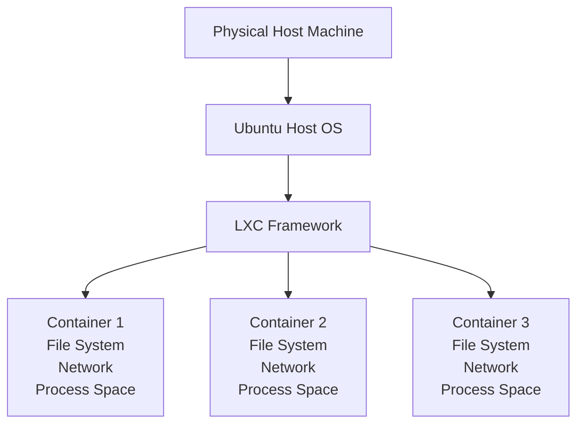

# Ubuntu LXC Containers

## Introduction

Linux Containers (LXC) represent a powerful virtualization method that combines the efficiency of containers with the security features of traditional virtual machines. Unlike full virtualization solutions that emulate entire hardware environments, LXC operates at the operating system level, allowing multiple isolated Linux systems (containers) to run on a single host with minimal overhead.

In this guide, we'll explore how to use LXC containers specifically on Ubuntu, one of the most popular Linux distributions. You'll learn how to set up, manage, and leverage these containers for your development and production environments.

## What Are LXC Containers?

LXC stands for "Linux Containers." They are lightweight virtualization technologies that enable running multiple isolated Linux systems (containers) on a single host without the overhead of full virtual machines.



### Key Characteristics of LXC Containers

- **OS-level virtualization**: Containers share the host OS kernel but have their own isolated user space
- **Lightweight**: Minimal overhead compared to full VMs
- **Fast startup**: Containers can start in seconds
- **Resource efficiency**: Significantly lower memory footprint
- **Near-native performance**: Little to no performance penalty
- **Security isolation**: Process, file system, and network separation

## LXC vs Other Container Technologies

Before diving deeper, let's understand how LXC compares to other container technologies you might have heard of:

| Feature | LXC | Docker | Virtual Machines |
|---------|-----|--------|------------------|
| Isolation Level | OS-level | OS-level | Hardware-level |
| Startup Time | Seconds | Seconds | Minutes |
| Resource Overhead | Very Low | Very Low | High |
| Purpose | System containers | Application containers | Complete systems |
| Persistence | Persistent by default | Ephemeral by default | Persistent by default |
| Init System | Full system with init | Single process | Full system with init |

## Installing LXC on Ubuntu

Let's start by installing LXC on your Ubuntu system:

```bash
# Update package lists
sudo apt update

# Install LXC and related tools
sudo apt install lxc lxc-templates lxd lxd-client -y
```

After installation, verify that the LXC service is running:

```bash
sudo systemctl status lxc
```

Expected output should look similar to:

```
● lxc.service - LXC Container Initialization and Autoboot Code
     Loaded: loaded (/lib/systemd/system/lxc.service; enabled; vendor preset: enabled)
     Active: active (exited) since Sat 2023-09-16 14:30:22 UTC; 5s ago
       Docs: man:lxc-autostart
             man:lxc
    Process: 3245 ExecStart=/usr/sbin/lxc-autostart (code=exited, status=0/SUCCESS)
   Main PID: 3245 (code=exited, status=0/SUCCESS)
        CPU: 12ms
```

## Creating Your First LXC Container

Now that LXC is installed, let's create your first container:

```bash
# Create a container named "my-container" using the Ubuntu 22.04 template
sudo lxc-create -n my-container -t download -- --dist ubuntu --release jammy --arch amd64
```

This command creates a container named "my-container" using the Ubuntu 22.04 LTS (Jammy Jellyfish) template.

The output will display progress as it downloads and sets up the container:

```
Setting up the GPG keyring
Downloading the image index
Downloading the rootfs
Downloading the metadata
The image cache is now ready
Unpacking the rootfs

You just created an Ubuntu jammy amd64 (20230915_07:42) container.
```

## Starting and Accessing Your Container

After creating your container, you can start it and access its console:

```bash
# Start the container
sudo lxc-start -n my-container

# Check if the container is running
sudo lxc-ls --fancy
```

The `lxc-ls --fancy` command will show all your containers and their status:

```
NAME          STATE   AUTOSTART GROUPS IPV4      IPV6
my-container  RUNNING 0         -      10.0.3.27 -
```

Now, let's access the container's console:

```bash
# Access the container's shell
sudo lxc-attach -n my-container
```

You'll now have a shell prompt inside your container! You can run commands as if you were on a separate Ubuntu system.

To exit the container's shell and return to your host system, simply type:

```bash
exit
```

## Managing LXC Containers

Let's explore basic container management commands:

### Stopping a Container

```bash
sudo lxc-stop -n my-container
```

### Restarting a Container

```bash
sudo lxc-restart -n my-container
```

### Destroying a Container

When you no longer need a container, you can destroy it:

```bash
sudo lxc-stop -n my-container   # Stop it first if running
sudo lxc-destroy -n my-container
```

## Container Configuration

LXC containers are highly configurable. Container configurations are stored in `/var/lib/lxc/[container-name]/config`.

Let's look at how to modify some common settings:

### Limiting Resources

You can limit CPU, memory, and other resources for a container. Edit the container's config file:

```bash
sudo nano /var/lib/lxc/my-container/config
```

Add these lines to set resource limits:

```
# CPU limits
lxc.cgroup2.cpu.max = 50000 100000  # Limits to 50% of one CPU core

# Memory limits
lxc.cgroup2.memory.max = 512M       # Limits to 512MB RAM
```

Save the file and restart the container for changes to take effect.

### Network Configuration

By default, LXC creates a bridge network called `lxcbr0`. You can modify network settings in the container's config file:

```bash
# Add a static IP address
lxc.net.0.ipv4.address = 10.0.3.100
```

## Advanced LXC Container Usage

Let's explore some more advanced use cases for LXC containers:

### Creating Container Snapshots

LXC supports creating snapshots of containers, which are point-in-time backups:

```bash
# Create a snapshot
sudo lxc-snapshot -n my-container

# List snapshots
sudo lxc-snapshot -n my-container -L
```

### Restoring from a Snapshot

```bash
# Restore from the first snapshot (snap0)
sudo lxc-snapshot -n my-container -r snap0
```

### Container Cloning

You can create a clone of an existing container:

```bash
# Clone a container
sudo lxc-copy -n my-container -N my-container-clone
```

## Real-World Applications of LXC Containers

Let's explore some practical applications for LXC containers:

### 1. Development Environments

You can create isolated development environments for different projects:

```bash
# Create a development environment for a Python project
sudo lxc-create -n python-dev -t download -- --dist ubuntu --release jammy --arch amd64

# Start the container
sudo lxc-start -n python-dev

# Access the container
sudo lxc-attach -n python-dev

# Inside the container, install Python and tools
apt update
apt install python3 python3-pip python3-venv -y
```

### 2. Testing System Configurations

LXC is perfect for testing system configurations without affecting your production environment:

```bash
# Create a test container
sudo lxc-create -n config-test -t download -- --dist ubuntu --release jammy --arch amd64

# Start and access the container
sudo lxc-start -n config-test
sudo lxc-attach -n config-test

# Inside the container, experiment with configurations
apt update
apt install nginx -y
```

### 3. Hosting Multiple Web Services

You can host multiple isolated web services on a single machine:

```bash
# Create containers for different services
sudo lxc-create -n web-server -t download -- --dist ubuntu --release jammy --arch amd64
sudo lxc-create -n database-server -t download -- --dist ubuntu --release jammy --arch amd64

# Start the containers
sudo lxc-start -n web-server
sudo lxc-start -n database-server

# Configure the web server container
sudo lxc-attach -n web-server
apt update
apt install nginx -y
# Configure nginx...
exit

# Configure the database container
sudo lxc-attach -n database-server
apt update
apt install mariadb-server -y
# Configure database...
exit
```

## Automating Container Management

For managing many containers, you can create simple scripts. Here's an example of a bash script to create and set up a web server container:

```bash
#!/bin/bash

# Create a new container for a web server
sudo lxc-create -n web-server -t download -- --dist ubuntu --release jammy --arch amd64

# Start the container
sudo lxc-start -n web-server

# Wait for container to boot
sleep 5

# Install nginx
sudo lxc-attach -n web-server -- bash -c "apt update && apt install -y nginx"

# Configure nginx to serve a custom page
sudo lxc-attach -n web-server -- bash -c "echo '<html><body><h1>Hello from LXC Container</h1></body></html>' > /var/www/html/index.html"

# Get the container's IP address
IP=$(sudo lxc-info -n web-server -iH)

echo "Web server is running at http://$IP"
```

Save this as `setup-web-container.sh`, make it executable with `chmod +x setup-web-container.sh`, and run it.

## Security Considerations

LXC containers provide isolation but aren't as secure as full virtual machines. Here are some security best practices:

1. **Keep LXC and the host system updated**:
   ```bash
   sudo apt update && sudo apt upgrade -y
   ```

2. **Use unprivileged containers** when possible:
   ```bash
   # Configure user namespace mapping
   echo "your-username:100000:65536" | sudo tee -a /etc/subuid
   echo "your-username:100000:65536" | sudo tee -a /etc/subgid
   ```

3. **Restrict container capabilities**:
   Add to container config:
   ```
   lxc.cap.drop = sys_module mac_admin mac_override sys_time
   ```

4. **Use AppArmor profiles**:
   LXC uses AppArmor by default on Ubuntu. Verify it's active:
   ```bash
   sudo aa-status
   ```

## Troubleshooting Common Issues

### Container Fails to Start

If a container won't start, check the logs:

```bash
# View container logs
sudo lxc-start -n my-container -F
```

### Network Connectivity Issues

If your container can't access the network:

```bash
# Check container network configuration
sudo lxc-info -n my-container

# Verify the host bridge interface
ip addr show lxcbr0
```

### Container Filesystem Issues

If you encounter filesystem errors:

```bash
# Check container storage
sudo du -sh /var/lib/lxc/my-container

# Run filesystem check (with container stopped)
sudo e2fsck -f /var/lib/lxc/my-container/rootfs.img  # If using image-based storage
```

## Summary

LXC containers provide a lightweight, efficient approach to virtualization on Ubuntu systems. They offer near-native performance while maintaining good isolation between environments. Key advantages include:

- Fast startup and minimal overhead
- System-level containers with full init systems
- Flexibility for development, testing, and production
- Easy resource constraints and isolation
- Snapshot and cloning capabilities

By mastering LXC containers, you've added a powerful tool to your Ubuntu virtualization toolkit that bridges the gap between traditional virtual machines and application containers like Docker.

## Additional Resources

To continue learning about LXC containers, consider exploring:

- The official LXC documentation at [linuxcontainers.org](https://linuxcontainers.org/lxc/documentation/)
- The `lxc-create` man page: `man lxc-create`
- The Ubuntu Server Guide section on LXC

## Exercises

To practice what you've learned:

1. Create three containers with different Ubuntu versions (20.04, 22.04, and 23.04) and compare their resource usage.
2. Set up a container with resource limits and benchmark its performance.
3. Create a container for a LAMP stack (Linux, Apache, MySQL, PHP) and deploy a simple web application.
4. Set up container snapshots and practice restoring from them after making changes.
5. Create a container without internet access but with access to a specific service on the host.