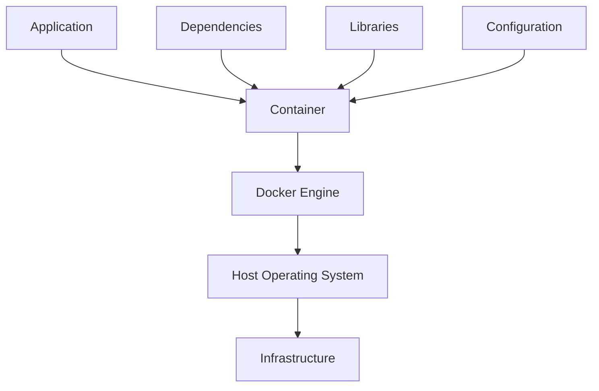

# Ubuntu Docker Containers

## Introduction

Docker containers have revolutionized how we develop, deploy, and run applications. Unlike traditional virtualization that emulates entire operating systems, Docker containers package only the application and its dependencies, making them lightweight, portable, and efficient. In this guide, we'll explore how to work with Docker containers specifically on Ubuntu, one of the most popular Linux distributions for container deployments.

## What Are Docker Containers?

Docker containers are standalone, executable packages that include everything needed to run an application: code, runtime, system tools, libraries, and settings. Containers isolate software from its surroundings, ensuring consistent operation regardless of differences between development and staging environments.



### Containers vs. Virtual Machines

Before diving deeper, let's understand how containers differ from traditional virtual machines:

| Docker Containers | Virtual Machines |
|-------------------|------------------|
| Share the host OS kernel | Run a complete OS with its own kernel |
| Lightweight (MBs in size) | Heavyweight (GBs in size) |
| Start in seconds | Start in minutes |
| Less resource intensive | More resource intensive |
| Application-level isolation | Hardware-level isolation |

## Installing Docker on Ubuntu

Let's start by installing Docker on your Ubuntu system:

### Prerequisites

- Ubuntu 20.04 LTS or newer
- A user account with sudo privileges
- Internet connection

### Step 1: Update Package Index

First, update your existing packages:

```bash
sudo apt update
```

### Step 2: Install Required Packages

Install packages that allow apt to use repositories over HTTPS:

```bash
sudo apt install apt-transport-https ca-certificates curl software-properties-common
```

### Step 3: Add Docker's Official GPG Key

```bash
curl -fsSL https://download.docker.com/linux/ubuntu/gpg | sudo gpg --dearmor -o /usr/share/keyrings/docker-archive-keyring.gpg
```

### Step 4: Set Up the Docker Repository

```bash
echo "deb [arch=$(dpkg --print-architecture) signed-by=/usr/share/keyrings/docker-archive-keyring.gpg] https://download.docker.com/linux/ubuntu $(lsb_release -cs) stable" | sudo tee /etc/apt/sources.list.d/docker.list > /dev/null
```

### Step 5: Install Docker Engine

```bash
sudo apt update
sudo apt install docker-ce docker-ce-cli containerd.io
```

### Step 6: Verify the Installation

Check if Docker is installed correctly:

```bash
sudo docker run hello-world
```

Expected output:

```
Hello from Docker!
This message shows that your installation appears to be working correctly.

To generate this message, Docker took the following steps:
 1. The Docker client contacted the Docker daemon.
 2. The Docker daemon pulled the "hello-world" image from the Docker Hub.
 3. The Docker daemon created a new container from that image which runs the
    executable that produces the output you are currently reading.
 4. The Docker daemon streamed that output to the Docker client, which sent it
    to your terminal.
```

### Step 7: Manage Docker as a Non-Root User (Optional but Recommended)

Add your user to the docker group to run commands without sudo:

```bash
sudo usermod -aG docker $USER
```

Log out and log back in for the changes to take effect. Then verify with:

```bash
docker run hello-world
```

## Docker Fundamentals

### Key Concepts

1. **Docker Image**: A read-only template containing instructions for creating a Docker container.
2. **Docker Container**: A runnable instance of an image.
3. **Dockerfile**: A text file with instructions to build a Docker image.
4. **Docker Hub**: A registry service for finding and sharing Docker images.
5. **Docker Compose**: A tool for defining and running multi-container applications.

### Basic Docker Commands

Let's explore some essential Docker commands:

#### Listing Images

```bash
docker images
```

Example output:

```
REPOSITORY    TAG       IMAGE ID       CREATED         SIZE
ubuntu        latest    1318b700e415   2 weeks ago     72.8MB
hello-world   latest    feb5d9fea6a5   12 months ago   13.3kB
```

#### Pulling an Image

```bash
docker pull ubuntu:20.04
```

Example output:

```
20.04: Pulling from library/ubuntu
16ec32c2132b: Pull complete
Digest: sha256:6a8fa9d2db082b9af0c94bbfee24c823d73f4a311c1f887f8daa5b07545e3d6c
Status: Downloaded newer image for ubuntu:20.04
docker.io/library/ubuntu:20.04
```

#### Running a Container

```bash
docker run -it ubuntu:20.04 bash
```

This command runs an interactive Ubuntu 20.04 container and opens a bash shell.

#### Listing Running Containers

```bash
docker ps
```

Example output:

```
CONTAINER ID   IMAGE          COMMAND   CREATED         STATUS         PORTS     NAMES
3f4e15c175d0   ubuntu:20.04   "bash"    2 minutes ago   Up 2 minutes             eager_newton
```

#### Listing All Containers (Including Stopped)

```bash
docker ps -a
```

#### Stopping a Container

```bash
docker stop container_id
```

#### Removing a Container

```bash
docker rm container_id
```

#### Removing an Image

```bash
docker rmi image_id
```

## Creating Your First Dockerfile

A Dockerfile is a text document that contains all the commands needed to build an image. Let's create a simple web server:

1. Create a new directory for your project:

```bash
mkdir docker-web-app
cd docker-web-app
```

2. Create an `index.html` file:

```bash
echo "<html><body><h1>Hello from Docker on Ubuntu!</h1></body></html>" > index.html
```

3. Create a Dockerfile:

```bash
touch Dockerfile
```

4. Edit the Dockerfile with your favorite text editor and add the following:

```dockerfile
# Use official Nginx image as base
FROM nginx:alpine

# Copy custom HTML file to the Nginx document root
COPY index.html /usr/share/nginx/html/

# Expose port 80
EXPOSE 80

# Command to run when container starts
CMD ["nginx", "-g", "daemon off;"]
```

5. Build the Docker image:

```bash
docker build -t my-web-app .
```

Example output:

```
Sending build context to Docker daemon  3.072kB
Step 1/4 : FROM nginx:alpine
alpine: Pulling from library/nginx
8ea3b23f387b: Pull complete
9751bef37bf3: Pull complete
cecd0553e253: Pull complete
596b1d696923: Pull complete
64ea0bddacb1: Pull complete
Digest: sha256:2d194184b067db3598771b4cf326cfe6ad5051937ba1132b8b7d4b0184e0d0a6
Status: Downloaded newer image for nginx:alpine
 ---> a6eb2a334a9f
Step 2/4 : COPY index.html /usr/share/nginx/html/
 ---> 86bcee5200dc
Step 3/4 : EXPOSE 80
 ---> Running in 955bf04c78c2
Removing intermediate container 955bf04c78c2
 ---> 7f90bd80a702
Step 4/4 : CMD ["nginx", "-g", "daemon off;"]
 ---> Running in 6fa14f63cee4
Removing intermediate container 6fa14f63cee4
 ---> 74ba67f4bbc2
Successfully built 74ba67f4bbc2
Successfully tagged my-web-app:latest
```

6. Run the container:

```bash
docker run -d -p 8080:80 my-web-app
```

7. Access your web application by opening a browser and navigating to `http://localhost:8080`

## Docker Compose for Multi-Container Applications

For more complex applications with multiple containers, Docker Compose simplifies deployment:

### Installing Docker Compose

```bash
sudo apt install docker-compose
```

### Example: WordPress with MySQL

Let's create a simple WordPress setup with MySQL:

1. Create a new directory:

```bash
mkdir wordpress-docker
cd wordpress-docker
```

2. Create a `docker-compose.yml` file:

```yaml
version: '3'

services:
  db:
    image: mysql:5.7
    volumes:
      - db_data:/var/lib/mysql
    restart: always
    environment:
      MYSQL_ROOT_PASSWORD: rootpassword
      MYSQL_DATABASE: wordpress
      MYSQL_USER: wordpress
      MYSQL_PASSWORD: wordpress

  wordpress:
    depends_on:
      - db
    image: wordpress:latest
    ports:
      - "8080:80"
    restart: always
    environment:
      WORDPRESS_DB_HOST: db:3306
      WORDPRESS_DB_USER: wordpress
      WORDPRESS_DB_PASSWORD: wordpress
      WORDPRESS_DB_NAME: wordpress

volumes:
  db_data:
```

3. Start the containers:

```bash
docker-compose up -d
```

4. Access WordPress at `http://localhost:8080`

## Docker Networking

Docker provides several networking options to enable communication between containers:

### Default Networks

Docker comes with three default networks:
- `bridge`: The default network for containers
- `host`: Removes network isolation between container and host
- `none`: No networking

### Listing Networks

```bash
docker network ls
```

Example output:

```
NETWORK ID     NAME      DRIVER    SCOPE
9f34c2e8cc74   bridge    bridge    local
6a4d0cff8a12   host      host      local
53e634a14262   none      null      local
```

### Creating a Custom Network

```bash
docker network create my-network
```

### Connecting Containers to a Network

```bash
docker run -d --name container1 --network my-network ubuntu sleep infinity
docker run -d --name container2 --network my-network ubuntu sleep infinity
```

Now container1 and container2 can communicate using their container names as hostnames.

## Docker Volumes

Volumes allow you to persist data and share it between containers:

### Creating a Volume

```bash
docker volume create my-data
```

### Using a Volume

```bash
docker run -d --name my-container -v my-data:/app/data ubuntu sleep infinity
```

### Inspecting a Volume

```bash
docker volume inspect my-data
```

## Docker Best Practices for Ubuntu

1. **Keep Images Small**: Use minimal base images like Ubuntu 20.04 minimal or Alpine.
2. **Use Multi-Stage Builds**: Separate build environment from runtime environment.
3. **Manage Sensitive Data**: Use Docker secrets or environment variables for credentials.
4. **Regular Updates**: Keep your Docker Engine and images updated.
5. **Resource Limits**: Set memory and CPU limits for containers.
6. **Use .dockerignore**: Exclude unnecessary files from your build context.
7. **Non-Root Users**: Run containers as non-root users when possible.

## Practical Use Cases

### 1. Development Environment

Create a consistent development environment across your team:

```dockerfile
FROM ubuntu:20.04

RUN apt-get update && apt-get install -y \
    python3 \
    python3-pip \
    nodejs \
    npm

WORKDIR /app

COPY requirements.txt .
RUN pip3 install -r requirements.txt

CMD ["/bin/bash"]
```

### 2. Continuous Integration

Use Docker for CI pipelines to ensure consistent testing environments:

```yaml
# .github/workflows/docker-test.yml
name: Docker Test

on: [push, pull_request]

jobs:
  test:
    runs-on: ubuntu-latest
    steps:
      - uses: actions/checkout@v2
      - name: Build and test
        run: |
          docker build -t my-app-test .
          docker run my-app-test pytest
```

### 3. Microservices Deployment

Deploy a microservices application with Docker Compose:

```yaml
version: '3'

services:
  frontend:
    build: ./frontend
    ports:
      - "80:80"
    depends_on:
      - api

  api:
    build: ./api
    ports:
      - "8000:8000"
    depends_on:
      - database

  database:
    image: postgres:13
    volumes:
      - db_data:/var/lib/postgresql/data
    environment:
      POSTGRES_PASSWORD: secretpassword
      POSTGRES_DB: myapp

volumes:
  db_data:
```

## Troubleshooting Common Issues

### Docker Daemon Not Running

```bash
sudo systemctl start docker
```

### Permission Denied

If you get "permission denied" errors:

```bash
sudo usermod -aG docker $USER
# Log out and log back in
```

### Container Cannot Connect to Internet

Check your DNS settings:

```bash
sudo nano /etc/docker/daemon.json
```

Add:

```json
{
  "dns": ["8.8.8.8", "8.8.4.4"]
}
```

Then restart Docker:

```bash
sudo systemctl restart docker
```

### Cannot Remove Images or Containers

Force removal:

```bash
docker rm -f container_id
docker rmi -f image_id
```

## Summary

Docker containers on Ubuntu provide a powerful, flexible way to develop, test, and deploy applications. By packaging applications with their dependencies, Docker ensures consistent behavior across different environments while maintaining efficiency and isolation. We've covered installation, basic concepts, creating custom images, networking, volumes, and real-world applications.

With these fundamentals, you're well-equipped to start containerizing your applications on Ubuntu. As you grow more comfortable with Docker, you'll discover how it can streamline your development workflow and simplify deployment processes.

## Additional Resources

- [Official Docker Documentation](https://docs.docker.com/)
- [Docker Hub](https://hub.docker.com/) for finding pre-built images
- [Docker Compose Documentation](https://docs.docker.com/compose/)

## Exercises

1. Create a Docker container that runs a simple Python web application using Flask.
2. Build a multi-container application with a frontend, backend, and database.
3. Set up a continuous integration pipeline using Docker for a GitHub project.
4. Create a development environment Docker image for your preferred programming language.
5. Experiment with Docker networks by creating a network of three containers that communicate with each other.