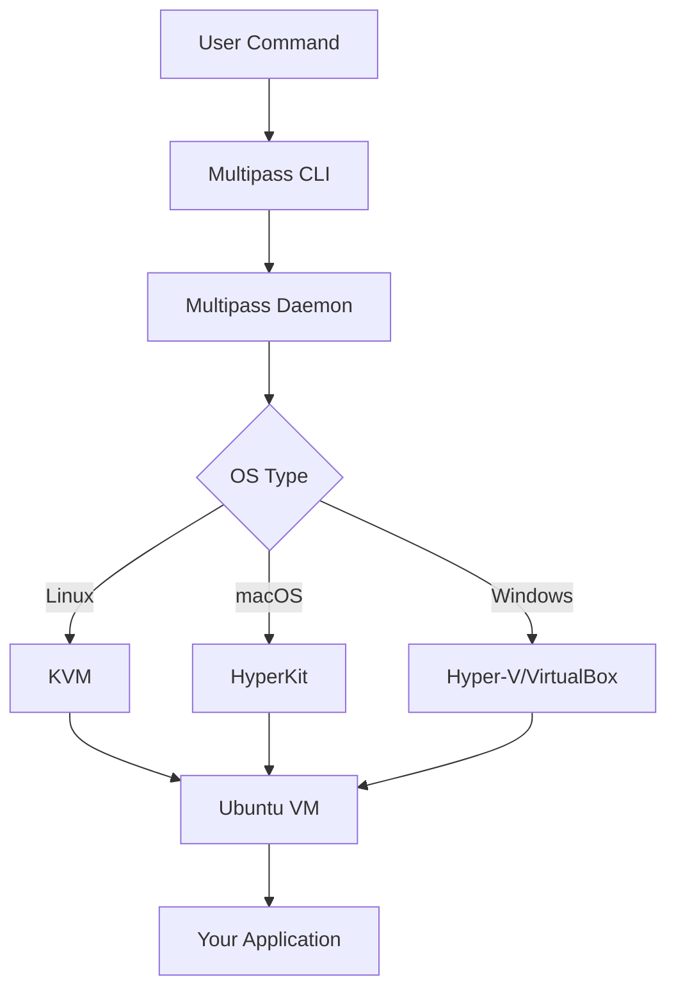

# Ubuntu Multipass

## Introduction

Ubuntu Multipass is a lightweight virtual machine manager developed by Canonical, the company behind Ubuntu. It enables developers to create and manage Ubuntu virtual machines (VMs) quickly and with minimal configuration. Multipass is designed to simplify the process of setting up development environments, testing software across different Ubuntu versions, and simulating cloud deployments on your local machine.

Think of Multipass as your personal cloud on your desktop or laptop. It allows you to spin up fresh Ubuntu instances with a single command, making it perfect for developers who need isolated environments for their projects without the overhead of traditional virtualization solutions.

## Why Use Multipass?

Before diving into how Multipass works, let's understand why you might want to use it:

- **Simplicity**: Create Ubuntu VMs with a single command
- **Lightweight**: Uses minimal system resources compared to other virtualization tools
- **Cross-platform**: Available for Windows, macOS, and Linux
- **Cloud-init support**: Configure VMs using the same tools as major cloud providers
- **Integration with development workflows**: Mount local directories into VMs for seamless development

## Installation

Let's start by installing Multipass on your system.

### On Ubuntu and other Linux distributions

```bash
# Install via Snap
sudo snap install multipass
```

### On macOS

```bash
# Install via Homebrew
brew install --cask multipass
```

### On Windows

```bash
# Download the installer from the official website
# https://multipass.run/download/windows
# Then run the installer and follow the on-screen instructions
```

## Basic Commands

After installation, you can manage your VMs using the `multipass` command in your terminal.

### Creating your first VM

```bash
# Create a new Ubuntu VM with default settings
multipass launch --name my-first-vm

# Output
Launching my-first-vm...
Downloading Ubuntu 22.04 LTS...      100%
Launched: my-first-vm
```

The `launch` command creates a new virtual machine. By default, it uses the latest LTS (Long Term Support) version of Ubuntu.

### Listing your VMs

```bash
multipass list

# Output
Name           State     IPv4             Image
my-first-vm    Running   192.168.64.2     Ubuntu 22.04 LTS
```

### Accessing your VM

```bash
# SSH into your VM
multipass shell my-first-vm

# You'll see a prompt like this
ubuntu@my-first-vm:~$
```

### Running commands in your VM

```bash
# Run a command in your VM without entering it
multipass exec my-first-vm -- lsb_release -a

# Output
No LSB modules are available.
Distributor ID: Ubuntu
Description:    Ubuntu 22.04.1 LTS
Release:        22.04
Codename:       jammy
```

### Stopping and starting VMs

```bash
# Stop a VM
multipass stop my-first-vm

# Start a VM
multipass start my-first-vm
```

### Deleting a VM

```bash
# Delete a VM
multipass delete my-first-vm

# Recover deleted VMs or permanently remove them
multipass recover my-first-vm  # Recover
multipass purge  # Permanently remove all deleted VMs
```

## Advanced Usage

Now that you're familiar with the basics, let's explore some more advanced features of Multipass.

### Customizing VM Creation

You can customize your VMs by specifying the Ubuntu version, CPU count, memory, and disk space.

```bash
# Create a VM with specific resources
multipass launch --name custom-vm --cpus 2 --mem 4G --disk 10G

# Create a VM with a specific Ubuntu version
multipass launch --name lts-vm bionic  # Ubuntu 18.04 LTS
```

Available image aliases include:
- `18.04` or `bionic` (Ubuntu 18.04 LTS)
- `20.04` or `focal` (Ubuntu 20.04 LTS)
- `22.04` or `jammy` (Ubuntu 22.04 LTS)
- `daily:23.10` or `mantic` (Ubuntu 23.10 development builds)

### Mounting Local Directories

One of the most useful features for developers is the ability to mount local directories into a VM, allowing you to work on your code locally while running it in the VM.

```bash
# Mount a local directory to a VM
multipass mount /path/to/local/dir my-first-vm:/path/in/vm

# Example: Mount your project directory
multipass mount ~/projects/my-webapp my-first-vm:~/webapp
```

Now you can edit files locally and run them in the VM without having to copy files back and forth.

### Using Cloud-Init

Cloud-init is a standard used by cloud platforms to configure cloud instances during initialization. Multipass supports cloud-init, allowing you to automate VM setup.

Create a file named `cloud-config.yaml`:

```yaml
#cloud-config
packages:
  - nginx
  - nodejs
  - npm
runcmd:
  - sudo systemctl enable nginx
  - sudo systemctl start nginx
```

Now launch a VM with this configuration:

```bash
multipass launch --name web-server --cloud-init cloud-config.yaml

# This VM will automatically install nginx, nodejs, and npm during creation
```

### Creating Your Own VM Image

You can create a custom VM, install software, make configurations, and then create a new image from it.

```bash
# Launch a VM and customize it
multipass launch --name template-vm
multipass shell template-vm

# Inside the VM, install software and make configurations
# ...

# Exit the VM and stop it
exit
multipass stop template-vm

# Now you can use this VM as a template for new VMs
```

## Real-World Applications

Let's explore some practical examples of how Multipass can be used in real-world scenarios.

### Web Development Environment

Create a full web development environment with a few commands:

```bash
# Create a cloud-init file named webdev-config.yaml
# With content:
#cloud-config
packages:
  - nginx
  - nodejs
  - npm
  - mongodb
  - git
runcmd:
  - sudo systemctl enable nginx mongodb
  - sudo systemctl start nginx mongodb

# Launch the VM
multipass launch --name webdev --cloud-init webdev-config.yaml
multipass mount ~/projects webdev:~/projects

# Access your VM
multipass shell webdev
```

Now you have a complete web development environment with Node.js, MongoDB, and nginx, with your local projects directory mounted.

### Testing Across Ubuntu Versions

If you need to test your application on different Ubuntu versions:

```bash
# Create VMs for different Ubuntu versions
multipass launch --name bionic bionic  # 18.04 LTS
multipass launch --name focal focal    # 20.04 LTS
multipass launch --name jammy jammy    # 22.04 LTS

# Mount your application to all VMs
for vm in bionic focal jammy; do
  multipass mount ~/myapp $vm:~/myapp
done

# Run tests on each VM
for vm in bionic focal jammy; do
  echo "Testing on $vm"
  multipass exec $vm -- cd ~/myapp && ./run_tests.sh
done
```

### Local Kubernetes Development with MicroK8s

You can use Multipass to create a local Kubernetes environment using MicroK8s:

```bash
# Create a cloud-init file named k8s-config.yaml
# With content:
#cloud-config
packages:
  - snapd
runcmd:
  - sudo snap install microk8s --classic
  - sudo usermod -a -G microk8s ubuntu
  - sudo microk8s enable dns dashboard storage

# Launch the VM with more resources
multipass launch --name k8s --cpus 4 --mem 8G --disk 40G --cloud-init k8s-config.yaml

# Access the VM
multipass shell k8s

# Inside the VM, check Kubernetes status
microk8s status
```

## Advanced Networking

Multipass supports various networking configurations to connect your VMs.

### Bridged Networking

By default, Multipass VMs use a NAT (Network Address Translation) network. If you want your VM to appear as a separate machine on your network, you can use bridged networking.

```bash
# First, find your network interfaces
multipass networks

# Launch a VM with bridged networking
multipass launch --name bridged-vm --network en0  # Replace en0 with your interface
```

### Port Forwarding

You can expose services running in your VM to your host machine:

```bash
# For example, to access a web server running on port 80 in the VM
multipass exec my-first-vm -- sudo apt install -y nginx

# Access the web server from your host machine's browser at http://192.168.64.2
# (Use the IP address shown in `multipass list`)
```

## Automating with Multipass

You can create scripts to automate VM setup and management. Here's a simple bash script to create a development environment:

```bash
#!/bin/bash
# dev-environment.sh

VM_NAME="dev-vm"

# Create the VM if it doesn't exist
if ! multipass info $VM_NAME &>/dev/null; then
  echo "Creating $VM_NAME..."
  multipass launch --name $VM_NAME --cpus 2 --mem 4G
  
  echo "Installing development tools..."
  multipass exec $VM_NAME -- sudo apt update
  multipass exec $VM_NAME -- sudo apt install -y build-essential git nodejs npm
  
  echo "Mounting project directory..."
  multipass mount ~/projects $VM_NAME:~/projects
else
  echo "Starting $VM_NAME..."
  multipass start $VM_NAME
fi

# Connect to the VM
multipass shell $VM_NAME
```

Make the script executable and run it:

```bash
chmod +x dev-environment.sh
./dev-environment.sh
```

## Troubleshooting

Here are some common issues you might encounter when using Multipass:

### VM fails to launch

```bash
# Check the multipass service status
multipass version

# On Linux, check snap service
sudo snap services multipass

# Reset multipass if needed
sudo snap restart multipass
```

### Unable to connect to VM

```bash
# Check VM status
multipass list

# Restart the VM
multipass stop my-first-vm
multipass start my-first-vm
```

### Mount command fails

```bash
# Make sure the target directory exists in the VM
multipass exec my-first-vm -- mkdir -p /path/in/vm

# Try remounting
multipass umount my-first-vm:/path/in/vm
multipass mount /path/to/local/dir my-first-vm:/path/in/vm
```

## Understanding Multipass Architecture

Multipass uses different virtualization backends depending on your operating system:

- **Linux**: Uses KVM (Kernel-based Virtual Machine)
- **macOS**: Uses HyperKit (based on xhyve)
- **Windows**: Uses Hyper-V or VirtualBox

Here's a simplified diagram of how Multipass works:



## Summary

Ubuntu Multipass is a powerful yet simple tool for managing Ubuntu virtual machines. In this guide, we've covered:

- Basic installation and commands
- Creating and managing VMs
- Advanced features like cloud-init and mounting directories
- Real-world application examples
- Troubleshooting common issues

With Multipass, you can easily create reproducible development environments, test software across different Ubuntu versions, and simulate cloud deployments locally. Its lightweight design and simple command-line interface make it an excellent choice for developers who need isolated Ubuntu environments without the complexity of traditional virtualization solutions.

## Additional Resources

To continue learning about Ubuntu Multipass:

- [Official Multipass Documentation](https://multipass.run/docs)
- [Ubuntu Multipass GitHub Repository](https://github.com/canonical/multipass)
- [Cloud-init Documentation](https://cloudinit.readthedocs.io/)

## Exercises

1. Create a new VM with Ubuntu 20.04 LTS and 2GB of RAM.
2. Install a LAMP (Linux, Apache, MySQL, PHP) stack on your VM using cloud-init.
3. Mount a local project directory and set up a development environment.
4. Create a script that launches multiple VMs for testing different configurations.
5. Set up a Kubernetes cluster using MicroK8s in a Multipass VM.