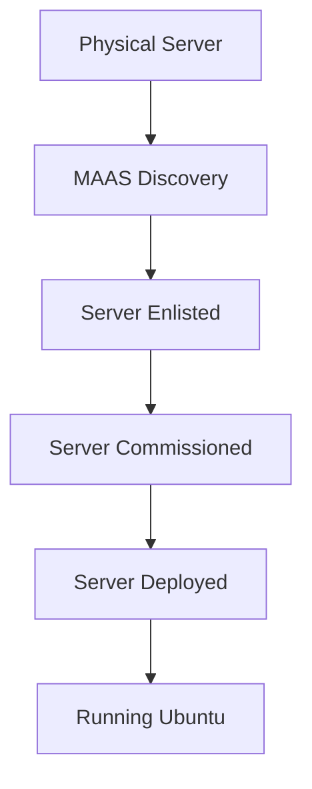

# Ubuntu Cloud Integration

## Introduction

Ubuntu is one of the most popular operating systems for cloud computing, powering millions of servers and cloud instances worldwide. Ubuntu Cloud Integration refers to the suite of tools, services, and features that enable Ubuntu to work seamlessly with various cloud platforms and services.

Whether you're deploying applications on public clouds like AWS, Azure, or Google Cloud, setting up a private cloud with OpenStack, or orchestrating containers with Kubernetes, Ubuntu provides optimized images and powerful tools to streamline your cloud journey.

In this guide, we'll explore how Ubuntu integrates with cloud platforms, the tools it offers for cloud management, and practical ways to deploy and manage Ubuntu in cloud environments.

## Why Ubuntu for Cloud?

Before diving into the technical details, let's understand why Ubuntu is a popular choice for cloud deployments:

- **Official cloud images**: Canonical (the company behind Ubuntu) provides regularly updated, optimized Ubuntu images for all major cloud providers.
- **Long-term support**: Ubuntu LTS (Long Term Support) releases are supported for 5 years, providing stability for cloud deployments.
- **Security focus**: Regular security updates and features like AppArmor make Ubuntu a secure choice for cloud workloads.
- **Minimal footprint**: Ubuntu cloud images are lightweight and optimized for cloud environments.
- **Broad ecosystem**: A rich set of tools for cloud deployment, management, and orchestration.

## Ubuntu Cloud Images

At the core of Ubuntu's cloud integration are official cloud images. These are pre-built, lightweight Ubuntu images specifically optimized for cloud environments.

### Available Cloud Images

Ubuntu provides official images for:

- Amazon Web Services (AWS)
- Microsoft Azure
- Google Cloud Platform (GCP)
- Oracle Cloud
- IBM Cloud
- Alibaba Cloud
- OpenStack
- And many more

### Finding and Using Cloud Images

You can find Ubuntu cloud images in two main ways:

1. **Directly from cloud marketplaces**: Ubuntu images are available in the marketplace/image catalog of all major cloud providers.
2. **From Ubuntu Cloud Images website**: You can download images from [cloud-images.ubuntu.com](https://cloud-images.ubuntu.com) (replace with your own link).

Here's how to launch an Ubuntu instance on AWS using the AWS CLI:

```bash
aws ec2 run-instances \
  --image-id ami-0123456789abcdef0 \
  --count 1 \
  --instance-type t2.micro \
  --key-name your-key-pair \
  --security-group-ids sg-01234567890abcdef
```

### Cloud-Init

Ubuntu cloud images come with cloud-init, a multi-distribution package that handles early initialization of cloud instances. With cloud-init, you can:

- Set up users and SSH keys
- Configure network settings
- Run custom scripts on first boot
- Mount volumes
- Install packages

Here's an example cloud-init configuration:

```yaml
#cloud-config
users:
  - name: ubuntu
    sudo: ALL=(ALL) NOPASSWD:ALL
    groups: users, admin
    home: /home/ubuntu
    shell: /bin/bash
    ssh-authorized-keys:
      - ssh-rsa AAAAB3NzaC1yc2E...

packages:
  - nginx
  - python3-pip
  - build-essential

runcmd:
  - systemctl start nginx
  - systemctl enable nginx
```

This configuration creates a user with SSH access, installs packages, and runs commands on first boot.

## Ubuntu on Major Cloud Platforms

Let's look at how Ubuntu integrates with the major cloud providers:

### AWS (Amazon Web Services)

Ubuntu is a first-class citizen on AWS with:

- Official AMIs (Amazon Machine Images) for all supported Ubuntu versions
- Support for AWS-specific features like EBS volumes, EC2 instance types, etc.
- Integration with AWS services like Auto Scaling, CloudFormation, etc.

Finding Ubuntu AMIs on AWS:

```bash
aws ec2 describe-images \
  --owners 099720109477 \
  --filters "Name=name,Values=ubuntu/images/hvm-ssd/ubuntu-jammy-22.04-amd64-server-*" \
  --query 'sort_by(Images, &CreationDate)[-1]'
```

### Microsoft Azure

Ubuntu on Azure offers:

- Optimized VM images in the Azure Marketplace
- Support for Azure-specific features
- Integration with Azure services like Azure Resource Manager, Azure Storage, etc.

Creating an Ubuntu VM on Azure:

```bash
az vm create \
  --resource-group myResourceGroup \
  --name myVM \
  --image UbuntuLTS \
  --admin-username azureuser \
  --generate-ssh-keys
```

### Google Cloud Platform (GCP)

Ubuntu on GCP includes:

- Official images in the GCP Marketplace
- Optimized performance on GCP infrastructure
- Integration with GCP services like Cloud Storage, Cloud SQL, etc.

Creating an Ubuntu VM on GCP:

```bash
gcloud compute instances create my-ubuntu-instance \
  --image-family ubuntu-2204-lts \
  --image-project ubuntu-os-cloud \
  --zone us-central1-a \
  --machine-type e2-medium
```

## Cloud Management Tools

Ubuntu provides several tools to manage cloud deployments:

### MAAS (Metal as a Service)

MAAS allows you to treat physical servers like virtual machines in the cloud. It's perfect for creating your own cloud infrastructure:

```bash
sudo snap install maas
sudo maas init
```

MAAS workflow:



### Juju - Cloud Orchestration

Juju is an open-source application modeling tool that allows you to deploy, configure, scale, and operate complex software on cloud platforms:

```bash
sudo snap install juju --classic
juju bootstrap aws
juju deploy postgresql
```

Juju architecture:


### Multipass - Lightweight VM Manager

Multipass is a lightweight VM manager for Linux, Windows, and macOS that lets you simulate cloud deployments locally:

```bash
sudo snap install multipass
multipass launch ubuntu:20.04 --name cloud-test
multipass shell cloud-test
```

## Ubuntu on Kubernetes

Kubernetes has become the de-facto standard for container orchestration, and Ubuntu offers excellent integration:

### MicroK8s

MicroK8s is a lightweight, CNCF-certified Kubernetes distribution by Canonical:

```bash
sudo snap install microk8s --classic
microk8s enable dns dashboard storage
microk8s kubectl get all --all-namespaces
```

### Charmed Kubernetes

For production environments, Charmed Kubernetes offers a fully-featured Kubernetes deployment:

```bash
juju deploy kubernetes-core
```

## Private Cloud with OpenStack

Ubuntu is the reference operating system for OpenStack, making it perfect for building private clouds:

### MicroStack

MicroStack provides a single-machine OpenStack deployment for testing and development:

```bash
sudo snap install microstack --beta --devmode
sudo microstack.init --auto
```

### Charmed OpenStack

For production environments, Charmed OpenStack offers a full OpenStack deployment:

```bash
juju bootstrap manual/192.168.1.1 maas-controller
juju deploy openstack-base
```

## Practical Example: Deploying a Web Application to the Cloud

Let's walk through deploying a simple web application to AWS using Ubuntu and cloud-init:

1. Create a cloud-init configuration file named `web-app.yaml`:

```yaml
#cloud-config
package_update: true
package_upgrade: true

packages:
  - nginx
  - nodejs
  - npm

write_files:
  - path: /var/www/html/index.html
    content: |
      <!DOCTYPE html>
      <html>
      <head>
        <title>Hello from Ubuntu in the Cloud!</title>
      </head>
      <body>
        <h1>Ubuntu Cloud Integration</h1>
        <p>This server was automatically configured with cloud-init.</p>
        <div id="time"></div>
        <script>
          setInterval(() => {
            document.getElementById('time').textContent = 
              'Server time: ' + new Date().toLocaleString();
          }, 1000);
        </script>
      </body>
      </html>
    permissions: '0644'

  - path: /etc/nginx/sites-available/default
    content: |
      server {
        listen 80 default_server;
        listen [::]:80 default_server;
        root /var/www/html;
        index index.html index.htm;
        server_name _;
        location / {
          try_files $uri $uri/ =404;
        }
      }
    permissions: '0644'

runcmd:
  - systemctl restart nginx
```

2. Launch an EC2 instance with this cloud-init configuration:

```bash
aws ec2 run-instances \
  --image-id ami-0123456789abcdef0 \
  --instance-type t2.micro \
  --key-name your-key-pair \
  --security-group-ids sg-01234567890abcdef \
  --user-data file://web-app.yaml
```

3. Once the instance is running, access the web application at your instance's public IP.

## Monitoring and Managing Ubuntu Cloud Instances

### Landscape

Landscape is Canonical's systems management tool that helps you monitor, manage, and update Ubuntu cloud instances:

```bash
sudo apt install landscape-client
sudo landscape-config --computer-title "web-server" --account-name "my-landscape"
```

### Canonical Livepatch

Livepatch allows kernel updates without rebooting, ideal for cloud servers:

```bash
sudo snap install canonical-livepatch
sudo canonical-livepatch enable YOUR_LIVEPATCH_TOKEN
```

## Best Practices for Ubuntu in the Cloud

1. **Use LTS releases** for production workloads to ensure long-term stability and support.
2. **Implement proper security** with security groups, network ACLs, and Ubuntu's built-in security features.
3. **Automate deployments** using cloud-init, Juju, or infrastructure as code tools.
4. **Minimize instance size** to reduce costs - Ubuntu cloud images are optimized for small footprints.
5. **Regularly update** your instances to receive security patches.
6. **Use cloud-native storage solutions** instead of relying on instance storage.
7. **Create custom images** for frequently deployed configurations.

## Troubleshooting

### Common Issues and Solutions

#### Instance doesn't initialize properly

Check cloud-init logs:

```bash
cat /var/log/cloud-init.log
cat /var/log/cloud-init-output.log
```

#### Network connectivity issues

Verify network configuration:

```bash
ip addr show
sudo netplan apply
```

#### Package installation failures

Check apt logs:

```bash
cat /var/log/apt/history.log
sudo apt update && sudo apt upgrade
```

## Summary

Ubuntu Cloud Integration offers a comprehensive ecosystem for deploying, managing, and scaling applications in cloud environments. From optimized cloud images to powerful management tools like MAAS, Juju, and MicroK8s, Ubuntu provides everything you need to succeed in the cloud.

By leveraging Ubuntu's cloud features, you can:

- Deploy applications consistently across different cloud providers
- Build private cloud infrastructure with OpenStack
- Orchestrate containerized applications with Kubernetes
- Automate deployments with cloud-init and Juju
- Manage your cloud instances efficiently

As cloud computing continues to evolve, Ubuntu remains at the forefront with regular updates and new features to address emerging cloud technologies and use cases.

## Additional Resources

- Official Ubuntu Documentation (replace with your own links)
- Ubuntu Cloud Images
- Juju Documentation
- MicroK8s Documentation
- OpenStack Documentation

## Exercises

1. Deploy an Ubuntu instance on AWS using cloud-init to automatically install and configure a database server.
2. Set up a local Kubernetes cluster with MicroK8s and deploy a multi-container application.
3. Create a custom Ubuntu cloud image with your preferred packages and configurations pre-installed.
4. Use Juju to deploy a complex application stack with multiple interconnected services.
5. Configure an Ubuntu instance to automatically apply security updates using unattended-upgrades.