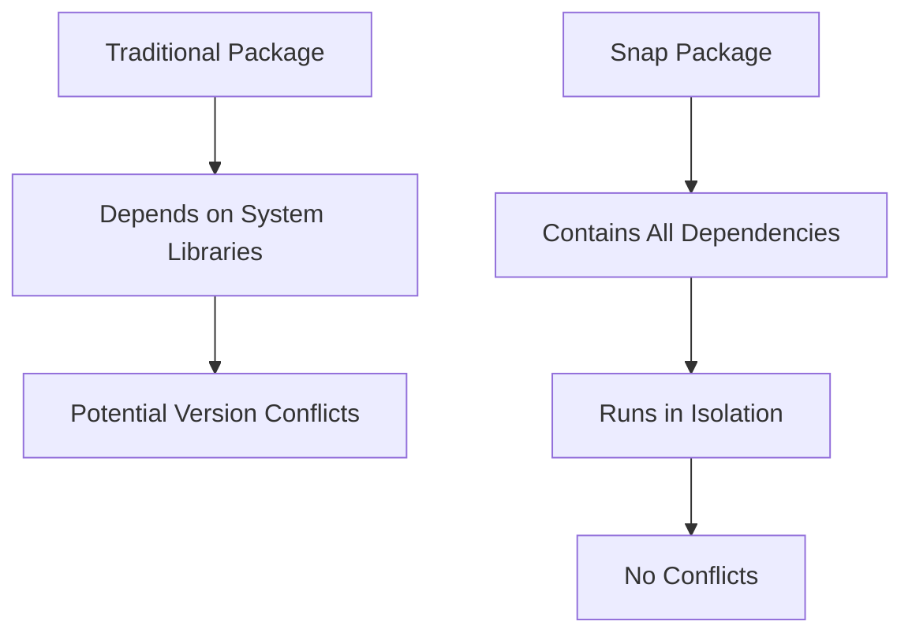

# Ubuntu Snapcraft

## Introduction

Snapcraft is Ubuntu's universal package management system that allows developers to package applications with all their dependencies and distribute them across Linux distributions. Snaps are containerized software packages that are easy to create, secure, and distribute regardless of the Linux distribution. As part of Ubuntu's virtualization ecosystem, Snapcraft provides an efficient way to distribute and update applications without worrying about dependency conflicts or system compatibility issues.

## What Are Snaps?

Snaps are:

- **Self-contained applications** - They bundle applications with their dependencies
- **Auto-updating** - Users always get the latest version
- **Secure** - Applications run in isolation with limited access to the system
- **Cross-platform** - Work on most Linux distributions, not just Ubuntu
- **Easy to install** - One command installation and removal

## How Snaps Work

Snaps operate using a different paradigm from traditional Debian packages (`.deb`). Here's a simple diagram to illustrate the difference:



The snap system consists of:

1. **snapd** - The background service that manages and maintains your snap packages
2. **snap** - The command line interface to interact with snapd
3. **snapcraft** - The tool to create your own snaps
4. **Snap Store** - An online repository of available snaps

## Getting Started with Snaps

### Installing the Snap System

Most modern Ubuntu installations come with snap pre-installed. If you need to install it:

```bash
sudo apt update
sudo apt install snapd
```

To verify the installation:

```bash
snap version
```

Output:
```
snap    2.58.2
snapd   2.58.2
series  16
ubuntu  22.04
kernel  5.15.0-58-generic
```

### Finding and Installing Snaps

You can find snaps using the search command:

```bash
snap find firefox
```

Output:
```
Name                 Version    Publisher      Notes    Summary
firefox              112.0.2-1  mozilla✓       -        Mozilla Firefox web browser
firefox-esr          102.9.0-1  mozilla✓       -        Mozilla Firefox web browser (Extended Support Release)
...
```

To install a snap:

```bash
sudo snap install firefox
```

Output:
```
firefox 112.0.2-1 from Mozilla✓ installed
```

### Managing Installed Snaps

List your installed snaps:

```bash
snap list
```

Output:
```
Name      Version    Rev    Tracking       Publisher   Notes
core      16-2.58.2  14447  latest/stable  canonical✓  core
firefox   112.0.2-1  2356   latest/stable  mozilla✓    -
```

Update all snaps:

```bash
sudo snap refresh
```

Remove a snap:

```bash
sudo snap remove firefox
```

## Creating Your First Snap Package

Creating your own snap packages requires the Snapcraft tool:

```bash
sudo snap install snapcraft --classic
```

### Basic Snapcraft Workflow

1. **Initialize a snapcraft project**:

```bash
mkdir my-snap-app
cd my-snap-app
snapcraft init
```

This creates a `snap` directory with a template `snapcraft.yaml` file:

```yaml
name: my-snap-app  # The name of the snap
base: core22       # The base snap is the runtime environment
version: '0.1'     # The version of the snap
summary: Single-line elevator pitch for your app
description: |
  This is my first snap application. It does amazing things.

grade: devel       # Stable or devel quality
confinement: devmode  # Use 'strict' for strict confinement

parts:
  my-part:
    # Define how to build your app
    plugin: nil
    
apps:
  my-snap-app:
    command: bin/my-command
```

2. **Edit the snapcraft.yaml file** to define your application:

```yaml
name: hello-world
base: core22
version: '0.1'
summary: A simple Hello World application
description: |
  A basic snap package that prints "Hello World" to the console.

grade: stable
confinement: strict

parts:
  hello:
    plugin: dump
    source: .
    override-build: |
      mkdir -p $SNAPCRAFT_PART_INSTALL/bin
      echo '#!/bin/bash' > $SNAPCRAFT_PART_INSTALL/bin/hello
      echo 'echo "Hello World from Snap!"' >> $SNAPCRAFT_PART_INSTALL/bin/hello
      chmod +x $SNAPCRAFT_PART_INSTALL/bin/hello

apps:
  hello-world:
    command: bin/hello
```

3. **Build your snap**:

```bash
snapcraft
```

This command builds a `.snap` file that can be installed locally.

4. **Install and test your snap**:

```bash
sudo snap install hello-world_0.1_amd64.snap --dangerous
```

The `--dangerous` flag is needed because the snap isn't signed by the Snap Store.

Run your snap:

```bash
hello-world
```

Output:
```
Hello World from Snap!
```

## Practical Example: Creating a Python Application Snap

Let's create a more practical example - a simple Python Flask web server.

1. **Create the directory structure**:

```bash
mkdir flask-hello-world
cd flask-hello-world
```

2. **Create a simple Flask application** (app.py):

```python
from flask import Flask

app = Flask(__name__)

@app.route('/')
def hello_world():
    return 'Hello, World from Flask!'

if __name__ == '__main__':
    app.run(host='0.0.0.0', port=8080)
```

3. **Create requirements.txt**:

```
flask==2.0.1
```

4. **Initialize and configure snapcraft.yaml**:

```bash
snapcraft init
```

Edit the `snap/snapcraft.yaml` file:

```yaml
name: flask-hello
base: core22
version: '0.1'
summary: A simple Flask Hello World web server
description: |
  A snap package that runs a Flask web server saying Hello World.

grade: stable
confinement: strict

parts:
  flask-app:
    plugin: python
    source: .
    python-packages:
      - flask

apps:
  flask-hello:
    command: python3 $SNAP/app.py
    daemon: simple
    plugs:
      - network
      - network-bind
```

5. **Build the snap**:

```bash
snapcraft
```

6. **Install and test**:

```bash
sudo snap install flask-hello_0.1_amd64.snap --dangerous
```

Access the web server at http://localhost:8080.

## Advanced Snapcraft Features

### Interfaces and Plugs

Snaps use an interface system to securely access system resources:

```yaml
apps:
  my-app:
    command: bin/my-command
    plugs:
      - home         # Access to user's home directory
      - network      # Network access
      - camera       # Camera access
      - removable-media  # USB drives, etc.
```

### Environment Variables

Set environment variables for your snap:

```yaml
apps:
  my-app:
    command: bin/my-command
    environment:
      DEBUG_MODE: "true"
      CUSTOM_PATH: "$SNAP/custom"
```

### Multiple Applications in One Snap

A single snap can contain multiple executables:

```yaml
apps:
  main-app:
    command: bin/main
  helper-tool:
    command: bin/helper
  background-service:
    command: bin/service
    daemon: simple
```

## Best Practices for Snap Development

1. **Use strict confinement** when possible for better security
2. **Keep your snaps small** by excluding unnecessary files
3. **Version your snaps** properly using semantic versioning
4. **Test thoroughly** on different distributions
5. **Use the snapcraft extensions** for common application types:
   - `gnome-3-38` for GNOME applications
   - `flutter-master` for Flutter applications
   - `desktop-gnome-platform` for desktop applications

## Distributing Your Snap

To share your snap with the world:

1. Create an account on the [Snap Store](https://snapcraft.io/store)
2. Register your snap name:

```bash
snapcraft register my-snap-name
```

3. Build and push your snap:

```bash
snapcraft
snapcraft upload --release=stable my-snap-name_0.1_amd64.snap
```

## Troubleshooting Common Issues

### Snap Building Failures

If snapcraft fails to build:

```bash
snapcraft clean
snapcraft --debug
```

### Permission Denied Errors

If your snap can't access a resource:

1. Check if you've connected the necessary interfaces:

```bash
snap connections my-snap-name
```

2. Connect missing interfaces:

```bash
sudo snap connect my-snap-name:camera :camera
```

## Summary

Ubuntu Snapcraft provides a robust system for packaging and distributing applications across Linux distributions. Key benefits include:

- Self-contained packages with all dependencies included
- Strong security through isolation and confinement
- Automatic updates for users
- Cross-platform compatibility
- Simple command-line interface for management

With Snapcraft, developers can focus on their applications rather than worrying about the intricacies of different Linux distributions and dependency management.

## Additional Resources

- [Official Snapcraft Documentation](https://snapcraft.io/docs)
- [Snapcraft Forum](https://forum.snapcraft.io/)
- [Ubuntu Snap Store](https://snapcraft.io/store)

## Practice Exercises

1. Create a snap package for a simple "Hello World" application in your favorite programming language.
2. Modify an existing snap to use strict confinement instead of devmode.
3. Create a snap with multiple applications and a background service.
4. Build a snap that uses at least three different interfaces (plugs).
5. Package an existing open-source application as a snap and share it with friends.