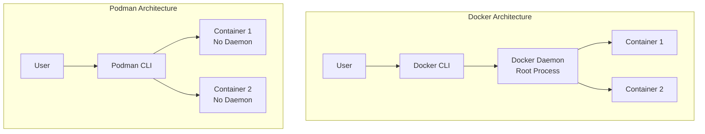

# Ubuntu Podman

## Introduction

Podman (Pod Manager) is a daemonless container engine for developing, managing, and running OCI (Open Container Initiative) containers on Linux systems, including Ubuntu. As a modern alternative to Docker, Podman allows you to run containers without requiring root privileges, making it more secure and flexible for development environments.

In this guide, we'll explore how to set up Podman on Ubuntu, understand its core concepts, and learn how to use it effectively for your containerization needs. Whether you're new to containers or transitioning from other container technologies, this tutorial will provide you with the knowledge to get started with Podman on Ubuntu.

## Why Podman?

Before diving into installation and commands, let's understand why Podman is gaining popularity:

- **Daemonless architecture**: Unlike Docker, Podman doesn't require a running daemon process
- **Rootless containers**: Run containers without root privileges
- **Docker compatibility**: Most Docker commands work with Podman
- **Pod support**: Native Kubernetes-like pod management
- **Security-focused**: Improved isolation and reduced attack surface

## Installing Podman on Ubuntu

Podman is available in the Ubuntu repositories starting from Ubuntu 20.04. Let's install it:

```bash
# Update your system repositories
sudo apt update

# Install Podman
sudo apt install -y podman
```

After installation, verify that Podman is correctly installed:

```bash
podman --version
```

Expected output (version may vary):
```
podman version 3.4.4
```

## Basic Podman Commands

Let's get familiar with basic Podman commands. If you've used Docker before, you'll notice similarities.

### Pulling Images

Pull an image from a registry:

```bash
podman pull ubuntu:22.04
```

Expected output:
```
Trying to pull ubuntu:22.04...
Getting image source signatures
Copying blob e5bccf219b16 done  
Copying blob 4b75288346d4 done  
Copying blob 1a40cb2669a8 done  
Copying config d4c2ef5a1e done  
Writing manifest to image destination
Storing signatures
d4c2ef5a1ea7141f4b2b61d76c3eca253089d5611855eb9a42539546baa1d554
```

### Listing Images

View downloaded images:

```bash
podman images
```

Expected output:
```
REPOSITORY                TAG         IMAGE ID      CREATED      SIZE
docker.io/library/ubuntu  22.04       d4c2ef5a1ea7  2 weeks ago  77.8 MB
```

### Running Containers

Run a container from an image:

```bash
podman run -it ubuntu:22.04 bash
```

This command starts an interactive Ubuntu container with bash shell access.

### Listing Containers

List running containers:

```bash
podman ps
```

List all containers (including stopped ones):

```bash
podman ps -a
```

### Stopping and Removing Containers

Stop a running container:

```bash
podman stop <container_id>
```

Remove a container:

```bash
podman rm <container_id>
```

## Rootless Containers

One of Podman's key features is the ability to run containers without root privileges. This is called "rootless mode."

By default, when you install Podman on Ubuntu, you can run containers as a non-root user:

```bash
# As a regular user (not using sudo)
podman run -it ubuntu:22.04 bash
```

This enhances security by limiting container privileges to your user account.

## Working with Podman Containers

### Running a Web Server

Let's run a simple web server using Podman:

```bash
podman run -d -p 8080:80 --name web-server nginx
```

This command:
- `-d`: Runs the container in detached mode (background)
- `-p 8080:80`: Maps port 8080 on your host to port 80 in the container
- `--name web-server`: Names the container "web-server"
- `nginx`: Uses the Nginx web server image

Verify the running container:

```bash
podman ps
```

Expected output:
```
CONTAINER ID  IMAGE                           COMMAND               CREATED        STATUS            PORTS                 NAMES
3a7c37f5f7e9  docker.io/library/nginx:latest  nginx -g daemon o...  5 seconds ago  Up 5 seconds ago  0.0.0.0:8080->80/tcp  web-server
```

Access the web server by opening your browser and navigating to `http://localhost:8080`.

### Creating a Custom Container

Let's create a custom container using a Containerfile (Podman's equivalent to a Dockerfile):

1. Create a directory for your project:

```bash
mkdir ~/podman-demo
cd ~/podman-demo
```

2. Create a file named `Containerfile` with the following content:

```dockerfile
FROM ubuntu:22.04
RUN apt-get update && apt-get install -y nginx
EXPOSE 80
CMD ["nginx", "-g", "daemon off;"]
```

3. Build the container image:

```bash
podman build -t my-nginx .
```

4. Run your custom container:

```bash
podman run -d -p 8080:80 --name custom-web my-nginx
```

## Managing Container Lifecycle

### Inspecting Containers

Get detailed information about a container:

```bash
podman inspect <container_id>
```

### Viewing Container Logs

Check container logs:

```bash
podman logs <container_id>
```

Follow logs in real-time:

```bash
podman logs -f <container_id>
```

### Executing Commands in Running Containers

Run commands inside a running container:

```bash
podman exec -it <container_id> bash
```

## Working with Pods

Podman supports pods, which are groups of containers that share resources. This concept is similar to Kubernetes pods.

### Creating a Pod

Create a pod:

```bash
podman pod create --name my-pod -p 8080:80
```

### Adding Containers to a Pod

Add a container to the pod:

```bash
podman run -d --pod my-pod --name web-container nginx
```

Add another container to the same pod:

```bash
podman run -d --pod my-pod --name app-container ubuntu sleep infinity
```

### Managing Pods

List pods:

```bash
podman pod list
```

Stop a pod (stops all containers in the pod):

```bash
podman pod stop my-pod
```

Remove a pod:

```bash
podman pod rm my-pod
```

## Podman vs Docker: Key Differences

Here's a comparison of Podman and Docker architecture:



Key differences:
- Docker requires a daemon running with root privileges
- Podman is daemonless and can run without root privileges
- Podman uses the same OCI container format as Docker
- Podman supports Kubernetes-style pods

## Volume Management

### Creating Volumes

Create a named volume:

```bash
podman volume create my-data
```

List volumes:

```bash
podman volume ls
```

### Using Volumes with Containers

Mount a volume to a container:

```bash
podman run -d -v my-data:/var/www/html --name web-with-data nginx
```

Mount a host directory to a container:

```bash
podman run -d -v /path/on/host:/path/in/container --name web-with-host-data nginx
```

## Networking in Podman

### Listing Networks

View available networks:

```bash
podman network ls
```

### Creating Custom Networks

Create a custom network:

```bash
podman network create my-network
```

Run a container on the custom network:

```bash
podman run -d --network my-network --name networked-container nginx
```

## Container Resource Management

Limit container resources:

```bash
podman run --memory="512m" --cpu-shares=512 -d --name limited-container nginx
```

## Persisting Containers with Systemd

Podman can generate systemd unit files to automatically start containers at boot:

1. Generate a systemd service file:

```bash
podman generate systemd --name web-server --new > web-server.service
```

2. Install the service file:

```bash
mkdir -p ~/.config/systemd/user/
cp web-server.service ~/.config/systemd/user/
```

3. Enable and start the service:

```bash
systemctl --user enable web-server.service
systemctl --user start web-server.service
```

## Migrating from Docker to Podman

If you're coming from Docker, Podman makes the transition easy:

1. Set up a Podman alias for Docker:

```bash
alias docker=podman
```

2. Most Docker commands will work unchanged with Podman
3. Dockerfile syntax is compatible with Containerfile

## Troubleshooting Common Issues

### Permission Denied

If you encounter permission issues:

```bash
podman unshare chown -R <your-username>:<your-group> ~/.local/share/containers
```

### Network Connectivity Issues

Reset Podman's network:

```bash
podman network rm podman
podman network create podman
```

## Summary

In this guide, we've explored Podman on Ubuntu as a powerful and secure alternative to Docker. We've covered:

- Installing and configuring Podman
- Basic container operations
- Working with rootless containers
- Managing images, volumes, and networks
- Creating pods for multi-container applications
- Comparing Podman with Docker
- Troubleshooting common issues

Podman provides a seamless transition for Docker users while offering enhanced security through its daemonless, rootless architecture. As container technology evolves, Podman represents an important tool in the Ubuntu virtualization ecosystem.

## Further Learning

To continue your Podman journey:

- Explore more complex containerization scenarios
- Learn about container orchestration with Kubernetes
- Build CI/CD pipelines using Podman
- Investigate container security best practices

## Practice Exercises

1. Create a Podman container running a database server
2. Set up a multi-container application using pods
3. Create a custom image for a Python web application
4. Configure persistent storage for a stateful application
5. Experiment with Podman's resource constraints for performance tuning