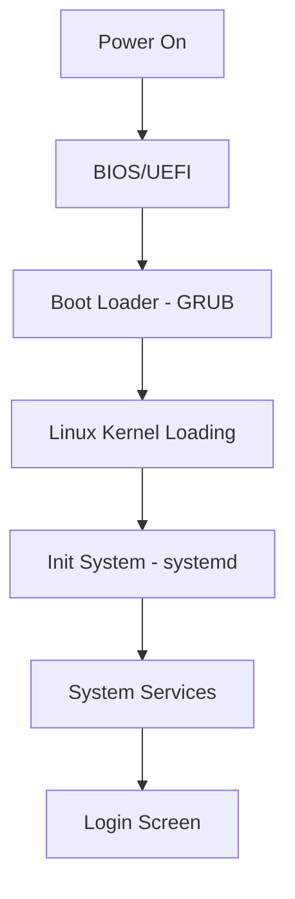

# Ubuntu Boot Problems

## Introduction

Boot problems in Ubuntu can be frustrating, especially for beginners. When your Ubuntu system fails to start properly, it may seem like a catastrophic issue, but most boot problems have straightforward solutions. This guide will walk you through understanding the Ubuntu boot process, diagnosing common boot issues, and applying practical solutions to get your system running again.

## Understanding the Ubuntu Boot Process

Before diving into troubleshooting, it's important to understand how Ubuntu boots. The process involves several stages:



1. **BIOS/UEFI Stage**: The computer's firmware initializes hardware
2. **Boot Loader Stage**: GRUB (GRand Unified Bootloader) loads
3. **Kernel Stage**: Linux kernel initializes
4. **Init System**: systemd starts system services
5. **Login Stage**: Display manager presents login screen

Knowing this sequence helps identify at which stage a boot problem is occurring.

## Common Ubuntu Boot Problems and Solutions

### 1. GRUB Issues

#### GRUB Menu Not Appearing

If the GRUB menu doesn't appear during boot:

```bash
# Hold Shift during boot to force GRUB menu to display
# Or repair GRUB from a live USB with:
sudo mount /dev/sdXY /mnt  # Mount your Ubuntu partition
sudo grub-install --boot-directory=/mnt/boot /dev/sdX
sudo update-grub
```

Replace `sdXY` with your Ubuntu partition (e.g., `sda1`) and `sdX` with your drive (e.g., `sda`).

#### GRUB Rescue Prompt

If you see "GRUB Rescue" prompt:

```
grub rescue> ls
grub rescue> ls (hd0,1)/
grub rescue> set prefix=(hd0,1)/boot/grub
grub rescue> set root=(hd0,1)
grub rescue> insmod normal
grub rescue> normal
```

After booting, repair GRUB permanently:

```bash
sudo update-grub
sudo grub-install /dev/sdX
```

### 2. Kernel Panic

A kernel panic is indicated by error messages and system freeze. Common solutions:

1. **Boot with an older kernel version**:
   - At GRUB menu, select "Advanced options for Ubuntu"
   - Choose an older kernel version

2. **Update or reinstall the kernel**:
   ```bash
   # From a successful boot or recovery mode
   sudo apt update
   sudo apt install --reinstall linux-image-generic
   sudo update-initramfs -u
   ```

### 3. Failed Mount Issues

If the system cannot mount the root filesystem:

```bash
# From recovery mode or live USB
sudo fsck -f /dev/sdXY  # Check and repair filesystem
```

### 4. Black Screen After Boot

The black screen issue often relates to graphics drivers:

1. **Access TTY terminal**:
   Press `Ctrl+Alt+F3` to access a text terminal

2. **Remove problematic graphics drivers**:
   ```bash
   sudo apt purge nvidia*  # For NVIDIA issues
   # Or
   sudo apt purge xserver-xorg-video-*  # Purge all video drivers
   sudo apt install xserver-xorg-video-nouveau  # Reinstall open source driver
   ```

3. **Update and reinstall display manager**:
   ```bash
   sudo apt update
   sudo apt install --reinstall ubuntu-desktop
   sudo systemctl restart gdm3  # Or lightdm, depending on your system
   ```

### 5. Recovery Mode

Ubuntu's recovery mode is a powerful troubleshooting tool:

1. Hold `Shift` during boot to access GRUB
2. Select "Advanced options for Ubuntu"
3. Choose a recovery mode option
4. From the recovery menu, you can:
   - Check filesystems
   - Access root shell
   - Repair broken packages
   - Update GRUB bootloader

```bash
# Common recovery mode commands
sudo dpkg --configure -a  # Fix broken packages
sudo apt update && sudo apt upgrade  # Update system
sudo apt install -f  # Fix dependencies
```

## Preventing Boot Problems

Protect yourself from future boot issues:

1. **Create bootable recovery media**:
   ```bash
   sudo apt install usb-creator-gtk
   # Then use Startup Disk Creator to make a bootable USB
   ```

2. **Keep your system updated**:
   ```bash
   sudo apt update && sudo apt upgrade
   ```

3. **Check disk space regularly**:
   ```bash
   df -h
   ```

4. **Back up your GRUB configuration**:
   ```bash
   sudo cp /boot/grub/grub.cfg ~/grub.cfg.backup
   ```

5. **Install Boot-Repair tool**:
   ```bash
   sudo add-apt-repository ppa:yannubuntu/boot-repair
   sudo apt update
   sudo apt install boot-repair
   ```

## Practical Example: Repairing a Failed Boot

Let's walk through a complete example of fixing a system that won't boot due to a corrupted GRUB configuration:

1. **Boot from Ubuntu live USB**
2. **Open terminal and identify your Ubuntu partition**:
   ```bash
   sudo fdisk -l
   # Look for Linux partition, e.g., /dev/sda2
   ```

3. **Mount your Ubuntu partition**:
   ```bash
   sudo mount /dev/sda2 /mnt
   ```

4. **Mount required virtual filesystems**:
   ```bash
   sudo mount --bind /dev /mnt/dev
   sudo mount --bind /proc /mnt/proc
   sudo mount --bind /sys /mnt/sys
   ```

5. **Chroot into the mounted system**:
   ```bash
   sudo chroot /mnt
   ```

6. **Reinstall and update GRUB**:
   ```bash
   grub-install /dev/sda
   update-grub
   ```

7. **Exit and reboot**:
   ```bash
   exit
   sudo reboot
   ```

## Advanced Boot Diagnostics

For persistent problems, diagnostic tools can help:

```bash
# View boot messages
journalctl -b

# Check boot timing information
systemd-analyze blame

# List failed services
systemctl --failed
```

## Summary

Boot problems in Ubuntu are common but usually fixable. By understanding the boot process and having a systematic approach to troubleshooting, you can resolve most issues without reinstalling your system. Remember that patience is key—hasty actions can sometimes make the problem worse.

## Additional Resources

- The Ubuntu community forums are an excellent place to seek help
- The official Ubuntu documentation contains detailed troubleshooting guides
- Boot-Repair is a valuable tool for automated boot fixes
- Creating regular system backups can save you from lengthy repair processes

## Exercises for Practice

1. Create a bootable Ubuntu USB drive and practice entering recovery mode
2. Identify the different partitions on your system using `fdisk -l`
3. Backup your current GRUB configuration
4. Learn to use the `chroot` method to repair a system from a live USB
5. Practice using `journalctl` to read boot logs and identify potential issues