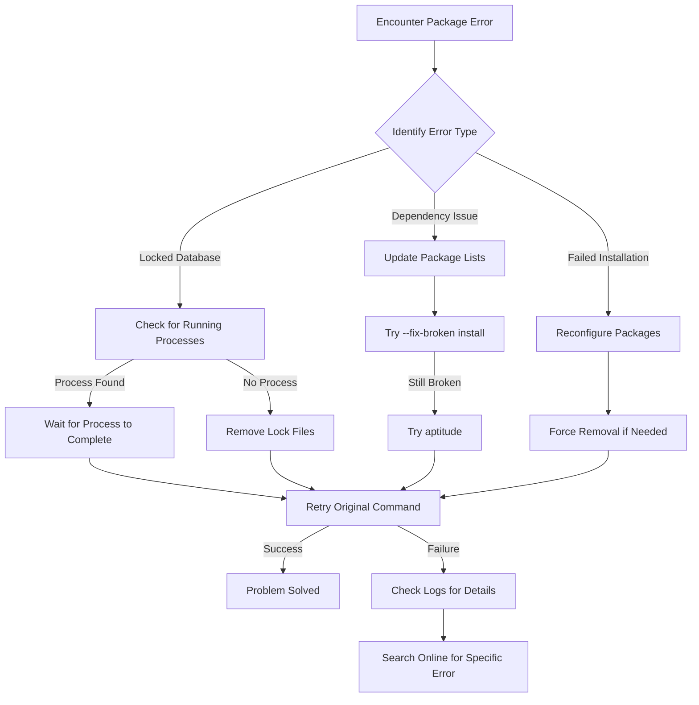

# Ubuntu Package Errors

## Introduction

Package management is a cornerstone of the Ubuntu operating system. The Advanced Package Tool (APT) and Debian Package Manager (dpkg) work together to install, update, and remove software packages on your system. However, even experienced developers occasionally encounter package-related errors that can be frustrating to resolve.

This guide will walk you through the most common Ubuntu package errors, explain why they occur, and provide step-by-step solutions to resolve them. Whether you're seeing "unmet dependencies," "broken packages," or "locked database" errors, you'll learn how to diagnose and fix these issues efficiently.

## Common Package Management Errors

### 1. Locked Database Errors

One of the most frequent errors beginners encounter occurs when multiple package management processes try to run simultaneously.

#### Error Message

```bash
E: Could not get lock /var/lib/dpkg/lock - open (11: Resource temporarily unavailable)
E: Unable to lock the administration directory (/var/lib/dpkg/), is another process using it?
```

#### Why This Happens

Ubuntu allows only one package management process to run at a time. This error typically appears when:
- Another package manager is already running (like Software Center, Update Manager, etc.)
- A previous package installation process was interrupted abnormally
- System updates are running in the background

#### Solution

1. **Wait a few minutes** - If automatic updates are running, give them time to complete.

2. **Check for running apt processes**:

```bash
ps aux | grep -i apt
```

3. **If no processes are running, remove the lock files**:

```bash
sudo rm /var/lib/apt/lists/lock
sudo rm /var/cache/apt/archives/lock
sudo rm /var/lib/dpkg/lock
sudo rm /var/lib/dpkg/lock-frontend
```

4. **Reconfigure dpkg**:

```bash
sudo dpkg --configure -a
```

### 2. Broken Packages and Dependency Issues

Dependency problems occur when packages rely on specific versions of other packages that aren't available or conflict with installed versions.

#### Error Messages

```bash
E: Unable to correct problems, you have held broken packages.
```

Or:

```bash
The following packages have unmet dependencies:
  package-name : Depends: dependency-name (>= version) but it is not going to be installed
E: Unable to correct problems, you have held broken packages.
```

#### Why This Happens

- Mixing incompatible repositories
- Interrupted upgrades
- Manual package installation that conflicts with repository versions
- Repository inconsistencies

#### Solution

**Step 1: Update package information**

```bash
sudo apt update
```

**Step 2: Attempt to fix broken packages**

```bash
sudo apt --fix-broken install
```

**Step 3: Try the dist-upgrade command**

```bash
sudo apt dist-upgrade
```

**Step 4: Use aptitude (if needed)**

```bash
sudo apt install aptitude
sudo aptitude install package-name
```

Aptitude offers interactive conflict resolution, allowing you to choose from different solutions.

### 3. Failed Package Installation or Removal

Sometimes package installation or removal fails, leaving the system in a partially configured state.

#### Error Message

```bash
dpkg: error processing package package-name (--configure):
 subprocess installed post-installation script returned error exit status 1
Errors were encountered while processing:
 package-name
```

#### Solution

1. **Reconfigure the package**:

```bash
sudo dpkg --configure -a
```

2. **Force remove the problematic package** (if necessary):

```bash
sudo dpkg --remove --force-remove-reinstreq package-name
```

3. **Clean the apt cache and try again**:

```bash
sudo apt clean
sudo apt update
sudo apt install -f
```

## Real-World Examples

### Example 1: Fixing a Broken LAMP Stack Installation

Let's say you were installing a LAMP stack (Linux, Apache, MySQL, PHP) and the process was interrupted, resulting in broken packages.

```bash
$ sudo apt install apache2 mysql-server php libapache2-mod-php php-mysql
Reading package lists... Done
Building dependency tree... Done
Some packages could not be installed. This may mean that you have
requested an impossible situation or if you are using the unstable
distribution that some required packages have not yet been created
or been moved out of Incoming.
The following information may help to resolve the situation:

The following packages have unmet dependencies:
 mysql-server : Depends: mysql-server-8.0 but it is not going to be installed
E: Unable to correct problems, you have held broken packages.
```

**Solution steps:**

```bash
# First, update the package list
$ sudo apt update

# Try to fix broken packages
$ sudo apt --fix-broken install

# If that doesn't work, try using aptitude for interactive resolution
$ sudo apt install aptitude
$ sudo aptitude install mysql-server

# Aptitude will offer resolution options (example output):
# The following actions will resolve these dependencies:

# Keep the following packages at their current version:
# 1) mysql-server [Not Installed]

# Accept this solution? [Y/n/q/?]
# n

# The following actions will resolve these dependencies:

# Install the following packages:
# 1) mysql-server-8.0 [8.0.28-0ubuntu4 (jammy)]

# Accept this solution? [Y/n/q/?]
# Y
```

### Example 2: Resolving Package Conflicts After Adding a PPA

Imagine you added a PPA for a newer version of an application, but it conflicts with existing packages:

```bash
$ sudo add-apt-repository ppa:graphics-drivers/ppa
$ sudo apt update
$ sudo apt install nvidia-driver-510
Reading package lists... Done
Building dependency tree... Done
Some packages could not be installed. This may mean that you have
requested an impossible situation or if you are using the unstable
distribution that some required packages have not yet been created
or been moved out of Incoming.
The following information may help to resolve the situation:

The following packages have unmet dependencies:
 nvidia-driver-510 : Depends: libnvidia-gl-510 (= 510.60.02-0ubuntu1) but it is not going to be installed
                     Depends: libnvidia-extra-510 (= 510.60.02-0ubuntu1) but it is not going to be installed
E: Unable to correct problems, you have held broken packages.
```

**Solution:**

```bash
# Check what's causing the conflict
$ apt-cache policy libnvidia-gl-510

# Remove conflicting packages
$ sudo apt remove nvidia-driver-*

# Clean up
$ sudo apt autoremove
$ sudo apt clean

# Try with specific version number
$ sudo apt install nvidia-driver-510=510.60.02-0ubuntu1
```

## Using `apt` vs `apt-get`

Ubuntu provides multiple package management commands. Here's a quick comparison:

| Command | Purpose | Beginner-friendly |
| ------- | ------- | ----------------- |
| `apt` | Modern command combining common operations | ✅ |
| `apt-get` | Lower-level package management | ⚠️ Requires more knowledge |
| `aptitude` | Interactive dependency resolver | ✅ For resolving conflicts |
| `dpkg` | Direct package manipulation | ⚠️ Lower level than apt |

For most beginners, sticking with `apt` commands is recommended.

```bash
# Update package lists
sudo apt update

# Upgrade installed packages
sudo apt upgrade

# Install a package
sudo apt install package-name

# Remove a package
sudo apt remove package-name

# Search for a package
apt search search-term
```

## Package Management Workflow

The following diagram shows the typical workflow for diagnosing and resolving package errors in Ubuntu:



## Summary

Package management errors in Ubuntu can be frustrating but are usually resolvable with a systematic approach:

1. **Understand the error message** - Different types of errors require different solutions
2. **Check for common causes** - Locked databases, broken dependencies, and interrupted installations
3. **Apply the appropriate fix** - From simply waiting to using advanced tools like aptitude
4. **Prevent future issues** - Avoid mixing incompatible repositories and don't interrupt installations

By following the steps in this guide, you should be able to resolve most package-related issues in Ubuntu and maintain a healthy system for your development work.

## Additional Resources

- [Ubuntu Documentation on APT](https://help.ubuntu.com/community/AptGet/Howto)
- [Debian Package Management](https://www.debian.org/doc/manuals/debian-reference/ch02.en.html)
- [APT Command Cheat Sheet](https://itsfoss.com/apt-command-guide/)

## Practice Exercises

1. **Exercise 1**: Intentionally create a locked database situation by opening multiple terminal windows and running `sudo apt update` in one while trying to install a package in another. Then practice resolving the lock.

2. **Exercise 2**: Create a virtual machine with Ubuntu, then practice adding and removing PPAs to see how they can sometimes create dependency conflicts.

3. **Exercise 3**: Research and create a list of essential apt commands that every Ubuntu developer should know, with examples of when to use each.