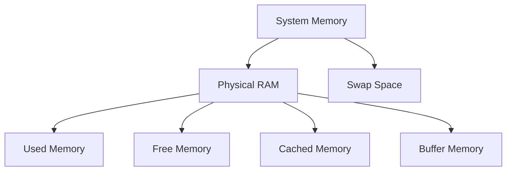

# Ubuntu Memory Problems

Memory issues are among the most common problems Ubuntu users face. Whether you're running a desktop environment, server, or development machine, understanding how to diagnose and fix memory problems is an essential skill for any Ubuntu user.

## Introduction

Memory in Ubuntu (and other Linux distributions) is managed by the kernel in a complex system that balances physical RAM, swap space, and various caching mechanisms. When these systems don't work as expected, your computer might slow down, applications may crash, or your system could become unresponsive.

In this guide, we'll cover:
- How memory works in Ubuntu
- Common memory problems and their symptoms
- Tools to diagnose memory issues
- Solutions for various memory-related problems
- Preventive measures to avoid memory issues

## Understanding Memory Management in Ubuntu

Before diving into troubleshooting, it's important to understand the basics of how Ubuntu manages memory.

### Types of Memory in Ubuntu



- **Physical RAM**: The actual memory hardware in your computer.
- **Swap Space**: Portion of your hard drive used as virtual memory when RAM is full.
- **Used Memory**: Memory actively used by applications and the system.
- **Free Memory**: Memory not currently in use.
- **Cached Memory**: Memory storing recently accessed data for quicker retrieval.
- **Buffer Memory**: Memory used for temporary storage of raw disk blocks.

### Memory Allocation Process

When an application requests memory:

1. The kernel checks if there's enough free RAM available
2. If RAM is available, it's allocated to the application
3. If RAM is insufficient, the kernel:
   - First tries to free up cached memory
   - Then uses swap space if necessary
   - Finally, in extreme cases, invokes the OOM (Out of Memory) killer to terminate processes

## Common Memory Problems in Ubuntu

### 1. High Memory Usage

**Symptoms:**
- System becomes sluggish
- Applications take longer to start
- Frequent disk activity (swap thrashing)

**Diagnosis:**

Use the `free` command to check memory usage:

```bash
free -h
```

Sample output:
```
              total        used        free      shared  buff/cache   available
Mem:           7.7G        4.2G        1.2G        289M        2.3G        2.9G
Swap:          2.0G        128M        1.9G
```

Use `top` or `htop` to identify memory-hungry processes:

```bash
top
```

Or install and use htop for a more user-friendly interface:

```bash
sudo apt install htop
htop
```

### 2. Memory Leaks

**Symptoms:**
- A specific application's memory usage keeps increasing over time
- System performance degrades the longer the application runs
- Application eventually crashes with an "out of memory" error

**Diagnosis:**

Use `ps` combined with `watch` to monitor a specific process:

```bash
watch -n 1 "ps -p PID -o pid,vsz,rss,cmd"
```

Replace `PID` with the actual process ID. This updates every second showing:
- VSZ: Virtual memory size
- RSS: Resident Set Size (actual RAM used)

### 3. Out of Memory (OOM) Errors

**Symptoms:**
- Applications crash unexpectedly
- System logs show "Out of memory" errors
- Kernel kills processes automatically

**Diagnosis:**

Check system logs for OOM events:

```bash
journalctl | grep -i "out of memory"
```

Or examine kernel logs:

```bash
dmesg | grep -i "out of memory"
```

### 4. Swap Thrashing

**Symptoms:**
- High disk activity
- System becomes extremely slow
- GUI might freeze or respond very slowly

**Diagnosis:**

Monitor swap usage with `vmstat`:

```bash
vmstat 1
```

Look at the "si" and "so" columns which show swap-in and swap-out activity. Values consistently above 0 indicate swap thrashing.

## Tools for Diagnosing Memory Issues

### 1. Basic Command-line Tools

#### The `free` Command

```bash
free -h
```

The `-h` flag shows memory in human-readable format.

#### The `top` Command

```bash
top
```

Press `Shift + M` to sort processes by memory usage.

#### The `ps` Command

```bash
ps aux --sort=-%mem | head -n 10
```

This shows the top 10 memory-consuming processes.

### 2. Advanced Diagnostic Tools

#### Install and Use `htop`

```bash
sudo apt install htop
htop
```

#### Memory Statistics with `vmstat`

```bash
vmstat 1 10
```

This runs vmstat every second for 10 samples.

#### Detailed Memory Information

```bash
cat /proc/meminfo
```

#### Process-specific Memory Map

```bash
pmap -x PID
```

Replace `PID` with the actual process ID.

## Solutions for Common Memory Problems

### 1. Addressing High Memory Usage

#### Close Unused Applications

Identify memory-intensive applications using `top` or `htop` and close those you don't need:

```bash
kill PID
```

Or more gracefully:

```bash
killall application_name
```

#### Adjust Application Settings

Many applications allow you to configure their memory usage. For example, in Firefox:
1. Enter `about:config` in the address bar
2. Search for `browser.cache.memory.capacity`
3. Adjust the value to a lower number (in KB)

#### Optimize Desktop Environment

If you're using a resource-heavy desktop environment like GNOME, consider:
- Disabling unnecessary extensions
- Switching to a lighter desktop environment like XFCE or LXDE:

```bash
sudo apt install xubuntu-desktop
```

### 2. Fixing Memory Leaks

#### Update Software

Memory leaks are often bugs that get fixed in updates:

```bash
sudo apt update
sudo apt upgrade
```

#### Restart Affected Applications

For temporary relief, restart applications showing signs of memory leaks.

#### Use Alternative Applications

If a specific application consistently has memory leaks, consider alternatives.

### 3. Managing Swap Space

#### Check Swap Status

```bash
swapon --show
```

#### Create or Resize Swap File

If you need more swap space:

```bash
# Create a 2GB swap file
sudo fallocate -l 2G /swapfile
sudo chmod 600 /swapfile
sudo mkswap /swapfile
sudo swapon /swapfile
```

To make it permanent, add to `/etc/fstab`:

```bash
echo '/swapfile none swap sw 0 0' | sudo tee -a /etc/fstab
```

#### Adjust Swappiness

Swappiness controls how aggressively Ubuntu uses swap space:

```bash
# Check current value
cat /proc/sys/vm/swappiness

# Set temporarily to a lower value (e.g., 10)
sudo sysctl vm.swappiness=10

# Make permanent by editing /etc/sysctl.conf
sudo nano /etc/sysctl.conf

# Add this line:
# vm.swappiness=10
```

Lower values (like 10) make the system use swap less aggressively.

### 4. Handling Out of Memory (OOM) Issues

#### Adjust OOM Killer Behavior

You can adjust the OOM score for important processes:

```bash
# Make process less likely to be killed
echo -1000 > /proc/PID/oom_score_adj

# Make process more likely to be killed
echo 1000 > /proc/PID/oom_score_adj
```

#### Increase RAM

If you consistently face OOM issues, consider upgrading your physical RAM if possible.

## Preventive Measures

### 1. System Monitoring

Set up ongoing monitoring with tools like:

```bash
sudo apt install sysstat
```

Enable collection in `/etc/default/sysstat`:

```bash
sudo nano /etc/default/sysstat
# Change ENABLED="false" to ENABLED="true"
sudo systemctl restart sysstat
```

### 2. Resource Limits with `cgroups`

Control group limits can be set for applications:

```bash
# Create a memory-limited cgroup
sudo cgcreate -g memory:limited_group

# Set a memory limit of 1GB
sudo cgset -r memory.limit_in_bytes=1G limited_group

# Run a command within this cgroup
sudo cgexec -g memory:limited_group command
```

### 3. Regular System Maintenance

Keep your system in good shape:

```bash
# Remove unused packages
sudo apt autoremove

# Clean package cache
sudo apt clean
```

## Real-World Applications

### Case Study 1: Development Server

A typical development server running multiple services (database, web server, and application server) was experiencing slowdowns during peak hours.

**Diagnosis:**
```bash
free -h
```
Showed nearly full RAM and active swap usage.

**Solution:**
1. Adjusted database memory settings in `/etc/mysql/mysql.conf.d/mysqld.cnf`:
   ```
   innodb_buffer_pool_size = 256M  # Reduced from 1G
   ```

2. Modified Apache settings in `/etc/apache2/mods-enabled/mpm_prefork.conf`:
   ```
   <IfModule mpm_prefork_module>
       StartServers             2
       MinSpareServers          2
       MaxSpareServers          5
       MaxRequestWorkers       25
       MaxConnectionsPerChild 1500
   </IfModule>
   ```

3. Added monitoring with `sysstat` to track memory usage patterns.

**Result:** Server stabilized with consistent performance and reduced memory pressure.

### Case Study 2: Desktop System for Video Editing

A desktop system used for video editing would freeze during rendering.

**Diagnosis:**
```bash
dmesg | grep -i "out of memory"
```
Showed the video editor was being killed by the OOM killer.

**Solution:**
1. Increased swap space:
   ```bash
   sudo fallocate -l 8G /swapfile
   sudo chmod 600 /swapfile
   sudo mkswap /swapfile
   sudo swapon /swapfile
   ```

2. Adjusted OOM priority for the video editor:
   ```bash
   # Find the PID first
   pidof kdenlive
   # Then adjust OOM score
   sudo echo -900 > /proc/[PID]/oom_score_adj
   ```

3. Closed unnecessary applications before editing sessions.

**Result:** Video rendering completed successfully without system freezes.

## Summary

Memory issues in Ubuntu can manifest in various ways, from simple slowdowns to complete system freezes. By understanding how memory works, using the right diagnostic tools, and applying appropriate solutions, you can keep your Ubuntu system running smoothly.

Remember these key points:
- Use tools like `free`, `top`, and `htop` to identify memory issues
- Adjust application settings to optimize memory usage
- Use swap space wisely by configuring swappiness
- Keep your system updated to fix memory leaks
- Consider hardware upgrades if consistently facing memory limitations

## Additional Resources

### Further Reading
- The Ubuntu Wiki Memory Management section
- Linux Kernel Documentation on Memory Management
- The "Linux System Administration Handbook"

### Practice Exercises
1. Use `free`, `top`, and `htop` to examine your current system memory usage
2. Identify your top three memory-consuming applications
3. Create a small test script that gradually consumes memory to practice using the monitoring tools
4. Experiment with different swappiness values and observe the impact on system performance
5. Set up a simple alert script that notifies you when memory usage exceeds a threshold