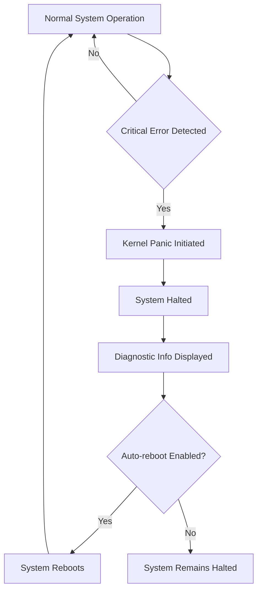

# Ubuntu Kernel Panics

## Introduction

When your Ubuntu system suddenly freezes, displays cryptic error messages, or reboots unexpectedly, you might be experiencing a kernel panic. A kernel panic is a critical system error detected by the Linux kernel when it encounters a situation it cannot safely recover from. Think of it as the Linux equivalent of the infamous "Blue Screen of Death" in Windows systems.

Kernel panics can be intimidating for beginners, but understanding what they are, what causes them, and how to resolve them is an essential skill for any Ubuntu user or system administrator. This guide will walk you through the fundamentals of kernel panics in Ubuntu, how to diagnose them, and most importantly, how to fix and prevent them.

## What Is a Kernel Panic?

The kernel is the core component of the operating system that manages system resources and acts as a bridge between software applications and hardware. When the kernel encounters a critical error that compromises system stability or security, it initiates a kernel panic as a protective measure.

During a kernel panic:

1. The system stops all normal operations
2. Diagnostic information is displayed on the screen or saved to logs
3. Depending on configuration, the system may automatically reboot



## Common Causes of Kernel Panics

Understanding what typically causes kernel panics can help you diagnose and prevent them:

### Hardware Issues

- **Faulty RAM**: Memory errors are a leading cause of kernel panics
- **Overheating**: CPU or GPU thermal issues can trigger system protection mechanisms
- **Power supply problems**: Unstable power can cause hardware components to behave unpredictably
- **Failing hard drives**: Storage device errors can corrupt system files

### Software Issues

- **Incompatible or buggy drivers**: Particularly graphics or network drivers
- **Kernel module conflicts**: When kernel extensions interfere with each other
- **System updates gone wrong**: Incomplete or corrupted system updates
- **Filesystem corruption**: Damage to critical system files

## Identifying a Kernel Panic

Here are common symptoms that indicate you're experiencing a kernel panic:

1. The system freezes completely and becomes unresponsive
2. A screen with error messages appears, often with "Kernel panic" explicitly stated
3. Text output containing memory addresses, register values, and stack traces
4. Automatic system reboot without warning

Example kernel panic message:

```
Kernel panic - not syncing: Fatal exception in interrupt
CPU: 2 PID: 0 Comm: swapper/2 Not tainted 5.4.0-42-generic #46-Ubuntu
Hardware name: To Be Filled By O.E.M. To Be Filled By O.E.M./H110M-S2, BIOS F22 05/25/2018
Call Trace:
 dump_stack+0x6d/0x9a
 panic+0x101/0x2e3
 __report_bad_irq+0x3e/0xae
 note_interrupt+0x23c/0x280
 handle_irq_event_percpu+0x5f/0x70
 handle_irq_event+0x3c/0x60
 handle_fasteoi_irq+0x94/0x160
 generic_handle_irq+0x24/0x40
 __handle_domain_irq+0x5c/0xb0
 gic_handle_irq+0x5c/0x120
 __irq_svc+0x5c/0x78
 arch_cpu_idle+0x14/0x20
 default_idle_call+0x24/0x30
 do_idle+0x170/0x1e0
 cpu_startup_entry+0x14/0x20
 secondary_start_kernel+0x168/0x174
 rest of stack trace not available
```

## Diagnosing Kernel Panics

When troubleshooting kernel panics, follow these steps to gather diagnostic information:

### 1. Check System Logs

Ubuntu stores kernel panic information in system logs. After rebooting, check these files:

```bash
# View kernel messages
sudo dmesg | grep -i panic

# Check system logs
sudo journalctl -k | grep -i panic

# Examine system log file
sudo less /var/log/syslog
```

### 2. Enable Kernel Crash Dumps

To capture detailed information when panics occur, install and configure the kernel crash dump utility:

```bash
# Install the crash dump utility
sudo apt install linux-crashdump

# When prompted, select 'Yes' to enable kernel crash dumps
```

This configures your system to save crash dumps to `/var/crash/` for later analysis.

### 3. Use Diagnostic Tools

Several tools can help analyze kernel problems:

```bash
# Check hardware for memory issues
sudo apt install memtest86+

# Verify filesystem integrity
sudo fsck -f /dev/sdXY  # Replace sdXY with your partition

# Monitor system temperature
sudo apt install lm-sensors
sudo sensors-detect
sudo sensors
```

## Common Kernel Panic Solutions

Now that you understand how to diagnose kernel panics, let's explore practical solutions:

### Memory Issues

If you suspect RAM problems:

1. Run a memory test using memtest86+:

```bash
# Reboot and select memtest86+ from the GRUB menu
# Or run it directly (will run at next boot)
sudo memtester 1024 5  # Test 1GB of RAM for 5 iterations
```

2. If issues are found, try:
   - Reseating the RAM modules
   - Using different memory slots
   - Replacing faulty memory

### Driver Problems

Problematic drivers often cause kernel panics:

```bash
# If the issue started after updating, boot into an older kernel from GRUB
# Then blacklist the suspected module
echo "blacklist module_name" | sudo tee -a /etc/modprobe.d/blacklist.conf
```

To identify which module might be causing issues:

```bash
# Look for error messages related to specific modules
sudo dmesg | grep -i "error\|fail\|fatal"
```

### System Update Issues

If a kernel panic occurs after a system update:

1. Boot into recovery mode:
   - Restart your computer
   - Hold the Shift key during boot to access GRUB
   - Select "Advanced options for Ubuntu"
   - Choose a recovery mode option

2. Fix package issues:

```bash
# Once in recovery mode, select "Enable networking" then "Root shell"
apt update
apt --fix-broken install
apt upgrade
```

### Filesystem Corruption

To repair filesystem issues:

```bash
# Check and repair filesystem (run from recovery mode or live USB)
sudo fsck -f /dev/sdXY  # Replace sdXY with your partition

# If your root partition needs checking, do it from recovery mode or live USB
```

## Preventing Kernel Panics

The best approach to kernel panics is preventing them in the first place:

1. **Keep your system updated**:
```bash
sudo apt update && sudo apt upgrade
```

2. **Be cautious with third-party software**:
   - Only install drivers from trusted sources
   - Research compatibility before installing new hardware

3. **Monitor system health**:
```bash
# Install system monitoring tools
sudo apt install htop iotop
```

4. **Ensure adequate cooling**:
   - Clean dust from fans and heat sinks
   - Ensure proper airflow in your computer case

5. **Use stable power**:
   - Consider a UPS (Uninterruptible Power Supply)
   - Check your power supply unit's capacity meets system demands

## Real-World Example: Resolving a GPU Driver Kernel Panic

Let's walk through a common scenario: kernel panics after installing a new GPU driver.

### Scenario
After installing the latest NVIDIA graphics driver on Ubuntu, your system crashes with a kernel panic during boot.

### Solution

1. Boot into recovery mode (hold Shift during boot, select recovery)

2. Enable networking in the recovery menu

3. Access root shell and remove the problematic driver:

```bash
# Remove the NVIDIA driver
sudo apt purge nvidia*

# Reinstall the open-source Nouveau driver
sudo apt install xserver-xorg-video-nouveau

# Update initramfs
sudo update-initramfs -u
```

4. Reboot and the system should start normally:

```bash
sudo reboot
```

5. Once stable, research the correct driver version for your hardware and install it:

```bash
# Check recommended driver
ubuntu-drivers devices

# Install recommended driver
sudo ubuntu-drivers autoinstall
# OR for a specific version
# sudo apt install nvidia-driver-XXX  # Replace XXX with version number
```

## Summary

Kernel panics in Ubuntu can be intimidating but are manageable with the right approach:

1. **Understand the symptoms** - system freeze, error messages, unexpected reboots
2. **Diagnose systematically** - check logs, run hardware tests, identify patterns
3. **Apply targeted solutions** - address hardware issues, fix driver conflicts, repair system files
4. **Prevent future occurrences** - maintain regular updates, monitor system health, use stable hardware

While kernel panics can be frustrating, they're often your system's way of protecting itself from potential damage. With the knowledge and tools from this guide, you're well-equipped to diagnose, resolve, and prevent kernel panics in your Ubuntu system.

## Additional Resources

For further learning about kernel panics and system troubleshooting:

- The Ubuntu community forums: [https://ubuntuforums.org/](https://ubuntuforums.org/)
- The kernel documentation: [https://www.kernel.org/doc/](https://www.kernel.org/doc/)
- Linux system administration books and courses

## Practice Exercises

1. Set up kernel crash dumps on a test system and analyze the resulting reports
2. Create a recovery USB drive and practice booting into it to fix a simulated system issue
3. Research and document the most common kernel panic causes for your specific hardware
4. Configure automated system logs backup to help with future troubleshooting

Remember that each kernel panic provides an opportunity to learn more about your system and improve your troubleshooting skills!