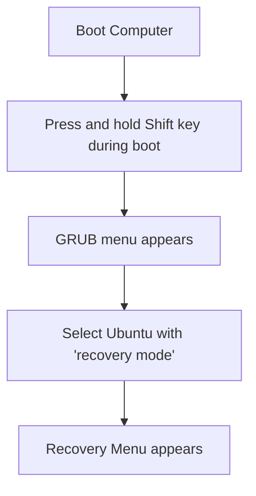

# Ubuntu Recovery Mode

## Introduction

Ubuntu Recovery Mode is a specialized boot option that provides essential troubleshooting tools when your system encounters problems. Think of it as a "safe mode" that loads a minimal Ubuntu environment with fewer services, allowing you to diagnose and repair issues that prevent normal system operation.

Recovery Mode is particularly useful when:
- Your system won't boot normally
- You need to repair broken packages
- You need to reset a forgotten password
- You need to access a root shell for advanced troubleshooting
- Graphics drivers are causing boot failures
- You need to reconfigure system settings

This guide will walk you through accessing and using Ubuntu Recovery Mode to solve common problems you might encounter as a beginner.

## Accessing Recovery Mode

### Method 1: During Boot (GRUB Menu)

The most common way to access Recovery Mode is through the GRUB boot menu:

1. Start or restart your Ubuntu system
2. When the GRUB menu appears, select the Ubuntu entry with "(recovery mode)" appended
   - If the GRUB menu doesn't appear automatically, press and hold the `Shift` key during boot (for BIOS systems) or `Esc` key (for UEFI systems)



### Method 2: Forcing GRUB to Appear

If you can't see the GRUB menu, you can force it to appear by modifying GRUB settings:

1. Open Terminal in a working Ubuntu system
2. Edit the GRUB configuration file:

```bash
sudo nano /etc/default/grub
```

3. Find and modify these lines:

```bash
# Comment out this line to always show the menu
# GRUB_TIMEOUT_STYLE=hidden

# Set timeout to a higher value (e.g., 10 seconds)
GRUB_TIMEOUT=10
```

4. Save the file (Ctrl+O, then Enter) and exit (Ctrl+X)
5. Update GRUB configuration:

```bash
sudo update-grub
```

## Using the Recovery Menu

Once you boot into Recovery Mode, you'll see a menu with several options:

### 1. resume - Resume normal boot

This option exits Recovery Mode and continues booting normally.

### 2. clean - Clean up disk space

This option removes unnecessary files to free up disk space, which can be helpful if your system is having issues due to a full disk.

```bash
# What happens behind the scenes:
apt-get clean
```

### 3. dpkg - Repair broken packages

This option repairs broken package installations, which is one of the most common causes of Ubuntu system problems.

```bash
# What happens behind the scenes:
dpkg --configure -a
apt-get update
apt-get -f install
```

Example scenario:
```
Recovery Menu > dpkg

Updating packages...
Fixing broken dependencies...
Setting up package-name (1.2.3-4ubuntu1)...
Processing completed successfully.
Press Enter to continue.
```

### 4. fsck - Check filesystem

This runs a filesystem check to identify and repair disk errors.

```bash
# What happens behind the scenes:
fsck -f /dev/sdaX  # Where X is your root partition
```

Example output:
```
fsck from util-linux 2.36.1
e2fsck 1.46.2 (28-Feb-2021)
/dev/sda1: clean, 123456/7654321 files, 1234567/7654321 blocks
```

### 5. grub - Update GRUB bootloader

This updates your GRUB bootloader configuration, which can resolve boot-related issues.

```bash
# What happens behind the scenes:
update-grub
```

### 6. network - Enable networking

This enables network access in Recovery Mode, which is necessary for options that require internet connectivity.

```bash
# What happens behind the scenes:
service networking start
```

### 7. root - Drop to root shell prompt

This provides access to a root shell for advanced troubleshooting and manual repairs.

```bash
# You'll see something like:
root@ubuntu:~# 
```

### 8. system-summary - System summary

This displays a summary of your system information for diagnostic purposes.

## Common Recovery Tasks

### Resetting a Forgotten Password

If you've forgotten your user password, you can reset it using Recovery Mode:

1. Boot into Recovery Mode
2. Select "root" to get a root shell
3. Enable write access to the file system:

```bash
mount -o remount,rw /
```

4. Reset the password for your user:

```bash
passwd username
```

5. Enter and confirm a new password
6. Type `exit` to return to the recovery menu
7. Select "resume" to continue normal boot

### Fixing Graphics Driver Issues

If you're experiencing black screens or graphics issues after installing drivers:

1. Boot into Recovery Mode
2. Select "root" to get a root shell
3. Enable networking:

```bash
service networking start
```

4. Remove problematic graphics drivers (example for NVIDIA):

```bash
apt-get purge nvidia*
```

5. Reinstall the X server:

```bash
apt-get install --reinstall xserver-xorg
```

6. Reconfigure the X server:

```bash
dpkg-reconfigure xserver-xorg
```

7. Reboot the system:

```bash
reboot
```

### Freeing Disk Space

When your system is low on disk space:

1. Boot into Recovery Mode
2. Select "root" to get a root shell
3. Check disk usage:

```bash
df -h
```

4. Clean package cache:

```bash
apt-get clean
```

5. Remove old kernels (be careful and keep at least one working kernel):

```bash
dpkg --list | grep linux-image
apt-get purge linux-image-x.x.x-xx-generic
```

6. Remove unnecessary packages:

```bash
apt-get autoremove
```

## Advanced Recovery Mode Techniques

### Chroot into Your System

For advanced troubleshooting, you can use "chroot" to work within your installed system from a live USB:

1. Boot from Ubuntu Live USB
2. Open Terminal
3. Mount your system partitions:

```bash
sudo mount /dev/sdaX /mnt  # Replace X with your root partition
sudo mount /dev/sdaY /mnt/boot  # If you have a separate boot partition
sudo mount --bind /dev /mnt/dev
sudo mount --bind /proc /mnt/proc
sudo mount --bind /sys /mnt/sys
```

4. Chroot into your system:

```bash
sudo chroot /mnt
```

5. Perform necessary repairs
6. Exit chroot when done:

```bash
exit
```

### Manually Update Initramfs

If you're experiencing issues with the initial RAM disk:

1. Boot into Recovery Mode
2. Select "root" to get a root shell
3. Enable write access:

```bash
mount -o remount,rw /
```

4. Update initramfs for all kernels:

```bash
update-initramfs -u -k all
```

### Restore GRUB After Windows Overwrites It

If Windows has overwritten your GRUB bootloader:

1. Boot from Ubuntu Live USB
2. Open Terminal
3. Add repository for boot-repair:

```bash
sudo add-apt-repository ppa:yannubuntu/boot-repair
sudo apt-get update
sudo apt-get install boot-repair
boot-repair
```

4. Click "Recommended repair" in the boot-repair window

## Summary

Ubuntu Recovery Mode is an essential tool in your troubleshooting arsenal. It provides access to powerful utilities that can help you recover from a wide range of system issues, from boot problems to package management errors. As you become more comfortable with Linux, you'll find Recovery Mode to be an invaluable resource for maintaining and repairing your Ubuntu system.

## Additional Resources

- [Ubuntu Official Documentation on Recovery Mode](https://help.ubuntu.com/community/RecoveryMode)
- [Ubuntu Forums](https://ubuntuforums.org/) - A great place to get help with specific issues
- [Ask Ubuntu](https://askubuntu.com/) - Question and answer site for Ubuntu users

## Practice Exercises

1. **Basic Recovery**: Boot into Recovery Mode and explore each menu option without making changes.
2. **Package Repair**: Intentionally break a package (in a test environment), then use Recovery Mode to repair it.
3. **Disk Space Management**: Use Recovery Mode to identify large files and free up disk space.
4. **Password Recovery**: Create a test user account, then practice using Recovery Mode to reset its password.