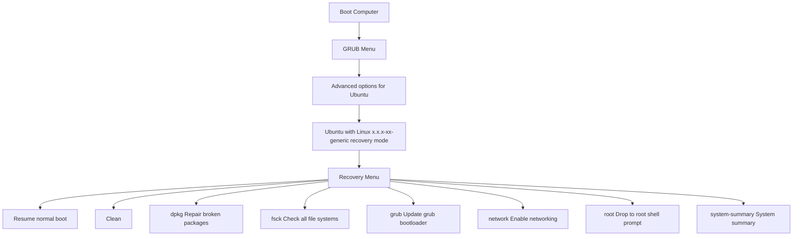
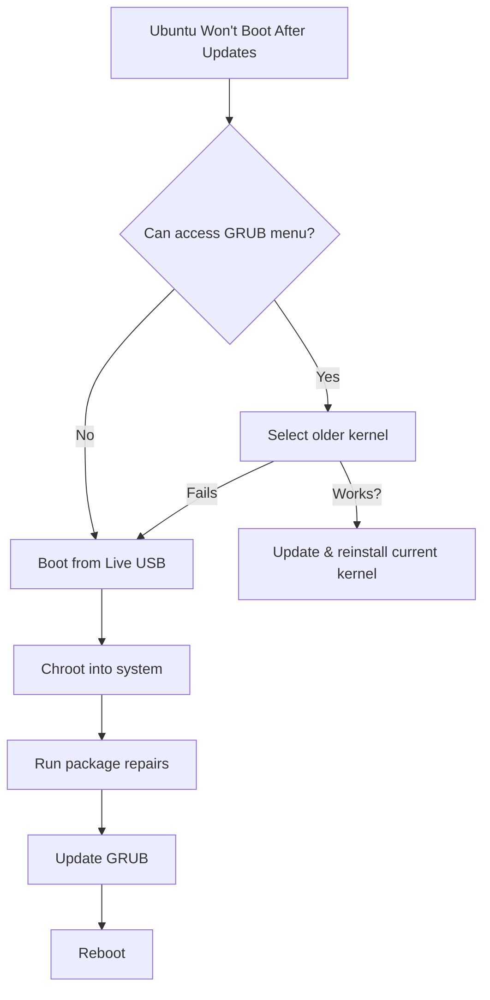

# Ubuntu System Rescue

When your Ubuntu system refuses to boot or experiences critical issues, knowing how to rescue it becomes an essential skill. This guide will walk you through the various methods and tools available for Ubuntu system rescue operations.

## Introduction

System rescue in Ubuntu refers to the process of recovering your operating system when it encounters serious problems that prevent normal operation. These issues might include:

- Failed boot process
- Corrupted file systems
- Broken package installations
- Misconfigured system files
- Hardware detection problems
- Kernel panic situations

Learning rescue techniques not only helps you recover from disasters but also provides deeper understanding of how Ubuntu works under the hood.

## Rescue Tools and Methods

### Ubuntu Recovery Mode

The recovery mode is your first line of defense when Ubuntu won't boot normally.

#### Accessing Recovery Mode

1. Restart your computer
2. When the GRUB menu appears, select "Advanced options for Ubuntu"
3. Choose the kernel version with "(recovery mode)" appended to it
4. You'll see the Recovery Menu with several options



#### Recovery Menu Options

- **Resume**: Continue normal boot process
- **Clean**: Free up disk space
- **dpkg**: Repair broken packages
- **fsck**: Check and repair filesystem
- **grub**: Update GRUB bootloader
- **network**: Enable networking
- **root**: Drop to root shell prompt
- **system-summary**: Display system information

#### Using Root Shell for Repairs

The root shell option is particularly useful for advanced repairs:

```bash
# Check and repair file system
fsck /dev/sda1

# Remount root filesystem with write permissions
mount -o remount,rw /

# Fix broken package issues
apt update
apt --fix-broken install

# Reconfigure packages
dpkg-reconfigure package-name
```

### Ubuntu Live USB

When recovery mode isn't accessible or sufficient, a Live USB becomes your next best option.

#### Creating a Live USB

1. Download the Ubuntu ISO from the official website
2. Create a bootable USB using tools like:
   - Etcher (cross-platform)
   - Rufus (Windows)
   - Startup Disk Creator (Ubuntu)
   - dd command (Linux)

```bash
# Example using dd on Linux
sudo dd bs=4M if=path/to/ubuntu.iso of=/dev/sdX status=progress oflag=sync
```

#### Booting from Live USB

1. Insert the USB drive into the affected computer
2. Restart and access your BIOS/UEFI boot menu (usually F12, F2, or Del key)
3. Select your USB device to boot from
4. Choose "Try Ubuntu without installing"

#### Rescue Operations from Live USB

##### File Recovery

Mount your system drives to recover important files:

```bash
# Create mount point
sudo mkdir /mnt/system

# Mount the root partition
sudo mount /dev/sdXY /mnt/system

# For separate home partition
sudo mount /dev/sdXZ /mnt/system/home

# Access your files
cd /mnt/system/home/username
```

##### Repair GRUB Bootloader

```bash
# Mount necessary filesystems
sudo mount /dev/sdXY /mnt/system
sudo mount --bind /dev /mnt/system/dev
sudo mount --bind /proc /mnt/system/proc
sudo mount --bind /sys /mnt/system/sys

# Chroot into your system
sudo chroot /mnt/system

# Update and reinstall GRUB
update-grub
grub-install /dev/sdX

# Exit chroot and reboot
exit
sudo reboot
```

##### Fix Package Management

```bash
# Inside chroot environment
apt update
apt --fix-broken install
dpkg --configure -a
apt clean
apt autoremove
```

### Boot-Repair Tool

Boot-Repair is a specialized tool for fixing boot issues in Ubuntu and other Linux distributions.

#### Installing Boot-Repair on Live USB

```bash
sudo add-apt-repository ppa:yannubuntu/boot-repair
sudo apt update
sudo apt install boot-repair
```

#### Using Boot-Repair

1. Launch Boot-Repair: `boot-repair`
2. Choose "Recommended repair" for automatic fixes
3. Follow the on-screen instructions
4. Boot-Repair will generate a URL with diagnostic information if needed

### SystemRescue Live Environment

For advanced users, SystemRescue (formerly SystemRescueCd) provides specialized tools beyond what Ubuntu Live offers.

#### Key Features

- Lightweight environment focused on system repair
- Advanced partitioning tools
- File recovery utilities
- Network diagnostics
- Password reset capabilities

## Common Rescue Scenarios

### Scenario 1: Ubuntu Won't Boot After Updates



#### Step-by-Step Solution:

1. Boot to GRUB menu and select an older kernel version
2. If successful, open terminal and run:

```bash
sudo apt update
sudo apt install --reinstall linux-generic
sudo update-grub
```

3. If older kernel doesn't work, use Live USB to chroot and fix:

```bash
# From Live USB after mounting and chrooting
apt update
apt install --reinstall linux-generic
update-grub
```

### Scenario 2: Fixing a Corrupted File System

1. Boot to recovery mode or Live USB
2. Run file system check:

```bash
# From recovery mode
fsck -f /dev/sdXY

# From Live USB (don't run fsck on mounted partitions)
sudo umount /dev/sdXY
sudo fsck -f /dev/sdXY
```

3. If bad blocks are suspected:

```bash
sudo badblocks -v /dev/sdXY > bad-blocks
sudo fsck -l bad-blocks /dev/sdXY
```

### Scenario 3: Resetting a Forgotten Password

1. Boot to recovery mode
2. Select root shell
3. Remount filesystem with write permissions:

```bash
mount -o remount,rw /
```

4. Change the user's password:

```bash
passwd username
```

5. Reboot:

```bash
reboot
```

### Scenario 4: Recovering from a "No Space Left" Error

When your system crashes due to filled disk space:

1. Boot to recovery mode
2. Select "Clean" option or use root shell
3. Identify large files:

```bash
du -h --max-depth=1 /var
du -h --max-depth=1 /var/log
```

4. Clean up old logs and cache:

```bash
apt clean
journalctl --vacuum-time=3d
find /var/log -type f -name "*.gz" -delete
```

## Advanced Rescue Techniques

### Using Chroot for System Repair

Chroot ("change root") is a powerful technique that allows you to operate inside your installed system from a Live environment.

```bash
# Mount your system
sudo mount /dev/sdXY /mnt

# For UEFI systems, mount the EFI partition
sudo mount /dev/sdXZ /mnt/boot/efi  # if needed

# Bind essential directories
sudo mount --bind /dev /mnt/dev
sudo mount --bind /proc /mnt/proc
sudo mount --bind /sys /mnt/sys

# Enter chroot environment
sudo chroot /mnt

# Now you can run commands as if booted into your system
# For example, to reinstall the desktop environment:
apt install --reinstall ubuntu-desktop

# Exit chroot when done
exit

# Unmount everything before rebooting
sudo umount -R /mnt
```

### Repairing Disk with SMART Tools

When hardware issues are suspected:

```bash
# Install smartmontools from Live USB
sudo apt install smartmontools

# Check disk health
sudo smartctl -H /dev/sda

# Run short test
sudo smartctl -t short /dev/sda

# View test results
sudo smartctl -l selftest /dev/sda
```

### Emergency File Recovery with TestDisk and PhotoRec

For recovering deleted files or damaged partitions:

```bash
# Install tools
sudo apt install testdisk

# Launch TestDisk for partition recovery
sudo testdisk

# Launch PhotoRec for file recovery
sudo photorec
```

## Preventive Measures

### Creating System Backups

```bash
# Using Timeshift
sudo apt install timeshift
sudo timeshift --create --comments "Before system update"

# Using rsync for manual backup
sudo rsync -aAXv --exclude={"/dev/*","/proc/*","/sys/*","/tmp/*","/run/*","/mnt/*","/media/*","/lost+found"} / /path/to/backup
```

### Setting Up Boot Log Analysis

```bash
# View boot logs
journalctl -b

# Previous boot logs
journalctl -b -1

# Export boot logs for analysis
journalctl -b > ~/boot-log.txt
```

### Automated System Checks

Create a weekly system check script:

```bash
#!/bin/bash
# Save as /etc/cron.weekly/system-check.sh

# Check disk space
df -h > /var/log/system-check/disk-space.log

# Check for broken packages
dpkg --audit > /var/log/system-check/dpkg-audit.log

# Run filesystem check on next boot for root partition
touch /forcefsck

# Make executable
chmod +x /etc/cron.weekly/system-check.sh
```

## Summary

Ubuntu system rescue is a critical skill for any Linux user or administrator. By understanding the various recovery tools and techniques, you can confidently address system failures when they occur. Remember these key points:

1. Always start with the least invasive method (Recovery Mode)
2. Keep a Live USB ready for emergencies
3. Learn basic command-line tools for system repair
4. Implement regular backups to minimize data loss
5. Document your system configuration for reference

With practice, you'll develop the skills to diagnose and resolve even complex system failures, turning potential disasters into manageable challenges.

## Additional Resources

- Ubuntu Community Help Wiki: Recovery Mode
- Ubuntu Forums (Troubleshooting section)
- Manual pages: `man fsck`, `man mount`, `man chroot`

## Practice Exercises

1. Create a Ubuntu Live USB and practice booting into it
2. Simulate a GRUB failure and repair it using Live USB
3. Practice using chroot to modify system files from a Live environment
4. Set up an automated backup strategy for your important files
5. Create a personal rescue checklist based on this guide