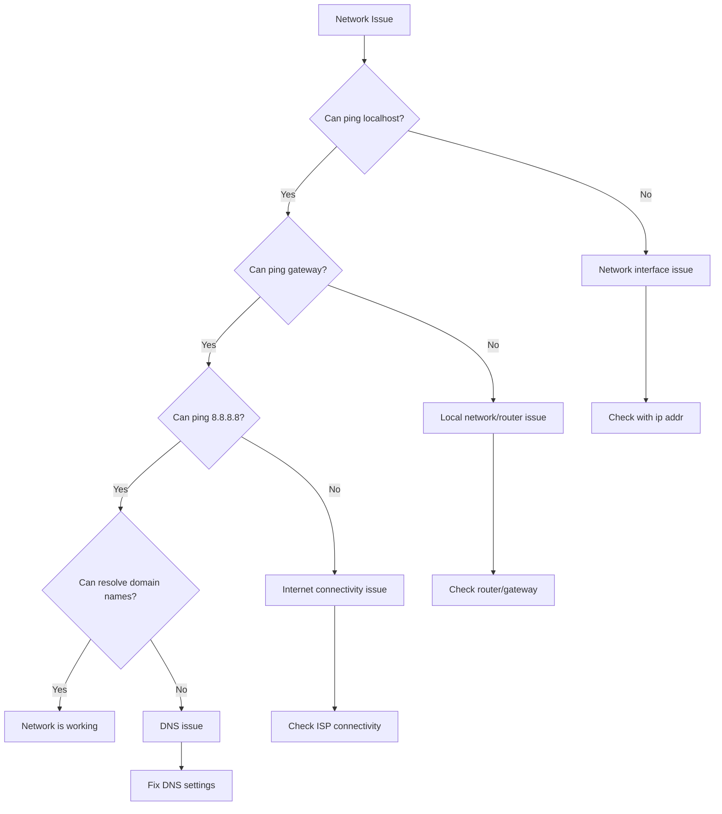

# Ubuntu Network Issues

## Introduction

Networking issues can be frustrating when working with Ubuntu, especially for beginners. This guide will walk you through the most common network problems, their causes, and step-by-step solutions. Understanding how to diagnose and fix network issues is an essential skill for any Ubuntu user, from connecting to Wi-Fi networks to configuring complex network settings.

## Common Network Issues in Ubuntu

### 1. No Internet Connection

One of the most common issues is when your Ubuntu system shows it's connected to a network but can't access the internet.

#### Diagnosis Steps:

1. **Check physical connections**: Ensure all cables are properly connected if using Ethernet.

2. **Verify network status**:
   ```bash
   ping -c 4 google.com
   ```
   If this returns errors, you may have a DNS or routing issue.

3. **Check network interface status**:
   ```bash
   ip addr show
   ```
   Look for your main interface (usually `wlan0` for wireless or `eth0`/`enp3s0` for Ethernet) and verify it has an IP address.

#### Solutions:

1. **Restart Network Manager**:
   ```bash
   sudo systemctl restart NetworkManager
   ```

2. **Set DNS servers manually**:
   Edit the `/etc/resolv.conf` file or use NetworkManager:
   ```bash
   sudo nano /etc/resolv.conf
   ```
   Add these lines:
   ```
   nameserver 8.8.8.8
   nameserver 8.8.4.4
   ```
   Save and close the file.

3. **Check if the network interface is up**:
   ```bash
   sudo ip link set dev wlan0 up
   ```
   (Replace `wlan0` with your actual interface name)

### 2. Wi-Fi Connection Issues

#### Diagnosis Steps:

1. **Check if Wi-Fi is enabled**:
   ```bash
   rfkill list
   ```
   Look for "Soft blocked: yes" or "Hard blocked: yes" which indicates Wi-Fi is disabled.

2. **Scan for available networks**:
   ```bash
   sudo iwlist wlan0 scan | grep ESSID
   ```
   This will show all available Wi-Fi networks.

3. **Check driver status**:
   ```bash
   lspci -k | grep -A 3 -i network
   ```
   This shows your network card and the driver in use.

#### Solutions:

1. **Enable Wi-Fi if blocked**:
   ```bash
   sudo rfkill unblock wifi
   ```

2. **Install additional drivers**:
   Open "Software & Updates", go to the "Additional Drivers" tab, and install any recommended wireless drivers.

3. **Connect via command line**:
   ```bash
   sudo nmcli dev wifi connect "Network_SSID" password "network_password"
   ```

### 3. Static IP Configuration

Sometimes you need to set a static IP address instead of using DHCP.

#### Command Line Method:

Edit the Netplan configuration file:

```bash
sudo nano /etc/netplan/01-network-manager-all.yaml
```

Add the following configuration (adjust to your network):

```yaml
network:
  version: 2
  renderer: NetworkManager
  ethernets:
    enp3s0:
      dhcp4: no
      addresses: [192.168.1.100/24]
      gateway4: 192.168.1.1
      nameservers:
        addresses: [8.8.8.8, 8.8.4.4]
```

Apply the changes:

```bash
sudo netplan apply
```

#### GUI Method:

1. Open "Settings" > "Network"
2. Click the gear icon next to your connection
3. Switch to the "IPv4" tab
4. Change method from "Automatic (DHCP)" to "Manual"
5. Add your desired IP address, subnet mask, gateway, and DNS servers
6. Click "Apply"

## Network Troubleshooting Tools

### 1. NetworkManager

NetworkManager is Ubuntu's default network configuration utility.

Common commands:

```bash
# List all connections
nmcli connection show

# Show device status
nmcli device status

# Restart NetworkManager
sudo systemctl restart NetworkManager

# Turn Wi-Fi on or off
nmcli radio wifi on
nmcli radio wifi off
```

### 2. Diagnostic Commands

Here's a flowchart of network troubleshooting steps:



Essential diagnostic commands:

1. **Check interface status**:
   ```bash
   ip addr
   ```

2. **Test connectivity to gateway**:
   ```bash
   # Find your gateway
   ip route | grep default
   
   # Ping the gateway
   ping -c 4 192.168.1.1  # Replace with your gateway IP
   ```

3. **Check DNS resolution**:
   ```bash
   nslookup google.com
   ```

4. **Trace network path**:
   ```bash
   traceroute google.com
   ```

5. **View network statistics**:
   ```bash
   netstat -tuln
   ```

6. **Monitor network traffic**:
   ```bash
   sudo tcpdump -i wlan0 -n
   ```

## Fixing Advanced Network Issues

### 1. Driver Problems

If your wireless or wired network card isn't working properly, you might need to install or update drivers.

1. **Identify your network hardware**:
   ```bash
   lspci | grep -i net
   ```

2. **Check currently loaded drivers**:
   ```bash
   lsmod | grep iwl  # For Intel wireless
   # OR
   lsmod | grep r8  # For Realtek
   ```

3. **Install drivers**:
   For Intel wireless cards:
   ```bash
   sudo apt update
   sudo apt install linux-firmware
   ```

   For Realtek cards:
   ```bash
   sudo apt install rtl8812au-dkms
   ```

4. **Reload the driver**:
   ```bash
   sudo modprobe -r iwlwifi  # Remove driver
   sudo modprobe iwlwifi     # Load driver again
   ```

### 2. Network Interface Renaming

Ubuntu uses predictable network interface names (like `enp3s0` instead of `eth0`). To revert to traditional names:

1. Edit GRUB configuration:
   ```bash
   sudo nano /etc/default/grub
   ```

2. Find the line with `GRUB_CMDLINE_LINUX=""` and change it to:
   ```
   GRUB_CMDLINE_LINUX="net.ifnames=0 biosdevname=0"
   ```

3. Update GRUB and reboot:
   ```bash
   sudo update-grub
   sudo reboot
   ```

### 3. Firewall Configuration

Ubuntu uses UFW (Uncomplicated Firewall) by default. Sometimes firewall settings can block necessary connections.

```bash
# Check firewall status
sudo ufw status

# Enable/disable firewall
sudo ufw enable
sudo ufw disable

# Allow specific ports
sudo ufw allow 80/tcp  # HTTP
sudo ufw allow 443/tcp  # HTTPS
sudo ufw allow 22/tcp  # SSH
```

## Real-World Examples

### Setting Up a Network Bridge for Virtual Machines

If you're using VirtualBox or KVM, you might need to set up a network bridge:

1. Install bridge-utils:
   ```bash
   sudo apt install bridge-utils
   ```

2. Create a netplan configuration:
   ```bash
   sudo nano /etc/netplan/01-netcfg.yaml
   ```

3. Add the bridge configuration:
   ```yaml
   network:
     version: 2
     renderer: networkd
     ethernets:
       enp3s0:
         dhcp4: no
         dhcp6: no
     bridges:
       br0:
         interfaces: [enp3s0]
         dhcp4: yes
         dhcp6: no
   ```

4. Apply the configuration:
   ```bash
   sudo netplan apply
   ```

### Setting Up a VPN Connection

1. Install OpenVPN:
   ```bash
   sudo apt install openvpn network-manager-openvpn network-manager-openvpn-gnome
   ```

2. Import a VPN configuration:
   ```bash
   sudo openvpn --config your-vpn-config.ovpn
   ```

3. Or set up through NetworkManager:
   - Click on the network icon in the top bar
   - Select "VPN Connections" > "Configure VPN"
   - Click "+" to add a new VPN connection
   - Select "Import from file..." and choose your .ovpn file

## Troubleshooting Common Error Messages

### "Network service discovery disabled"

This is related to Avahi daemon issues:

```bash
sudo systemctl restart avahi-daemon
```

### "No wireless networks found"

1. Check if the driver is loaded:
   ```bash
   lsmod | grep iwl
   ```

2. Check if the device is recognized:
   ```bash
   sudo lshw -C network
   ```

3. Restart NetworkManager:
   ```bash
   sudo systemctl restart NetworkManager
   ```

### "Device not managed" error

This occurs when NetworkManager isn't managing your device. Edit `/etc/NetworkManager/NetworkManager.conf`:

```bash
sudo nano /etc/NetworkManager/NetworkManager.conf
```

Make sure the `[ifupdown]` section looks like this:

```
[ifupdown]
managed=true
```

Then restart NetworkManager:

```bash
sudo systemctl restart NetworkManager
```

## Summary

Network issues in Ubuntu can be intimidating for beginners, but understanding the basic troubleshooting steps will help you resolve most problems. Remember to:

1. Start with checking physical connections
2. Use diagnostic commands to identify the issue
3. Apply specific solutions based on the diagnosis
4. Restart services or the system when necessary

The most important tools for network troubleshooting in Ubuntu are:
- NetworkManager (`nmcli`)
- IP utilities (`ip`, `ping`, `traceroute`)
- Network diagnostic tools (`netstat`, `tcpdump`)
- System logs (`journalctl`)

By mastering these tools and understanding the troubleshooting process, you'll be able to resolve most network issues in Ubuntu quickly and efficiently.

## Additional Resources

For further learning and reference:

- Ubuntu's official networking documentation: [Ubuntu Network Documentation](https://help.ubuntu.com/community/NetworkManager)
- The `man` pages for networking tools: `man ip`, `man ping`, `man nmcli`
- Network configuration with Netplan: `man netplan`

## Practice Exercises

1. Configure your Ubuntu system to use Google's DNS servers (8.8.8.8 and 8.8.4.4).
2. Set up a static IP address for your system using both the command line and GUI methods.
3. Use `tcpdump` to capture and analyze network traffic when visiting a website.
4. Create a script that checks if your network is functioning properly and sends a notification if it's down.
5. Configure UFW to allow traffic only on ports you commonly use (SSH, HTTP, HTTPS).