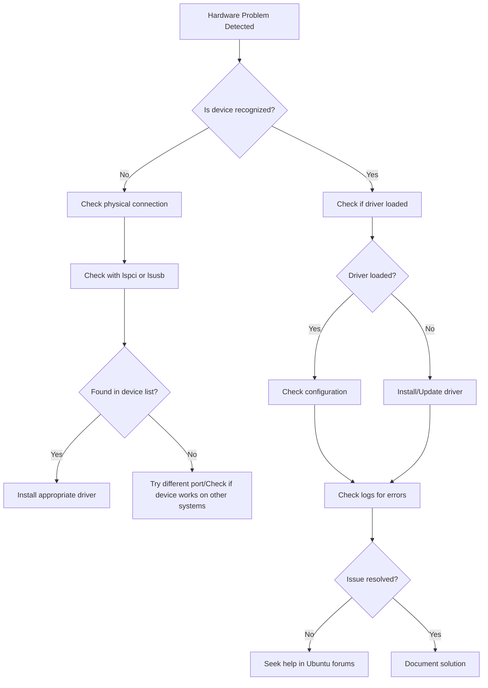

# Ubuntu Hardware Problems

## Introduction

Hardware issues can be frustrating when using any operating system, and Ubuntu is no exception. While Ubuntu generally offers excellent hardware compatibility, you may occasionally encounter problems with devices not being recognized, malfunctioning, or performing poorly. This guide will help you understand, diagnose, and resolve common hardware problems in Ubuntu.

Unlike Windows, which typically includes manufacturer-provided drivers, Ubuntu relies on open-source drivers built into the Linux kernel. This different approach to hardware management means troubleshooting techniques specific to Ubuntu are essential knowledge for any user.

## Understanding Hardware Detection in Ubuntu

Before diving into specific problems, let's understand how Ubuntu interacts with hardware:

### The Linux Kernel and Hardware

Ubuntu's ability to interact with hardware depends on the Linux kernel, which includes drivers for a wide range of devices. When you boot your system, the kernel detects hardware and loads appropriate drivers.

You can see what hardware Ubuntu has detected with this command:

```bash
lspci -v
```

Output example:
```
00:00.0 Host bridge: Intel Corporation Device 9b43 (rev 05)
        Subsystem: Dell Device 0979
        Flags: bus master, fast devsel, latency 0
        Kernel driver in use: intel_uncore
        Kernel modules: ie31200_edac

00:02.0 VGA compatible controller: Intel Corporation UHD Graphics (rev 05) (prog-if 00 [VGA controller])
        Subsystem: Dell Device 0979
        Flags: bus master, fast devsel, latency 0, IRQ 255
        Memory at a0000000 (64-bit, non-prefetchable) [size=16M]
        Memory at 90000000 (64-bit, prefetchable) [size=256M]
        I/O ports at 3000 [size=64]
        Expansion ROM at 000c0000 [virtual] [disabled] [size=128K]
        Capabilities: <access denied>
        Kernel driver in use: i915
        Kernel modules: i915
```

For USB devices, use:

```bash
lsusb
```

Output example:
```
Bus 002 Device 001: ID 1d6b:0003 Linux Foundation 3.0 root hub
Bus 001 Device 003: ID 13d3:56a2 IMC Networks USB Camera
Bus 001 Device 002: ID 8087:0029 Intel Corp. AX200 Bluetooth
Bus 001 Device 001: ID 1d6b:0002 Linux Foundation 2.0 root hub
```

## Common Hardware Problems and Solutions

### 1. Graphics Card Issues

Graphics problems are among the most common hardware issues in Ubuntu.

#### Symptoms:
- Black screen after login
- Screen flickering
- Poor performance
- Display resolution problems

#### Diagnostic Steps:

First, check what graphics card and driver is currently in use:

```bash
lspci | grep -i vga
```

Output example:
```
00:02.0 VGA compatible controller: Intel Corporation UHD Graphics (rev 05)
01:00.0 VGA compatible controller: NVIDIA Corporation GP107M [GeForce GTX 1050 Mobile] (rev a1)
```

Check the current driver:

```bash
sudo lshw -c video
```

Output example:
```
  *-display                 
       description: VGA compatible controller
       product: UHD Graphics
       vendor: Intel Corporation
       physical id: 2
       bus info: pci@0000:00:02.0
       logical name: /dev/fb0
       version: 05
       width: 64 bits
       clock: 33MHz
       capabilities: vga_controller bus_master cap_list rom fb
       configuration: depth=32 driver=i915 latency=0 resolution=1920,1080
       resources: irq:255 memory:a0000000-a0ffffff memory:90000000-9fffffff ioport:3000(size=64) memory:c0000-dffff
```

#### Common Solutions:

**For NVIDIA Graphics Cards:**

Install proprietary drivers:

```bash
sudo ubuntu-drivers autoinstall
```

Or select a specific driver:

```bash
sudo apt install nvidia-driver-XXX
```
(Replace XXX with the version number like 470, 515, etc.)

**For AMD Graphics Cards:**

Install AMD drivers:

```bash
sudo apt install xserver-xorg-video-amdgpu
```

**Reset Graphics Configuration:**

If issues persist, try resetting the graphics configuration:

```bash
sudo dpkg-reconfigure xserver-xorg
```

### 2. Wi-Fi Connection Problems

#### Symptoms:
- Wi-Fi adapter not detected
- Inability to connect to networks
- Unstable connection
- Slow speeds

#### Diagnostic Steps:

Check if your wireless card is detected:

```bash
lspci | grep -i network
```

Or:

```bash
lsusb | grep -i network
```

Check if the wireless interface is up:

```bash
ip link show
```

Output example:
```
1: lo: <LOOPBACK,UP,LOWER_UP> mtu 65536 qdisc noqueue state UNKNOWN mode DEFAULT group default qlen 1000
    link/loopback 00:00:00:00:00:00 brd 00:00:00:00:00:00
2: wlp0s20f3: <BROADCAST,MULTICAST,UP,LOWER_UP> mtu 1500 qdisc noqueue state UP mode DORMANT group default qlen 1000
    link/ether 94:e6:f7:41:14:c3 brd ff:ff:ff:ff:ff:ff
```

Check available networks:

```bash
nmcli device wifi list
```

#### Common Solutions:

**Install Additional Drivers:**

Ubuntu may need additional drivers for your wireless card:

```bash
sudo apt update
sudo ubuntu-drivers autoinstall
```

**For Broadcom Wireless Cards:**

```bash
sudo apt install bcmwl-kernel-source
```

**Enable the Wireless Card:**

If the card is disabled:

```bash
sudo rfkill unblock wifi
```

**Use a Firmware Update:**

Some cards need additional firmware:

```bash
sudo apt install linux-firmware
```

### 3. Printer Issues

#### Symptoms:
- Printer not detected
- Failed print jobs
- Poor print quality

#### Diagnostic Steps:

Check if your printer is detected:

```bash
lpstat -p -d
```

View all CUPS printers:

```bash
lpstat -v
```

#### Common Solutions:

**Install Printer Support:**

```bash
sudo apt install cups
sudo systemctl enable cups
sudo systemctl start cups
```

**Access CUPS Web Interface:**

Open a browser and navigate to: http://localhost:631/

**Install Driver Packages:**

```bash
sudo apt install printer-driver-gutenprint
```

For HP printers:

```bash
sudo apt install hplip
```

Then run the HP setup utility:

```bash
hp-setup
```

### 4. Audio Problems

#### Symptoms:
- No sound
- Distorted audio
- Microphone not working
- Audio device not detected

#### Diagnostic Steps:

Check audio devices:

```bash
aplay -l
```

Output example:
```
**** List of PLAYBACK Hardware Devices ****
card 0: PCH [HDA Intel PCH], device 0: ALC295 Analog [ALC295 Analog]
  Subdevices: 1/1
  Subdevice #0: subdevice #0
card 0: PCH [HDA Intel PCH], device 3: HDMI 0 [HDMI 0]
  Subdevices: 1/1
  Subdevice #0: subdevice #0
```

Check the current audio configuration:

```bash
pulseaudio --dump-conf
```

#### Common Solutions:

**Restart PulseAudio:**

```bash
pulseaudio -k
pulseaudio --start
```

**Install PulseAudio Volume Control:**

```bash
sudo apt install pavucontrol
```

Then run it to adjust settings:

```bash
pavucontrol
```

**Update ALSA:**

```bash
sudo apt install alsa-utils
sudo alsa force-reload
```

**Reset Audio Configuration:**

```bash
rm -rf ~/.config/pulse
sudo reboot
```

### 5. USB Device Problems

#### Symptoms:
- USB devices not detected
- Devices disconnecting randomly
- Devices working intermittently

#### Diagnostic Steps:

Check USB devices:

```bash
lsusb
```

Monitor USB events in real-time:

```bash
sudo udevadm monitor
```

Check USB storage information:

```bash
sudo fdisk -l
```

#### Common Solutions:

**Mount USB Drives Manually:**

```bash
sudo mkdir /media/usb
sudo mount /dev/sdb1 /media/usb
```
(Replace `sdb1` with your actual device)

**Reset USB Controller:**

```bash
sudo modprobe -r xhci_pci
sudo modprobe xhci_pci
```

**Install USB Utils:**

```bash
sudo apt install usbutils
```

## Advanced Hardware Troubleshooting

### Using the Hardware & Drivers Tool

Ubuntu includes a graphical tool for managing proprietary drivers:

1. Open the "Software & Updates" application
2. Click on the "Additional Drivers" tab
3. Install any recommended drivers
4. Reboot your system

### Checking Hardware Logs

System logs can provide valuable information about hardware issues:

```bash
dmesg | grep -i error
```

Or check specific hardware:

```bash
dmesg | grep -i wifi
dmesg | grep -i usb
dmesg | grep -i audio
```

### Kernel Parameter Adjustments

Sometimes, adding kernel parameters can resolve hardware issues:

1. Edit the GRUB configuration:

```bash
sudo nano /etc/default/grub
```

2. Modify the `GRUB_CMDLINE_LINUX_DEFAULT` line to add parameters (examples):
   - For NVIDIA issues: `nouveau.modeset=0`
   - For power management: `acpi_osi=Linux`
   - For older hardware: `noapic nolapic`

3. Update GRUB:

```bash
sudo update-grub
```

4. Reboot your system

## Troubleshooting Workflow

When facing hardware issues, follow this systematic approach:



## Summary

Hardware troubleshooting in Ubuntu follows a logical approach:
1. Identify the affected hardware
2. Check if Ubuntu recognizes the device
3. Determine if the correct driver is loaded
4. Install or update drivers if needed
5. Configure the device correctly
6. If all else fails, consult the Ubuntu community

Remember that Ubuntu's hardware support improves with each release. If you're experiencing persistent issues with a device, consider:
- Checking for BIOS/firmware updates
- Trying a newer Ubuntu version or kernel
- Looking for hardware-specific workarounds in the Ubuntu forums or Ask Ubuntu

## Additional Resources

- [Ubuntu Official Documentation](https://help.ubuntu.com/)
- [Ask Ubuntu - Hardware Questions](https://askubuntu.com/questions/tagged/hardware)
- [Ubuntu Hardware Compatibility List](https://certification.ubuntu.com/)

## Practice Exercises

1. Use the `lshw` command to generate a complete hardware profile of your system. Identify any devices showing as "UNCLAIMED" which might need drivers.

2. Create a basic troubleshooting script that collects hardware information for a specific component (like graphics, audio, or network) to help in diagnosing issues.

3. Compare the output of `sudo lshw -C display` before and after installing graphics drivers to see the differences in configuration.

4. Research how to create a custom udev rule to fix a problematic USB device that's not being detected correctly.