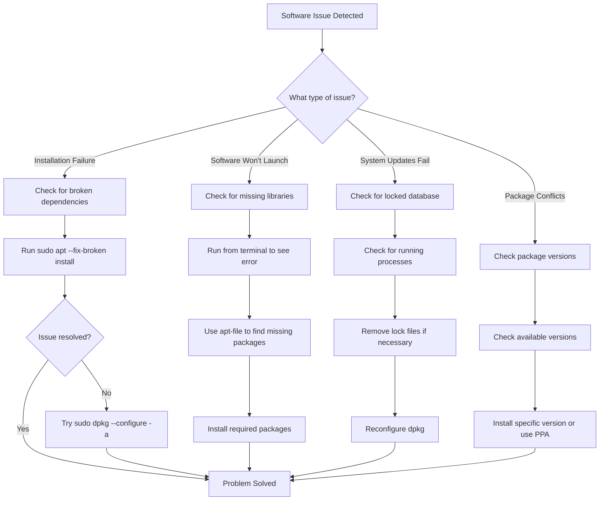

# Ubuntu Software Troubleshooting

## Introduction

Software management in Ubuntu can sometimes lead to unexpected issues for beginners. This guide will help you understand common software problems in Ubuntu and provide step-by-step solutions to resolve them. We'll cover package management issues, installation failures, dependency problems, and other software-related challenges that Ubuntu users frequently encounter.

## Understanding Ubuntu's Package Management

Ubuntu uses the APT (Advanced Package Tool) system along with dpkg for managing software. Before diving into troubleshooting, it's important to understand how software is managed in Ubuntu:

- **dpkg**: The low-level package manager that handles installation and removal of `.deb` packages
- **APT**: A higher-level tool that manages dependencies, repositories, and interacts with dpkg
- **Software repositories**: Collections of software packages that APT can fetch and install
- **Dependencies**: Libraries and other packages required for a software to function properly

## Common Software Issues and Solutions

### 1. Broken Package Dependencies

One of the most common software issues in Ubuntu occurs when package dependencies become broken during installation or updates.

#### Symptoms
- Error messages containing phrases like "broken packages" or "unmet dependencies"
- Failed software installations
- System update failures

#### Solution

```bash
# Update package lists
sudo apt update

# Try to fix broken packages
sudo apt --fix-broken install

# Advanced fix for more persistent issues
sudo dpkg --configure -a

# Clean and try again
sudo apt clean
sudo apt update
```

#### Example Output

```
Reading package lists... Done
Building dependency tree... Done
Correcting dependencies... Done
The following additional packages will be installed:
  libssl3
The following packages will be upgraded:
  libssl3
1 upgraded, 0 newly installed, 0 to remove and 217 not upgraded.
3 not fully installed or removed.
Need to get 0 B/1,878 kB of archives.
After this operation, 0 B of additional disk space will be used.
Do you want to continue? [Y/n] y
(Reading database ... 215463 files and directories currently installed.)
```

### 2. Locked APT Database

Sometimes, the package database may be locked if another package management process is running.

#### Symptoms
- Error message: "Could not get lock /var/lib/dpkg/lock"
- Error message: "Unable to lock the administration directory"

#### Solution

First, check if any package managers are running:

```bash
ps -aux | grep -i apt
```

If no legitimate process is running, you can remove the lock files:

```bash
# Remove lock files (use with caution)
sudo rm /var/lib/apt/lists/lock
sudo rm /var/cache/apt/archives/lock
sudo rm /var/lib/dpkg/lock
sudo rm /var/lib/dpkg/lock-frontend

# Reconfigure dpkg
sudo dpkg --configure -a
```

### 3. Failed Software Installation

Sometimes software installations fail due to various reasons.

#### Symptoms
- Installation process terminates with error
- Software appears in the application menu but doesn't launch
- Missing dependencies errors

#### Solution

```bash
# For software installed via apt
sudo apt install --reinstall package-name

# For software installed from .deb file
sudo dpkg -i --force-all /path/to/package.deb
sudo apt --fix-broken install
```

### 4. Package Manager Database Corruption

The APT database can occasionally become corrupted.

#### Symptoms
- Strange error messages during apt operations
- Incomplete or failed installations

#### Solution

```bash
# Rebuild the database
sudo apt clean
sudo apt update --fix-missing
```

## Advanced Troubleshooting Techniques

### 1. Checking Package Status

Understanding the current state of packages can help diagnose issues:

```bash
# Check if a package is installed
dpkg -l | grep package-name

# Get detailed information about a package
apt show package-name

# List files installed by a package
dpkg -L package-name
```

### 2. Finding Missing Libraries

Software sometimes fails to run due to missing shared libraries:

```bash
# Run the program from terminal to see error messages
program-name

# If you see "missing shared library" errors, install the package that provides it
sudo apt install apt-file
sudo apt-file update
apt-file search missing-library-name.so
```

Example:

```
$ myprogram
myprogram: error while loading shared libraries: libfoo.so.2: cannot open shared object file: No such file or directory

$ apt-file search libfoo.so.2
libfoo-dev: /usr/lib/x86_64-linux-gnu/libfoo.so.2
```

### 3. Managing Package Repositories

Sometimes issues stem from problematic repositories:

```bash
# View current repositories
cat /etc/apt/sources.list
ls /etc/apt/sources.list.d/

# Disable a problematic PPA
sudo add-apt-repository --remove ppa:name/ppa
```

### 4. Checking for Held Packages

Packages can be "held" in a specific version, preventing updates:

```bash
# Check for held packages
apt-mark showhold

# Unhold a package
sudo apt-mark unhold package-name
```

## Diagnosing Software Issues with System Logs

System logs can provide valuable information about software failures:

```bash
# Check system log for errors
journalctl -xe

# Check apt history log
less /var/log/apt/history.log

# Check specific application logs (if they write to syslog)
journalctl -u service-name.service
```

## Handling Ubuntu Software Center Issues

The graphical Software Center can also experience problems:

### Symptoms
- Software Center crashes or freezes
- Unable to install/remove software using the GUI

### Solution

```bash
# Restart the Software Center services
killall snap-store
killall gnome-software

# Clear cache
rm -rf ~/.cache/gnome-software/
rm -rf ~/.cache/snapd/

# Reinstall Software Center
sudo apt install --reinstall gnome-software
```

## Package Version Conflicts

Sometimes newer software requires newer versions of libraries than what's available in your Ubuntu release.

### Solution

```bash
# Check which versions are available
apt policy package-name

# Install a specific version
sudo apt install package-name=version-number

# Consider using a PPA for newer versions (with caution)
sudo add-apt-repository ppa:team/repo
sudo apt update
sudo apt install package-name
```

## Troubleshooting Flowchart



## Practical Examples

### Example 1: Fixing a Broken Firefox Installation

```bash
# Update repository information
sudo apt update

# Try to reinstall firefox
sudo apt install --reinstall firefox

# If issues persist, purge and reinstall
sudo apt purge firefox
sudo apt install firefox

# If still facing issues, try using the snap version
sudo snap install firefox
```

### Example 2: Resolving Dependencies for a .deb Package

Suppose you downloaded `application.deb` but it has dependency issues:

```bash
# First attempt to install
sudo dpkg -i application.deb
# This might show dependency errors

# Fix dependencies and complete installation
sudo apt --fix-broken install

# Verify installation
dpkg -l | grep application
```

### Example 3: Fixing Repository GPG Key Issues

If you see "GPG error" or "NO_PUBKEY" errors:

```bash
# For example, with key 123456789ABC
sudo apt-key adv --keyserver keyserver.ubuntu.com --recv-keys 123456789ABC

# On newer Ubuntu versions, use:
sudo gpg --keyserver keyserver.ubuntu.com --recv-keys 123456789ABC
sudo gpg --export 123456789ABC | sudo tee /etc/apt/trusted.gpg.d/custom.gpg > /dev/null
```

## Summary

In this guide, we've covered essential Ubuntu software troubleshooting techniques:

- Understanding the APT package management system
- Fixing broken dependencies
- Handling locked databases
- Resolving failed installations
- Repairing corrupted package databases
- Advanced troubleshooting with system logs
- Managing software repositories and package versions

By following these troubleshooting steps methodically, you can resolve most software-related issues in Ubuntu. Remember that many problems can be diagnosed by reading error messages carefully and searching for those specific errors in the Ubuntu community forums.

## Additional Resources

- [Ubuntu Official Documentation](https://help.ubuntu.com/)
- [Ask Ubuntu](https://askubuntu.com/) - A Q&A site for Ubuntu users
- [Ubuntu Community Help Wiki](https://help.ubuntu.com/community)
- [APT Manual](https://manpages.ubuntu.com/manpages/focal/man8/apt.8.html)

## Exercises

1. Deliberately break a package dependency (on a test system) and practice fixing it using the methods described.
2. Create a script that performs basic system maintenance, including fixing broken packages and updating the system.
3. Install software from a third-party repository, then practice removing it completely including the repository.
4. Set up a simple local repository to understand how APT repositories work.
5. Practice diagnosing a missing library problem by installing an application with dependencies not included by default.