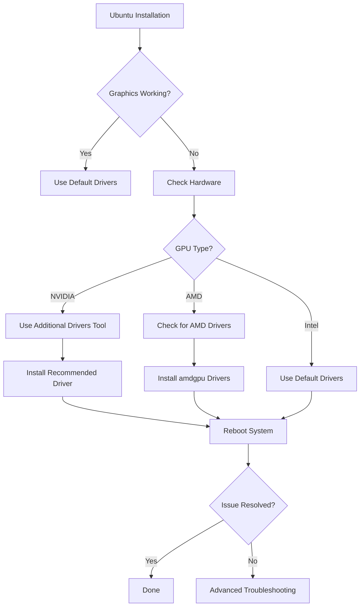

# Ubuntu Graphical Issues

## Introduction

Ubuntu, like any operating system, can sometimes experience graphical issues that affect the user experience. These problems can range from minor annoyances like screen flickering to more serious issues like a complete graphical interface failure. This guide aims to help you understand, diagnose, and resolve common graphical issues in Ubuntu.

Whether you're new to Ubuntu or an experienced user facing a stubborn display problem, this guide will walk you through systematic troubleshooting approaches to get your system back to normal.

## Common Ubuntu Graphical Issues

Let's explore some of the most frequent graphical problems Ubuntu users encounter:

### 1. Black Screen After Boot

One of the most alarming issues is when your Ubuntu system boots up only to display a black screen.

**Possible causes:**
- Graphics driver incompatibility
- Incorrect display settings
- Issues with the X Window System
- Kernel updates that conflict with your hardware

**Quick solution - Recovery Mode:**

```bash
# Boot into recovery mode by holding Shift during boot
# Then select "Enable Networking" followed by "Root Shell"

# Update package information
apt update

# Reinstall the ubuntu-desktop package
apt install --reinstall ubuntu-desktop

# Reboot
reboot
```

### 2. Screen Flickering

Screen flickering can be irritating and might indicate underlying issues.

**Possible causes:**
- Incompatible graphics drivers
- Power saving features
- Compositor issues
- Refresh rate problems

**Solution - Disable Compositor:**

You can temporarily disable the compositor to check if it resolves the issue:

```bash
# For GNOME Shell
gsettings set org.gnome.mutter.experimental-features "[]"

# For KDE Plasma
# Navigate to System Settings > Display and Monitor > Compositor
# Toggle "Enable compositor on startup" off
```

### 3. Resolution Problems

Incorrect display resolution can make your system difficult to use.

**Solution - Set Resolution via Command Line:**

If your GUI is inaccessible, you can set the resolution through the terminal:

```bash
# List available resolutions
xrandr

# Set a specific resolution (replace values with those from xrandr output)
xrandr --output HDMI-1 --mode 1920x1080
```

## Understanding Graphics Drivers in Ubuntu

Graphics drivers are software components that allow your operating system to communicate with your graphics hardware. Ubuntu offers different types of drivers:

1. **Open Source Drivers** - These come pre-installed (like Nouveau for NVIDIA or AMD open source drivers)
2. **Proprietary Drivers** - Developed by hardware manufacturers (NVIDIA, AMD)

### Graphics Driver Management Flow



## Diagnosing Graphics Issues

Before attempting fixes, it's important to gather information about your system:

### Identify Your Graphics Hardware

```bash
# Basic information
lspci | grep -i vga

# More detailed information
sudo lshw -c video

# For NVIDIA GPUs
nvidia-smi

# For AMD GPUs
glxinfo | grep "OpenGL renderer"
```

### Check Current Driver Status

```bash
# For basic driver info
ubuntu-drivers devices

# For currently loaded modules
lsmod | grep -i nvidia  # For NVIDIA
lsmod | grep -i amdgpu  # For AMD
```

## Common Solutions for Graphics Issues

### 1. Using the Additional Drivers Tool

Ubuntu includes a graphical tool for managing proprietary drivers:

1. Open "Software & Updates"
2. Click on the "Additional Drivers" tab
3. Select the recommended driver
4. Click "Apply Changes"
5. Reboot your system

### 2. Manual Driver Installation

For NVIDIA GPUs, you might need to install drivers manually:

```bash
# Add the graphics drivers PPA
sudo add-apt-repository ppa:graphics-drivers/ppa
sudo apt update

# Install the NVIDIA driver
sudo apt install nvidia-driver-XXX  # Replace XXX with version number
sudo reboot
```

For AMD GPUs:

```bash
# Install the latest Mesa drivers
sudo add-apt-repository ppa:kisak/kisak-mesa
sudo apt update
sudo apt upgrade
sudo reboot
```

### 3. Fixing Broken X Server Configuration

If your X Server configuration is broken, you can reset it:

```bash
# Back up current configuration
sudo cp /etc/X11/xorg.conf /etc/X11/xorg.conf.backup

# Remove the current configuration (Ubuntu will generate a new one)
sudo rm /etc/X11/xorg.conf

# Restart the display manager
sudo systemctl restart gdm.service  # For GNOME
# OR
sudo systemctl restart lightdm.service  # For LightDM
```

## Special Case: Hybrid Graphics (NVIDIA Optimus/AMD Switchable)

Many laptops come with dual graphics - an integrated GPU (Intel/AMD) and a discrete GPU (NVIDIA/AMD). These require special configuration:

### Setting Up NVIDIA Prime

```bash
# Install NVIDIA drivers with Prime support
sudo apt install nvidia-prime

# Switch to NVIDIA GPU
sudo prime-select nvidia

# Switch to Intel GPU (for better battery life)
sudo prime-select intel

# Check current setting
prime-select query
```

### Using the NVIDIA Settings Application

For more granular control:

```bash
# Open NVIDIA Settings
nvidia-settings

# Configure PRIME profiles through the GUI
# - Performance Mode uses the NVIDIA GPU
# - Power Saving Mode uses the Intel GPU
```

## Resolving Issues After Ubuntu Updates

Sometimes Ubuntu updates can break graphics configurations. Here's how to recover:

### Downgrading Broken Packages

```bash
# List recently installed packages
grep "install " /var/log/dpkg.log | tail -n 20

# Downgrade a specific package
sudo apt install package-name=version-number
```

### Reinstalling the Desktop Environment

If your desktop environment is corrupted:

```bash
# For GNOME (default Ubuntu desktop)
sudo apt install --reinstall ubuntu-desktop gnome-shell

# For KDE Plasma
sudo apt install --reinstall kubuntu-desktop

# For Xfce
sudo apt install --reinstall xubuntu-desktop
```

## Troubleshooting Wayland Issues

Ubuntu has been transitioning to Wayland from X11, which can cause some compatibility issues:

### Switching Between Wayland and X11

If you're experiencing issues with Wayland, you can switch to X11:

1. Log out of your current session
2. At the login screen, click on the gear icon
3. Select "Ubuntu on Xorg"
4. Log in normally

To switch permanently:

```bash
# Edit the GDM configuration
sudo nano /etc/gdm3/custom.conf

# Uncomment the line:
# WaylandEnable=false

# Save and exit
# Restart GDM
sudo systemctl restart gdm3
```

## Advanced Troubleshooting

For persistent issues, these techniques can help:

### Examining System Logs

```bash
# Check X.org logs
cat /var/log/Xorg.0.log | grep EE

# Check system journal for graphics-related issues
journalctl -b | grep -i "nvidia\|nouveau\|amdgpu\|radeon\|intel"
```

### Creating a Custom xorg.conf

Sometimes, you need to manually create a configuration:

```bash
# Create a basic configuration file
sudo nvidia-xconfig  # For NVIDIA GPUs

# Or create a more detailed one
sudo Xorg -configure

# Edit the configuration
sudo nano /etc/X11/xorg.conf
```

### Using nomodeset for Emergency Boot

If you can't boot with graphics, use nomodeset:

1. At the GRUB menu, press 'e' to edit
2. Find the line starting with 'linux' and add `nomodeset` after 'quiet splash'
3. Press F10 to boot with these settings

To make this permanent:

```bash
# Edit GRUB configuration
sudo nano /etc/default/grub

# Modify the GRUB_CMDLINE_LINUX_DEFAULT line
# Example: GRUB_CMDLINE_LINUX_DEFAULT="quiet splash nomodeset"

# Update GRUB
sudo update-grub
```

## Real-World Examples

### Case Study 1: Fixing Flickering on Dell XPS with NVIDIA Graphics

A common issue on Dell XPS laptops with NVIDIA graphics is screen flickering during video playback. Here's how to fix it:

```bash
# Create a configuration file
sudo nano /usr/share/X11/xorg.conf.d/20-intel.conf

# Add the following content:
Section "Device"
    Identifier "Intel Graphics"
    Driver "intel"
    Option "TearFree" "true"
EndSection

# Save and reboot
```

### Case Study 2: Resolving Black Screen on Ubuntu 22.04 After Update

A user upgraded to Ubuntu 22.04 and encountered a black screen on boot:

```bash
# Boot to recovery mode
# Enable networking
# Access root shell

# Purge and reinstall graphics drivers
sudo apt purge nvidia*
sudo ubuntu-drivers autoinstall
sudo reboot
```

## Summary

Graphics issues in Ubuntu can be frustrating but are usually resolvable with the right approach. Remember these key points:

1. Start by identifying your graphics hardware
2. Check if you're using the correct drivers
3. Try the built-in Additional Drivers tool before manual installation
4. Examine logs to pinpoint error messages
5. Consider switching between Wayland and X11 if problems persist
6. For emergency cases, use recovery mode or the nomodeset parameter

With patience and systematic troubleshooting, most Ubuntu graphical issues can be resolved, restoring your system to a fully functional state.

## Additional Resources

- [Ubuntu Graphics Documentation](https://help.ubuntu.com/community/VideoDriverHowto)
- [NVIDIA Linux Driver Documentation](https://docs.nvidia.com/cuda/cuda-installation-guide-linux/)
- [AMD Graphics Driver Documentation](https://amdgpu-install.readthedocs.io/)
- [X.org Troubleshooting Guide](https://www.x.org/wiki/Documentation/)

## Practice Exercises

1. Identify your current graphics hardware and drivers
2. Create a backup plan for your graphics configuration
3. Practice switching between graphics drivers (if you have dual graphics)
4. Learn how to read and interpret Xorg logs
5. Set up a test user account to safely experiment with different graphics settings