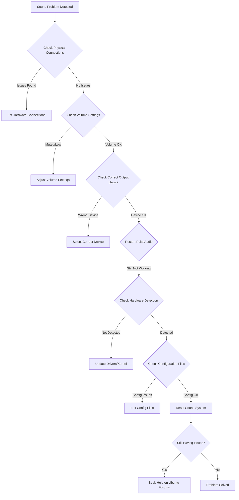

# Ubuntu Sound Problems

## Introduction

Sound issues are among the most frustrating problems for new Ubuntu users. Whether you're setting up a development environment or just trying to enjoy media on your system, functioning audio is essential. This guide will walk you through common Ubuntu sound problems and their solutions, from basic troubleshooting to more advanced fixes.

Sound in Ubuntu is primarily managed through two systems:
- **ALSA (Advanced Linux Sound Architecture)**: The low-level kernel component that interacts directly with sound hardware
- **PulseAudio**: A sound server that sits on top of ALSA, providing advanced features like per-application volume control and network audio

Understanding how these systems work together is key to resolving most audio issues in Ubuntu.

## Common Sound Problems and Solutions

### No Sound Output

If you can't hear anything from your speakers or headphones, try these steps in order:

#### 1. Check Physical Connections

Before diving into software fixes, check the basics:

- Ensure speakers or headphones are properly connected
- Make sure volume is turned up on external speakers
- Try different audio ports if available

#### 2. Check System Volume and Mute Status

```bash
# Check and set volume using command line
amixer sset Master unmute
amixer sset Master 80%

# Check if audio is muted
amixer get Master
```

#### 3. Verify the Correct Output Device is Selected

Open the Sound Settings either from the system tray or by running:

```bash
gnome-control-center sound
```

Make sure the correct output device is selected in the "Output" tab.

#### 4. Restart the PulseAudio Service

```bash
# Kill the current PulseAudio process
pulseaudio -k

# Start PulseAudio again (usually starts automatically)
pulseaudio --start
```

#### 5. Check ALSA and PulseAudio Status

```bash
# List all sound cards recognized by ALSA
aplay -l

# Check PulseAudio sound devices
pactl list short sinks
```

If your device is not listed, it might be a driver issue.

### Audio Device Not Detected

If Ubuntu doesn't recognize your audio hardware:

#### 1. Identify Your Audio Hardware

```bash
# Detailed hardware information including audio devices
sudo lshw -C multimedia

# Alternative command for audio information
lspci -v | grep -A7 -i "audio"
```

#### 2. Install or Reinstall ALSA Drivers

```bash
# Remove and reinstall ALSA components
sudo apt update
sudo apt install --reinstall alsa-base alsa-utils
```

#### 3. Update ALSA Configuration

If your audio card is detected but not properly configured, you might need to edit the ALSA configuration file:

```bash
sudo nano /etc/modprobe.d/alsa-base.conf
```

Add options for your specific sound card. For example, for Intel HDA:

```
options snd-hda-intel model=auto
```

#### 4. Update the Kernel

Sometimes, newer Ubuntu kernels include better audio driver support:

```bash
sudo apt update
sudo apt dist-upgrade
```

After upgrading, reboot your system.

### Audio Crackling or Distortion

For poor audio quality issues:

#### 1. Adjust PulseAudio Sample Rate

Create or edit the PulseAudio daemon configuration:

```bash
sudo nano /etc/pulse/daemon.conf
```

Uncomment and modify these lines:

```
default-sample-rate = 48000
alternate-sample-rate = 44100
```

Then restart PulseAudio:

```bash
pulseaudio -k
```

#### 2. Fix CPU Frequency Scaling Issues

Sometimes audio crackling is related to CPU power management:

```bash
# Install cpufrequtils
sudo apt install cpufrequtils

# Set CPU governor to performance
sudo cpufreq-set -g performance
```

Remember this will increase power consumption.

### Headphones Not Working (But Speakers Do)

This is often related to the auto-switching feature in ALSA:

#### 1. Check ALSA Controls

```bash
alsamixer
```

Use F6 to select your sound card, then look for headphone-related controls that might be muted.

#### 2. Edit ALSA Configuration

For headphone jack issues, you might need to provide a model option:

```bash
sudo nano /etc/modprobe.d/alsa-base.conf
```

Add a line like (example for Intel HDA):

```
options snd-hda-intel model=dell-headset-multi
```

The exact model depends on your hardware. Common options include:
- `dell-headset-multi`
- `laptop-amic`
- `acer-headset-multi`

### Microphone Not Working

Microphone issues often require separate troubleshooting:

#### 1. Check Input Device in Sound Settings

```bash
gnome-control-center sound
```

Go to the "Input" tab and ensure the correct device is selected.

#### 2. Check Input Levels in ALSA

```bash
alsamixer
```

Press F4 to switch to capture controls, ensure microphone is not muted.

#### 3. Test Microphone Recording

```bash
# Record a short audio clip
arecord -d 5 -f cd test.wav

# Play it back to test
aplay test.wav
```

## Advanced Troubleshooting

### Using PulseAudio Volume Control (pavucontrol)

The PulseAudio Volume Control application provides more detailed control than the default sound settings:

```bash
# Install pavucontrol if not already installed
sudo apt install pavucontrol

# Launch the application
pavucontrol
```

This tool allows you to:
- Configure input and output devices
- Control volume for individual applications
- Redirect audio streams between devices

### Debugging Sound with Command Line Tools

#### 1. Check for Sound Card Issues

```bash
# Check ALSA information
cat /proc/asound/cards

# Get detailed PulseAudio information
pacmd list-cards
```

#### 2. Monitor PulseAudio Logs

```bash
# View PulseAudio debug messages
PULSE_LOG=debug pulseaudio -vvvv
```

#### 3. Check for Module Issues

```bash
# List all loaded ALSA modules
lsmod | grep snd
```

### Solving Issues Through Config Files

Sometimes you need to create or modify configuration files:

#### PulseAudio User Configuration

Create a custom configuration file:

```bash
mkdir -p ~/.config/pulse
nano ~/.config/pulse/daemon.conf
```

Add configuration options, for example:

```
resample-method = src-sinc-best-quality
default-sample-format = s24le
default-sample-rate = 96000
alternate-sample-rate = 48000
```

### Completely Reset Sound System

If all else fails, this nuclear option can help:

```bash
# Remove PulseAudio configuration
rm -rf ~/.config/pulse

# Remove ALSA user settings
rm -rf ~/.asoundrc

# Reinstall audio components
sudo apt update
sudo apt purge alsa-base pulseaudio
sudo apt install alsa-base pulseaudio
```

Then reboot your system.

## Specific Hardware Solutions

### Bluetooth Audio Issues

Bluetooth audio requires additional components:

```bash
# Install Bluetooth audio packages
sudo apt install pulseaudio-module-bluetooth bluez bluez-tools

# Restart PulseAudio and Bluetooth services
pulseaudio -k
sudo service bluetooth restart
```

### HDMI Audio Not Working

For HDMI audio output problems:

#### 1. Check if HDMI Audio is Detected

```bash
aplay -l | grep HDMI
```

#### 2. Set HDMI as Default Output

Use the Sound Settings or create a custom default:

```bash
# Create a file to set HDMI as default
nano ~/.config/pulse/default.pa
```

Add this line:

```
set-default-sink alsa_output.pci-0000_01_00.1.hdmi-stereo
```

Replace the sink name with your actual HDMI sink name (from `pactl list sinks short`).

## Common Sound Configuration Workflow

This diagram shows a typical workflow for solving Ubuntu sound issues:



## Summary

Sound problems in Ubuntu can range from simple configuration issues to complex driver compatibility challenges. This guide covered:

- Basic troubleshooting steps for common sound issues
- How to check hardware detection and driver status
- Configuration adjustments for PulseAudio and ALSA
- Advanced techniques for debugging sound problems
- Hardware-specific solutions

Remember that sound architecture in Linux is complex, and sometimes a combination of approaches is needed to solve a particular issue.

## Additional Resources

- [Ubuntu Community Help Wiki - Sound Troubleshooting](https://help.ubuntu.com/community/SoundTroubleshooting)
- [PulseAudio Documentation](https://www.freedesktop.org/wiki/Software/PulseAudio/Documentation/)
- [ALSA Project Documentation](https://www.alsa-project.org/wiki/Main_Page)
- Ubuntu Forums - Audio & Video section for community support

## Practice Exercises

1. Use `alsamixer` to explore your sound card settings and identify all available controls.
2. Create a simple shell script that resets your sound system when executed.
3. Experiment with different `resample-method` values in PulseAudio configuration to find the best quality/performance balance for your system.
4. Use `pactl` commands to create a virtual audio output device and route application audio to it.