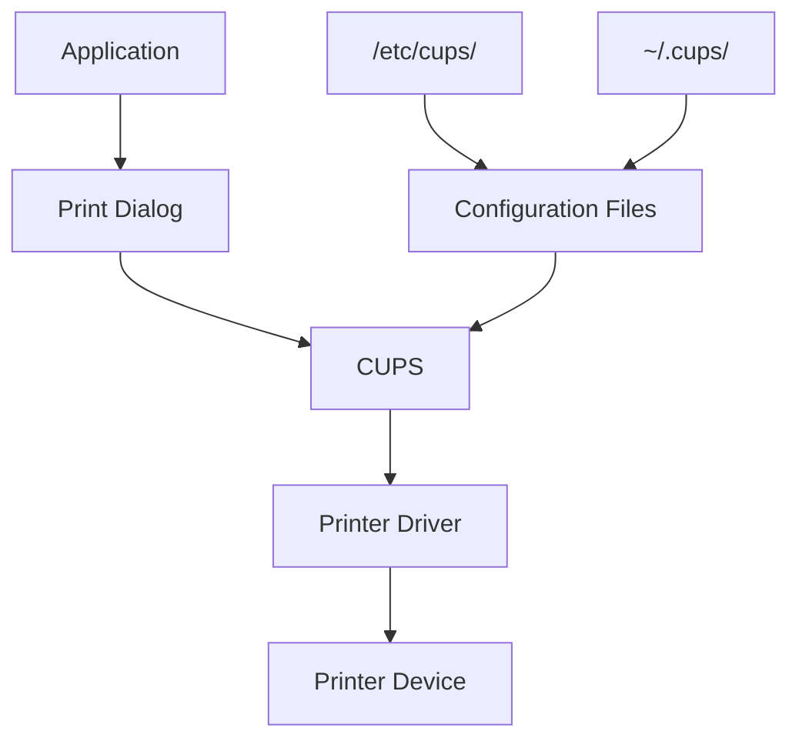

# Ubuntu Printer Issues

## Introduction

Printer issues are among the most common challenges new Ubuntu users face. While Ubuntu's printing system has improved significantly over the years, you may still encounter configuration problems, driver compatibility issues, or connection errors. This guide will walk you through diagnosing and resolving common printer problems in Ubuntu, using the CUPS (Common Unix Printing System) framework that Ubuntu relies on for printing functionality.

## Understanding Ubuntu's Printing Architecture

Before diving into specific troubleshooting steps, let's understand how printing works in Ubuntu:



Ubuntu uses CUPS (Common Unix Printing System) as its printing backend. When you print a document:

1. Your application sends the print job to CUPS
2. CUPS processes the document using the appropriate driver
3. CUPS then sends the processed data to your printer

Understanding this workflow helps pinpoint where issues might occur.

## Common Printer Issues and Solutions

### 1. Printer Not Detected

If Ubuntu doesn't detect your printer, try these solutions:

#### Check Physical Connection

```bash
# For USB printers, check if the printer is recognized
lsusb

# For network printers, check if the printer's IP is reachable
ping printer_ip_address
```

If your USB printer doesn't appear in the `lsusb` output, try:
- Connecting to a different USB port
- Using a different USB cable
- Rebooting both the printer and computer

#### Restart the CUPS Service

```bash
sudo systemctl restart cups
```

#### Install Printer Drivers

Many printers require specific drivers:

```bash
# Install common printer drivers
sudo apt update
sudo apt install printer-driver-gutenprint

# For HP printers
sudo apt install hplip

# For Brother printers
sudo apt install printer-driver-brlaser
```

### 2. Print Jobs Stuck in Queue

If your print jobs get stuck in the queue:

#### Check the CUPS Service Status

```bash
systemctl status cups
```

#### Clear the Print Queue

```bash
# List all print jobs
lpstat -o

# Cancel all print jobs
cancel -a

# Cancel specific print job
cancel job-id
```

#### Restart CUPS with Empty Queue

```bash
sudo systemctl stop cups
sudo rm -rf /var/spool/cups/*
sudo systemctl start cups
```

### 3. Poor Print Quality

For issues with print quality:

#### Check Ink/Toner Levels

Most printer manufacturers provide utilities to check ink levels:

```bash
# For HP printers
hp-levels

# For most other printers, check through system settings
gnome-control-center printers
```

#### Update or Reinstall Drivers

```bash
sudo apt update
sudo apt install --reinstall printer-driver-name
```

#### Adjust Print Settings

Open your printer settings from the system settings menu and adjust:
- Print quality (draft, normal, high)
- Paper type
- Color settings

### 4. Network Printer Connection Issues

For network printers that aren't connecting:

#### Verify Network Settings

```bash
# Check if printer IP is reachable
ping printer_ip_address

# Check if printer port is open (typically 9100 for many printers)
telnet printer_ip_address 9100
```

#### Add Printer Using Different Protocols

If automatic detection fails, try manually adding your printer using different protocols:

1. Open Printers from System Settings
2. Click "Add Printer"
3. Select "Network Printer"
4. Try different connection methods:
   - IPP (Internet Printing Protocol): `ipp://printer_ip_address/ipp/print`
   - AppSocket/HP JetDirect: `socket://printer_ip_address:9100`
   - LPD/LPR: `lpd://printer_ip_address/queue_name`

### 5. CUPS Web Interface for Advanced Troubleshooting

CUPS includes a web interface for advanced management:

```bash
# Ensure the web interface is enabled
sudo cupsctl --remote-admin --remote-any --share-printers

# Open in browser
xdg-open http://localhost:631
```

The web interface allows you to:
- View detailed error logs
- Manage print jobs 
- Configure printer settings
- Test printers

## Checking Logs for Error Messages

When troubleshooting printer issues, checking logs can provide valuable insights:

```bash
# View CUPS error log
sudo cat /var/log/cups/error_log

# View only recent errors
sudo tail -n 50 /var/log/cups/error_log

# Monitor log in real-time while attempting to print
sudo tail -f /var/log/cups/error_log
```

Common error messages and their meanings:

| Error Message              | Likely Cause                             |
|----------------------------|------------------------------------------|
| `Unable to locate printer` | Connectivity or driver issue             |
| `Filter failed`            | Incompatible driver or corrupt print job |
| `Permission denied`        | CUPS permission issue                    |
| `Bad file descriptor`      | Communication error with printer         |
| `Connection failed`        | Network or USB connection problem        |

## Command-Line Tools for Printer Management

Ubuntu provides several command-line tools for printer management:

```bash
# List available printers
lpstat -p -d

# Set default printer
lpoptions -d printer_name

# Print a test page
lp -d printer_name /usr/share/cups/data/testprint

# Check printer status
lpstat -p printer_name -l

# Enable a disabled printer
cupsenable printer_name
```

## Configuring Default Printer Settings

To set up your default printing preferences:

```bash
# Show current printer options
lpoptions -p printer_name -l

# Set default options (example: duplex printing)
lpoptions -p printer_name -o sides=two-sided-long-edge

# Set default paper size
lpoptions -p printer_name -o media=a4
```

## Resolving Driver Compatibility Issues

Some printers may not have native Linux drivers. Here are some solutions:

### Using Generic Drivers

For basic printing functionality:

```bash
# Install generic PostScript driver
sudo apt install foomatic-db-compressed-ppds
```

### Installing Proprietary Drivers

Many manufacturers provide Linux drivers on their websites:

1. Download the appropriate `.deb` package from the manufacturer's website
2. Install using:
   ```bash
   sudo dpkg -i driver_package.deb
   sudo apt install -f  # Fix any dependencies
   ```

### Using Windows Drivers with Printer Applications

For printers without Linux support, you can use printer applications:

```bash
# Install printer-driver-foo2zjs for specific laser printers
sudo apt install printer-driver-foo2zjs

# For many other printers
sudo apt install printer-application-common
```

## Troubleshooting Specific Printer Brands

### HP Printers

HP printers generally have good Linux support through HPLIP:

```bash
# Install full HP driver support
sudo apt install hplip hplip-gui

# Run HP setup tool
hp-setup
```

The `hp-setup` utility provides a guided interface for setting up HP printers and troubleshooting common issues.

### Canon Printers

Canon printers often require extra steps:

```bash
# Install Canon common driver
sudo apt install cnijfilter2

# For scanner functionality
sudo apt install scangearmp2
```

### Epson Printers

Epson printers may need specific drivers:

```bash
# Repository for Epson drivers
sudo add-apt-repository ppa:epson-inkjet/epson-inkjet
sudo apt update
sudo apt install epson-inkjet-printer-escpr
```

## Advanced: Creating Custom PPD Files

For unsupported printers, sometimes creating a custom PPD (PostScript Printer Description) file is necessary:

1. Find a similar printer model's PPD file:
   ```bash
   find /etc/cups/ppd -type f -name "*.ppd" | grep -i similar_model
   ```

2. Copy and modify the PPD file:
   ```bash
   sudo cp /etc/cups/ppd/similar_model.ppd /etc/cups/ppd/your_model.ppd
   sudo nano /etc/cups/ppd/your_model.ppd
   ```

3. Edit the manufacturer and model information
4. Reload CUPS:
   ```bash
   sudo systemctl reload cups
   ```

## Printer Permissions Issues

If you're having permission issues with your printer:

```bash
# Add your user to the lpadmin group
sudo usermod -a -G lpadmin your_username

# Set appropriate permissions
sudo chmod 640 /etc/cups/printers.conf
sudo chown root:lp /etc/cups/printers.conf

# Restart CUPS
sudo systemctl restart cups
```

## Summary

In this guide, we've covered:

- The basics of how printing works in Ubuntu
- Common printer detection and connection issues
- Troubleshooting print quality problems
- Network printer configuration
- Using the CUPS web interface
- Log analysis for printer troubleshooting
- Command-line tools for printer management
- Brand-specific troubleshooting tips
- Advanced solutions for difficult printer issues

Remember that printer troubleshooting often requires patience and experimentation. If one solution doesn't work, try another approach, and consult the Ubuntu community forums for help with specific printer models.

## Additional Resources

- [Ubuntu Official Documentation on Printing](https://help.ubuntu.com/community/Printers)
- [CUPS Documentation](https://www.cups.org/documentation.html)
- [OpenPrinting Database](https://www.openprinting.org/printers) - Check compatibility of specific printer models
- [Ubuntu Forums Printing Section](https://ubuntuforums.org/forumdisplay.php?f=332)

## Practice Exercises

1. Set up a virtual printer using CUPS-PDF to test your printing system:
   ```bash
   sudo apt install cups-pdf
   ```
   After installation, you'll have a PDF printer that saves print jobs as PDF files in `~/PDF/`.

2. Create a basic troubleshooting script that checks for common printer issues and displays the status of your printing system.

3. Configure your printer to use less ink/toner by setting appropriate default options.

4. If you have multiple printers, set up printer classes to group them logically and enable automatic failover.