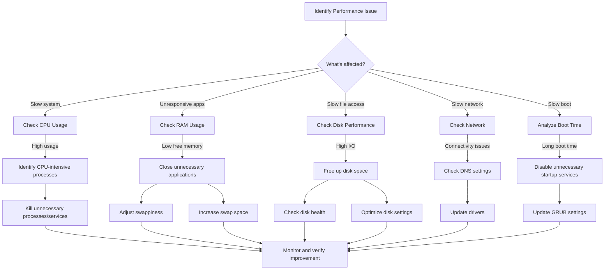

# Ubuntu Performance Issues

## Introduction

Ubuntu is one of the most popular Linux distributions known for its user-friendly interface and stability. However, like any operating system, it can experience performance issues over time. These problems might manifest as slow boot times, unresponsive applications, or general system sluggishness. 

This guide will help you understand common Ubuntu performance issues, how to diagnose them, and most importantly, how to resolve them. Whether you're running Ubuntu on an older machine or a powerful workstation, these techniques will help you maintain optimal system performance.

## Understanding System Resources

Before diving into specific issues, it's important to understand the four main resources that affect system performance:

1. **CPU (Central Processing Unit)**: Handles all computations and processes
2. **RAM (Random Access Memory)**: Provides temporary storage for running programs
3. **Storage (HDD/SSD)**: Permanently stores your files and applications
4. **Network**: Manages data transfer between your computer and other devices/internet

Performance bottlenecks typically occur when one or more of these resources becomes constrained.

## Monitoring Tools

Ubuntu offers several built-in and installable tools to help you monitor system performance:

### 1. Top and Htop

The `top` command is a built-in utility that provides a real-time view of system processes:

```bash
top
```

Output example:
```
top - 14:23:45 up 3 days, 2:34, 2 users, load average: 0.45, 0.52, 0.59
Tasks: 244 total,   1 running, 243 sleeping,   0 stopped,   0 zombie
%Cpu(s):  5.9 us,  2.1 sy,  0.0 ni, 91.7 id,  0.3 wa,  0.0 hi,  0.0 si,  0.0 st
MiB Mem :  15936.3 total,   7682.0 free,   4815.1 used,   3439.2 buff/cache
MiB Swap:   2048.0 total,   2047.7 free,      0.3 used.   9892.5 avail Mem
```

`htop` is an enhanced version of `top` with a more user-friendly interface:

```bash
sudo apt install htop
htop
```

### 2. System Monitor

Ubuntu's graphical System Monitor provides an easy-to-understand interface for monitoring resources:

1. Open System Monitor from the application menu
2. Or launch it from terminal:

```bash
gnome-system-monitor
```

### 3. iostat

For monitoring disk I/O (input/output) operations:

```bash
sudo apt install sysstat
iostat
```

Example output:
```
Linux 5.15.0-60-generic (ubuntu)     03/13/2025     _x86_64_    (4 CPU)

avg-cpu:  %user   %nice %system %iowait  %steal   %idle
           2.45    0.00    1.01    0.35    0.00   96.19

Device             tps    kB_read/s    kB_wrtn/s    kB_dscd/s    kB_read    kB_wrtn    kB_dscd
sda               5.89       132.67        26.39         0.00    4612842     917727          0
```

## Common Performance Issues and Solutions

### 1. High CPU Usage

#### Diagnosis:

Monitor CPU usage with `top` or System Monitor. Look for processes using a high percentage of CPU.

```bash
top -o %CPU
```

#### Solutions:

1. **Identify and close resource-intensive applications**:
   ```bash
   kill -15 PID
   ```
   (Replace PID with the process ID from top)

2. **Update system and applications**:
   ```bash
   sudo apt update && sudo apt upgrade
   ```

3. **Control startup applications**:
   Open "Startup Applications" from the application menu and disable unnecessary programs.

4. **Adjust CPU scaling governor**:
   ```bash
   sudo apt install cpufrequtils
   sudo cpufreq-set -g performance
   ```

### 2. RAM (Memory) Issues

#### Diagnosis:

Check memory usage with `free` command:

```bash
free -h
```

Example output:
```
              total        used        free      shared  buff/cache   available
Mem:           15Gi       4.7Gi       7.5Gi       285Mi       3.4Gi       9.7Gi
Swap:          2.0Gi          0B       2.0Gi
```

#### Solutions:

1. **Close unnecessary applications**

2. **Adjust swappiness** (controls how aggressively Ubuntu uses swap space):
   ```bash
   # Check current value
   cat /proc/sys/vm/swappiness
   
   # Set a lower value (temporarily)
   sudo sysctl vm.swappiness=10
   
   # Make it permanent
   echo 'vm.swappiness=10' | sudo tee -a /etc/sysctl.conf
   ```

3. **Increase swap space**:
   ```bash
   # Create a swap file
   sudo fallocate -l 2G /swapfile
   sudo chmod 600 /swapfile
   sudo mkswap /swapfile
   sudo swapon /swapfile
   
   # Make it permanent
   echo '/swapfile none swap sw 0 0' | sudo tee -a /etc/fstab
   ```

4. **Install a lighter desktop environment** for older hardware:
   ```bash
   sudo apt install xubuntu-desktop
   ```

### 3. Disk Performance Issues

#### Diagnosis:

Check disk usage and performance:

```bash
# Check disk space
df -h

# Check I/O stats
iostat -x 1
```

#### Solutions:

1. **Free up disk space**:
   ```bash
   # Remove old packages
   sudo apt autoremove
   
   # Clean apt cache
   sudo apt clean
   
   # Find large files
   sudo find /home -type f -size +100M -exec ls -lh {} \;
   ```

2. **Disable unnecessary services**:
   ```bash
   # List services
   systemctl list-unit-files --state=enabled
   
   # Disable a service
   sudo systemctl disable service-name
   ```

3. **Enable TRIM for SSDs**:
   ```bash
   # Check if TRIM is supported
   sudo hdparm -I /dev/sda | grep "TRIM supported"
   
   # Enable TRIM
   sudo systemctl enable fstrim.timer
   sudo systemctl start fstrim.timer
   ```

4. **Check for disk errors**:
   ```bash
   # For ext4 filesystems
   sudo fsck -f /dev/sdXY
   ```

### 4. Network Performance Issues

#### Diagnosis:

Monitor network usage:

```bash
# Install iftop
sudo apt install iftop

# Monitor network usage
sudo iftop
```

#### Solutions:

1. **Optimize DNS settings**:
   ```bash
   # Install resolvconf
   sudo apt install resolvconf
   
   # Edit resolv.conf
   sudo nano /etc/resolvconf/resolv.conf.d/head
   
   # Add Google DNS servers
   nameserver 8.8.8.8
   nameserver 8.8.4.4
   
   # Update resolv.conf
   sudo resolvconf -u
   ```

2. **Update network drivers**:
   ```bash
   sudo apt update && sudo apt upgrade
   ```

3. **Disable IPv6** (if not needed):
   ```bash
   # Edit sysctl.conf
   sudo nano /etc/sysctl.conf
   
   # Add these lines
   net.ipv6.conf.all.disable_ipv6 = 1
   net.ipv6.conf.default.disable_ipv6 = 1
   net.ipv6.conf.lo.disable_ipv6 = 1
   
   # Apply changes
   sudo sysctl -p
   ```

### 5. Boot Time Optimization

#### Diagnosis:

Analyze boot time:

```bash
systemd-analyze blame
```

#### Solutions:

1. **Disable unnecessary startup services**:
   ```bash
   # Disable a service
   sudo systemctl disable service-name
   ```

2. **Update GRUB configuration**:
   ```bash
   sudo nano /etc/default/grub
   
   # Modify this line to reduce timeout
   GRUB_TIMEOUT=1
   
   # Update GRUB
   sudo update-grub
   ```

3. **Enable concurrent startup**:
   ```bash
   sudo nano /etc/systemd/system.conf
   
   # Uncomment and modify
   DefaultTimeoutStartSec=5s
   DefaultTimeoutStopSec=5s
   ```

## Visualizing Performance Data

Let's use a Mermaid diagram to visualize the performance troubleshooting process:



## Real-World Example: Troubleshooting a Slow Ubuntu System

Let's walk through a complete troubleshooting scenario for a slow Ubuntu system:

### Scenario: System becomes increasingly sluggish after several hours of use

1. **Initial assessment**:
   Open System Monitor and observe high memory usage (90%) and moderate CPU usage (30%)

2. **Memory investigation**:
   ```bash
   free -h
   ```
   Output shows very little free memory and swap space is being used heavily

3. **Process identification**:
   ```bash
   top -o %MEM
   ```
   Identifies Firefox using 35% of memory with multiple tabs open

4. **Immediate solution**:
   - Close unnecessary Firefox tabs
   - Restart Firefox

5. **Long-term solution**:
   - Increase swap space:
     ```bash
     sudo fallocate -l 4G /swapfile2
     sudo chmod 600 /swapfile2
     sudo mkswap /swapfile2
     sudo swapon /swapfile2
     echo '/swapfile2 none swap sw 0 0' | sudo tee -a /etc/fstab
     ```
   - Install browser extensions to manage memory usage
   - Set up a weekly system maintenance script:
     ```bash
     #!/bin/bash
     # Weekly maintenance script
     
     # Update system
     sudo apt update && sudo apt upgrade -y
     
     # Clean package cache
     sudo apt autoremove -y
     sudo apt clean
     
     # Clear journal logs
     sudo journalctl --vacuum-time=7d
     
     # Clear thumbnails cache
     rm -rf ~/.cache/thumbnails/*
     
     echo "Maintenance complete!"
     ```

6. **Result**:
   - System memory usage dropped to 45%
   - Overall system responsiveness improved significantly
   - Long-term maintenance script helps prevent recurrence

## Summary

Performance troubleshooting in Ubuntu is often about identifying which system resource is constrained and then taking appropriate actions to alleviate that constraint. The key steps include:

1. **Monitor** your system to identify the bottleneck (CPU, RAM, disk, or network)
2. **Diagnose** the specific processes or services causing the issue
3. **Implement** targeted solutions to address the root cause
4. **Verify** that the performance has improved
5. **Establish** ongoing maintenance practices to prevent future issues

By following a systematic approach to performance troubleshooting, you can maintain a responsive and efficient Ubuntu system, even on older hardware.

## Additional Resources

- [Ubuntu Community Help Wiki](https://help.ubuntu.com/)
- [Official Ubuntu Documentation](https://docs.ubuntu.com/)
- [Canonical's Ubuntu Performance Guide](https://ubuntu.com/server/docs/performance-tuning)

## Practice Exercises

1. Use `top` to identify the top 3 CPU-consuming processes on your system
2. Create a bash script that collects system performance data every hour
3. Analyze your system's boot time and identify the longest-running service
4. Implement a swap file and measure its impact on system performance
5. Create a scheduled task to clean up your system once a week