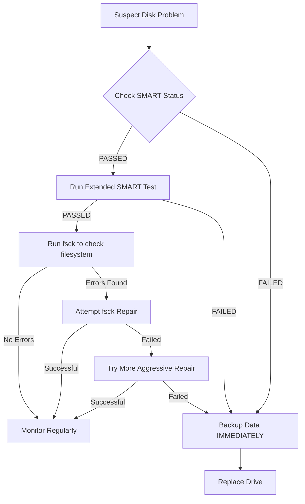

# Ubuntu Disk Errors

## Introduction

Disk errors are among the most critical issues you might encounter when using Ubuntu. Unlike software bugs that can be fixed with a simple update, disk errors can lead to data loss, system instability, and even complete hardware failure. This guide will help you understand common disk errors in Ubuntu, how to detect them early, and the steps to diagnose and resolve these issues before they cause serious problems.

## Understanding Disk Errors

Disk errors in Ubuntu (and other Linux systems) can be classified into several categories:

1. **File System Errors**: Issues with the logical organization of data on the disk
2. **Bad Sectors**: Physical or logical damage to portions of the disk
3. **I/O Errors**: Problems with reading from or writing to the disk
4. **S.M.A.R.T. Failures**: Warning signs from the disk's internal monitoring system
5. **Mount Failures**: Problems with accessing disk partitions

Let's explore each type in detail and learn how to address them.

## Detecting Disk Errors

### Warning Signs

Before your system encounters critical disk failures, it often displays warning signs:

- System freezes or hangs during file operations
- Unexpected system crashes or reboots
- Files becoming corrupt or disappearing
- Extremely slow disk operations
- Strange noises coming from the physical drive (clicking, grinding)
- Error messages during boot or file operations

### Critical Error Messages

Pay special attention to these error messages:

```
Input/output error
```

```
Read-only file system
```

```
Cannot mount /dev/sdX
```

```
Buffer I/O error on device sdX
```

```
Hard disk problem detected
```

## Diagnostic Tools

Ubuntu provides several powerful tools to diagnose disk issues:

### 1. SMART Monitoring Tools

S.M.A.R.T. (Self-Monitoring, Analysis, and Reporting Technology) is built into most modern hard drives to detect and report various indicators of drive reliability.

#### Installing smartmontools

```bash
sudo apt update
sudo apt install smartmontools
```

#### Checking SMART Status

```bash
sudo smartctl -H /dev/sda
```

Sample output for a healthy drive:

```
SMART overall-health self-assessment test result: PASSED
```

For a failing drive:

```
SMART overall-health self-assessment test result: FAILED
Warning: The device has SMART capability but has FAILED the SMART overall health test.
```

#### Running a SMART Test

Short test:

```bash
sudo smartctl -t short /dev/sda
```

Extended test (more thorough but takes longer):

```bash
sudo smartctl -t long /dev/sda
```

Viewing test results:

```bash
sudo smartctl -a /dev/sda
```

### 2. fsck (File System Consistency Check)

`fsck` is the primary tool for checking and repairing file system errors.

**Important**: Always run fsck on unmounted partitions to avoid data corruption.

#### Checking a Partition

```bash
sudo fsck /dev/sda1
```

Sample output with no errors:

```
fsck from util-linux 2.36.1
e2fsck 1.46.2 (28-Feb-2021)
/dev/sda1: clean, 98765/1234567 files, 1234567/7654321 blocks
```

Sample output with errors:

```
fsck from util-linux 2.36.1
e2fsck 1.46.2 (28-Feb-2021)
/dev/sda1 contains a file system with errors, check forced.
Pass 1: Checking inodes, blocks, and sizes
Inode 12345 has illegal blocks. Clear? yes
```

#### Forcing a Check on Root Partition at Next Boot

```bash
sudo touch /forcefsck
```

### 3. badblocks

`badblocks` scans a device for bad sectors (blocks).

#### Non-destructive Read-only Test

```bash
sudo badblocks -v /dev/sda
```

#### Write Test (Caution: Destroys Data!)

```bash
sudo badblocks -wsv /dev/sda
```

### 4. Disk Utility (GUI option)

Ubuntu's Disk Utility provides a user-friendly interface for disk diagnostics:

1. Open "Disks" from the application menu
2. Select your disk
3. Click the hamburger menu (≡) and select "SMART Data & Self-Tests"

## Fixing Common Disk Errors

### File System Repairs

#### Using fsck

For non-root partitions:

```bash
sudo umount /dev/sdXY
sudo fsck -y /dev/sdXY
```

The `-y` flag automatically answers "yes" to all prompts.

#### Repairing a Root Partition

You'll need to use a Live USB for this:

1. Boot from Ubuntu Live USB
2. Open a terminal
3. Run:

```bash
sudo fsck -f -y /dev/sdXY
```

Where `/dev/sdXY` is your root partition.

### Marking Bad Blocks

If you've identified bad blocks, you can mark them as unusable:

```bash
sudo e2fsck -l bad-blocks.txt /dev/sdXY
```

### Recovering Data from a Failing Disk

Before attempting repairs on a severely damaged disk, recover your data:

```bash
sudo ddrescue -d -r3 /dev/sdX /path/to/backup/image /path/to/logfile
```

This uses `ddrescue` (install with `sudo apt install gddrescue`) to create an image of the failing drive with multiple rescue attempts for problem areas.

## Practical Examples

### Example 1: Regular Disk Health Check

A proactive approach to disk maintenance:

```bash
# Check SMART status
sudo smartctl -H /dev/sda

# Run a short self-test
sudo smartctl -t short /dev/sda
# Wait for a few minutes
sudo smartctl -a /dev/sda | grep -A 20 "Self-test execution status"

# Check for file system errors (assuming sda1 is unmounted)
sudo fsck -n /dev/sda1
```

### Example 2: Troubleshooting a System That Won't Boot

When Ubuntu fails to boot due to disk errors:

1. Boot from Live USB
2. Open terminal
3. Identify your partitions:

```bash
sudo fdisk -l
```

4. Check and repair the root partition:

```bash
sudo fsck -y /dev/sda1  # Replace with your root partition
```

5. If the filesystem is severely damaged, try more aggressive repair:

```bash
sudo e2fsck -f -y -v /dev/sda1
```

### Example 3: Creating a Scheduled Disk Check

Setting up automatic weekly SMART checks:

1. Create a script:

```bash
sudo nano /usr/local/bin/disk-health-check.sh
```

2. Add the following content:

```bash
#!/bin/bash
# Simple disk health check script

DISK="/dev/sda"
EMAIL="your@email.com"

# Run a short SMART test
smartctl -t short $DISK
sleep 60  # Wait for test to complete

# Get test results
RESULTS=$(smartctl -a $DISK)

# Check if there are any warnings
if echo "$RESULTS" | grep -E "FAILING_NOW|FAILED"; then
  echo "$RESULTS" | mail -s "URGENT: Disk problems detected on $(hostname)" $EMAIL
fi
```

3. Make it executable:

```bash
sudo chmod +x /usr/local/bin/disk-health-check.sh
```

4. Add to crontab to run weekly:

```bash
sudo crontab -e
```

Add the line:

```
0 2 * * 0 /usr/local/bin/disk-health-check.sh
```

This runs the check every Sunday at 2 AM.

## Preventing Disk Errors

### Hardware Considerations

1. **Power Protection**: Use UPS (Uninterruptible Power Supply) to prevent sudden power loss
2. **Temperature Control**: Ensure proper cooling for your system
3. **Physical Protection**: Avoid moving the computer while it's running
4. **Regular Replacement**: Consider proactively replacing drives after 3-5 years

### Software Practices

1. **Proper Shutdown**: Always shut down Ubuntu properly
2. **Regular Checks**: Schedule periodic fsck and SMART checks
3. **Monitor Disk Space**: Keep at least 10-15% free space
4. **Enable SMART Monitoring**: Install and configure smartmontools

## Disk Error Workflow

Here's a flowchart for handling disk errors in Ubuntu:



## Summary

Disk errors in Ubuntu can range from minor file system inconsistencies to serious hardware failures. By understanding the different types of errors and learning how to use the diagnostic and repair tools available, you can:

1. Detect problems early before they lead to data loss
2. Repair file system errors and mark bad sectors
3. Determine when a disk needs to be replaced
4. Implement practices to prevent future disk problems

Remember that hardware does eventually fail, so always maintain regular backups of your important data regardless of how healthy your disks appear.

## Additional Resources

- The `man` pages for disk tools: `man fsck`, `man smartctl`, `man badblocks`
- [Ubuntu Community Help Wiki - Disk Checking](https://help.ubuntu.com/community/FilesystemTroubleshooting)
- [SMART Monitoring Tools Documentation](https://www.smartmontools.org/wiki/TocDoc)

## Exercises

1. Run a basic SMART health check on your main disk and interpret the results.
2. Create a bootable Ubuntu Live USB to have ready for emergency repairs.
3. Set up a weekly cron job to check disk health and email you the results.
4. Practice identifying different types of disk errors from sample output messages.
5. Design a backup strategy that would protect your data in case of catastrophic disk failure.