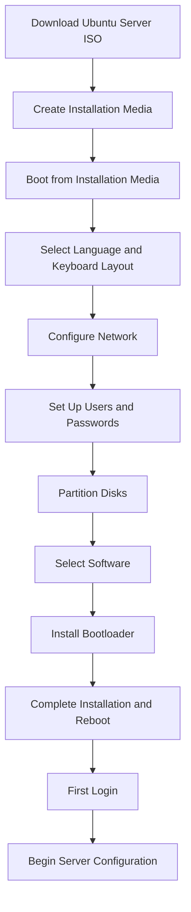

# Ubuntu Server Introduction

## What is Ubuntu Server?

Ubuntu Server is a variant of the Ubuntu operating system specifically designed for server environments. Unlike the desktop version that focuses on graphical user interfaces and consumer applications, Ubuntu Server is optimized for network services, data processing, and cloud infrastructure.

As a free and open-source operating system based on Debian Linux, Ubuntu Server has become one of the most popular choices for web servers, database servers, file servers, and cloud computing due to its stability, security, and extensive community support.

## Why Choose Ubuntu Server?

Ubuntu Server offers several advantages that make it an excellent choice for beginners and experienced administrators alike:

- **Long-term support (LTS)**: Ubuntu Server LTS releases receive security updates and bug fixes for 5 years, providing stability for production environments
- **Regular release cycle**: Predictable releases every six months, with LTS versions every two years
- **Extensive package repositories**: Access to thousands of pre-built software packages through APT (Advanced Package Tool)
- **Strong security**: Regular security updates and built-in security features
- **Minimal resource requirements**: Efficient operation even on modest hardware
- **Excellent documentation**: Comprehensive guides and a supportive community
- **Cloud-ready**: Optimized for virtualization and cloud deployments

## Ubuntu Server vs. Ubuntu Desktop

Ubuntu Server differs from Ubuntu Desktop in several key ways:

| Feature | Ubuntu Server | Ubuntu Desktop |
|---------|---------------|----------------|
| Default User Interface | Command-line only | Graphical (GNOME) |
| System Resources | Minimal | Higher (for GUI) |
| Default Services | Server-oriented | Desktop-oriented |
| Package Selection | Server packages | Desktop applications |
| Installation Process | More manual options | User-friendly, automated |
| Target Use Case | Network services, infrastructure | Personal computing, workstations |

## Getting Started with Ubuntu Server

### System Requirements

To run Ubuntu Server effectively, you'll need:

- 1 GHz processor (2 GHz recommended)
- 1 GB RAM (2 GB recommended)
- 2.5 GB disk space (10+ GB recommended for production)
- Network interface
- CD/DVD drive or USB port for installation media (if not installing remotely)

### Installation Overview

The installation process for Ubuntu Server is straightforward but requires some basic knowledge of partitioning and networking. Here's a high-level overview:



### Downloading Ubuntu Server

Visit the official Ubuntu website to download the latest Ubuntu Server LTS release:

1. Navigate to [ubuntu.com/download/server](https://ubuntu.com/download/server)
2. Choose the latest LTS version (recommended for beginners)
3. Select your system architecture (typically 64-bit)
4. Download the ISO file

### Basic Terminal Commands

After installing Ubuntu Server, you'll primarily interact with it through the terminal. Here are some essential commands to get started:

```bash
# Update package list
sudo apt update

# Upgrade installed packages
sudo apt upgrade

# Install a new package
sudo apt install package-name

# Check system status
systemctl status

# View system information
hostnamectl

# View IP address configuration
ip addr show

# Check disk usage
df -h

# View running processes
ps aux

# Shutdown the server
sudo shutdown -h now

# Restart the server
sudo reboot
```

## Managing Services in Ubuntu Server

Ubuntu Server uses systemd to manage services. Here are the basic commands for service management:

```bash
# Start a service
sudo systemctl start service-name

# Stop a service
sudo systemctl stop service-name

# Restart a service
sudo systemctl restart service-name

# Enable a service to start at boot
sudo systemctl enable service-name

# Disable a service from starting at boot
sudo systemctl disable service-name

# Check service status
sudo systemctl status service-name
```

### Example: Installing and Configuring a Web Server

Let's walk through a practical example of installing and configuring the Apache web server:

```bash
# Update package list
sudo apt update

# Install Apache
sudo apt install apache2

# Check if Apache is running
sudo systemctl status apache2
```

Expected output:

```
● apache2.service - The Apache HTTP Server
     Loaded: loaded (/lib/systemd/system/apache2.service; enabled; vendor preset: enabled)
     Active: active (running) since Mon 2023-06-05 14:30:45 UTC; 5s ago
       Docs: https://httpd.apache.org/docs/2.4/
   Main PID: 12345 (apache2)
      Tasks: 55 (limit: 4679)
     Memory: 5.7M
        CPU: 65ms
     CGroup: /system.slice/apache2.service
             ├─12345 /usr/sbin/apache2 -k start
             ├─12346 /usr/sbin/apache2 -k start
             └─12347 /usr/sbin/apache2 -k start
```

You can now create a simple HTML file to test your web server:

```bash
# Create a test HTML file
echo "<html><body><h1>My Ubuntu Server is working!</h1></body></html>" | sudo tee /var/www/html/test.html
```

Access your web server by navigating to `http://your-server-ip/test.html` from a web browser.

## User Management

Managing users and permissions is a critical aspect of server administration:

```bash
# Create a new user
sudo adduser username

# Add user to sudo group (for administrative privileges)
sudo usermod -aG sudo username

# Switch to another user
su - username

# Change password
sudo passwd username

# Delete user
sudo deluser username
```

## Network Configuration

Ubuntu Server 18.04 and later use Netplan for network configuration. Here's a basic example:

1. Edit the network configuration file:

```bash
sudo nano /etc/netplan/00-installer-config.yaml
```

2. Configure a static IP address:

```yaml
network:
  version: 2
  ethernets:
    enp0s3:
      dhcp4: no
      addresses: [192.168.1.100/24]
      gateway4: 192.168.1.1
      nameservers:
        addresses: [8.8.8.8, 8.8.4.4]
```

3. Apply the configuration:

```bash
sudo netplan apply
```

## Remote Access with SSH

Secure Shell (SSH) allows you to remotely access and manage your Ubuntu Server:

```bash
# Install SSH server
sudo apt install openssh-server

# Check SSH status
sudo systemctl status ssh

# Connect to your server from another machine
ssh username@server-ip
```

Securing SSH:

```bash
# Edit SSH configuration
sudo nano /etc/ssh/sshd_config
```

Common security settings:

```
# Disable root login
PermitRootLogin no

# Change SSH port (optional)
Port 2222

# Allow only specific users
AllowUsers username1 username2

# Disable password authentication (if using key-based auth)
PasswordAuthentication no
```

After making changes:

```bash
# Restart SSH service
sudo systemctl restart ssh
```

## Common Server Roles

Ubuntu Server can be configured for various roles:

### Web Server
```bash
# Install Apache
sudo apt install apache2

# Install Nginx
sudo apt install nginx
```

### Database Server
```bash
# Install MySQL
sudo apt install mysql-server

# Install PostgreSQL
sudo apt install postgresql
```

### File Server
```bash
# Install Samba for Windows file sharing
sudo apt install samba

# Install NFS for Linux/Unix file sharing
sudo apt install nfs-kernel-server
```

### Mail Server
```bash
# Install Postfix
sudo apt install postfix

# Install Dovecot for IMAP/POP3
sudo apt install dovecot-imapd dovecot-pop3d
```

## Monitoring and Maintenance

Regular monitoring and maintenance are essential for server health:

```bash
# Check system resource usage
top

# Monitor disk space
df -h

# View system logs
sudo journalctl

# Check for failed services
sudo systemctl --failed

# Update all packages
sudo apt update && sudo apt upgrade -y
```

## Backup and Recovery

Implement a backup strategy to protect your data:

```bash
# Simple backup using tar
sudo tar -czvf /backup/server-backup-$(date +%Y%m%d).tar.gz /path/to/important/data

# Install and configure the backup utility Duplicity
sudo apt install duplicity
```

## Summary

Ubuntu Server provides a robust, secure, and flexible platform for hosting various network services and applications. As a beginner, you now have a foundational understanding of:

- What Ubuntu Server is and its advantages
- Basic installation process
- Essential terminal commands
- Service management
- User and network configuration
- Common server roles and applications
- Basic monitoring and maintenance

## Next Steps

To continue your Ubuntu Server journey, consider:

1. Setting up a practical project (web server, file server, etc.)
2. Learning more about system security and hardening
3. Exploring containerization with Docker on Ubuntu Server
4. Automating tasks with shell scripts
5. Implementing monitoring solutions like Prometheus or Nagios

## Additional Resources

- [Official Ubuntu Server Documentation](https://ubuntu.com/server/docs)
- [Ubuntu Server Guide](https://help.ubuntu.com/lts/serverguide/)
- [Ask Ubuntu Community](https://askubuntu.com/)
- [Linux Command Line Basics](https://ubuntu.com/tutorials/command-line-for-beginners)
- [Digital Ocean Community Tutorials](https://www.digitalocean.com/community/tutorials?q=ubuntu+server)