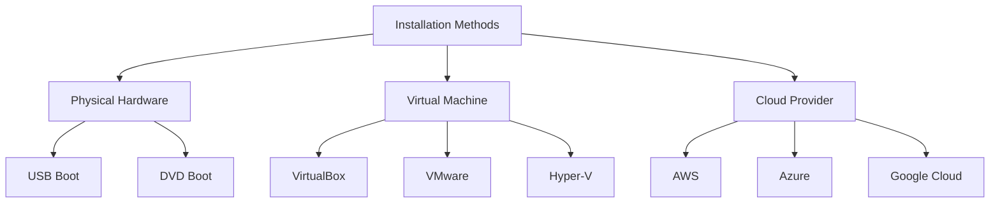

# Ubuntu Server Installation

## Introduction

Ubuntu Server is a powerful, free, and open-source operating system that powers millions of servers worldwide. Unlike Ubuntu Desktop, the Server edition doesn't include a graphical user interface by default, making it lightweight and perfect for server environments where resources need to be optimized for services rather than display capabilities.

In this guide, we'll walk through the complete process of installing Ubuntu Server on your machine. Whether you're setting up a home lab, preparing for cloud deployments, or learning server administration, this step-by-step tutorial will help you get started with confidence.

## Prerequisites

Before beginning the installation process, ensure you have:

- A computer or virtual machine with at least:
  - 1 GHz processor
  - 1 GB RAM (2 GB recommended)
  - 2.5 GB storage space
- Ubuntu Server ISO image downloaded from the [official Ubuntu website](https://ubuntu.com/download/server)
- USB drive (4GB+) if installing on physical hardware
- Internet connection (recommended but not required)
- Basic knowledge of computer hardware and networking concepts

## Installation Methods

You can install Ubuntu Server in several ways:



For this guide, we'll focus on the physical hardware and virtual machine methods.

## Step-by-Step Installation Process

### 1. Creating Bootable Media (for physical hardware)

If you're installing on physical hardware, you'll need to create a bootable USB drive:

1. Download a tool like Rufus (Windows), Etcher (cross-platform), or use the `dd` command on Linux
2. Insert your USB drive (minimum 4GB)
3. Select the Ubuntu Server ISO and your USB drive
4. Create the bootable media

For example, using `dd` on Linux:

```bash
# Replace /path/to/ubuntu-server.iso with your ISO path
# Replace /dev/sdX with your USB device (be very careful to use the correct device!)
sudo dd if=/path/to/ubuntu-server.iso of=/dev/sdX bs=4M status=progress
```

### 2. Booting from Installation Media

1. Insert the bootable USB drive into the target machine
2. Power on the machine and enter the boot menu (often by pressing F12, F2, or DEL during startup)
3. Select the USB drive as the boot device
4. The Ubuntu Server installer will load

### 3. Language Selection

The first screen allows you to select your preferred language for the installation process. Use the arrow keys to navigate, then press Enter to confirm your selection.

### 4. Keyboard Configuration

Next, you'll configure your keyboard layout:

1. Select your keyboard layout (e.g., English US)
2. You can test your keyboard layout using the provided text field
3. Select "Done" and press Enter to continue

### 5. Network Configuration

The installer will automatically attempt to configure your network using DHCP:

1. If successful, it will display your network interface with an assigned IP address
2. You can edit the configuration by selecting the network interface
3. Options include:
   - Using DHCP (automatic)
   - Setting a static IP address
   - Configuring DNS servers
4. Select "Done" to proceed

Example static IP configuration:

```
IP Address: 192.168.1.100/24
Gateway: 192.168.1.1
Name servers: 8.8.8.8, 8.8.4.4
Search domains: (can be left blank for home setups)
```

### 6. Proxy Configuration

If your network requires a proxy to access the internet, enter it here. Otherwise, leave it blank and select "Done".

### 7. Ubuntu Archive Mirror

The installer suggests the closest mirror based on your location. You can:
- Accept the default mirror
- Choose a different mirror for faster downloads
- Select "Done" to continue

### 8. Guided Storage Configuration

This is a critical step that determines how Ubuntu Server will use your storage:

1. You'll see the available storage devices
2. Choose one of the following options:
   - **Use an entire disk**: Erases everything on the selected disk and installs Ubuntu
   - **Use an entire disk and set up LVM**: Same as above but uses Logical Volume Management
   - **Manual**: Allows custom partitioning (advanced)

For beginners, the first or second option is recommended:

```
┌─────────────────────┐
│ Guided storage config│
├─────────────────────┤
│ [ ] Use an entire disk│
│ [X] Use an entire disk and set up LVM│
│ [ ] Manual│
└─────────────────────┘
```

### 9. Disk Selection

Select the disk where you want to install Ubuntu Server. Be careful as this will erase all data on the selected disk.

### 10. Storage Configuration Summary

Review the proposed changes carefully:

1. The installer shows which partitions will be created
2. If using LVM, you can adjust the volume sizes
3. Select "Done" when satisfied

### 11. Confirm Destructive Action

The installer will warn you that it's about to format the selected disk. Confirm if you're ready to proceed. This action cannot be undone.

### 12. Profile Setup

Enter your server's details:

1. **Your name**: Your full name
2. **Your server's name**: A hostname for the server (e.g., `ubuntu-server`)
3. **Username**: The username for your account (e.g., `admin`)
4. **Password**: A strong password (enter twice to confirm)

For example:
```
Your name: John Smith
Your server's name: ubuntu-server
Pick a username: admin
Password: ********
```

### 13. SSH Setup

Configure SSH (Secure Shell) access:

1. You can install the OpenSSH server for remote access
2. Choose whether to import SSH keys from GitHub (if you have an account)
3. Select "Done" to continue

If you're new to servers, installing OpenSSH is highly recommended as it allows you to manage your server remotely.

### 14. Featured Server Snaps

The installer offers popular server applications to install:

1. You can select which server applications to install
2. Common choices include:
   - docker: For container management
   - microk8s: For Kubernetes
   - nextcloud: For file sharing and collaboration
3. Use spacebar to select/deselect options
4. Select "Done" to proceed

For a minimal installation, you can leave all options unselected.

### 15. Installation Process

The installation will now begin:

1. The system will download and install packages
2. Progress bars show installation status
3. This typically takes 5-15 minutes depending on your hardware and internet speed

### 16. Installation Complete

Once the installation is finished:

1. You'll see a "Installation complete!" message
2. Select "Reboot Now"
3. Remove the installation media when prompted

### 17. First Boot

After rebooting:

1. The server will start and present a login prompt
2. Log in with the username and password you created earlier
3. You'll see a welcome message with system information

Example login screen:
```
ubuntu-server login: admin
Password: 
Welcome to Ubuntu 22.04.1 LTS (GNU/Linux 5.15.0-56-generic x86_64)

 * Documentation:  https://help.ubuntu.com
 * Management:     https://landscape.canonical.com
 * Support:        https://ubuntu.com/advantage

  System information as of Fri Mar 13 14:30:25 UTC 2025

  System load:  0.08              Processes:             123
  Usage of /:   12.5% of 30.83GB  Users logged in:       1
  Memory usage: 20%               IPv4 address for eth0: 192.168.1.100
  Swap usage:   0%

1 update can be applied immediately.
To see these additional updates run: apt list --upgradable

The programs included with the Ubuntu system are free software;
the exact distribution terms for each program are described in the
individual files in /usr/share/doc/*/copyright.

Ubuntu comes with ABSOLUTELY NO WARRANTY, to the extent permitted by
applicable law.

admin@ubuntu-server:~$
```

## Post-Installation Tasks

After successful installation, it's recommended to perform these important steps:

### Update Your System

Always update your system immediately after installation:

```bash
sudo apt update
sudo apt upgrade -y
```

### Set Up a Firewall

Ubuntu comes with UFW (Uncomplicated Firewall), which you should configure:

```bash
# Allow SSH (if you're using it)
sudo ufw allow ssh

# Enable the firewall
sudo ufw enable

# Check status
sudo ufw status
```

### Configure Automatic Updates (Optional)

For servers, automatic security updates are often a good idea:

```bash
# Install the unattended-upgrades package
sudo apt install unattended-upgrades

# Configure it
sudo dpkg-reconfigure -plow unattended-upgrades
```

## Troubleshooting Common Installation Issues

### Boot Issues

**Problem**: The system doesn't boot from the installation media.
**Solution**: Enter your BIOS/UEFI settings and ensure:
- Boot order has USB/DVD as the first option
- Secure Boot is disabled (if using older versions)
- Legacy boot mode is enabled if necessary

### Network Detection Failure

**Problem**: Installer doesn't detect your network interfaces.
**Solution**: Some network cards require additional drivers. Try:
- Connecting via Ethernet instead of Wi-Fi for installation
- Downloading and including firmware packages on your installation media

### Disk Not Detected

**Problem**: Your hard drive isn't visible in the installer.
**Solution**:
- Check SATA mode in BIOS (try changing between AHCI and IDE)
- For newer NVMe drives, ensure they're properly seated and the BIOS is updated

## Summary

Congratulations! You've successfully installed Ubuntu Server. This guide covered:

1. Preparing for installation
2. Creating bootable media
3. The step-by-step installation process
4. Initial configuration
5. Post-installation tasks and security

Ubuntu Server provides a solid foundation for hosting websites, running applications, storing files, and much more. As you become more comfortable, you can explore advanced server configurations and services.

## Next Steps

Now that you have Ubuntu Server installed, consider exploring:

- Setting up a web server with Apache or Nginx
- Configuring a database server like MySQL or PostgreSQL
- Deploying applications with Docker containers
- Implementing backup solutions
- Monitoring your server with tools like Prometheus and Grafana

## Additional Resources

- [Ubuntu Server Documentation](https://ubuntu.com/server/docs)
- [Linux Command Line Basics](https://ubuntu.com/tutorials/command-line-for-beginners)
- [Server Security Best Practices](https://ubuntu.com/server/docs/security-introduction)