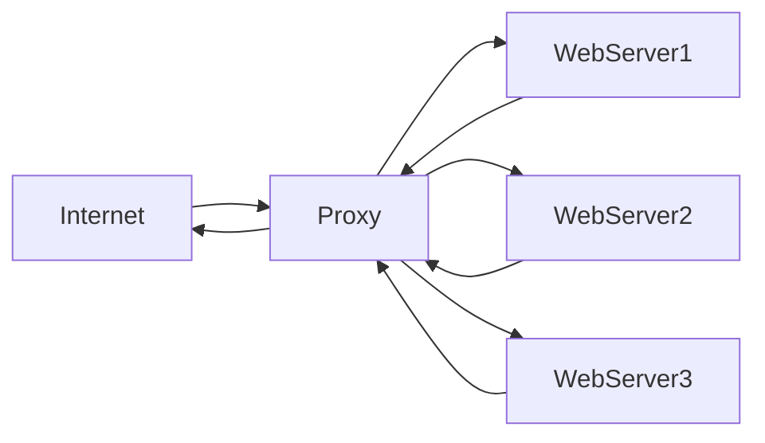

# Ubuntu Proxy Servers

## Introduction

Proxy servers act as intermediaries between clients and other servers, providing various benefits such as improved security, performance optimization, and access control. In Ubuntu Server environments, proxy servers are essential components for managing network traffic efficiently.

A proxy server receives requests from clients, processes them according to configured rules, and then forwards these requests to their intended destinations. The responses follow the same path in reverse, allowing the proxy to monitor, modify, cache, or filter the content.

In this guide, we'll explore the concepts, installation procedures, and configuration of proxy servers on Ubuntu, with practical examples to help you implement proxy solutions for your own projects.

## Types of Proxy Servers

Before diving into implementation, let's understand the different types of proxy servers:

### Forward Proxy

A forward proxy stands between client applications and the internet, handling outbound requests from internal clients to external servers.


### Reverse Proxy

A reverse proxy sits in front of web servers, handling inbound requests from the internet to your internal services. It's commonly used for load balancing, SSL termination, and security.



### Transparent Proxy

A transparent proxy intercepts client requests without requiring any client configuration. These are often used for content filtering or caching.

## Setting Up Squid Proxy Server

Squid is one of the most popular proxy server solutions for Ubuntu. Let's set up a basic Squid proxy server:

### Installation

```bash
sudo apt update
sudo apt install squid -y
```

After installation, Squid service should start automatically. Verify its status:

```bash
sudo systemctl status squid
```

Expected output:
```
● squid.service - Squid Web Proxy Server
     Loaded: loaded (/lib/systemd/system/squid.service; enabled; vendor preset: enabled)
     Active: active (running) since Mon 2023-09-04 10:15:22 UTC; 5s ago
       Docs: man:squid(8)
   Main PID: 12345 (squid)
      Tasks: 4 (limit: 4678)
     Memory: 14.0M
        CPU: 456ms
     CGroup: /system.slice/squid.service
             ├─12345 /usr/sbin/squid -sYC
             ├─12346 (squid-1) --kid 1 -sYC
             ├─12347 (logfile-daemon) /var/log/squid/access.log
             └─12348 (basic/ncsa_auth) /etc/squid/passwd
```

### Basic Configuration

The main configuration file for Squid is located at `/etc/squid/squid.conf`. Let's create a simple configuration:

1. Back up the original configuration:

```bash
sudo cp /etc/squid/squid.conf /etc/squid/squid.conf.backup
```

2. Edit the configuration file:

```bash
sudo nano /etc/squid/squid.conf
```

3. For a basic configuration, you can use:

```
# Define the port Squid will listen on
http_port 3128

# Set access control lists
acl localnet src 192.168.1.0/24 # Adjust to match your local network
acl SSL_ports port 443
acl Safe_ports port 80 # HTTP
acl Safe_ports port 443 # HTTPS
acl Safe_ports port 21 # FTP

# Allow specific ports
http_access deny !Safe_ports
http_access deny CONNECT !SSL_ports

# Allow local network
http_access allow localnet
http_access allow localhost

# And finally deny all other access
http_access deny all

# Set cache options
cache_dir ufs /var/spool/squid 100 16 256
coredump_dir /var/spool/squid
```

4. Save and restart Squid:

```bash
sudo systemctl restart squid
```

### Testing Your Squid Proxy

You can test your proxy using `curl`:

```bash
curl -x http://localhost:3128 https://www.example.com
```

This should display the HTML content of example.com, fetched through your proxy.

## Setting Up NGINX as a Reverse Proxy

NGINX is an excellent choice for setting up a reverse proxy. Let's configure it:

### Installation

```bash
sudo apt update
sudo apt install nginx -y
```

### Basic Reverse Proxy Configuration

1. Create a new configuration file:

```bash
sudo nano /etc/nginx/sites-available/reverse-proxy.conf
```

2. Add this basic configuration:

```
server {
    listen 80;
    listen [::]:80;
    
    server_name example.com;
    
    location / {
        proxy_pass http://localhost:8080;
        proxy_set_header Host $host;
        proxy_set_header X-Real-IP $remote_addr;
        proxy_set_header X-Forwarded-For $proxy_add_x_forwarded_for;
        proxy_set_header X-Forwarded-Proto $scheme;
    }
}
```

This configuration forwards requests to a service running on port 8080 on the same machine.

3. Enable the site and restart NGINX:

```bash
sudo ln -s /etc/nginx/sites-available/reverse-proxy.conf /etc/nginx/sites-enabled/
sudo systemctl restart nginx
```

### Load Balancing with NGINX

NGINX can distribute traffic across multiple backend servers:

```bash
sudo nano /etc/nginx/sites-available/load-balancer.conf
```

Add this configuration:

```
upstream backend_servers {
    server 192.168.1.101:8080;
    server 192.168.1.102:8080;
    server 192.168.1.103:8080;
}

server {
    listen 80;
    
    location / {
        proxy_pass http://backend_servers;
        proxy_set_header Host $host;
        proxy_set_header X-Real-IP $remote_addr;
    }
}
```

Enable the configuration:

```bash
sudo ln -s /etc/nginx/sites-available/load-balancer.conf /etc/nginx/sites-enabled/
sudo systemctl restart nginx
```

## Authenticating Users in Squid

To restrict proxy access to authenticated users:

1. Install the `apache2-utils` package to use the `htpasswd` utility:

```bash
sudo apt install apache2-utils -y
```

2. Create a password file:

```bash
sudo htpasswd -c /etc/squid/passwd username
```

Replace "username" with your desired username. You'll be prompted to enter a password.

3. Modify your Squid configuration:

```bash
sudo nano /etc/squid/squid.conf
```

Add these lines:

```
# Authentication settings
auth_param basic program /usr/lib/squid/basic_ncsa_auth /etc/squid/passwd
auth_param basic realm Proxy Authentication Required
acl authenticated proxy_auth REQUIRED
http_access allow authenticated localnet
http_access allow authenticated localhost
http_access deny all
```

4. Restart Squid:

```bash
sudo systemctl restart squid
```

Now, users will need to provide credentials to use the proxy.

## Setting Up Transparent Proxy

A transparent proxy intercepts and redirects traffic without client configuration:

1. Enable IP forwarding:

```bash
sudo sysctl -w net.ipv4.ip_forward=1
```

To make this permanent, edit `/etc/sysctl.conf`:

```bash
sudo nano /etc/sysctl.conf
```

Add or uncomment:

```
net.ipv4.ip_forward=1
```

2. Configure iptables to redirect traffic:

```bash
sudo iptables -t nat -A PREROUTING -i eth0 -p tcp --dport 80 -j REDIRECT --to-port 3128
```

3. Modify Squid configuration:

```bash
sudo nano /etc/squid/squid.conf
```

Change the `http_port` line to:

```
http_port 3128 intercept
```

4. Restart Squid:

```bash
sudo systemctl restart squid
```

## Caching with Squid

Squid can cache content to improve performance:

```bash
sudo nano /etc/squid/squid.conf
```

Add or modify these lines:

```
# Cache settings
cache_mem 256 MB
maximum_object_size 100 MB
cache_dir ufs /var/spool/squid 1000 16 256
```

This allocates 256MB of memory for caching and 1GB of disk space.

Restart Squid:

```bash
sudo systemctl restart squid
```

## Monitoring and Troubleshooting

### Viewing Squid Logs

Access logs:
```bash
sudo tail -f /var/log/squid/access.log
```

Error logs:
```bash
sudo tail -f /var/log/squid/cache.log
```

### Common Troubleshooting Commands

Check if Squid is listening on the expected port:
```bash
sudo netstat -tulpn | grep squid
```

Test the configuration file for errors:
```bash
sudo squid -k parse
```

Restart Squid and apply configuration changes:
```bash
sudo squid -k reconfigure
```

## Security Considerations

When running proxy servers, consider these security measures:

1. **Restrict access**: Only allow necessary clients to access your proxy.
2. **Use authentication**: Implement user authentication to control proxy access.
3. **Regular updates**: Keep your proxy software updated with security patches.
4. **Access control**: Implement strict ACLs to limit which sites can be accessed.
5. **Monitoring**: Regularly review logs for suspicious activity.
6. **HTTPS inspection**: Consider implementing HTTPS inspection for comprehensive security (requires careful planning).

## Real-World Applications

### Content Filtering for Educational Institutions

For schools or libraries, you can configure Squid to block inappropriate websites:

```bash
sudo nano /etc/squid/squid.conf
```

Add:

```
# Block specific domains
acl blocked_sites dstdomain .example.com .inappropriate-site.com
http_access deny blocked_sites

# Use content filtering with SquidGuard (requires additional installation)
url_rewrite_program /usr/bin/squidGuard -c /etc/squidguard/squidGuard.conf
```

### Corporate Network Gateway

In a business environment, you might want to control internet access and monitor usage:

```
# Work hours ACL
acl workhours time MTWHF 8:00-17:00

# Allow social media only outside work hours
acl social_media dstdomain .facebook.com .twitter.com .instagram.com
http_access deny social_media workhours
http_access allow social_media !workhours

# Log all URLs
access_log /var/log/squid/access.log
```

### High-Availability Setup with Multiple Proxies

For critical environments, set up load balancing with NGINX:

```
upstream proxy_servers {
    server 192.168.1.10:3128;
    server 192.168.1.11:3128 backup;
}

server {
    listen 80;
    
    location / {
        proxy_pass http://proxy_servers;
        proxy_next_upstream error timeout invalid_header http_500;
    }
}
```

## Summary

Proxy servers are powerful tools in the Ubuntu Server ecosystem that provide numerous benefits including improved security, performance, and access control. In this guide, we've covered:

- Different types of proxy servers (forward, reverse, transparent)
- Setting up and configuring Squid as a forward proxy
- Configuring NGINX as a reverse proxy and load balancer
- User authentication and access control
- Configuring transparent proxying
- Implementing caching for improved performance
- Monitoring and troubleshooting techniques
- Real-world applications and examples

By implementing proxy servers in your Ubuntu environment, you can significantly enhance your network's security, performance, and manageability.

## Additional Resources

- [Squid Official Documentation](http://www.squid-cache.org/Doc/)
- [NGINX Documentation](https://nginx.org/en/docs/)
- [Ubuntu Server Guide](https://ubuntu.com/server/docs)

## Exercises

1. **Basic Setup**: Install Squid and configure it to allow access only from your local subnet.
2. **Authentication**: Implement basic authentication and create three different user accounts with different access permissions.
3. **Content Filtering**: Configure Squid to block access to specific websites or categories.
4. **Performance Tuning**: Experiment with different caching parameters and measure the performance improvement.
5. **High Availability**: Set up a redundant proxy configuration with multiple Squid instances and NGINX for load balancing.