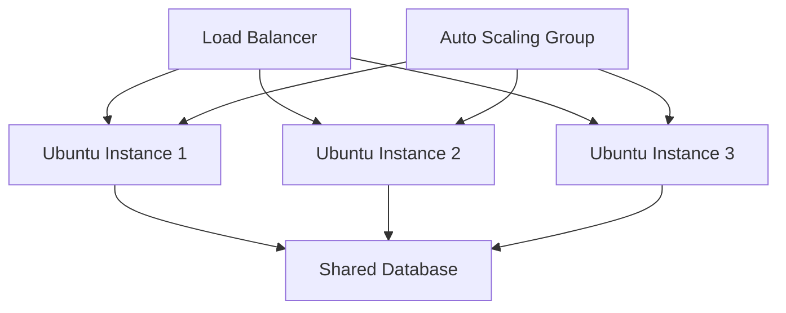

# Ubuntu Cloud Server

## Introduction

Ubuntu Cloud Server is a specialized version of Ubuntu Server designed to run optimally in cloud environments. Whether you're deploying applications on public clouds like AWS, Google Cloud, or Microsoft Azure, or building your own private cloud infrastructure, Ubuntu Cloud Server provides the reliability, security, and flexibility needed for modern cloud computing.

In this guide, we'll explore how Ubuntu Server has been adapted for cloud environments, the benefits it offers, and how to get started with deploying and managing Ubuntu instances in the cloud.

## What is Ubuntu Cloud Server?

Ubuntu Cloud Server is essentially Ubuntu Server optimized for cloud environments with:

- Pre-configured cloud-init for automated instance initialization
- Optimized images for major cloud providers
- Minimal footprint for faster deployment and reduced costs
- Enhanced security features for cloud environments
- Seamless integration with cloud-native tools and services

Ubuntu is the most popular operating system for cloud deployments, powering millions of servers across public, private, and hybrid cloud infrastructures worldwide.

## Cloud Images vs Traditional Server Installation

Traditional server installations typically involve downloading an ISO, creating bootable media, and going through an installation process that configures the system for specific hardware. Cloud environments work differently:

| Feature | Traditional Installation | Cloud Image |
|---------|--------------------------|------------|
| Installation | Manual process with media | Automated deployment from image |
| Configuration | Manual during setup | Automated via cloud-init |
| Hardware | Optimized for specific hardware | Generalized for virtualization |
| Size | Full installation | Minimal with on-demand package installation |
| Boot time | Longer initial setup | Quick instance provisioning |

## Getting Started with Ubuntu Cloud Server

### Finding Ubuntu Cloud Images

Canonical provides regularly updated cloud images for all supported Ubuntu releases. These images are available in different formats suitable for various cloud platforms.

You can find official Ubuntu cloud images at:
- [Ubuntu Cloud Images Portal](https://cloud-images.ubuntu.com/)
- Major cloud provider marketplaces (AWS, Azure, GCP, etc.)

### Launching an Ubuntu Instance on AWS

Let's walk through a practical example of launching an Ubuntu server on AWS using the AWS CLI:

```bash
# Install AWS CLI if you haven't already
sudo apt update
sudo apt install -y awscli

# Configure AWS credentials
aws configure

# Find the latest Ubuntu 22.04 LTS AMI ID for your region
aws ec2 describe-images \
    --owners 099720109477 \
    --filters "Name=name,Values=ubuntu/images/hvm-ssd/ubuntu-jammy-22.04-amd64-server-*" \
    --query "sort_by(Images, &CreationDate)[-1].ImageId" \
    --output text

# Launch an EC2 instance using the AMI ID (replace ami-12345678 with the actual ID)
aws ec2 run-instances \
    --image-id ami-12345678 \
    --instance-type t2.micro \
    --key-name your-key-pair \
    --security-group-ids sg-12345678 \
    --count 1
```

The output will include details about your newly launched instance:

```json
{
    "Instances": [
        {
            "InstanceId": "i-0abc123def456789",
            "InstanceType": "t2.micro",
            "ImageId": "ami-12345678",
            "State": {
                "Code": 0,
                "Name": "pending"
            },
            "PublicDnsName": "ec2-12-34-56-78.compute-1.amazonaws.com",
            // additional instance details...
        }
    ]
}
```

### Cloud-Init: Automating Instance Configuration

One of the key features of Ubuntu Cloud Server is cloud-init, which allows you to automate configuration during instance startup. This tool enables declarative setup of your server through YAML configuration.

Here's a simple cloud-init example that updates the system, installs Nginx, and creates a welcome page:

```yaml
#cloud-config
package_update: true
package_upgrade: true

packages:
  - nginx

write_files:
  - path: /var/www/html/index.html
    content: |
      <!DOCTYPE html>
      <html>
      <head>
        <title>Welcome to Ubuntu Cloud Server</title>
      </head>
      <body>
        <h1>Hello from cloud-init!</h1>
        <p>This page was automatically created during instance launch.</p>
      </body>
      </html>

runcmd:
  - systemctl restart nginx
```

To use this configuration when launching an EC2 instance:

```bash
# Save the config above as cloud-init.yaml
# Then use it when launching an instance
aws ec2 run-instances \
    --image-id ami-12345678 \
    --instance-type t2.micro \
    --key-name your-key-pair \
    --security-group-ids sg-12345678 \
    --user-data file://cloud-init.yaml
```

## Cloud Instance Management

### SSH Access

To connect to your Ubuntu cloud instance:

```bash
# Replace with your key and instance address
ssh -i /path/to/your-key.pem ubuntu@ec2-12-34-56-78.compute-1.amazonaws.com
```

The default username for Ubuntu cloud images is usually `ubuntu`.

### Package Management in the Cloud

Ubuntu's package management works the same way in cloud environments, but there are some best practices to consider:

```bash
# Update package lists
sudo apt update

# Install packages without prompts (useful for automation)
sudo apt install -y package-name

# Use apt-get in scripts for more stable output formatting
sudo apt-get -y install package-name
```

### Security Best Practices

Security is critical for cloud servers that are exposed to the internet:

1. **Keep your system updated**:
```bash
sudo apt update && sudo apt upgrade -y
```

2. **Configure the firewall**:
```bash
# Allow SSH and HTTP
sudo ufw allow 22/tcp
sudo ufw allow 80/tcp
sudo ufw enable
```

3. **Use strong authentication**:
```bash
# Disable password authentication in SSH
sudo sed -i 's/PasswordAuthentication yes/PasswordAuthentication no/' /etc/ssh/sshd_config
sudo systemctl restart sshd
```

## Ubuntu Cloud Features

### LivePatch

Ubuntu Pro subscribers can use LivePatch to apply kernel updates without rebooting:

```bash
# Enable LivePatch
sudo ua enable livepatch
```

### Integration with Cloud Services

Ubuntu cloud images integrate seamlessly with cloud-native services. For example, you can use AWS Systems Manager:

```bash
# Install AWS Systems Manager agent
sudo snap install amazon-ssm-agent --classic
sudo systemctl enable amazon-ssm-agent
sudo systemctl start amazon-ssm-agent
```

## Scaling and Managing Multiple Instances

As your application grows, you'll likely need to manage multiple Ubuntu cloud instances. Here's how cloud orchestration works at a high level:



### Using Terraform for Infrastructure as Code

Instead of manually launching instances, you can use Terraform to define your infrastructure:

```hcl
provider "aws" {
  region = "us-west-2"
}

resource "aws_instance" "ubuntu_server" {
  ami           = "ami-12345678" # Ubuntu AMI ID
  instance_type = "t2.micro"
  key_name      = "your-key-pair"

  tags = {
    Name = "UbuntuWebServer"
  }

  user_data = <<-EOF
              #!/bin/bash
              apt-get update
              apt-get install -y nginx
              echo "<h1>Hello from Terraform-provisioned Ubuntu!</h1>" > /var/www/html/index.html
              systemctl enable nginx
              systemctl start nginx
              EOF
}

output "public_ip" {
  value = aws_instance.ubuntu_server.public_ip
}
```

## Containerization with Ubuntu Cloud

Ubuntu cloud servers are an excellent platform for container workloads. Here's how to set up Docker on Ubuntu:

```bash
# Install Docker
sudo apt update
sudo apt install -y apt-transport-https ca-certificates curl software-properties-common
curl -fsSL https://download.docker.com/linux/ubuntu/gpg | sudo apt-key add -
sudo add-apt-repository "deb [arch=amd64] https://download.docker.com/linux/ubuntu $(lsb_release -cs) stable"
sudo apt update
sudo apt install -y docker-ce

# Verify Docker installation
sudo docker run hello-world
```

### Running a Web Application in Docker

Deploy a simple web application using Docker:

```bash
# Create a Dockerfile
cat > Dockerfile << 'EOF'
FROM ubuntu:22.04
RUN apt-get update && apt-get install -y nginx
COPY index.html /var/www/html/
EXPOSE 80
CMD ["nginx", "-g", "daemon off;"]
EOF

# Create a simple index.html
echo "<h1>Hello from Docker on Ubuntu Cloud!</h1>" > index.html

# Build and run the container
sudo docker build -t my-ubuntu-web-app .
sudo docker run -d -p 80:80 my-ubuntu-web-app
```

## Monitoring Ubuntu Cloud Instances

Monitoring is crucial for cloud operations. Here's how to set up basic monitoring with Prometheus Node Exporter:

```bash
# Install Prometheus Node Exporter
sudo apt update
sudo apt install -y prometheus-node-exporter

# Verify that the service is running
sudo systemctl status prometheus-node-exporter
```

You can then configure Prometheus to scrape metrics from your Ubuntu cloud instances for monitoring.

## Ubuntu Cloud Server in Production

For production environments, consider these additional configurations:

1. **Automated Backups**:
```bash
# Install AWS CLI
sudo apt install -y awscli

# Create a snapshot backup script
cat > backup.sh << 'EOF'
#!/bin/bash
INSTANCE_ID=$(curl -s http://169.254.169.254/latest/meta-data/instance-id)
DATE=$(date +%Y-%m-%d-%H-%M)
aws ec2 create-snapshot --volume-id vol-12345678 --description "Backup $DATE for $INSTANCE_ID"
EOF

# Make it executable and schedule with cron
chmod +x backup.sh
(crontab -l 2>/dev/null; echo "0 2 * * * /path/to/backup.sh") | crontab -
```

2. **Log Management**:
```bash
# Configure rsyslog to send logs to a central server
echo "*.* @logs.example.com:514" | sudo tee -a /etc/rsyslog.d/50-remote.conf
sudo systemctl restart rsyslog
```

## Summary

Ubuntu Cloud Server provides a robust, efficient, and secure platform for deploying applications in cloud environments. We've covered:

- The fundamentals of Ubuntu Cloud Server and how it differs from traditional server deployments
- How to launch and configure Ubuntu instances in the cloud
- Automating configuration with cloud-init
- Best practices for security and management
- Scaling and orchestrating multiple instances
- Containerization and monitoring solutions

By leveraging these capabilities, you can build scalable, reliable cloud infrastructure powered by Ubuntu.

## Additional Resources

- Ubuntu documentation: [https://ubuntu.com/server/docs](https://ubuntu.com/server/docs)
- Cloud-init documentation: [https://cloudinit.readthedocs.io/](https://cloudinit.readthedocs.io/)
- Terraform with AWS: [https://learn.hashicorp.com/tutorials/terraform/aws-build](https://learn.hashicorp.com/tutorials/terraform/aws-build)

## Exercises

1. **Basic**: Launch an Ubuntu cloud instance on a provider of your choice and connect to it via SSH.
2. **Intermediate**: Create a cloud-init configuration that installs and configures a LAMP (Linux, Apache, MySQL, PHP) stack.
3. **Advanced**: Set up a load-balanced application with three Ubuntu instances using Terraform.
4. **Expert**: Create a CI/CD pipeline that automatically deploys updates to your Ubuntu cloud instances whenever code is pushed to your repository.